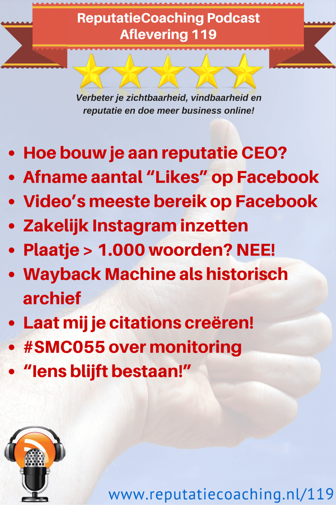
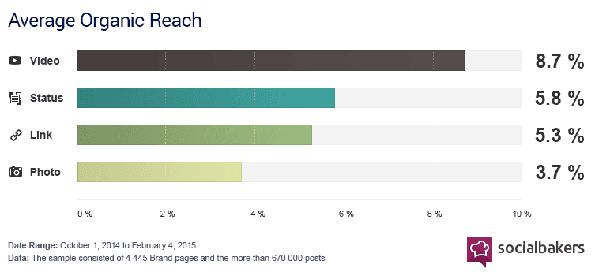
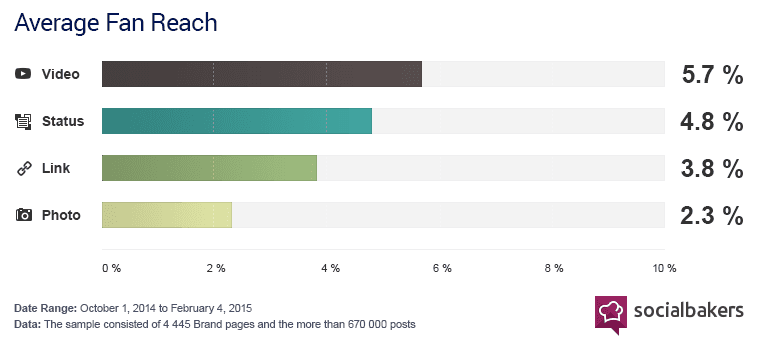
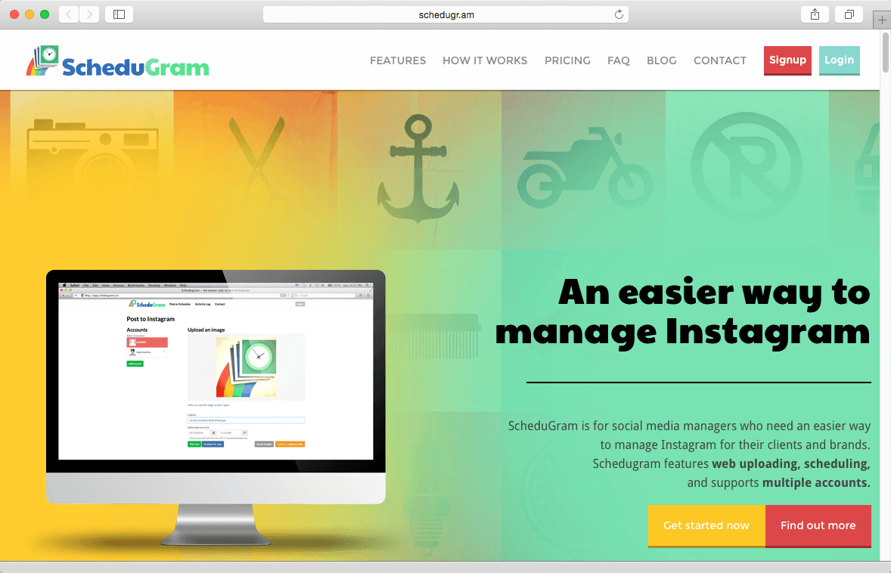
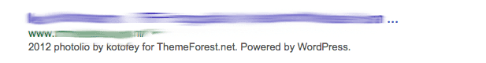
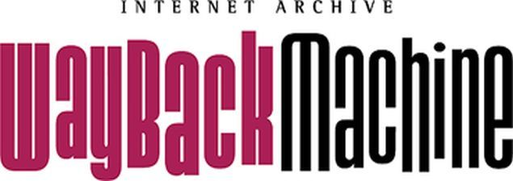
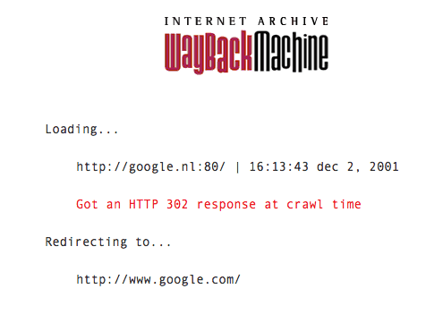

> **Historisch archief.** Deze aflevering verscheen op 12-03-2015 als onderdeel van ReputatieCoaching (2012–2016). De oorspronkelijke tekst is hieronder historisch bewaard. Diensten, contactgegevens, links, tools en adviezen kunnen inmiddels verouderd zijn.



**Transcriptiestatus:** Volledige transcriptie uit het oorspronkelijke archief.

**
Ik las op managersonline.nl over twaalf stappen naar een optimale CEO-reputatie. Die wil ik met je delen tezamen met mijn mening erover. En jaag jij voor je bedrijf nog steeds “Likes” na op Facebook? Blijf dan luisteren, want je hoeveelheid verzamelde “Likes” kan de komende tijd afnemen. Video’s hebben trouwens het grootste organische bereik op Facebook, wist je dat al? Zo nee, blijf dan vooral luisteren!**

**Zelf ben ik nu een tijdje bezig met Instagram. Ooit ben ik er privé mee begonnen, maar nu ben ik aan het onderzoeken op welke wijze ik het zakelijk kan inzetten en of het effect heeft. Ik vertel je er zo meer over.**

**Soms zie je van die fantastisch mooie websites, met alleen maar adembenemende foto’s. Helaas kan dat in je nadeel werken in de zoekresultaten. Ik laat je het zien. Daarbij maak ik onder andere gebruik van de Internet Wayback Machine, waarover ik je ook wat meer vertel.**

**Citations creëren om daarmee beter zichtbaar en hogerop te komen in de lokale zoekresultaten kost veel tijd en werk. Je moet er ook een goede administratie voor bijhouden. Ik kan je daarbij helpen met de nieuwe service die ik vandaag aankondig!**

**Eerder deze week was ik weer bij de maandelijkse bijeenkomst van Social Media Club Apeldoorn, waarin het dit keer ging over “monitoring”. Het laatste onderwerp voor de podcast van vandaag is een interview met Iens Boswijk, dat ik vond op de site van Fast Moving Targets.**

Hallo en hartelijk welkom bij deze aflevering van de ReputatieCoaching Podcast. Ik ben Eduard de Boer, ReputatieCoach. Dit is dé podcast die jou helpt om meer business te genereren, doordat jouw website beter gevonden wordt, zowel lokaal als landelijk en doordat ik je uitleg hoe je je online reputatie kunt verbeteren. Dit alles helpt jou om je bedrijf en jezelf beter op de online kaart te plaatsen.

De podcast kun je vinden op [www.reputatiecoaching.nl/119](https://web.archive.org/web/20150312141639/http://www.reputatiecoaching.nl/119/). Daar vind je niet alleen de tekst, maar ook video’s waar ik het in deze uitzending over heb, alsmede afbeeldingen, links enzovoorts. Bovendien is de podcast te beluisteren in iTunes, op Stitcher en ook op [TuneIn Radio](http://tunein.com/radio/ReputatieCoaching-Podcast-p655084/). Ik raad je aan om je op één van die drie kanalen te abonenneren op de podcast, zodat je geen aflevering hoeft te missen!

Laat ik dan nu overgaan op de onderwerpen voor vandaag…

## CEO-reputatie?


Op MarketingOnline.nl las ik een artikel met als titel “[In twaalf stappen naar een optimale CEO-reputatie](http://www.managersonline.nl/nieuws/15802/in-twaalf-stappen-naar-een-optimale-ceo-reputatie.html)”. Het onderzoek is uitgevoerd door het bedrijf “Weber Shandwick” en is gebaseerd op een online onderzoek onder meer dan 1.700 senior leidinggevenden in negentien landen verspreid over Noord-Amerika, Europa, Azië en Latijns-Amerika. Het is dus niet zomaar een flut-onderzoekje.

In dat artikel werden, naast de twaalf stappen waar ik zo op kom, een paar interessante statistieken vermeld. Zo vindt 81% van de ondervraagde senior leidinggevenden de betrokkenheid en zichtbaarheid van de CEO cruciaal voor de bedrijfsreputatie. Ik citeer een stukje uit het artikel:

De reputatie van de CEO is ook van belang voor het eindresultaat. Leidinggevenden schrijven 44 procent van de marktwaarde van hun bedrijf toe aan de reputatie van hun CEO. Daarnaast trekt én behoudt een sterke reputatie van de CEO ook werknemers (respectievelijk 77 procent en 70 procent).

Het onderzoek laat verder zien dat een CEO die het verhaal van een bedrijf kan personaliseren en tot leven kan brengen, de bedrijfsreputatie kan versterken. CEO’s kunnen op verschillende manieren zichzelf en hun bedrijf beter op de kaart zetten. Het artikel noemt de volgende:

```
  * Spreken op evenementen (binnen- en buiten de industrie)
  * Toegankelijk zijn voor nieuwsmedia
  * Zichtbaar zijn op de website van het bedrijf
  * Nieuwe inzichten en trends delen met het publiek
  * Actief zijn in de lokale gemeenschap
  * Zichtbaar zijn op het videokanaal van het bedrijf
  * Het invullen van leiderschapsposities buiten het bedrijf
  * Publiekelijk een standpunt innemen over zaken die de maatschappij of algemeen belang beïnvloeden
  * Actief zijn op social media
  * Publiekelijk een standpunt innemen over beleids- en politieke zaken
```

Zelf vind ik dit nogal voor de hand liggend en dus feitelijk een tiental open deuren. Dat gevoel kreeg ik nog meer toen ik “De CEO’s twaalf stappen-handleiding voor reputatie en betrokkenheid” die Weber Shandwick heeft opgesteld, las. Dit zijn niet alleen open deuren, maar ook nog eens heel algemeen en oppervlakkig beschreven stappen die een willekeurige communicatiemanager volgens mij niet bijster veel handvatten bieden:

```
  1. Maak een goede beoordeling van de reputatie van de CEO
  2. Ontwikkel een unieke positie voor de CEO
  3. Ontwikkel het verhaal van de CEO namens het bedrijf
  4. Zorg voor een sterke betrokkenheid binnen de industrie
  5. Maak gebruik van het senior management team, in aanvulling op de CEO
  6. Zorg voor een gedegen mediatraining van de CEO
  7. Evalueer de CEO’s houding tegenover het publieke beleid
  8. Beslis welke congressen of conferenties de juiste zijn voor de CEO
  9. Ontwikkel een sterke sociale media strategie
  10. Houdt reputatie programma’s bovenaan de to-do list
  11. Ondersteun de reputatie van de CEO vanuit de werknemers
  12. Zie CEO bescheidenheid niet als een zwakte
```

Mogelijk ben ik iets te negatief, maar heb jij de idee dat je meteen vol aan de slag kunt, als je deze 12 stappen hoort? Geef je mening onderaan de show notes, op [www.reputatiecoaching.nl/119](https://web.archive.org/web/20150312141639/http://www.reputatiecoaching.nl/119/).

## Afname aantal “Likes” op Facebook

*Historische afbeelding niet beschikbaar: Bedrijfspagina maken op Facebook*
Ik zeg het vaker: het aantal “Likes” dat je hebt verworven voor je Facebookpagina, bepaalt niet per definitie je populariteit, je reputatie of de kwaliteit van je product of dienstverlening. Het is maar net hoe je ermee omgaat…

Want kijk je wel eens hoeveel personen jouw Facebookupdates hebben bereikt? En relateer je dat wel eens aan het aantal “Likes” dat je hebt? Weinig heh? Het organische bereik van je posts op Facebok is meestal niet meer dan een paar procent. Wil je meer personen bereiken, dan moet je net als in de gewone offline wereld, betalen voor je exposure. De tijd van massale gratis zelfpromotie is namelijk voorbij.

Op MediaPost las ik een artikel over Facebook. Het bedrijf waarschuwt ondernemers, merken en andere eigenaren van Facebookpagina-eigenaars dat het aantal “Likes” kan afnemen. Dit komt doordat Facebook druk doende is het aantal inactieve en fake accounts terug te dringen.

Als ondernemer moet je hier niet rouwig om worden… Waarom niet? Nou, de “Likes” waren dus toch al niet van echte personen of anders van personen die niet meer actief zijn op Facebook. Dus hoewel je “Facebookreputatie” een deukje kan oplopen doordat je je op minder “Likes” kunt beroepen, zouden die accounts toch al niets hebben bijgedragen aan je sociale exposure.

Laat dus je dag niet verpesten, als je binnenkort opeens minder “Likes” op je teller ziet.

## Video’s hebben meeste organische bereik op Facebook


Ik heb het onderzoeksbureau “Socialbakers” al eens vaker genoemd in de podcast. Zij publiceerden recentelijk een artikel op hun website, met als titel “[Native Facebook Videos Get More Reach Than Any Other Type of Post](https://web.archive.org/web/20150313120934/http://www.socialbakers.com/blog/2367-native-facebook-videos-get-more-reach-than-any-other-type-of-post)”. In dit artikel kun je een paar leuke wetenswaardigheden lezen, die ik hier graag met je deel. Het gaat over promoted media, dus betaalde exposure in relatie tot het bereik.

Lange tijd waren foto’s het beste medium om te delen op Facebook, omdat die de meeste engagement genereerden. Dus werden foto’s ook het meeste gepromoot.

Hoewel foto’s nog wel het meest worden gepost op Facebook, zijn ze niet meer het meest effectief. Sterker nog: ze zijn inmiddels het minst effectief!

De groei zit ’m op dit moment in video’s. Toegegeven, er zijn minder video’s dan foto’s op Facebook, maar relatief gezien worden er meer video’s gepromoot tegen betaling, dan foto’s. Voor 27% van alle video’s wordt betaald om die onder de aandacht te krijgen van het publiek, tegenover 17% van alle foto’s.

[](https://lh6.googleusercontent.com/-FlXBzMfjvp4/VQGZpaHDFtI/AAAAAAAAB1U/4LmTYvOtf4s/w753-h350-no/20150312-SB-organisch-bereik.png)In de show notes heb ik een staafgrafiek uit het artikel opgenomen, waarin het gemiddelde *organische bereik* wordt getoond van video’s, statusupdates, links en foto’s. Hieruit blijkt dat video’s de grootste kans hebben om het publiek te bereiken en foto’s de kleinste kans.

[](https://lh4.googleusercontent.com/-LEVXuX8KLTc/VQGZwFWBZxI/AAAAAAAAB1o/SWd4KSDfRh8/w761-h352-no/20150312-SB-fan-bereik.png)

Als je dan gaat kijken naar het bereik van de verschillende posts onder de fans van een Facebookpagina, dan zie je feitelijk hetzelfde: video’s hebben de grootste kans om je fans te bereiken, namelijk zo’n 5,7%… Tegenover foto’s die slechts 2,3% van de fans kunnen bereiken.

Hieruit blijkt inderdaad wat ik in het vorige topic ook al aanhaalde: dat het organisch bereik van je posts gering is en dus absoluut niet gelijk is aan, of in de buurt komt van het totaal aantal fans dat je hebt…

En als je dan toch aan de slag wilt om je publiek via Facebook te bereiken, dan is video in elk geval de beste keuze, volgens Socialbakers.

## Experiment met zakelijk inzetten van Instagram

*Historische afbeelding niet beschikbaar: Instagram*
Instagram wordt al maar populairder. In podcast 107 vertelde ik je dat [Instagram inmiddels groter is dan Twitter](https://web.archive.org/web/20150312095159/http://www.reputatiecoaching.nl/107/). Ik had er voor 2014 al wel eens naar gekeken, maar altijd links laten liggen. In januari 2014 was ik op vakantie op Martinique en daar heb ik mijn eerste foto op Instagram gepost. Inmiddels heb ik op dit moment 449 foto’s op Instagram staan.

Als je me trouwens wilt volgen: mijn gebruikersnaam op Instagram is [eduarddeboer](https://instagram.com/eduarddeboer/) (aan elkaar dus). Instagram heeft zijn mooie kanten en zijn mindere kanten. Het is natuurlijk ooit begonnen als iPhone app om foto’s vanaf je mobiele telefoon online te plaatsen, al of niet na het toepassen van grafische filters.

Je zag in die tijd dat mensen hun borden met maaltijden gingen posten, reisfoto’s, huisdieren en wat dies meer zij. Ook ik heb foto’s gepost van de meest uiteenlopende situaties en objecten. Gewoon omdat het kon.

Via de service IFTTT.com, waarbij “IFTTT” staat voor “If This, Then That” kun je foto’s vanaf Instagram geautomatiseerd doorsturen naar Twitter, Facebook, Flickr en andere sociale media. Dat doe ik ook, al heb ik een paar weken geleden het posten naar Facebook verwijderd, omdat ik ben gestopt met Facebook.

Instagram laat je niet toe om foto’s via bijvoorbeeld je browser te uploaden en te delen. De foto’s moeten per se gepost worden met de Instagram app op je smartphone. Instagram staat geen andere apps toe. Waarschijnlijk is je dit wel eens opgevallen als je met een andere app foto’s maakt of bewerkt. Voor het posten naar Instagram, stuurt de app je foto door naar de Instagram app, waarmee je uiteindelijk de foto uploadt. Dus ook andere apps op je smartphone mogen geen foto’s uploaden naar Instagram, anders dan via de Instagram app.

Wanneer je als fotograaf met Instagram foto’s onder de aandacht van het Instagrampubliek wilt brengen voor zakelijke doeleinden ga je dit al snel als een beperking ervaren. Tja, je kunt foto’s eerst uploaden naar je smartphone vanaf je desktop of laptop, of downloaden naar je smartphone vanaf Dropbox of Google+, maar het is niet handig. Bovendien is het omslachtig om handmatig die foto’s te posten, zeker als je met een zekere regelmaat van bijvoorbeeld eenmaal per dag of eenmaal per week foto’s op Instagram wilt zetten.

[](http://schedugr.am)Om dat meteen even te tacklen: ik heb de dienst [Schedugram](http://schedugr.am) gevonden. Daar kun je foto’s uploaden via je browser en aangeven wanneer ze online moeten komen. De dienst uploadt dan de foto’s handmatig naar Instagram, zodat ze niet tegen de regels en gebruiksvoorwaarden van Instagram ingaan. Zo loop je dus ook niet het risico dat jouw Instagramaccount geblokkeerd wordt. Een klein potentieel nadeel is wel, dat het bedrijf je gebruikersnaam en wachtwoord voor Instagram moet hebben. Anders kunnen zij dit niet doen.

Het werkt super! Doordat het handmatig is, wordt je foto niet exact op de ingestelde tijd gepost, maar meestal een paar minuten later. Ik vind dat geen probleem.

Maar laat ik je over mijn experiment vertellen. Ik heb tot en met juli voor elke dag tenminste één trouwfoto ingepland met daarbij natuurlijk hashtags en een stukje tekst, alsmede de link naar de site et cetera. Ik wil eens zien of dit iets teweegbrengt en zo ja, wat het effect is.

De foto’s komen eerst online op Instagram. Vanaf daar worden ze door IFTTT.com opgepakt en verspreid naar Twitter, Facebook en Buffer. Vanaf Buffer gaat de foto ook op de Google+ pagina van Allround Fotografie. Vanzelfsprekend houd ik eventuele effecten op de positie van de Google+ pagina in de lokale resultaten ook nauwlettend in de gaten.

Het experiment draait pas sinds begin deze week, dus ik kan je er nog niets zinnigs over vertellen. Om je een idee te geven: de voorbereiding van dit experiment, dus het selecteren van de foto’s, het Instagramgereed maken ervan, de foto’s inplannen, uploaden naar Schedugram en dergelijke heeft me zo’n 6 uur gekost.

Maar het mooie is dat ik er, afgezien van het monitoren van reacties op de diverse sociale media, nu verder niets meer aan hoef te doen. Het loopt geheel zelfstandig tot en met 20 juli. Ik hou je op de hoogte…

## Plaatje zegt niet altijd meer dan 1.000 woorden!

Je ziet ze wel eens: van die fantastisch mooie websites met browservullende foto’s. Vooral fotografen hebben vaak dergelijke sites om hun werk te illustreren. Dat is natuurlijk ook een heel goed streven. Maar als je één en ander niet helemaal goed instelt en je totaal geen tekst op je website hebt, kan dat ook in je nadeel werken.

Een voorbeeld hiervan is, als je WordPress gebruikt met een theme of template, dat in de footer een copyright plaatst. Vaak kun je in de WordPress templates of instellingen dit aanpassen, maar als je dat copyright laat staan en je verder geen tekst op je webpagina hebt, dan kun je het volgende te zien krijgen bij je vermelding in de zoekresultaten:



Dus, een plaatje zegt niet altijd meer dan 1.000 woorden! Want een dergelijke beschrijving onder een titel van een webpagina nodigt niet uit om door te klikken.

Ik heb eens verder gekeken, of ik kon ontdekken waar de precieze oorzaak hiervan lag. Eerst dacht ik dat het kwam doordat er geen META “description” tag op de pagina stond. Maar die stond wel in het header-deel van de webpagina.

Toen ik de HTML-code van de pagina verder ging inspecteren, zag ik dat de body van de pagina naast de copyright tekst slechts twee andere woorden bevatte: de voornaam van de fotograaf in kwestie en het woordje “contact”. Dat was de enige leesbare tekst voor zoekmachines op de voorpagina van de desbetreffende website. Tja, dan moet je niet verwachten dat je op basis van je content hoog in de zoekresultaten gaat komen.

De site van deze fotograaf is relatief recentelijk vernieuwd. Dankzij de [Wayback Machine](http://archive.org/web/) kon ik zien dat de site in december 2014 (dus zo’n drie maanden geleden) er anders uitzag en toen maakte die ook nog geen gebruik van WordPress. Dus in de tussentijd is er een redesign van de site gekomen, waar overigens nog een groot aantal pagina’s het niet van doet, en die minder content bevat dan voorheen. De pagina’s van het werk van deze fotograaf bevatten slechts foto’s van het werk en foto’s of scans van de publicaties van haar werk. Al met al is dat dus heel dunne content. En dat in een tijd, waarin juist wordt verkondigd dat je waardevolle, interessante content moet produceren…

Die foto’s zijn natuurlijk uniek, waardevol en interessant. Het probleem is alleen dat de zoekmachines er verder geen kaas van kunnen maken en de pagina’s in de toekomst dus een grote kans hebben om lager te gaan scoren in de zoekresultaten.

Met de datum van 21 april 2015 op dit moment nog maar 40 dagen van ons verwijderd, snap ik niet dat er niet is gekozen voor een mobielvriendelijk template voor WordPress. Er zijn voldoende mooie responsive themes voor fotografen. Want natuurlijk kon ik het niet laten de voorpagina even door de mobielvriendelijk test tool van Google te halen. Deze gaf duidelijk aan dat de site NIET mobielvriendelijk was, en wel om de volgende redenen:

```
  * Tekst te klein om te lezen
  * Viewport voor mobiel niet ingesteld
  * Links te dicht bij elkaar
```

Dus dan ben je een nieuwe site aan het maken, of je laat een nieuwe site maken die over 40 dagen hoogstwaarschijnlijk ook nog eens verder gaat wegzakken in de mobiele zoekresultaten, omdat die niet mobielvriendelijk is! Wow, wat een verspilling van energie, tijd en geld!

## Wayback Machine als historisch archief

Ik had het zojuist over de [Wayback Machine](http://archive.org/web/). Kende je die al? Nee? Nog nooit van gehoord? OK, dan zal ik je er iets over vertellen. Je kunt de site in elk geval vinden op [http://archive.org/web](http://archive.org/web/).



Doel van die site is een archief aanleggen voor het nageslacht van alle media die wordt geproduceerd, gepubliceerd etc. Sinds 1996 worden er op verschillende momenten snapshots gemaakt van websites in de hele wereld.

Inmiddels omvat het archief meer dan 10 petabytes aan data (dat is dus 10 miljoen gigabyte, of 10.000 terabyte!). Even ter indicatie: dat kun je vergelijken met een toren van 18 kilometer hoog van gestapelde CD-ROMs zonder doosje. Dat is dus iets meer dan 2 keer de hoogte van de Mount Everest!

Er zijn meer dan 150 miljard webpagina’s opgeslagen, inclusief de content van alle toplevel domeinen, meer dan 200 miljoen websites in meer dan 40 talen.

Ik gebruik de Wayback Machine soms om net als nu eens te zien hoe een website er vroeger uitzag. Zo kun je zien dat er op 2 december 2001 om 16:13 nog geen Nederlandstalige site voor Google was, dus nog geen google.nl. Die werd in 2001 namelijk nog doorgesluisd naar google.com, die toen alleen nog maar in het Engels beschikbaar was:



## Nieuwe service! Laat mij je citations creëren!

Om met je zakelijke Google+ “Mijn Bedrijf”-pagina hogerop te komen in de lokale zoekresultaten zijn er een paar zaken die je moet doen.

Ten eerste moet je zakelijke Google+ pagina goed gevuld en ingericht zijn. Ook moet je voor je bedrijf de juiste categorie hebben ingesteld. Soms kun je door de categorie juist in te stellen hogerop komen, maar vaak ligt de daadwerkelijke oorzaak van het hogerop komen dan in in het feit dat je al een groot aantal citations hebt.

Citations zijn vermeldingen van je bedrijf, waarbij de bedrijfsnaam, de straat en het nummer, de postcode, de plaats en het telefoonummer worden vertoond. Dat zijn voor Google namelijk signalen die extra betrouwbaarheid geven aan het bestaan van jouw bedrijf. Andere signalen zijn bijvoorbeeld:

```
  * Leeftijd van je domein
  * Activiteit op je site (dus hoevaak publiceer je nieuwe content?)
  * Reviews of recensies op andere sites
  * Het aantal links naar je site
  * en dergelijke…
```

Er zijn tientallen, zo niet honderden signalen, waarvan wij er slechts een handjevol kennen.

Wil je nu hogerop komen in de lokale zoekresultaten dan moet de basis goed zijn. Daar wil ik nu even niet verder op ingaan. Daarna moet je aan de slag met het creëren van citations. Dat is handmatig werk, dat erg tijdrovend is, een goede administratie vereist en waarbij je ook nog eens ontzettend nauwkeurig moet werken omdat fouten snel tegen je kunnen werken.

Welnu, vanaf maart kan ik je die activiteit uit handen nemen. Als jij citations wilt, dan kan ik die voor je maken. Dankzij mijn jarenlange ervaring heb ik een grote lijst van sites, waar ik je bedrijf kan aanmelden en kan ik het ook nog eens snel doen.

Dus, ben je een lokaal opererende ondernemer en wil jij hogerop komen in de lokale zoekresultaten, neem dan contact met me op. Afhankelijk van de huidige status van je online zichtbaarheid, vindbaarheid en reputatie èn wat je wilt bereiken stel ik een plan voor je op, dat we gaan uitvoeren. Daarbij neem ik je het meeste werk uit handen. Wil je meer weten? Neem dan contact op via één van de kanalen die je aan het einde van de podcast te horen krijgt en die je ook op de website vindt.

## #SMC055 over monitoring

*Historische afbeelding niet beschikbaar: #SMC055: Social Media Club Apeldoorn*
En dan was ik afgelopen maandag weer bij de Social Media Club Apeldoorn, #SMC055 in het kort. Daar spraken Tim Geluk en Jaap van Zessen over monitoring. Tim Geluk vertelde over een productselectietraject voor een monitoringpakket bij de provincie Gelderland en Jaap van Zessen van Buzzcapture kwam vertellen over monitoring en het pakket dat zijn bedrijf in de markt zet.

Afgelopen dinsdag heb ik hier een Storify-bord van gemaakt, die je op de website kunt terugvinden. De link er naartoe vind je in de show notes, op [www.reputatiecoaching.nl/119](https://web.archive.org/web/20150312141639/http://www.reputatiecoaching.nl/119/).

Van de organisatie en de sprekers had ik toestemming de audio van de presentaties op te nemen. Je kunt horen wat de sprekers vertellen, maar daar is dan ook alles mee gezegd. Helaas, ik vind de audiokwaliteit te laag om stukken van de presentaties in de podcast op te nemen.

Wat ik de komende tijd ga doen is de presentaties nogmaals zelf afluisteren en dan de pareltjes eruit halen en daarover bloggen of over vertellen in de podcast.

## Iens Boswijk (Iens): “Iens blijft bestaan!”

Laatst sprak ik in [podcast 111](https://web.archive.org/web/20150312095303/http://www.reputatiecoaching.nl/111/) mijn twijfel uit over de onzekere toekomst van restaurantreviewsite Iens, toen bekend werd dat het was overgenomen door TripAdvisor. Ik zag op YouTube een interview met Iens Boswijk, in het programma [“Top Names” van Fast Moving Targets](https://web.archive.org/web/20150315020451/http://fastmovingtargets.nl/episodes/iens-boswijk-iens-geen-recensie-erger-dan-een-kritische-recensie-want-dan-besta-je-niet/). Deze video heb ik opgenomen in de show notes, op [www.reputatiecoaching.nl/119](https://web.archive.org/web/20150312141639/http://www.reputatiecoaching.nl/119/):

Wat ik er wil uitlichten is de vraag of Iens als zelfstandige reviewsite blijft bestaan of niet. Iens Boswijk zegt hierover:

Een scherpe opmerking die Iens Boswijk plaatst in het interview is:

Met deze mooie stelling kom ik dan ook weer aan het einde van de podcast van vandaag.

Ik wil op de valreep nog even kwijt dat ik komende maandagavond spreek voor een tiental tandartsen uit Apeldoorn over het verbeteren van hun zichtbaarheid en belang van reviews voor het opbouwen van een reputatie. Daarover bericht ik je dan weer in de podcast van volgende week.

Als je de podcast leuk vindt en je wilt nog meer op de hoogte blijven, volg me dan ook op Twitter, via [@reputatiecoach1](https://twitter.com/reputatiecoach1).

Heb je inderdaad wat aan alle informatie die ik met je deel, help mij dan met het verder verbeteren en promoten van deze podcast. Abonneer je op de podcast, zodat je altijd meteen de nieuwste uitzending krijgt voorgeschoteld.

Zoek de podcast op, in iTunes of Stitcher, geef de podcast een sterrenbeoordeling en laat ook je reactie achter. Door de podcast te beoordelen op iTunes en/of Stitcher breng je de podcast onder de aandacht van een breder publiek.

Je kunt me verder helpen, door de podcast aan te bevelen bij vrienden of collega’s, waarvan je denkt dat ze er hun voordeel mee kunnen doen, of door ’m te delen op Twitter, like’n en delen op Facebook of een “+1” te geven op Google+.

En vergeet niet: ik ben hier om je te helpen! Als je een vraag of een probleem hebt met betrekking tot je online reputatie of de vindbaarheid van je website, kun je een mailtje sturen naar [podcast@reputatiecoaching.nl](mailto:podcast@reputatiecoaching.nl).

Als je dat te lastig vindt, of als je de podcast beluistert terwijl je in de auto zit en je hebt acuut een vraag, spreek dan een boodschap in op de ReputatieCoaching Hotline, op nummer: 084 - 883 15 56. Mogelijk behandel ik je vraag of probleem dan in een artikel of in de podcast.

En je kunt ook rechtstreeks op de website een voicemail achterlaten, door op de tab aan de rechterkant van elke pagina te klikken, en je bericht in te spreken. Dit was [ReputatieCoaching Podcast aflevering 119](https://web.archive.org/web/20150312141639/http://www.reputatiecoaching.nl/119/) en mijn naam is [Eduard de Boer](http://nl.linkedin.com/in/eduarddeboer/nl).

Ik wens je de komende week weer succes met het werken aan je reputatie, zodat je meteen je reputatie voor jou kunt laten werken!

Tot volgende week!

Doei!

Links naar content die in deze podcast aan bod komt:

```
  * ReputatieCoaching Podcast in iTunes
  * ReputatieCoaching Podcast op Stitcher
  * [ReputatieCoaching Podcast op TuneIn Radio](http://tunein.com/radio/ReputatieCoaching-Podcast-p655084/)
  * [ReputatieCoaching Podcast RSS-feed](https://web.archive.org/web/20150228235938/http://feeds.reputatiecoaching.nl:80/ReputatieCoachingPodcast)
  * [Wayback Machine](http://archive.org/web/)
  * “[Facebook Warns Of Dips In ‘Like’ Count, Updates Metrics](http://www.mediapost.com/publications/article/245129/facebook-warns-of-dips-in-like-count-updates-me.html)” (MediaPost, 6 maart 2015)
  * “[In twaalf stappen naar een optimale CEO-reputatie](http://www.managersonline.nl/nieuws/15802/in-twaalf-stappen-naar-een-optimale-ceo-reputatie.html)” (Managersonline.nl, 9 maart 2015)
```
