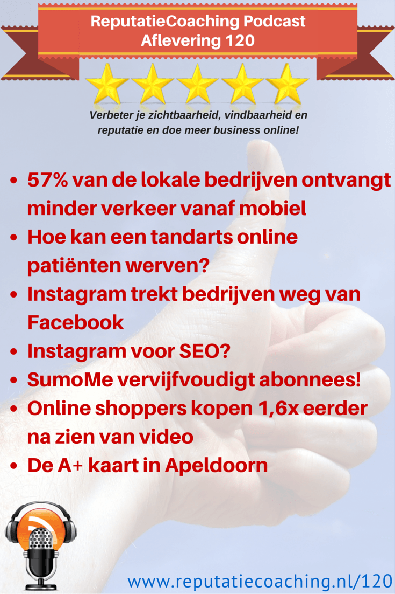
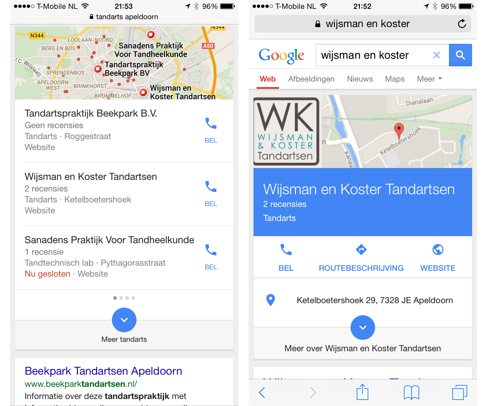
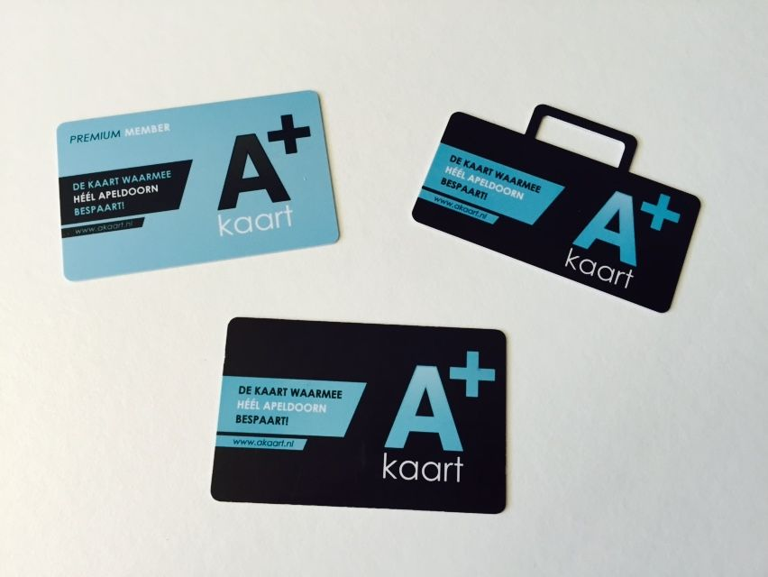

> **Historisch archief.** Deze aflevering verscheen op 19-03-2015 als onderdeel van ReputatieCoaching (2012–2016). De oorspronkelijke tekst is hieronder historisch bewaard. Diensten, contactgegevens, links, tools en adviezen kunnen inmiddels verouderd zijn.



**Transcriptiestatus:** Volledige transcriptie uit het oorspronkelijke archief.

**
Vandaag begin ik de podcast met een pijnlijk onderwerp. Hoewel het nog geen 21 april is, zal maar liefst 57% van de lokale bedrijven die mobiele bezoekers naar hun website kregen via hun lokale bedrijfsvermelding, vanaf eergisteravond dit verkeer zien wegvallen! Blijf luisteren!**

**En eerder deze week heb ik voor een tiental tandartsen uit Apeldoorn een presentatie gegeven over hoe ze in dit tijdperk van Internet patiënten kunnen werven.**

**Op Emerce las ik wederom een bevestiging dat de populariteit van Instagram toeneemt en zelfs zoveel, dat bedrijven minder gaan adverteren op Facebook en meer foto’s in eerste instantie delen via Instagram en pas daarna via Facebook. Ook vertel ik je iets over SEO met Instagram: is het mogelijk en zo ja, hoe dan?**

**WordPress blijft het CMS dat ik iedereen adviseer, die maar een nieuwe website gaat of laat maken. Eén van de redenen is de grote hoeveelheid beschikbare plugins die extra functionaliteit aan je website geven. Ik heb nu een plugin gevonden die het aantal inschrijvingen op mijn mailinglist vervijfvoudigt. Blijf luisteren, als je wilt weten welke plugin dat is.**

**“Video werkt als marketingtool!”. Dat roept iedereen. Wist je dat mensen die een video van een product hebben gezien, 1,6x vaker iets kopen dan de mensen die geen video hebben gezien?**

**Oh, nog iets leuks! Ik ben bezig met een soort van blauwdruk te ontwikkelen, die je in staat stelt op door jou ingestelde mometen tweets te versturen; geheel automatisch! Daarvoor heb ik over een paar weken drie betatesters nodig.**

**Gisteren had ik een leuk gesprek met Sascha Kruijshoop over de A+ kaart. Dat is weliswaar bestemd voor Apeldoornse ondernemers en inwoners van Apeldoorn, maar mogelijk bestaat er ook een dergelijk initiatief bij jou in de plaats en kun jij er ook je voordeel mee doen.**

Hallo en hartelijk welkom bij deze aflevering van de ReputatieCoaching Podcast. Ik ben Eduard de Boer, ReputatieCoach. Dit is dé podcast die jou helpt om meer business te genereren, doordat jouw website beter gevonden wordt, zowel lokaal als landelijk en doordat ik je uitleg hoe je je online reputatie kunt verbeteren. Dit alles helpt je om je bedrijf en jezelf beter op de online kaart te plaatsen.

De podcast kun je vinden op [www.reputatiecoaching.nl/120](https://www.reputatiecoaching.nl/120/). Daar vind je niet alleen de tekst, maar ook video’s waar ik het in deze uitzending over heb, alsmede afbeeldingen, links enzovoorts. Bovendien is de podcast te beluisteren in [iTunes](https://www.reputatiecoaching.nl/itunes), op [Stitcher](https://www.reputatiecoaching.nl/stitcher) en ook op [TuneIn Radio](http://tunein.com/radio/ReputatieCoaching-Podcast-p655084/). Ik raad je aan om je op één van die drie kanalen te abonneren op de podcast, zodat je geen aflevering hoeft te missen!

Laat ik dan nu overgaan op de onderwerpen voor vandaag…

## 57% van de lokale bedrijven ontvangt minder verkeer vanaf mobiel

Zoals je wellicht ben ik bijna dagelijks bezig om te zien of er iets verandert in de zoekresultaten en zo ja, wat ik zie. Zo spotte ik vorige week vrijdag kortstondig een experiment van Google, waarbij lokale Google+ bedrijfsvermeldingen op een geheel andere manier werden weergegeven. Het leek erop alsof de weergave werd gelijkgetrokken met die van Google Maps.

Enig navragen bij collega’s in de Verenigde Staten wees uit dat deze weergave aldaar reeds een tijdje actief was. Hoewel ik die weergave na een paar minuten niet meer kon reproduceren, bleven enkele Nederlandse collega’s nog wel deze weergave zien.

Maar eergisteravond zag ik opeens een totaal andere presentatie van de lokale zoekresultaten! Wat meteen opviel was dat er geen zeven, maar slechts nog drie lokale bedrijven werden vertoond:

[](https://lh5.googleusercontent.com/-J7_JVsDhrFs/VQlRUb82T5I/AAAAAAAAB3E/HfflOgHsufo/w1191-h993-no/20150318-Nieuwe-lokale-resultaten.png)

Dit heeft dus tot gevolg dat de vier bedrijven die op “D” tot en met “G” stonden, niet meer vermeld worden en dus ook geen verkeer meer uit de lokale bedrijfsvermeldingen ontvangen. Samenvattend: [57% van de lokale bedrijven ontvangt nu dus minder verkeer vanaf mobiele apparaten](https://www.reputatiecoaching.nl/57-van-de-lokale-bedrijven-verliest-groot-deel-van-de-mobiele-bezoekers/).

Overigens is ook de weergave van het lokale bedrijf veranderd, die je krijgt als je op het bedrijf klikt. Dan krijg je naast de inhoud van de Google+ vermelding ook nog tien organische zoekresultaten te zien, waar je bedrijf mee scoort.

En dat alles, terwijl het nog niet eens 21 april is! Dan vindt er namelijk een andere shakeout plaats die meer dan 50% van alle mobielonvriendelijke websites raakt. Vanaf die dag worden websites die niet compatible zijn met mobiele apparaten, lager vertoond in de mobiele zoekresultaten. En gezien het feit dat volgens Google gemiddeld iets meer dan 50% van alle zoekpogingen wordt uigevoerd op mobiele apparaten, dan kun je simpel narekenen wat het effect van deze verandering zal zijn.

En mocht je denken dat het in Nederland zo’n vaart nog niet zal lopen? Ik kan je vertellen dat zelfs tandartsen al gemiddeld zo’n 45% van hun verkeer via mobiel zien binnenkomen! Hoewel [www.reputatiecoaching.nl](/) wel mobielvriendelijk is, is grappig genoeg slechts 21,4% van het verkeer afkomstig vanaf mobiel of tablet. Maar in de statistieken van andere sites waar ik inzicht in heb zie ik inderdaad percentages variërend van 37% tot zo’n 53%…

Heb jij al eens gekeken naar je eigen statistieken? Hoeveel procent komt er bij jou vanaf mobiel? En is jouw website al wel mobiel? Ik kan het niet vaak genoeg zeggen: de tikker loopt…

## Hoe kan een tandarts online patiënten werven?


Vaak zeggen tandartsen dat ze geen patiënten meer aannemen, omdat ze “vol” zitten. Echter, als ze dit lange tijd volhouden vrees ik dat hun patiëntenbestand toch zal slinken en dan niet eens door de patiënten die overlijden.

Want volgens het CBS verhuizen gemiddeld zo’n 1,4 miljoen mensen per jaar. Daarvan gaat 40% naar buiten de gemeente en dus is de kans groot dat die mensen een andere tandarts gaan zoeken in de gemeente waar ze naartoe verhuizen.

Daarnaast zegt ook de KNMT (dat is de Koninklijke Nederlandse Maatschappij ter bevordering der Tandheelkunde) dat zo’n 60% van alle tandartsen toch nog nieuwe patiënten aanneemt.

Maar tandartsen worden geacht niet commercieel te zijn. Aan de andere kant lijkt het mij dat ze aan het einde van elk jaar toch geïnteresseerd zijn in een positief resultaat onder de streep.

Afgelopen maandagavond heb ik voor een studiegroep van tandartsen een presentatie gegeven over hoe tandartsen in deze moderne tijd patiënten kunnen werven via Internet. De presentatie sloot ik af met een soort online reputatiescan van de praktijk van elke aanwezige tandarts.

De inhoud van de presentatie varieerde van het oppoetsen van je Google+ pagina tot en met het verzamelen en vragen van reviews en het omgaan met negatieve reviews. Een leuke anekdote was dat de Google+ pagina van één van de praktijken als categorie “afhaalrestaurant” had. Dat leidde tot algehele hilariteit!

De presentatie kun je bekijken, want die heb ik op Slideshare geplaatst. Bovendien heb ik de presentatie ook opgenomen in de show notes:

\*\* [Hoe werf je als tandarts nieuwe patiënten online?](https://www.reputatiecoaching.nl//www.slideshare.net/ReputatieCoaching/hoe-werf-je-als-tandarts-nieuwe-patienten-online) \*\* from **[Eduard de Boer](https://www.reputatiecoaching.nl//www.slideshare.net/ReputatieCoaching)**

Ik heb tijdens de presentatie de audio van mijn verhaal opgenomen, dus binnenkort kun je ook nog de slideshow met de voiceover tegemoet zien. Maar daar gaat altijd veel tijd in zitten, dus die laat nog even op zich wachten.

## Instagram trekt bedrijven weg van Facebook

*Historische afbeelding niet beschikbaar: Instagram*
Vorige week vertelde ik er ook al over, dat het bereik van je content op Facebook steeds meer en meer beperkt wordt. Je moet echt betalen, wil je met je video’s, afbeeldingen of statusupdates nog een groot publiek bereiken op Facebook. Dat is ook de bevinding van de grote bedrijven en je ziet dat steeds meer bedrijven en merken eerst content gaan delen via Instagram en pas daarna via Facebook.

Dat las ik in een artikel op Emerce, met als titel “[Instagram trekt marketeers weg van Facebook](http://www.emerce.nl/nieuws/instagram-trekt-marketeers-weg-facebook)”. Dat artikel gaat over een oderzoek dat is uitgevoerd door onderzoeksbureau L2 Inc. onder 250 grote merken.

Op de site van L2 Inc. kun je een educatieve Engelstalige video zien, waarin de move naar Instagram, tezamen met diverse statistieken wordt uitgelegd. Deze video heb ik ook opgenomen in de show notes, op [www.reputatiecoaching.nl/120](https://www.reputatiecoaching.nl/120/):

```
  * Bedrijven zetten meer in op het organisch bereiken van hun doelgroep en steeds minder op het verzamelen van “Likes”.
  * Circa 1/3 van de merken die meer dan 20 keer per week op Instagram posten, creëren een bovengemiddelde interactie en betrokkenheid.
  * Productfoto’s in de context van lifestyle genereren meer betrokkenheid dan andere foto’s.
```

## Instagram voor SEO?

*Historische afbeelding niet beschikbaar: Instagram*
Al die content in de vorm van foto’s publiceren op Instagram is leuk en levert betrokkenheid op. Maar de vraag is of het ook een SEO effect heeft. Met andere woorden: draagt het publiceren van die foto’s bij aan het hoger scoren in de zoekresultaten?

Dat blijft een gevaarlijke vraag om te beantwoorden. Ik krijg vaker dit soort vragen, als: “Wat moet ik precies doen om snel hogerop te komen in de zoekresultaten? Hoe kom ik snel hoger dan mijn concurrent in plaats XYZ?”.

Je moet ook oppassen waarvoor je wilt scoren. Want lang niet elke zoekterm die jij mogelijk in je hoofd hebt wordt daadwerkelijk gebruikt door je toekomstige klanten of patiënten en ook lang niet elke zoekterm leidt tot conversie. En geld spenderen om alleen maar zoveel mogelijk bezoekers naar je site te trekken is ook behoorlijk zinloos.

Elke weg naar de top in de zoekresultaten begint met je site op orde brengen qua: gebruikersgemak, mobielvriendelijkheid, laadtijd en wat dies meer zij. Natuurlijk kun je je suf willen lezen en eindeloos zoeken naar alle informatie die je maar hierover kunt vinden. Mijn advies is: begin gewoon eerst eens met het aandachtig lezen van de Google “[Richtlijnen voor webmasters](https://support.google.com/webmasters/answer/35769?hl=nl)”. Dan lees je al heel snel wat je wel, maar vooral ook niet moet doen…

En als je slim bent, post je af en toe een foto op Instagram, waarbij je in elk geval een volwaardige citation in de omschrijving opneemt. Dat levert je dan niet alleen een citation bij Instagram op, maar ook bij andere websites die Instagramfoto’s en omschrijvingen vertonen. Voor links hoef je het niet echt te doen, want die worden door Instagram niet als klikbare links vertoond. Aan de andere kant lees je hier en daar verwijzingen dat Google ook aandacht geeft aan niet-klikbare links. Dus het kan sowieso geen kwaad. Ik heb ook wel gezien dat een site die foto’s van Instagram op een bepaalde manier herpubliceert, links wèl omzet naar klikbare links, al of niet NOFOLLOW.

Vorige week vertelde ik je over mijn experiment, maar het is nog te vroeg om resultaten te delen, vanwege de simpele reden dat ik in die ene week nog geen significante wijzigingen heb waargenomen. Ik houd een vinger aan de pols.

Je kunt in Instagram overigens slechts één link plaatsen, die wel klikbaar is. En dat is de link die je vermeldt in je Instagramprofiel. Als iemand je profiel bekijkt, wordt die klikbare link vertoond. Ik heb wel eens gehoord dat er bedrijven zijn die de link aanpassen per campagne die ze op Instagram draaien. Dus als ze een serie foto’s ten behoeve van de promotie van een bepaald product of een bepaalde dienst publiceren, wijst de link naar een specifieke landingspagina en dus niet naar de hoofdpagina van de site. Daarmee zou jij dus ook kunnen experimenteren.

Een andere mogelijkheid is dat je (er van uitgaand dat je WordPress gebruikt), de plugin [Pretty Link Lite](https://wordpress.org/plugins/pretty-link/) installeert. En als je dan in die plugin een prettylink aanmaakt die bijvoorbeeld luidt: [www.jouwsite.nl/instagram,](http://www.jouwsite.nl/instagram,) dan kun je de uiteindelijke bestemming van die link zelf bepalen vanuit je WordPress. Dat werkt mogelijk iets prettiger voor je.

Ik wil hier even niet verder ingaan op het gebruik van die plugin, maar ik kan je van harte aanraden om die in je WordPress te installeren, omdat je er leuke dingen mee kunt doen.

## SumoMe plugin vervijfvoudigt mijn abonnees!

*Historische afbeelding niet beschikbaar: Waarom WordPress?*
Terwijl ik wandel met de honden of als ik in de auto zit op weg naar opdrachtgevers of op de terugweg van bijeenkomsten die ik heb bezocht luister ik vrijwel altijd naar podcasts. Ik heb je al eens een lijstje gegeven van de podcasts waarop ik ben geabonneerd. Die is inmiddels enigszins verandert, maar dat doet er nu niet toe.

In een paar van die podcasts hoorde ik de hosts spreken over de plugin [SumoMe](https://wordpress.org/plugins/sumome/) voor het vergroten van het aantal inschrijvingen voor je mailinglist. Als je de informatiepagina op de WordPress-site leest, suggereert de omschrijving dat je het aantal abonnees op je mailinglist met die plugin kunt verdubbelen.

Ik kan je inmiddels vertellen dat dat nog een understatement is. Ik heb de plugin nu drie weken draaien op de site en ik zie tenminste vijf keer zoveel inschrijvingen binnenkomen, dan voorheen. Dus ik laat de plugin voorlopig actief, dat kun je je wel voorstellen!

## Webinars over handige plugins? Of andere topics?

Over WordPress plugins gesproken… Ik gebruik een groot aantal verschillende plugins in de diverse WordPress websites die ik heb. Van de meeste plugins heb ik een aardig idee hoe je ze het beste kunt gebruiken. Wellicht dat dat iets is, waar jij je voordeel mee wilt doen? Want als je het leuk vindt, kan ik een serie webinars organiseren over diverse handige plugins.

Ik kan dan beginnen met de plugins die ik gebruik en als je wilt mag je ook verzoeken indienen als je wilt dat ik naar bepaalde plugins kijk.

Hoe lijkt je dat? Heb je interesse in een paar van dit soort no-nonsense, hands-on webinars waarin ik je vertel over diverse nuttige, handige plugins en hoe je ze moet gebruiken?

Heb je interesse? Laat het me dan weten en post je reactie onder de show notes van deze podcast, op [www.reputatiecoaching.nl/120](https://www.reputatiecoaching.nl/120/).

## Online shoppers kopen 1,6x eerder na zien van video

Het CBS heeft een paar dagen geleden bekendgemaakt dat het aantal Internetgebruikers die online shoppen in de periode van 2005 tot 2014 is gestegen van 50 naar 77%. Dus, 77% van de Internetgebruikers koopt online!

In datzelfde artikel, waarnaar ik een link heb opgenomen in de show notes, wordt ook het volgende geschreven:

Het is vooral deze stijging die mij motiveert om niet alleen te bloggen, maar om ook deze podcast uit te brengen. Want mensen willen content consumeren waar en wanneer het hèn uitkomt. Daar past het fenomeen podcast dus ook in! Ook Apple voorzag deze trend. Het is niet voor niets dat Apple tegenwoordig de app “Podcasts” standaard meelevert in iPhones en op iPods en iPads! Gisteren attendeerde ik nog weer iemand op de app en die was ook meteen enthousiast over het fenomeen.

Maar goed, ik wil deze statistieken even relateren aan een ander interessant artikel dat ik heb gelezen. Dat is het artikel “[Online Shoppers 1.6X More Likely To Make Purchase After Viewing Video](http://marketingland.com/online-shoppers-1-6x-more-likely-to-make-purchase-after-viewing-video-report-121609) ” van Amy Gesenhues op Marketing Land. In dat artikel schrijft zij over een onderzoek dat is uitgevoerd door Invodo.

Ik geef je een paar resultaten uit dit onderzoek:

```
  * Internetshoppers die een video van een product hadden gezien, kochten 1,6x vaker het product, dan de mensen die de video niet hadden gezien.
  * Video’s op productpagina’s hadden een 16,8% view rate, terwijl algemene video’s op de websites door meestal niet meer dan zo’n 4 tot 5% van de bezoekers werden bekeken.
  * 4 van de 5 video’s hadden positieve reviews.
  * 2 van de 3 shoppers keken video’s voor tenminste 80% van de totale duur.
  * Op zondagen worden de meeste productvideo’s bekeken.
  * 62% van de video’s werd bekeken op een desktop, 20% op een smartphone en 18% op een tablet.
```

Tot zover de statistieken uit dat artikel. Video’s werken dus verkoopverhogend. Dit onderzoek is weliswaar uitgevoerd in de Verenigde Staten, maar ik denk dat het mensen eigen is. Kijk ook hier maar eens om je heen hoeveel video content er wordt geconsumeerd.

Laat dit voor jou een stimulans zijn om te beginnen met video, als je er tot nu toe nog niets mee doet. Want, zoals blijkt uit deze statstieken, laat je business liggen!

En zelfs tandartsen stappen in contentmarketing met video’s. Dat fenomeen was al populair in de Verenigde Staten, maar het komt nu ook naar Nederland. Eerder deze week heb ik voor Wijsman en Koster Tandartsen in Apeldoorn een video gemaakt over implantaten. Om je een idee te geven hoe zo’n video er uiziet heb ik die video opgenomen in de show notes:

## Tweets versturen van uit een spreadsheet!

*Historische afbeelding niet beschikbaar: Twitter*
Van nuttige plugins voor WordPress waar ik het iets eerder in deze podcast over had, kom ik ook op andere leuke en handige tooltjes… Technisch heb ik het al werkend… Ik heb een spreadsheet waarin ik mijn tweets intyp, tezamen met de datum/tijd dat ze online moeten komen. En omstreeks het gespecificeerde tijdstip wordt de tweet online gepubliceerd… Geheel automatisch!

Het concept is dus letterlijk zo simpel als het vullen van een paar velden in een spreadsheet! Dit wordt een product, in de vorm van een digitale handleiding en enkele instructievideo’s. Het product is over een paar weken gereed om te testen. Op dat moment heb ik drie betatesters nodig, die kritisch willen kijken naar alle onderdelen: de documentatie, de video’s en natuurlijk de oplossing.

Wil jij mij helpen met testen en als eerste GRATIS de blauwdruk voor het opzetten van dit handige systeem ontvangen? Wacht dan niet te lang! Want na drie testers stopt de mogelijkheid om je op te geven!

In de show notes op [www.reputatiecoaching.nl/120](https://www.reputatiecoaching.nl/120/) heb ik een invulformulier opgenomen. Daarin kun je je naam en mailadres achterlaten:

## De A+ kaart in Apeldoorn

Laat ik je voorafgaand aan dit topic over de [A+ kaart](http://www.akaart.nl) vertellen dat dit het laatste onderwerp is van deze podcast. Ben je totaal niet geïnteresseerd in de wijze waarop dit Apeldoornse initiatief lokale bedrijven en klanten weer dichter bij elkaar brengt, dan kun je nu stoppen met luisteren.

Aan de andere kant: je zou ook nog even kunnen blijven luisteren of je er nog iets van kunt opsteken… De keuze is aan jou!

OK, je blijft dus luisteren. De A+ kaart is een relatief nieuw initiatief in Apeldoorn dat lokale bedrijven op een positieve en niet-pusherige manier onder de aandacht brengt van de klanten of potentiële klanten.

Het concept van de [A+ kaart](http://www.akaart.nl) is afgeleid van de Iamsterdam City Card. Die is bedoeld voor mensen die in Amsterdam gedurende 24, 48 of 72 uur gratis gebruik willen maken van het Openbaar Vervoer, gratis in musea kunnen, gebruik maken van aanbiedingen etc.

[](https://lh4.googleusercontent.com/-yeiXCJXx03Y/VQsaZfJL3TI/AAAAAAAAB34/ruCAijkplzY/w852-h640-no/apluskaart.jpg)

Even in het kort hoe het hier in Apeldoorn werkt: mensen kunnen een abonnement nemen op de A+ kaart. Dat kost hen € 12,50 per maand. Dat lijkt duur, tenzij je hoort/leest wat je ervoor krijgt. Om te beginnen gaat er al € 2 per maand van naar goede doelen. Je krijgt daarnaast bij een groot aantal bedrijven in Apeldoorn (inmiddels al meer dan 60!) iets gratis of een substantiële korting. Ik geef je een paar voorbeelden:

```
  * Een lokale bakker geeft je gratis 1 desembrood per week
  * Je ontvangt 1 gratis grillworst per maand bij de plaatselijke slager
  * De lokale Jumbo geeft je per week EUR 5 aan gratis boodschappen
  * Gratis ruitensproeier bij het wassen van je auto.
  * Tweede persoon eet voor de halve prijs in een bepaald restaurant
  * Gratis sundae ijs bij McDonald’s in Apeldoorn bij bestelling van een menu
  * et cetera.
```

In de show notes heb ik ook een korte promotievideo opgenomen van de A+ kaart:

Ten tweede zet het Allround Fotografie op deze manier extra op de lokale kaart van Apeldoorn en ik ga experimenteren met diverse aanbiedingen om ervaring te krijgen met wat werkt en wat niet.

Ik weet natuurlijk niet wat er allemaal in andere plaatsen in Nederland speelt. Daarom is mijn advies aan jou om ook eens in je eigen plaats te onderzoeken en verder te kijken of er een soortgelijk initiatief is waar jij als lokale ondernemer je voordeel mee kunt doen.

Is er in jouw plaats iets soortgelijks? Laat het dan weten en plaats je reactie onderaan de show notes van deze podcast, op [www.reputatiecoaching.nl/120](https://www.reputatiecoaching.nl/120/).

Met dit topic over de A+ kaart in Apeldoorn kom ik dan weer aan het einde van deze 120e podcast…

Als je de podcast leuk vindt en je wilt nog meer op de hoogte blijven, volg me dan ook op Twitter, via [@reputatiecoach1](https://twitter.com/reputatiecoach1).

Heb je inderdaad wat aan alle informatie die ik met je deel, help mij dan met het verder verbeteren en promoten van deze podcast. Abonneer je op de podcast, zodat je altijd meteen de nieuwste uitzending krijgt voorgeschoteld.

Zoek de podcast op, in [iTunes](https://www.reputatiecoaching.nl/itunes) of [Stitcher](https://www.reputatiecoaching.nl/stitcher), geef de podcast een sterrenbeoordeling en laat ook je reactie achter. Door de podcast te beoordelen op iTunes en/of Stitcher breng je de podcast onder de aandacht van een breder publiek.

Je kunt me verder helpen, door de podcast aan te bevelen bij vrienden of collega’s, waarvan je denkt dat ze er hun voordeel mee kunnen doen, of door ’m te delen op Twitter, like’n en delen op Facebook of een “+1” te geven op Google+.

En vergeet niet: ik ben hier om je te helpen! Als je een vraag of een probleem hebt met betrekking tot je online reputatie of de vindbaarheid van je website, kun je een mailtje sturen naar [podcast@reputatiecoaching.nl](mailto:podcast@reputatiecoaching.nl).

Als je dat te lastig vindt, of als je de podcast beluistert terwijl je in de auto zit en je hebt acuut een vraag, spreek dan een boodschap in op de ReputatieCoaching Hotline, op nummer: 084 - 883 15 56. Mogelijk behandel ik je vraag of probleem dan in een artikel of in de podcast.

En je kunt ook rechtstreeks op de website een voicemail achterlaten, door op de tab aan de rechterkant van elke pagina te klikken, en je bericht in te spreken. Dit was [ReputatieCoaching Podcast aflevering 120](https://www.reputatiecoaching.nl/120/) en mijn naam is [Eduard de Boer](http://nl.linkedin.com/in/eduarddeboer/nl).

Ik wens je de komende week weer succes met het werken aan je reputatie, zodat je meteen je reputatie voor jou kunt laten werken!

Tot volgende week!

Doei!

Links naar content die in deze podcast aan bod komt:

```
  * [ReputatieCoaching Podcast in iTunes](https://www.reputatiecoaching.nl/itunes)
  * [ReputatieCoaching Podcast op Stitcher](https://www.reputatiecoaching.nl/stitcher)
  * [ReputatieCoaching Podcast op TuneIn Radio](http://tunein.com/radio/ReputatieCoaching-Podcast-p655084/)
  * [ReputatieCoaching Podcast RSS-feed](https://feeds.reputatiecoaching.nl/ReputatieCoachingPodcast)
  * [Pretty Link Lite](https://wordpress.org/plugins/pretty-link/) (Plugin voor WordPress om mooie korte links te maken)
  * [SumoMe](https://wordpress.org/plugins/sumome/) (Plugin voor het “verdubbelen” van je abonnees)
  * [A+ Kaart](http://www.akaart.nl) (voor inwoners van Apeldoorn)
  * “[CBS: Tablet verdringt bord van schoot](http://www.cbs.nl/nl-NL/menu/themas/vrije-tijd-cultuur/publicaties/artikelen/archief/2015/tablet-verdringt-bord-van-schoot.htm)” (CBS, 11 maart 2015)
  * “[Instagram trekt marketeers weg van Facebook](http://www.emerce.nl/nieuws/instagram-trekt-marketeers-weg-facebook)” (Emerce, 16 maart 2015)
  * “[Online Shoppers 1.6X More Likely To Make Purchase After Viewing Video](http://marketingland.com/online-shoppers-1-6x-more-likely-to-make-purchase-after-viewing-video-report-121609)” (Marketing Land, 16 maart 2015)
```
