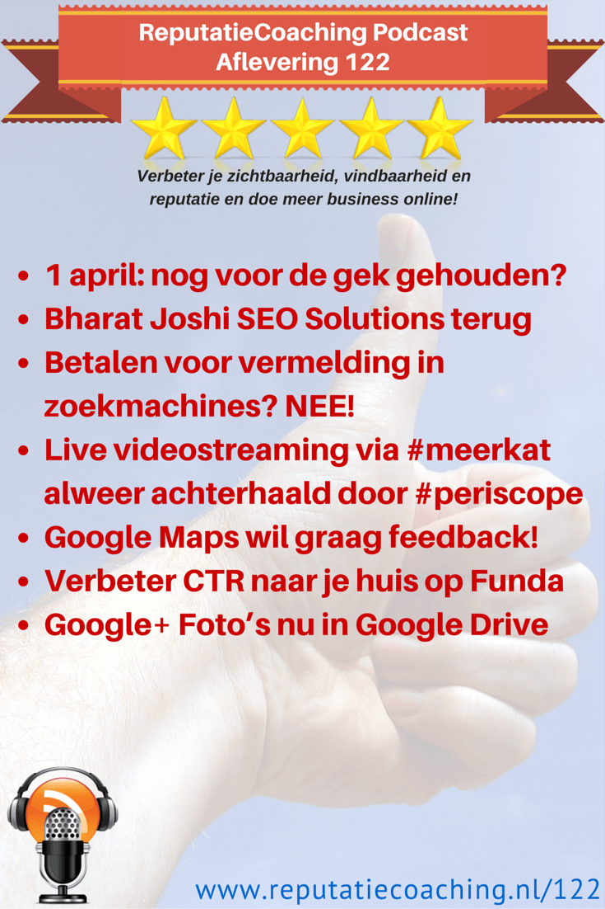
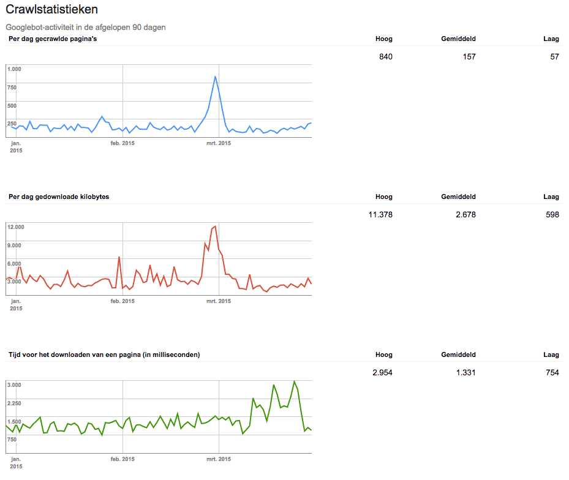
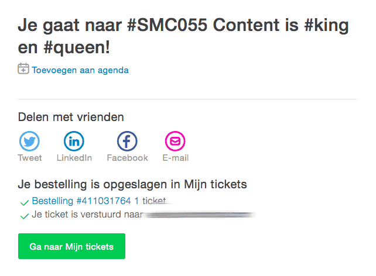
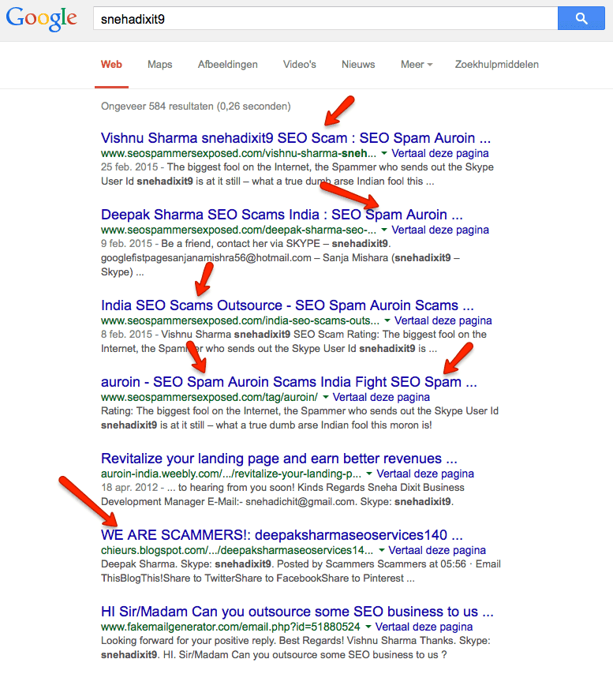
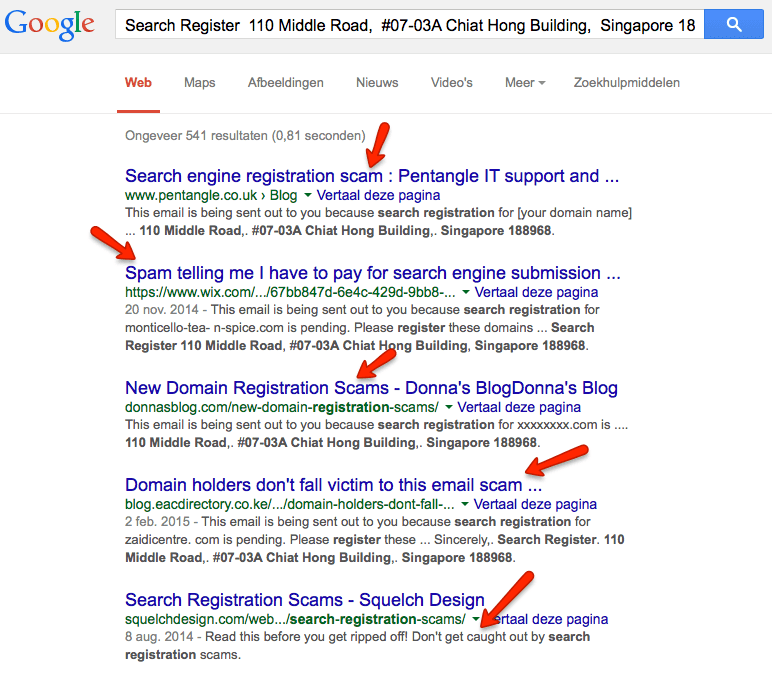
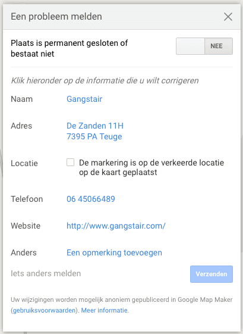
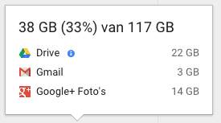

> **Historisch archief.** Deze aflevering verscheen op 2-04-2015 als onderdeel van ReputatieCoaching (2012–2016). De oorspronkelijke tekst is hieronder historisch bewaard. Diensten, contactgegevens, links, tools en adviezen kunnen inmiddels verouderd zijn.



**Transcriptiestatus:** Volledige transcriptie uit het oorspronkelijke archief.

**
Vorige week vertelde ik je toch over de serverstoring? Die lijkt opgelost en alles functioneert weer naar behoren. Ik heb weer een kaartje voor de #SMC055-avond van 13 april aanstaande en bovendien is Bharat Joshi weer terug met zijn SEO services… Ik leg je uit hoe je dit soort scam en spam kunt herkennen.**

**Ben jij actief met de nieuwe live video streaming app ‘Meerkat’? Dan ben je alweer ouderwets, want de opvolger heet ‘Periscope’! Google Maps wil graag jouw feedback om actueel te blijven!**

**Ik heb een aantal tips voor je voor het verhogen van de clickthrough rate op Funda en ik sluit de podcast van vandaag af met nieuws van Google+ Foto’s en Google Drive.**

Hallo en hartelijk welkom bij deze aflevering van de ReputatieCoaching Podcast. Ik ben Eduard de Boer, ReputatieCoach. Dit is dé podcast die jou helpt om meer business te genereren, doordat jouw website beter gevonden wordt, zowel lokaal als landelijk en doordat ik je uitleg hoe je je online reputatie kunt verbeteren. Dit alles helpt je om je bedrijf en jezelf beter op de online kaart te plaatsen.

De podcast kun je vinden op [www.reputatiecoaching.nl/122](https://www.reputatiecoaching.nl/122/). Daar vind je niet alleen de tekst, maar tevens video’s waar ik het in deze uitzending over heb, alsmede afbeeldingen, links enzovoorts. Bovendien is de podcast te beluisteren in [iTunes](https://www.reputatiecoaching.nl/itunes), op [Stitcher](https://www.reputatiecoaching.nl/stitcher) en op [TuneIn Radio](http://tunein.com/radio/ReputatieCoaching-Podcast-p655084/). Ik raad je aan om je op één van die drie kanalen te abonneren op de podcast, zodat je geen aflevering hoeft te missen!

## 1 april: nog voor de gek gehouden?

Gisteren was het 1 april, de dag dat mensen elkaar traditioneel voor de gek houden. Ben jij nog voor de gek gehouden? Of heb je anderen voor de gek gehouden? Ik hoop dat je er geen reputatieschade aan hebt opgelopen. Heb je iets leuks meegemaakt of iemand een leuke poets gebakken, laat het eens weten onderaan de show notes op [www.reputatiecoaching.nl/122](https://www.reputatiecoaching.nl/122/).

Op Google Maps was er wel een ludieke actie. Het is niet helemaal zeker of het een 1 april grap betreft, omdat die vanaf 31 maart al beschikbaar was in de Verenigde Staten. Maar dat kan natuurlijk komen doordat het toen in Nieuw-Zeeland al wel 1 april was.

Wil je weten wat die grap dan was? Kijk dan naar de screenshot in de show notes. Opeens kun je op Google Maps het inmiddels bijna antieke Pac-Man spelen in je eigen buurt of waar dan ook ter wereld!

[[Historische afbeelding: Pac-Man op Google Maps in Matenhoek (Apeldoorn)](https://lh3.googleusercontent.com/p_VR4QlbY8GvoiCQqyNQukPwdIVa-ipFwMy8K578aII=w1360-h1029-no)](https://lh3.googleusercontent.com/p_VR4QlbY8GvoiCQqyNQukPwdIVa-ipFwMy8K578aII=w1360-h1029-no)

Laat ik dan nu overgaan op de onderwerpen voor vandaag…

## Serverstoring opgelost: update over crawlstatistieken

Vorige week vertelde ik je dat ik bijna de hele woensdag bezig was geweest met het oplossen van een probleem op de webserver. In de show notes van de [podcast van vorige week](https://www.reputatiecoaching.nl/121/) heb ik je een grafiek laten zien die uit Google Webmaster Tools kwam, waarin je kon zien dat vanaf ongeveer 8 maart de server een stuk trager was geworden, waardoor de laadtijd van de webpagina’s bijna was verdrievoudigd.

De afgelopen week heb ik de vinger aan de virtuele pols van de server gehouden en de laadtijden nauwlettend gevolgd in Webmaster Tools. Gelukkig heb ik kunnen constateren dat richting Google het probleem opgelost lijkt, want de laadtijden zitten gemiddeld weer rond de één seconde per pagina.

[](https://lh5.googleusercontent.com/-qWJMNltiQ8g/VRxDenB_OaI/AAAAAAAAB7Y/UO-ERVSyKNo/w929-h784-no/20150331-Crawlstatistieken.png)

Desalniettemin heb ik een tweewekelijks terugkerende actie genoteerd in mijn agenda om toch even de statistieken voor de verschillende sites in GWT (dat is de afkorting voor Google Webmaster Tools), te controleren.

## #SMC055 met @jeanetbathoorn en @corhospes op 13 april a.s.

Gisteren stond ik weer op scherp! De klok van mijn computer liep gelijk met de atoomklokken elders in de wereld. Gespannen als een vioolsnaar zat ik vanaf 09:55 achter mijn beeldscherm… Toen het 15 seconden voor 10 was begon ik met het reloaden van de inschrijfpagina om maar een kaartje voor de #SMC055 sessie van 13 april aanstaande te kunnen bemachtigen!

En het is gelukt! Ik mag weer naar de 13 april sessie, waarvan het onderwerp dit keer is: “Content is #King en #Queen”. Als gastsprekers komen Jeanet Bathoorn en Cor Hospes, dus dat belooft wat te worden.

[](https://lh5.googleusercontent.com/-jg0BhLY8WuI/VRxDgI6PwlI/AAAAAAAAB7I/Go-CgA1nAog/w642-h472-no/20150401-smc055-bevestiging.png)Je kunt er meer over lezen op de site van [Social Media Club Apeldoorn](http://smcapeldoorn.nl/index.php/85-smc055-content-is-king-en-queen). Ik ben in elk geval van de partij en ik breng je na afloop weer op de hoogte van de inhoud van de avond.

## Bharat Joshi SEO Solutions (Skype: snehadixit9)

Kun je je [Bharat Joshi uit podcast 107](https://www.reputatiecoaching.nl/107/) nog herinneren? Toen bood hij SEO diensten aan. Hoewel ik toen niet heb gereageerd blijft hij toch volhouden. Laatst ontving ik weer een mail van hem, getiteld “SEO Solutions $99”. Hierin schreef hij het volgende:

Can you outsource some SEO business to us? We will work according to you and your clients and for a Long term relationship.
We will target in this Price More than 15 keywords.
Looking forward for your positive reply.

Best Regards!
Thanks.

Bharat joshi

Skype: snehadixit9

Als jij een soortgelijke mail ontvangt, moet je ’m gewoon delete’n. Denk na: hoe kan iemand uit (waarschijnlijk) India SEO voor jou doen voor 15 keywords? Bovendien weet je inmiddels wel dat je amper meer je website kunt optimaliseren voor 15 keywords. Het gaat om waardevolle content. Zonder content is het sowieso onmogelijk om goed te scoren.

Mocht je toch interesse hebben: je bent gewaarschuwd! Maar hoe kun je nu het kaf van het koren scheiden als je dit soort mailtjes krijgt?

Allereerst geldt de algemene regel: als iets te mooi lijkt om waar te zijn, dan is het bijna altijd te mooi om waar te zijn! Houd dat in gedachten!

Verder kan een beetje research doen naar gegevens die je in een dergelijke mail ziet, geen kwaad. Zoeken op de naam “Bharat Joshi” in Google levert je niet snel iets concreets op, waardoor je extra waakzaam wordt. Maar het intypen van het Skype-ID: snehadixit9 in Google levert slechts 547 resultaten op. En die zeggen meteen genoeg, zoals je kunt zien in de screenshot in de show notes:

[](https://lh4.googleusercontent.com/-OrbirVsKo4E/VRxDgp3K8DI/AAAAAAAAB7U/smqDz9nX6Rs/w777-h854-no/20150401-snehadixit9-scam.png)

Je ziet direct allemaal verwijzingen naar sites met trefwoorden als “scam” en “spam”. Dat zegt genoeg.

## Betalen voor vermelding in zoekmachines? NEE!

Maar de internetoplichters gaan verder en worden steeds creatiever. Zo stuurde Diana Albrink een ontvangen mail naar mij door, met de vraag of dit onzin was. Ik zal je de tekst even voorlezen:

Hi there Diana Albrink,

Domain Name: newyorkin40dates.com (Account #661592080)

This email is being sent out to you because search registration for newyorkin40dates.com is pending.

Please register these domains to search engines like Google, Bing and Yahoo ASAP to avoid late fees.

Registering for search engines would help you show up in search results and increase your online presence.

You can register your domain at link given below :

<http://seoevo.com/index.php?domain=newyorkin40dates.com&email=dianaalbrink%40hotmail.com&fname=Diana+Albrink>

We sincerely appreciate your business! If you require anything, we are at your service.

Remember… If you do not register your domain with the search engines, it may not appear in the search engine listing when people are looking for you. Failure to complete your domain name search engine registration by the expiration date may make it difficult for your customers to locate you on the web. Complete your search engine registration today.

Sincerely,

Search Register
110 Middle Road,
#07–03A Chiat Hong Building,
Singapore 188968.

Weer zo’n scammer. Deze probeert te appeleren aan angst… De angst dat je site niet zal worden opgenomen door de zoekmachines. Natuurlijk wist ik meteen dat dit onzin is. Zoekmachines als Google en Bing die doen hun uiterste best zelfstandig zo snel mogelijk zoveel mogelijk nieuwe sites te ontdekken en de content te indexeren. Dat is tenslotte één van hun standaardactiviteiten. Dus heb ik Diana direct teruggemaild dat dit inderdaad onzin was.

Maar goed, ik kon het niet laten even verder op onderzoek te gaan. Het viel me als eerste op dat er helemaal geen website werd vertoond, als ik [www.seoevo.com](http://www.seoevo.com) intypte in de browser. Dus zocht ik verder en klikte op de link in de mail. Vervolgens kwam ik via allerlei schermen en schijnbaar automatisch verworven kortingscodes op het volgende scherm:

[](https://lh5.googleusercontent.com/-NyK53zjK2do/VRxDgKeCNZI/AAAAAAAAB7E/3wcmAQeaK98/w991-h1029-no/20150401-seoevo.png)

Daar kon ik tegen betaling van US$97 mij ervan verzekeren dat de site opgenomen zou worden in de zoekmachines. Wow! Vanaf dat punt ben ik maar gestopt, want ik wist natuurlijk wel beter!

Een kleine zoektocht langs zogenaamde WHOIS servers liet zien dat de domeinnaam pas was geregistreerd op 25 februari 2015, heel recent dus. De volgende actie die ik ondernam was het kopiëren en plakken van het volledige adres in Google. Dat kan gewoon en het was meteen raak:

[](https://lh6.googleusercontent.com/-m2kjKqDIPiU/VRxDfVDHQmI/AAAAAAAAB7M/drG0yB5AkPM/w772-h673-no/20150401-search-register-seoevo-scam.png)

Allemaal verwijzingen naar scam en spam! Met deze twee voorbeelden van scams en pogingen tot moderne oplichting via Internet hoop ik je weer iets wijzer te hebben gemaakt, zodat je mails van een soortgelijke strekking in de toekomst direct herkent en verwijdert.

## Live videostreaming via #meerkat alweer achterhaald door #periscope

Slechts zo’n twee weken heeft de app Meerkat in de schijnwerpers gestaan. Meerkat stelt je in staat om live video te streamen via je Twitter-account. In no-time waren er 150.000 mensen geregistreerd, maar inmiddels is de app alweer een stille dood gestorven en zijn er nagenoeg geen mensen meer die het nog gebruiken.

De oorzaak daarvan is, dat Twitter er een virtueel stokje voor heeft gestoken. Omstreeks 9 maart maakte Twitter bekend de soortgelijke app “Periscope” te hebben opgekocht. Twitter heeft mooi meegelift op de immens groeiende populariteit van live videostreaming door Meerkat tot en met de conferentie SXSW15.

Toen sloeg Twitter genadeloos toe met Periscope. Periscope laat je grotendeels hetzelfde doen: live video streamen via Twitter, vanaf waar je maar bent (er natuurlijk van uitgaande dat je wel Internetconnectiviteit hebt).

Live streaming zal journalistiek eens en voor altijd veranderen. In plaats van dat er cameraploegen naar een ongeluk of ander nieuwswaardige gebeurtenis moeten, kunnen aanwezigen nu nog eerder live beelden streamen naar de rest van de wereld. Als gevolg hiervan zijn cameraploegen in de toekomst bijna altijd “te laat” en zijn de eerste beelden al gedeeld door de community.

Verder zie je dat diverse Internetgrootheden te pas en te onpas live video gaan streamen. De vraag is natuurlijk wel wat de zin ervan is om bijvoorbeeld het rondlopen met je honden live uit te zenden? Of je smartphone op je schoot te leggen en je gezicht te filmen als je aan het autorijden bent.

Ik denk dat het komt doordat het nog een nieuw fenomeen is, maar de live video streaming trekt wel kijkers. Zo was ik laatst bij een voetbalwedstrijd van onze zoon en streamde de video live, toen nog via Meerkat. Binnen no-time had ik toch maar liefst 23 kijkers! Maar deze hausse zal wel weer afzwakken, verwacht ik.

## Google Maps wil graag feedback!

Is het je wel eens overkomen dat je iets opzocht op Google Maps dat niet bleek te kloppen? En wist je toen niet wat je moest doen? Dan hoef je nu niet verder te zoeken. Google Maps wil graag jouw feedback, als er iets niet juist blijkt te zijn met een vermelding.

In de afbeedling hieronder zie je het venster dat wordt vertoond, als je op de naam van een bedrijf klikt. Onderaan zie je de tekst “Een bewerking voorstellen”:

[](https://lh5.googleusercontent.com/-O5X_P8u5LwQ/VRxDfIrHWLI/AAAAAAAAB7c/Jyd_WQ54FB4/w485-h422-no/20150401-gangstair-maps-bewerking-1.png)

Als je daarop klikt, kun je kiezen of de plaats permanent gesloten is, of anders op de informatie die niet klopt, zoals naam van het bedrijf, het adres, de locatie op de kaart, het telefoonnummer, de website of iets anders.

Wil je enige kans van slagen hebben dat jouw update wordt doorgevoerd, dan raad ik je aan om in het “Opmerking”-veld dat je ziet staan bij het kopje “Anders” zoveel mogelijk gegevens toe te voegen. Zo kun je jezelf voorstellen (je relatie tot het bedrijf bijvoorveeld), een link naar een geloofwaardige bron waar jij je andere informatie hebt gevonden, et cetera.

[](https://lh3.googleusercontent.com/--Oz24FLdFVc/VRxDfKjI0wI/AAAAAAAAB64/4FN41wFCc5Y/w409-h561-no/20150401-gangstair-maps-bewerking-2.png)

In sommige gevallen krijg je een mail van Google waarin wordt gemeld of de wijziging is doorgevoerd of niet en wat de reden daarvoor is.

Ik had gisteren nog een gesprek met een ondernemer. Hij gaat met zijn bedrijf omstreeks de herfst van dit jaar verhuizen naar een andere locatie. Met de Chrome extensie “NAP Hunter Lite”, waar ik het al eens eerder over heb gehad, heb ik voor hem zoveel mogelijk bedrijfsvermeldingen of citations gezocht. In eerste instantie vond NAP Hunter er 447. Na ontdubbeling en verwijderen van de URL’s van de bedrijfswebsite hield ik er alsnog 141 over.

Daar schrok de ondernemer van! Hij vroeg zich af óf en waarom hij die allemaal moest gaan wijzigen… En mijn antwoord was: “Ja, liefst allemaal. Maar anders zoveel mogelijk.”.

De reden ervoor is net als die van Google: de gebruikerservaring! Het staat ontzettend slordig als klanten naar je bellen om te melden dat ze je bedrijf niet kunnen vinden en ze blijken nog op je oude adres te staan.

Hieruit blijkt dat de tijden veranderen! Vroeger stond je vermeld bij de Kamer van Koophandel, in de Telefoongids en in de Gouden Gids. Je had je natuurlijk je visitekaartjes en briefpapier. Verder ging je een tijdje de banderolles en adreslabels van alle tijdschriften verzamelen om daarna een stapel adreswijzigingen te versturen aan de afzenders, evenals naar alle adressen in je Rolodex.

Tegenwoordig heb je geen flauw idee waar je allemaal vermeld staat met je bedrijfsgegevens! En dankzij zoekmachines zijn al die gegevens geïndexeerd en vindbaar! Dus is de kans veel groter dat je iets over het hoofd ziet en er ergens nog oude adresgegevens rondslingeren.

Een verhuizing vergt derhalve veel meer werk. Je kunt er niet vroeg genoeg mee beginnen, met het zoeken naar waar je allemaal vermeld staat. Zeker het grotere Internet-deel wordt vaak vergeten door bedrijven die verhuizen. Maak dus tijdig een lijst van alle plekken waar er een NAPT-vermelding van je bedrijf staat en ga die vóór je verhuizing allemaal aanpassen.

Wacht zo lang mogelijk met het aanpassen van je Google+ Mijn Bedrijf adres. Want de kans is groot dat Google een wijziging niet 1–2–3 toestaat. En als er voldoende andere online vermeldingen zijn van jouw bedrijf op het nieuwe adres, dan zal Google eerder de wijziging doorvoeren. Let wel dat je bedrijfsvermelding tijdens een dergelijke actie kan wegzakken in de lokale zoekresultaten.

Aan de andere kant is de verhuizing een mooi moment om in één keer alle andere inconsistente bedrijfsgegevens op te sporen, aan te passen en op te schonen waar mogelijk.

## Verbeter de clickthrough rate naar je huis op Funda

Eens iets anders over het verhogen van zichtbaarheid, om zo de clichthrough rate te verbeteren… Maar dan op Funda! Vrienden van ons hebben hun huis te koop staan en dus stond het huis op Funda, met omschrijving, plattegrond, kadastrale gegevens en foto’s die de makelaar had gemaakt.

In het kader van een soort van verfrissingsactie hebben we een aantal nieuwe foto’s gemaakt en dan niet alleen gewone “platte” foto’s, maar tevens een drietal 360° panoramafoto’s voor gebruik op Funda.

Toen ik eens ging kijken in Funda naar het overige woningaanbod van de verkoopmakelaar en van de andere huizen in de buurt, vielen mij een paar zaken op:

```
  * De makelaar had voor alle woningen een saaie, weinig zeggende afbeelding van de voorkant van het pand als eerste foto ingesteld. En dat is dus de foto die je in het algemene overzicht ziet, als je bijvoorbeeld zoekt in een bepaalde plaats of binnen bepaalde financiële grenzen.
  * De makelaar had voor geen enkel ander pand 360° foto’s laten maken.
  * Er stond wel een impressievideo op Funda en op YouTube, maar die was slechts in 360p… Een formaat dat je nooit of te nimmer zou durven te vertonen op een Full HD televisie.
  * De beschrijving bij de YouTube video was veel te beknopt om goed te kunnen ranken in de zoekresultaten.
  * In de video was nog geen gebruik gemaakt van infokaarten, noch van annotaties om eventueel door te klikken naar de website van de makelaar.
```

Ik vind het jammer om te zien dat ten eerste woningverkopers moeten betalen voor dit soort half geleverde diensten en ten tweede dat makelaars zo weinig idee hebben van toepassingen van de nieuwe media en al haar mogelijkheden om objecten beter zichtbaar en vindbaar te maken.

Zo te zien liggen daar nog heel wat kansen om dat te verbeteren en de eerste makelaars die daarmee aan de slag gaan zullen snel een significante verbetering zien in deze tijd, waarin de onroerend goed markt weer aantrekt.

Hoe ik het zou aanpakken? Om te beginnen flitsende foto’s, genomen bij mooi weer. En als eerste foto in Funda zou ik een sprekende knalfoto nemen en niet die van de voorgevel van een saai rijtjeshuis. Ik durf te wedden dat dat alleen al de CTR van de Funda-vermelding verhoogt.

Natuurlijk zou ik tenminste drie en indien mogelijk en relevant het maximum aantal van vijf panoramafoto’s in de Funda-vermelding willen. Veel makelaars kunnen die panoramafoto’s tegenwoordig al op hun eigen site zetten. Moet je zien wat voor extra beleving dit geeft aan potentiële kopers! Bovendien geeft het herkenning als de mensen komen kijken en kan het je helpen qua kijkers het kaf van het koren te scheiden.

Als je een impressievideo met een slideshow van het huis online plaatst, maak dan een moderne, flitsende video en niet een saaie en oudbollige PowerPoint-achtige opeenvolging van wat foto’s met teksten. En upload 1080p Full HD materiaal. Want steeds meer mensen surfen op grotere schermen en smart TV’s, waarop een inferieure video alleen maar afbreuk doet aan het object.

Gebruik de 4.000 karakters die je hebt voor de omschrijving in YouTube voor uitgebreide teksten en links naar relevante bestemmingen, zoals het object op Funda en natuurlijk een link naar het object op de site van de makelaar en de contactgegevens van de makelaar.

Een betere video thumbnail kan zeker bijdragen tot meer views van de video en mogelijk dus meer kijkers. Dus ik zou de keuze van de videothumbnail niet aan YouTube overlaten.

Bovendien zou ik de video op YouTube voorzien van annotaties en infokaarten om interactie met de kijkers mogelijk te maken. Stimuleer mensen om de video te “Like’n” of te delen en gebruik in de video links naar je site.

Verder zou ik me niet beperken door de video alleen te uploaden naar YouTube. Want als je de video ook uploadt naar Slideshare, Vimeo en Dailymotion kun je met wat geluk al twee of drie video’s vertoond krijgen als iemand het adres intypt in Google.

Tja, en het opsturen van papieren brochures van het object is zo achterhaald. Bovendien kost elke brochure weer bomen. Zet alle brochures van de objecten die je als makelaar in de verkoop hebt op document sharing sites, zoals Scribd, Issuu, Docstoc en dergelijke. Zo werken die 24 uur per dag, 7 dagen in de week voor je!

Wat je verder nog zou kunnen doen is een aantal generieke domeinnamen registreren, waarop je bepaalde type objecten te koop kunt aanbieden. Deze sites kun je dan na verkoop weer hergebruiken. Of wat dacht je ervan om voor de duurdere of exclusievere objecten een eigen Facebookpagina te maken? Zo kan ik nog wel even doorgaan!

Natuurlijk zou ik de huizen met alle foto’s uploaden (inclusief een passende omschrijving) op Pinterest. Want ik las eerder deze week dat Pinterest inmiddels het aantal van 50 miljard gepinde afbeeldingen is gepasseerd. Steeds meer mensen kijken op Pinterest. Dus moet je zeker zorgen dat je als makelaar daar je panden onder de aandacht brengt.

En wat te denken van Instagram? Je zou thema-accounts kunnen maken voor bijvoorbeeld appartementen, rijtjeshuizen, vrijstaande huizen, woonboerderijen et cetera. Of gewoon alles publiceren onder je eigen makelaarsaccount. Beide mogelijkheden is wat voor te zeggen. Ik neem aan dat ik je niet hoef te vertellen dat je natuurlijk de foto’s aan de fysieke locatie van de te verkopen woning moet koppelen (geotaggen). Onderschat het niet: steeds meer mensen worden actief op Instagram…

Zoals je ziet worden veel hedendaagse mogelijkheden op Internet nog zwaar onderbenut.

In 2012 heb ik ooit al eens het volgende gedaan voor een woonboerderij in Echt, Limburg, die toen in de verkoop ging:

```
  * Website gemaakt op eigen, generieke en herbruikbare domeinnaam ([http://www.woonboerderijtekoooplimburg.nl](http://www.woonboerderijtekoooplimburg.nl))
  * [Flitsende slideshow](https://www.youtube.com/watch?v=kjLXuonj_88) van de gemaakte impressiefoto’s
  * [Facebookpagina](https://nl-nl.facebook.com/pages/Woonboerderij-te-koop-Limburg/143192872493407) gemaakt
  * [Pinterestpagina](https://www.pinterest.com/tekoopinLimburg/woonboerderij-te-koop-in-echt-limburg/) gemaakt
```

Op dat moment had ik natuurlijk minder ervaring met contentmarketing. Bovendien kon ik in die tijd nog geen panoramafoto’s maken, dus dat is de reden dat die hier niet bij staan.

Ik denk dat ik binnenkort maar eens een cursus contentmarketing voor makelaars moet gaan maken…

## Google+ Foto’s nu in Google Drive

Zoals je weet krijg je bij Google de vorstelijke opslagcapaciteit van maar liefst 15 GB, zodra je een account aanmaakt. Dat is best veel… Sterker nog: het is meer dan dat je bij de meeste cloud opslagdiensten aan diskruimte krijgt. OK, een paar daar gelaten, maar die lijken enigszins obscuur en ik zou daar niet met een gerust hart mijn data deponeren.

Anyway, bij Google krijg je dus 15 GB. Maar dat is niet alleen voor bijvoorbeeld je mail. Het is voor alles wat je opslaat via Google+, Gmail, Google Documenten, Spreadsheet en overige Google Drive diensten. Ook Picasa uploads worden daarin opgeslagen, zodra je die veiligstelt in de Google wolk.

Toch is 15GB best veel. En als je wilt kun je meer opslagcapaciteit bijkopen. Op dit moment betaal je voor 100 GB slechts US$ 1,99 per maand en voor 1 TB een luttele US$ 9,99 per maand. Dus dat valt wel mee.

Het valt zeker mee, als je je het volgende realiseert:

```
  * Kleinere afbeeldingen met een resolutie van minder dan 2.048 bij 2.048 pixels gaan niet ten koste van je opslagcapaciteit.
  * Alle documenten die je in Google Documenten, Google Spreadsheets, Presentaties, Tekeningen en dergelijke creëert, kosten geen opslagcapaciteit.
  * Bestanden die je converteert of omzet, dus bijvoorbeeld Word naar Google Document en PowerPoint naar Google Presentatie kosten _geen_ opslagcapaciteit.
```

Zo upload ik op dit moment automatisch alle foto’s die ik maak op mijn iPhone naar Google+, maar dan wel in originele resolutie. Dus tellen ze mee voor mijn totale opslagcapaciteit. Verder moet ik Google+ Foto’s gebruiken voor de bedrijfspanorama’s, dus die nemen capaciteit in beslag.

[](https://lh5.googleusercontent.com/-AEAJ_22eiVM/VRxDe5txsPI/AAAAAAAAB6k/kArs0VHZ8xo/w275-h153-no/20150401-Google-Drive-gebruik.png)Om je een idee te geven… Ik heb op dit moment 38 GB in gebruik, waarvan 22 GB op Google Drive, 3 GB voor Gmail en 14 GB voor foto’s.

Teneinde een meer uniform beeld te creëren en het gebruikersgemak te vergroten, kun je nu de foto’s van Google+ vanaf deze week laten tonen in Google Drive. Ik kreeg gisteren de keuze hiervoor en ik heb het ingesteld. ’k Ben alleen vergeten screenshots te maken. Meteen verscheen een foto die ik gisteren had gemaakt in mijn Google Foto’s map.

Volgens Google worden alle nieuwe afbeeldingen en video’s meteen zichtbaar in je Google Foto’s folder en komen de oude foto’s automatisch de komende weken beschikbaar. Daarvoor moet nogal wat data heen en weer worden gepompt en ik denk dat dat de reden is waarom Google het niet in één keer kan doen.

Op de helppagina zegt Google er verder het volgende over:

```
  * Als je foto’s of video’s uit de map ‘Google Foto’s’ in Drive verwijdert, worden deze ook verwijderd uit Google+.
  * Je foto’s waarvan automatisch een back-up is gemaakt, zijn privé, tenzij je ervoor kiest ze te delen. Als je je map ‘Google Foto’s’ in Drive hebt gedeeld met anderen, kunnen de mensen met wie je hebt gedeeld, nieuwe foto’s en video’s bekijken die zijn toegevoegd aan de map.
  * Maak je geen zorgen over je opslaglimiet: de foto’s die je kunt bekijken in zowel Google+ als Drive tellen slechts één keer voor de limiet.
  * Je kunt in Google+ albums maken, je foto’s bewerken, Auto Awesome-foto’s en -films maken en delen met de mensen die belangrijk voor je zijn.
  * Als je een foto bewerkt in Google+, worden je bewerkingen alleen weergegeven in de foto in Google+, niet in de foto die is opgeslagen in de Drive-map. Als je wilt dat de bewerkte foto wordt weergegeven in je Drive-map, download je de bewerkte foto in Google+ en upload je deze naar je Drive-map.
```

En met dit nieuwtje over Google Drive en Google+ kom ik dan weer aan het einde van deze podcast. Ik hoop dat er voor jou weer nuttige informatie bij zat.

Zo niet, stuur me dan een mailtje of spreek een voicemail in met je vraag of probleem. Mail kun je sturen naar [podcast@reputatiecoaching.nl](mailto:podcast@reputatiecoaching.nl) en een voicemail kun je inspreken door op de tab aan de rechterkant van elke pagina te klikken.

Een alternatief om mij een voicemail te sturen is door te bellen met de ReputatieCoaching Hotline, op nummer: 084 - 883 15 56 en daar je bericht in te spreken. Mogelijk behandel ik je vraag of probleem dan in een artikel of in de podcast.

Als je de podcast leuk vindt en je wilt nog meer op de hoogte blijven, volg me dan op Twitter, via [@reputatiecoach1](https://twitter.com/reputatiecoach1).

Heb je inderdaad wat aan alle informatie die ik met je deel, help mij dan met het verder verbeteren en promoten van deze podcast. Abonneer je op de podcast, zodat je altijd meteen de nieuwste uitzending krijgt voorgeschoteld.

Zoek de podcast op, in [iTunes](https://www.reputatiecoaching.nl/itunes) of [Stitcher](https://www.reputatiecoaching.nl/stitcher), geef de podcast een sterrenbeoordeling en laat je reactie achter. Door de podcast te beoordelen op iTunes en/of Stitcher breng je de podcast onder de aandacht van een breder publiek.

Je kunt me verder helpen, door de podcast aan te bevelen bij vrienden of collega’s, waarvan je denkt dat ze er hun voordeel mee kunnen doen, of door ’m te delen op Twitter, like’n en delen op Facebook of een “+1” te geven op Google+.

Dit was [ReputatieCoaching Podcast aflevering 122](https://www.reputatiecoaching.nl/122/) en mijn naam is [Eduard de Boer](http://nl.linkedin.com/in/eduarddeboer/nl).

Ik wens je de komende week weer succes met het werken aan je reputatie, zodat je meteen je reputatie voor jou kunt laten werken!

Tot volgende week!

Doei!

Links naar content die in deze podcast aan bod komt:

```
  * [ReputatieCoaching Podcast in iTunes](https://www.reputatiecoaching.nl/itunes)
  * [ReputatieCoaching Podcast op Stitcher](https://www.reputatiecoaching.nl/stitcher)
  * [ReputatieCoaching Podcast op TuneIn Radio](http://tunein.com/radio/ReputatieCoaching-Podcast-p655084/)
  * [ReputatieCoaching Podcast RSS-feed](https://feeds.reputatiecoaching.nl/ReputatieCoachingPodcast)
```
