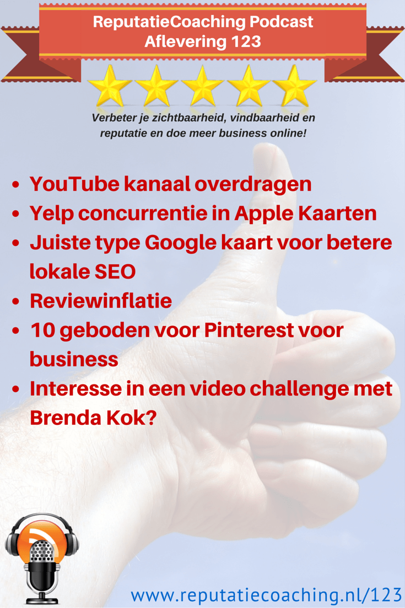
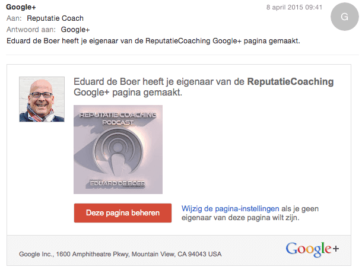
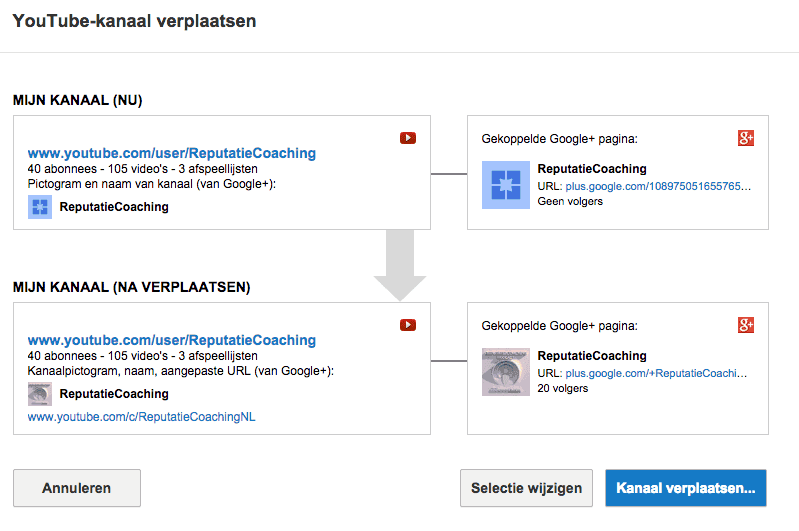
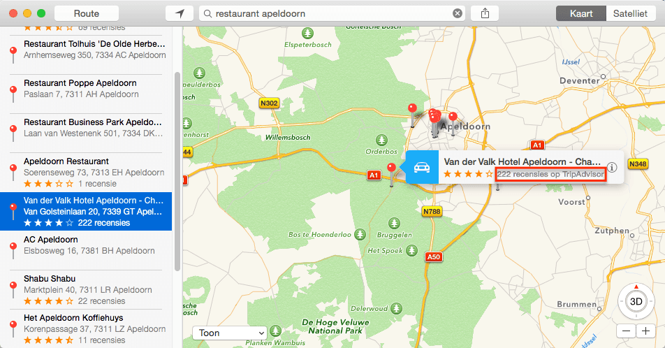
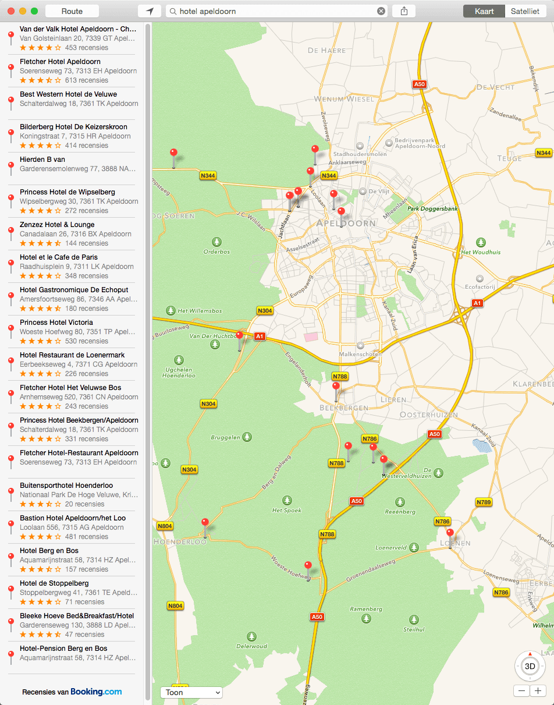
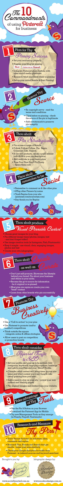

> **Historisch archief.** Deze aflevering verscheen op 9-04-2015 als onderdeel van ReputatieCoaching (2012–2016). De oorspronkelijke tekst is hieronder historisch bewaard. Diensten, contactgegevens, links, tools en adviezen kunnen inmiddels verouderd zijn.



**Transcriptiestatus:** Volledige transcriptie uit het oorspronkelijke archief.

**
Dat is een mooi nummer: 123… Oftewel: één - twee - drie. De volgende keer dat ik zo’n mooie opeenvolgende reeks van cijfers kan krijgen is pas over 111 podcasts, want dan ben ik bij aflevering 234: twee - drie - vier. Maar dat duurt nog wel even voor we zover zijn.**

**Wat heb ik vandaag voor je… Eens zien… Ik begin met mijn ervaring te delen voor het overdragen van het eigendom van een YouTube-kanaal aan een Google+ pagina. Dat was behoorlijk spannend! Het wordt straks redelijk complex, maar ik zal mijn best doen het zo eenvoudig mogelijk te houden.**

**Apple Kaarten voegt overigens nieuwe bronnen toe voor reviews, naast die van Yelp. Welke dat zijn, hoor je zo! Veel bedrijven vertonen een verkeerde Google kaart op hun site, die helemaal niets bijdraagt aan hun lokale SEO. Ik vertel je hoe je het wèl goed kunt doen. Daarna vertel ik je kort over reviewinflatie en als laatste heb ik de 10 geboden voor Pinterest voor business voor je, die ik tegenkwam op het weblog van Amy Porterfield.**

**Ik sluit de podcast van vandaag af met een aankondiging van een mogelijke video challenge door Brenda Kok.**

Hallo en hartelijk welkom bij deze aflevering van de ReputatieCoaching Podcast. Ik ben Eduard de Boer, ReputatieCoach. Dit is dé podcast die jou helpt om meer business te genereren, doordat jouw website beter gevonden wordt, zowel lokaal als landelijk en doordat ik je uitleg hoe je je online reputatie kunt verbeteren. Dit alles helpt je om je bedrijf en jezelf beter op de online kaart te plaatsen.

De podcast kun je vinden op [www.reputatiecoaching.nl/123](https://www.reputatiecoaching.nl/123/). Daar vind je niet alleen de tekst, maar ook video’s waar ik het in deze uitzending over heb, alsmede afbeeldingen, links enzovoorts. Bovendien is de podcast te beluisteren in [iTunes](https://www.reputatiecoaching.nl/itunes), op [Stitcher](https://www.reputatiecoaching.nl/stitcher) en ook op [TuneIn Radio](http://tunein.com/radio/ReputatieCoaching-Podcast-p655084/). Ik raad je aan om je op één van die drie kanalen te abonneren op de podcast, zodat je geen aflevering hoeft te missen!

Laat ik dan nu overgaan op de onderwerpen voor vandaag…

## YouTube kanaal overdragen / verhuizen

*Historische afbeelding niet beschikbaar: YouTube*
Ik waarschuw je alvast even vooraf: dit wordt een redelijk complex verhaal, maar ik zal mijn best doen om het inzichtelijk te maken en zo simpel mogelijk te houden…

Toen het lang geleden nog mogelijk was heb ik voor het domein reputatiecoaching.nl een gratis Google Apps omgeving aangemaakt, alwaar ik toen 10 e-mail accounts kon aanmaken. De enige die ik heb aangemaakt, zijn een administrator-account en natuurlijk het [info@reputatiecoaching.nl](mailto:info@reputatiecoaching.nl). Het mailadres [podcast@reputatiecoaching.nl](mailto:podcast@reputatiecoaching.nl) dat ik vaak communiceer, is slechts een alias. Dat wil zeggen dat alle mail aan podcast@, wordt doorgestuurd naar [info@reputatiecoaching.nl](mailto:info@reputatiecoaching.nl).

Op het info@ account heb ik een YouTube-kanaal aangemaakt, alwaar ik alle video’s van ReputatieCoaching door de jaren heen heb geüpload. Op dit moment zijn dat 105 publieke video’s. So far… so good.

Maar, waar het ooit fout ging in het verleden, was toen ik de Google+ pagina voor ReputatieCoaching heb aangemaakt. Dat heb ik namelijk onder mijn persoonlijke Gmail-adres gedaan. Pas veel later kwam ik erachter dat dit dus niet handig was, want nu waren de Google+ pagina van ReputatieCoaching en het YouTube-kanaal dus niet gekoppeld. Ik had wel eens getracht het eigendom van het YouTube-kanaal over te zetten, maar dat kreeg ik niet voor elkaar. Het leek erop alsof het toen alleen kon tussen verschillende Google-accounts en daarom liet ik het er toen maar bij.

Maar eerder deze week las ik een artikel op het YouTube Help kanaal met als titel “[Gekoppeld aan het verkeerde Google+ profiel of de verkeerde Google+ pagina](https://support.google.com/youtube/answer/3056283?hl=nl)”. Dat was precies mijn probleem! Ik dook er in en keek eerst de Engelstalige video waarin het werd toegelicht:



Toen kon ik het proces van overdracht starten.

Ik moet zeggen dat de tool van YouTube / Google je goed begeleidt. Op een gegeven moment kreeg ik het plaatje, dat je in de show notes kunt zien. Daarin staat de huidige situatie, alsmede de toekomstige situatie:

[](https://lh6.googleusercontent.com/-1teBK2sVCxM/VSWCQe2UBHI/AAAAAAAAB9Y/mcO_br_1VZU/w799-h531-no/20150408-move-youtube-kanaal.png)

Die heb ik tweemaal bevestigd en vervolgens was het YouTube-kanaal van ReputatieCoaching gekoppeld aan de juiste Google+ pagina.

Tenslotte heb ik het eigenaarschap van de Google+ pagina waaraan inmiddels dus het juiste YouTube-kanaal was gekoppeld weer terug overgedragen aan mijn persoonlijke Google account:

[](https://lh3.googleusercontent.com/-Rn6T0oAwahE/VSWCPI2yBeI/AAAAAAAAB88/wNridtNqdeQ/w600-h355-no/20150408-eigenaar-edb.png)

Pheewww… Het was even spannend, maar het is dus gelukt! Toegegeven, ik denk dat mijn situatie ook niet echt alledaags was. Maar ik wilde het toch even met je delen, voor het geval jij met een dergelijke situatie zit. Mocht je daarbij hulp nodig hebben, neem dan gerust contact op. Inmiddels snap ik aardig hoe het werkt en denk ik dat ik je er wel doorheen kan loodsen.

## Yelp krijgt concurrentie in Apple Kaarten

*Historische afbeelding niet beschikbaar: Logo Yelp*
Tot voor kort waren beoordelingen op Yelp de enige manier om met sterretjes en de bijbehorende reviews te worden vertoond in Apple Kaarten. Het was ook overduidelijk dat het hebben van één of meer recensies op Yelp hielp bij het bovenaan de lijst komen bij zoekpogingen in Apple Kaarten.

Maar aan het alleenrecht van Yelp is sindskort een einde gekomen, want inmiddels worden ook recensies en beoordelingen van TripAdvisor en Booking.com in Apple Kaarten vertoond bij respectievelijk restaurants en hotels. Voor zover ik het heb kunnen zien blijven Yelp recensies voor andere bedrijfscategorieën wel intact en actief.

Het leuke is overigens dat de vertoning van etablissementen verandert, als je de zoekterm varieert. Zo hebben we hier in Apeldoorn een vestiging van Van der Valk. Dat is natuurlijk een hotel alsmede een restaurant. Als je zoekt op “restaurant Apeldoorn”, dan verschijnt de afbeelding, zoals je die in de show notes kunt zien:

[](https://lh3.googleusercontent.com/-eT-Jfu3sgfk/VSWCRXh0JJI/AAAAAAAAB9Q/OEVIFTVTxao/w952-h498-no/20150408-restaurant-apeldoorn-cantharel.png)

Daarin kun je zien dat de locatie 222 recensies heeft op TripAdvisor. Ook als je de detailgegevens bekijkt zie je daarin het logo van TripAdvisor staan. En nu wordt het interessant… Als je vervolgens gaat zoeken op “hotel Apeldoorn”, dan wordt ook Van der Valk vertoond. Maar dan heeft het opeens 453 recensies en er staat ook bij dat die van Booking.com komen.

[](https://lh5.googleusercontent.com/-7-gne9MHm8k/VSWCQJ-2zFI/AAAAAAAAB9M/sIU3e94col8/w701-h892-no/20150408-hotels-apeldoorn-recensies.png)

Het lijkt erop, alsof Apple haar best doet om de kwaliteit van de Kaarten-app te verbeteren door zoveel mogelijk relevante data te koppelen. En het verschilt ook per land en per plaats. Zo worden bij de restaurants in Apeldoorn, Groningen, Amsterdam en Rotterdam de recensies van TripAdvisor vertoond, terwijl bij de restaurants in Utrecht reviews van Yelp staan vermeld, evenals in Maastricht, Tilburg en Deventer. Dus mogelijk zit Apple nog in een soort van overgangsfase tussen de verschillende bronnen.

Ik heb flink zitten zoeken, maar het lijkt exclusief. Ik kon dus geen steden vinden waar zowel TripAdvisor als Yelp recensies werden vertoond. Wellicht migreert Apple de recensies per stad. Dat zou ook nog kunnen.

Voor alle andere bedrijfstakken buiten hotels en restaurants blijven dus gewoon de Yelp recensies staan.

Wat ik je zojuist vertelde is nu precies de reden dat ik je altijd aanraad om op meerdere sites je recensies en reviews te verzamelen. Zo creëer je op deze manier meer exposure maar wat nog belangrijker is: je spreidt je risico!

Want wanneer je als restaurant je voornamelijk concentreerde op het verzamelen van reviews op Yelp om daarmee ook op Apple Kaarten boven je collega’s te worden vertoond, zou je nu redelijk in de aap gelogeerd zijn!

Het is een feit dat booking.com veel meer recensies krijgt voor hotelovernachtingen, dan een Yelp. Dus is het logisch dat Apple die gegevens in haar app wil vertonen om zo kwalitatief betere en kwantitatief meer data te bieden aan de gebruikers.

Houd in gedachten dat bedrijven als Apple, Google, Microsoft en andere grote multinationals jou helemaal niets verplicht zijn. Bottom-line streven ze continu naar meer winst voor de aandeelhouders. Dat is feitelijk hun hoogste doel. Maar als ze goed bezig zijn, dan streven ze ook naar een maximale gebruikerservaring waarbij ze wèl op elk moment het roer volledig kunnen omgooien, waardoor jij met je bedrijf mogelijk schade kunt oplopen…

Ik vroeg Philippine Wouters, de community manager van Yelp Nederland, wat zij ervan vond. Zij antwoordde: “Het zijn zeker goede platformen ook en alleen maar goed; hoe meer informatie van verschillende ‘hoeken’ - hoe beter wij geïnformeerd kunnen worden. Plus… Yelp wordt uiteraard gebruikt voor alles wat lokaal is, ook de niet-hotel-en-restaurant-industrie-gerelateerde bedrijven”.

Waar ik trouwens benieuwd naar ben is of Apple binnenkort ook op landniveau misschien branchespecifieke reviewsites gaat koppelen aan haar gegevens. Dus zouden dan de reviews van bijvoorbeeld zorgkaartnederland.nl of tandartsbeoordelingen.nl worden vertoond voor generieke zorgverleners, respectievelijk tandartsen? We zullen het zien. Tot zover op dit moment over Apple Kaarten.

## Juiste type Google kaart voor betere lokale SEO

*Historische afbeelding niet beschikbaar: Zet je bedrijf op de kaart van TomTom*
Het is een gegeven dat het embedden van een Google Maps kaart op bijvoorbeeld je contactpagina kan bijdragen aan een hogere ranking in de lokale zoekresultaten. Maar alleen als je het goed doet.

Dikwijls zie ik kaartjes op websites staan, waarin het adres is opgezocht en niet het bedrijf. Dat is leuk en geeft natuurlijk een goed signaal af aan de bezoekers van die pagina, maar je moet weten dat een dergelijke vermelding geen (of geen sterk) signaal is voor je ranking in de lokale resultaten. In de show notes laat ik je een dergelijke embedded map zien:

Heb jij nog geen stukje landkaart op je site staan, maar is je bedrijf wel een lokaal bedrijf dat op Google Maps staat? Zet dan vandaag nog een Google map op je contactpagina! En doe het dan op de juiste manier!

## Reviewinflatie

*Historische afbeelding niet beschikbaar: excellent-reputatie*
Wanneer hotels, restaurants en andere bedrijven allemaal hun uiterste best doen en na het leveren van hun producten of diensten om recensies vragen is de kans groot, dat je op een gegeven moment een convergentie van reviewscores krijgt.

Als er maar voldoende recensies worden gepost en voldoende beoordelingen worden gegeven, neemt de waarde van de beoordelingen af. Je ziet het al een beetje, als je op Apple Kaarten zoekt op “hotel apeldoorn”. Zoals ik zojuist al vertelde, staan daar sinds enige tijd de reviews van booking.com. En de meeste hotels zijn inderdaad flink actief in het vragen van recensies, terwijl sommige nog helemaal geen beoordelingen verzamelen.

Maar goed, het Fletcher Hotel in Apeldoorn spant de kroon met maar liefst 613 beoordelingen en drieëneenhalve ster van vijf. Ik ben eens de 20 vertoonde beoordelingen gaan turven en kwam op het volgende resultaat:

```
  * 4 hotels met 0 sterren, waarbij er eentje een dubbele vermelding was. Dus eigenlijk 3 met 0 sterren
  * 3 hotels met 3,5 sterren
  * 10 hotels met 4 sterren
  * 3 hotels met 4,5 sterren
```

OK, het is geen bijster grote steekproef, maar het laat wel meteen het probleem zien: welk hotel moet je kiezen als het leeuwendeel (ofwel 50%) 4 sterren heeft? Dan is er sprake van een soort reviewinflatie en op zo’n moment wordt de waarde van een beoordelingssite beduidend minder. Of denk jij daar anders over?

In elk geval verdwijnt het onderscheidend vermogen en zul je als potentiële gast van een hotel in Apeldoorn verder de diepte in moeten duiken en individuele beoordelingen gaan lezen. Terwijl je dat nu juist eigenlijk wilde vermijden, omdat je snel op zoek was naar een goed hotel in Apeldoorn. Nou ja, als je een hotel kiest dat met meer dan 500 beoordelingen vier sterren scoort, dan zit je hoogstwaarschijnlijk niet verkeerd.

Aan de andere kant wordt het voor de hotels dus ook steeds moeilijker om zich te onderscheiden en op basis van recensies gasten te trekken! Mogelijk gaat dan de positie nóg meer een rol spelen: de hotels in Apeldoorn worden conform de volgorde op de lijst van boven naar beneden gevuld…

Ik heb hier niet zo 1–2–3 een pasklare oplossing voor. Jij wel? Wat zie jij als mogelijkheden? En als jij een restaurant of ander bedrijf beoordeelt, hoeveel sterren geef jij dan gemiddeld? Reageer eens onderaan de show notes van deze podcast, op [www.reputatiecoaching.nl/123](https://www.reputatiecoaching.nl/123/).

## 10 geboden voor Pinterest voor business

*Historische afbeelding niet beschikbaar: Pinterest*
De afgelopen paar podcasts is Instagram vaak aan bod gekomen. Daardoor kan het lijken alsof ik Pinterest negeer of de kracht c.q. waarde van Pinterest negeer. Niets is minder waar! OK, Instagram groeit op dit moment extreem hard, maar we moeten ook Pinterest niet onderschatten!

Hoewel ik vind dat je niet per se overal online betrokken hoeft te zijn, vind ik het wel belangrijk dat je dáár bent, waar je klanten zich bevinden! Voor ondernemers bij wie het visuele een belangrijke rol speelt, is niet alleen activiteit op Instagram essentieel, maar ook de aanwezigheid op Pinterest.

Als je gaat zoeken naar een autoriteit op het gebied van social media in het algemeen en Facebook in het bijzonder, dan kom je vaak de naam “Amy Porterfield” tegen. Zij is internationaal een veelgevraagd spreekster en co-auteur van het boek “Facebook Marketing All-in-One for Dummies”. Om je een idee te geven waar zij vandaag de dag zoal over schrijft, geef ik je de titels van haar vijf meest recente blogposts:

```
  * "[How to Discover Your Calling with Jeff Goins"](http://www.amyporterfield.com/2015/03/53-how-to-discover-your-calling-with-jeff-goins/)
  * “[How to Use Short Video Clips on Facebook](http://www.amyporterfield.com/2015/03/52-how-to-use-short-video-clips-on-facebook/)”
  * “[Putting More “You” in Your Business—A Guide to Building Brand Personality](http://www.amyporterfield.com/2015/03/51-brand-personality/)”
  * “[How to Automate Leads and Sales with Smart Paid Ads](http://www.amyporterfield.com/2015/03/50-how-to-automate-leads-and-sales-with-smart-paid-ads/)”
  * “[How to Know If Your Idea is Profitable](http://www.amyporterfield.com/2015/03/49-tell-idea-profitable/)”
```

Zoals je ziet: allemaal titels waar je op voorhand al de idee van krijgt dat het waardevolle, unieke en leerzame content is. Ik ben dan ook geabonneerd op haar podcast. Sowieso als ik de hei op ga om lekker te wandelen met de honden luister ik bijna altijd naar podcasts en Amy is één van de podcasters die dan dikwijls voorbij komt. Als jij interesse hebt in online marketing, dan kan ik je Amy Porterfield ook zeker aanbevelen! En als je al podcasts beluistert, dan kan ik je ook Amy haar podcast aanbevelen. De titel daarvan is: “Online Marketing Made Easy with Amy Porterfield”.

Maar goed, terug naar Pinterest. Amy heeft een tijdje geleden op haar weblog de 10 geboden voor Pinterest voor Business gepubliceerd, die waren opgesteld door Donna Moritz uit Australië. Ondanks dat deze tips alweer een goede tweeënenhalf jaar oud zijn, zijn ze nog steeds relevant, nuttig en bruikbaar. Daarom wil ik ze graag met je delen:

```
  1. Plan voor Pinterest Succes

    * Neem de tijd om je account goed op te zetten. Vergeet ook niet om je website te verifiëren.
    * Gebruik trefwoorden in je omschrijving. En dan voeg ik daar graag aan toe: zet er ook je citation in ;-)
    * Koppel met andere social media platformen, zoals Facebook, Twitter en dergelijke.
    * Onderzoek waar je ideale klant naar op zoek is en wat die pint.
    * Creëer je initiële borden. Kies daarbij onderwerpen die betrekking hebben op je business waarden, je cultuur, je interesses, producten en diensten.


  2. Controleer de bron, voordat je iets pint.

    * Let op copyright; lees de kleine lettertjes op de diverse sites.
    * Check de bron van de pin en controleer of het een legitieme site is.
    * Voeg eventueel een visueel watermerk toe, als je eigen, unieke content pint.


  3. Pin strategisch

    * Pin in verschillende borden. Voeg pins geleidelijk toe en start nieuwe borden als je dat nodig acht. Wees creatief met de namen van je borden, de omschrijvingen bij je pins en je pins. Wees je ervan bewust dat de titels van borden en de omschrijvingen bij pins geïndexeerd kunnen worden door Google.
    * Volg, volg, volg! Begin met het volgen van gebruikers en/of individuele borden die je interesseren.
    * Maak gebruik van “Rich pins”. Kijk maar eens op de site van Pinterest om daar meer over te lezen. Tip van mij: Place pins kunnen je helpen bij je lokale SEO…
    * Zet ook links naar websites in de omschrijvingen bij je pins.
    * Verdeel je pins in de tijd en verschiet dus niet al je kruit in één keer. Neem er de tijd voor. Anders verdwijnen jouw pins binnen no-time op de schermen van anderen.


  4. Wees sociaal

    * Reageer en Like pins, net als je dat op Facebook, Twitter, YouTube en Google+ doet. Maak ook gebruik van de re-pin functie.
    * Gebruik @namen en #tags. Want #tags zijn doorzoekbaar op Pinterest.
    * Volg wat er vanaf jouw website of websites wordt gepind. Typ eens in de adresbalk van je browser, de URL: www.pinterest.com/source/jouwdomein.nl . Dan zie je wat er vanaf jouw website op Pinterest is gepind. Doe daar je voordeel mee!
    * Bedank mensen, bijvoorbeeld als ze reageren of jouw pins re-pinnen.


  5. Produceer visuele content

    * Gebruik de mooiste afbeeldingen, foto’s of infographics voor je borden en vraag jezelf steeds af: “Hoe kan ik visueel aantrekkelijke en ‘pinbare’ content posten?”.
    * Pin verschillende soorten afbeeldingen, dus ook video’s en text-images.
    * Pin ook Slideshare presentaties, net zoals je video’s kunt pinnen.
    * Pin video’s. Ik kan het niet vaak genoeg zeggen: videomarketing is de trend van deze tijd!
    * Gebruik image tools, zoals [PicMonkey](http://www.picmonkey.com), [Canva](http://canva.com), [Instagram](https://instagram.com), [Pixlr](https://pixlr.com) en andere voor het maken van mooie afbeeldingen.
    * Experimenteer met afmetingen. Idealiter zijn foto’s op Pinterest tenminste 735 pixels breed, zonder beperking van de lengte.
    * Speel ook eens met infographics.


  6. Creëer en Cureer

    * Promoot niet alleen jezelf, dus geef ook credits aan andere pinners.
    * Vind en creëer “verse” pins om te delen
    * Leer van anderen die al succes hebben op Pinterest.


  7. Promoot creatief

    * Gebruik een CTA of “Call To Action” in de pins die je zelf maakt
    * Denk buiten het vierkant… Instagram is vierkant, maar de rest van de wereld is niet vierkant.
    * Experimenteer met lengtes en verhoudingen.


  8. Onderschat niet het belang van SEO en links

    * Houd SEO in gedachten als je bezig gaat met Pinterest, maar onthoud dat de magie zit in de verwijzingen en niet in de directe links naar je pins. De belangrijkste “link” die Pinterest je geeft, is naar andere mensen. Bouw aan relaties en de mensen komen vanzelf, net als de SEO.
    * Maximaliseer de vindbaarheid van je pins. Gebruik keywords, hashtags en url’s in je omschrijvingen.
    * Pin originele afbeeldingen en content van je eigen website waar mogelijk, want dat is tenslotte de plek waar je mensen naartoe wilt sturen.
    * Pas soms ook de URL aan van de bron van een pin, als je dat uitkomt.


  9. Gebruik tools

    * Ik noemde Canva zojuist al. Dat is één van de mooiste, eenvoudigste en beste online image editors die ik ken.
    * Kijk ook eens naar PicMonkey, Instagram, Skitch en andere tools.
    * Op je mobiel kun je gebruik maken van de Instagram app en de Wordswag app om mooie afbeeldingen te maken.


  10. Research en meet

    * Track je recente activiteit
    * Onderzoek de pins, borden en merken die succes hebben en probeer hun stijl/acties te kopiëren of nog beter: te verbeteren.
    * Maak gebruik van Google Analytics voor het meten van het effect van je werk.
```

In de show notes op [www.reputatiecoaching.nl/123](https://www.reputatiecoaching.nl/123/) heb ik van deze tips van Any Porterfield ook een infographic opgenomen:[](https://lh5.googleusercontent.com/-IH0J8vnhI_w/VSWCR744DRI/AAAAAAAAB-U/SAEQgw-N_f8/w554-no/Pinterest_Commandments1.jpg)

## Interesse in een video challenge met Brenda Kok?

*Historische afbeelding niet beschikbaar: Brenda-Kok*
In oktober vorig jaar heb ik onder begeleiding van Brenda Kok deelgenomen aan de 14-daagse video challenge. En boy, wat heb ik daar veel van opgestoken, ondanks dat ik slechts 10 van de 14 dagen kon deelnemen! Dankzij die video challenge ben ik mijn schroom om voor de videocamera te verschijnen en te spreken, totaal verloren! Dat is dan ook de reden dat ik je aandacht vraag voor het volgende…

Brenda overweegt dit jaar slechts één video challenge te organiseren, maar dan alleen als er voldoende animo is! Dus, als slechts een handjevol mensen zich inschrijft, dan gaat het niet door. Daarom: als jij ooit hebt overwogen om maar iets met video te gaan doen, dan heb je hier de ultieme kans om GRATIS waardevolle tips en opbouwende kritiek te krijgen op jouw video performance op alle fronten.

Dus, je krijgt niet alleen GRATIS tips over het verbeteren van je audio en video, maar ook over jezelf beter presenteren, belichting, achtergronden en weet ik wat allemaal! Het is maar net, waar de groep behoefte aan heeft! Brenda past zich tijdens de challenge volledig aan, aan de wensen, eisen, verzoeken en ervaringen van de groep.

Oh, heb ik je al verteld dat het GRATIS is? Hallooooo?! Als je dat hoort, moet er toch meteen een belletje gaan rinkelen? GRATIS deelname en GRATIS waardevolle tips van iemand waar de bekende coaches en goeroes van Nederland en daarbuiten te rade gaan voor het opzetten en/of verbeteren van hun videmarketing… Wat wil je nog meer?!

Als je intersse hebt om (bij voldoende animo) gratis en vrijblijvend deel te nemen aan de video challenge, stuur dan een mailtje naar: [please-reply@sparklingprofessionals.com](mailto:please-reply@sparklingprofessionals.com). Kijk anders even in de show notes van deze aflevering om typefouten en mogelijke teleurstellingen te voorkomen.

Met deze aankondiging van een mogelijke video challenge door Brenda Kok kom ik dan weer aan het einde van deze 123e podcast. Als je de podcast leuk vindt en je wilt nog meer op de hoogte blijven, volg me dan ook op Twitter, via [@reputatiecoach1](https://twitter.com/reputatiecoach1).

Heb je inderdaad wat aan alle informatie die ik met je deel, help mij dan met het verder verbeteren en promoten van deze podcast. Abonneer je op de podcast, zodat je altijd meteen de nieuwste uitzending krijgt voorgeschoteld.

Zoek de podcast op, in [iTunes](https://www.reputatiecoaching.nl/itunes) of [Stitcher](https://www.reputatiecoaching.nl/stitcher), geef de podcast een sterrenbeoordeling en laat ook je reactie achter. Door de podcast te beoordelen op iTunes en/of Stitcher breng je de podcast onder de aandacht van een breder publiek.

Je kunt me verder helpen, door de podcast aan te bevelen bij vrienden of collega’s, waarvan je denkt dat ze er hun voordeel mee kunnen doen, of door ’m te delen op Twitter, like’n en delen op Facebook of een “+1” te geven op Google+.

En vergeet niet: ik ben hier om je te helpen! Als je een vraag of een probleem hebt met betrekking tot je online reputatie of de vindbaarheid van je website, kun je een mailtje sturen naar [podcast@reputatiecoaching.nl](mailto:podcast@reputatiecoaching.nl).

Als je dat te lastig vindt, of als je de podcast beluistert terwijl je in de auto zit en je hebt acuut een vraag, spreek dan een boodschap in op de ReputatieCoaching Hotline, op nummer: 084 - 883 15 56. Mogelijk behandel ik je vraag of probleem dan in een artikel of in de podcast.

En je kunt ook rechtstreeks op de website een voicemail achterlaten, door op de tab aan de rechterkant van elke pagina te klikken, en je bericht in te spreken. Dit was [ReputatieCoaching Podcast aflevering 123](https://www.reputatiecoaching.nl/123/) en mijn naam is [Eduard de Boer](http://nl.linkedin.com/in/eduarddeboer/nl).

Ik wens je de komende week weer succes met het werken aan je reputatie, zodat je meteen je reputatie voor jou kunt laten werken!

Tot volgende week!

Doei!

Links naar content die in deze podcast aan bod komt:

```
  * [ReputatieCoaching Podcast in iTunes](https://www.reputatiecoaching.nl/itunes)
  * [ReputatieCoaching Podcast op Stitcher](https://www.reputatiecoaching.nl/stitcher)
  * [ReputatieCoaching Podcast op TuneIn Radio](http://tunein.com/radio/ReputatieCoaching-Podcast-p655084/)
  * [ReputatieCoaching Podcast RSS-feed](https://feeds.reputatiecoaching.nl/ReputatieCoachingPodcast)
  * “[Gekoppeld aan het verkeerde Google+ profiel of de verkeerde Google+ pagina](https://support.google.com/youtube/answer/3056283?hl=nl)” (YouTube Help)
  * “[Eigendom van een pagina overdragen](https://support.google.com/business/answer/3415281?hl=nl)” (Google Mijn Bedrijf Help)
```
