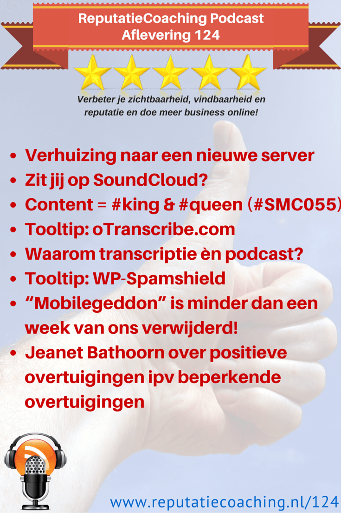
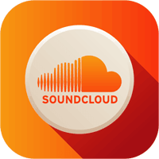
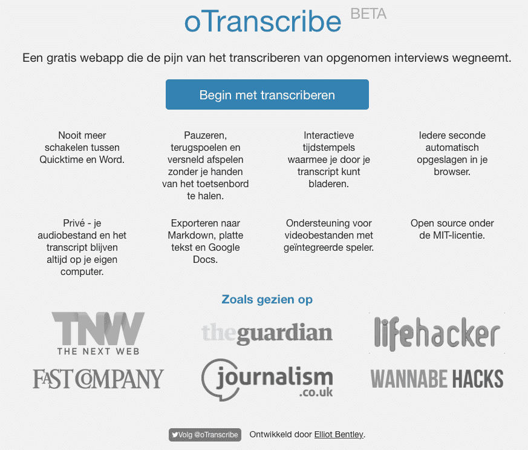
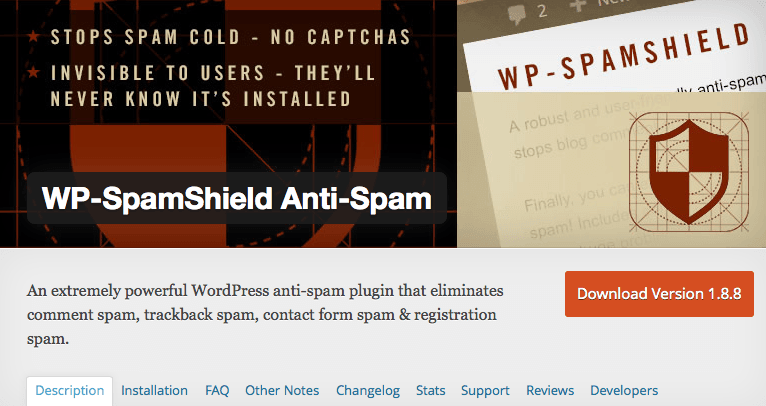

> **Historisch archief.** Deze aflevering verscheen op 16-04-2015 als onderdeel van ReputatieCoaching (2012–2016). De oorspronkelijke tekst is hieronder historisch bewaard. Diensten, contactgegevens, links, tools en adviezen kunnen inmiddels verouderd zijn.



**Transcriptiestatus:** Volledige transcriptie uit het oorspronkelijke archief.

**
Afgelopen maandag was ik bij de Social Media Club avond en ik begin de podcast van vandaag met je daar iets over te vertellen. Verder heb ik een tweetal leuke tooltips, die mogelijk voor jou interessant kunnen zijn. De eerste tip gaat over het maken van transcripties en de tweede gaat over het beter tegenhouden van spamberichten in je WordPress site.**

**Vorige week kreeg ik van iemand de vraag waarom ik zoveel moeite doe om wekelijks de podcast uit te brengen en van elke podcast bovendien nog eens een volledige transcriptie te posten. Daar heb ik een aantal redenen voor, die ik je zal vertellen.**

**Ik heb vandaag twee updates van Google over Mobilegeddon en ik sluit de podcast van vandaag af met het uitermate leerzame verhaal van Jeanet Bathoorn over hoe je beperkende overtuigingen omdenkt in positieve overtuigingen.**

Hallo en hartelijk welkom bij deze aflevering van de ReputatieCoaching Podcast. Ik ben Eduard de Boer, ReputatieCoach. Dit is dé podcast die jou helpt om meer business te genereren, doordat jouw website beter gevonden wordt, zowel lokaal als landelijk en doordat ik je uitleg hoe je je online reputatie kunt verbeteren. Dit alles helpt je om je bedrijf en jezelf beter op de online kaart te plaatsen.

De podcast kun je vinden op [www.reputatiecoaching.nl/124](https://web.archive.org/web/20150605073515/http://www.reputatiecoaching.nl/124/). Daar vind je niet alleen de tekst, maar ook video’s waar ik het in deze uitzending over heb, alsmede afbeeldingen, links enzovoorts. Bovendien is de podcast te beluisteren in iTunes, op Stitcher en op [TuneIn Radio](http://tunein.com/radio/ReputatieCoaching-Podcast-p655084/). Ik raad je aan om je op één van die drie kanalen te abonneren op de podcast, zodat je geen aflevering hoeft te missen!

## Verhuizing naar een nieuwe server

Voordat ik over ga op de onderwerpen voor vandaag even kort het volgende. Zoals ik een paar podcasts geleden vertelde toen mijn server om onverklaarbare redenen opeens langzamer was geworden, is het voordeel van het hebben van een eigen server dat je alles onder controle kunt houden en is dat meteen een nadeel. Want als er iets aan de hand is, moet je zelf aan het werk.

De afgelopen tijd heb ik hier eens diep over nagedacht en de plussen en minnen getracht objectief tegenover elkaar te zetten. Een manier om die objectiviteit erin te brengen, is de voor- en nadelen proberen uit te drukken in geld. Dat haalt in elk geval de emotie eruit.

Ik ben tot het inzicht gekomen dat het verlies van een hele dag om een storing op te moeten lossen inmiddels niet meer opweegt tegen de paar voordelen die een dedicated server mij bieden. Daarnaast zijn de kosten van een dedicated server aanzienlijk hoger dan de andere oplossingen die ik onderzocht heb.

Daarom heb ik besloten wederom een switch te maken. Mijn huidige contract voor de dedicated server loopt nog tot en met begin juni, dus ik heb ruim voldoende tijd om alle sites over te zetten. Om te testen hoe de nieuwe omgeving presteert, heb ik inmiddels enkele websites verhuisd naar de nieuwe omgeving. Die laat ik dus een paar weken draaien, terwijl ik diverse statistieken nauwlettend in de gaten houd. Gedurende de weken naar juni zal ik –als de nieuwe hostingomgeving goed bevalt– alle sites overzetten.

Als alle sites over zijn gezet, heb ik de volgende voordelen:

```
  1. Ik hoef geen systeembeheerder meer te spelen.
  2. De systemen blijven automatisch up-to-date voor wat betreft versies van operating systemen en dergelijke.
  3. Problemen kan ik tenminste bij de hostingprovider neerleggen en hoef ik zelf niet meer op te lossen.
  4. Nieuwe websites kan ik met een paar muiskliks aanmaken en inrichten, inclusief een volledige WordPress-installatie of een ander programma of omgeving uit een scala van meer dan 75 veelgebruikte softwarepakketten.
  5. Ik bespaar meer dan € 1.200 per jaar.
```

Heb jij een aantal websites? Hoeveel? Hoe heb jij e.e.a. ingeregeld? Vertel het eens onderaan de show notes van deze podcast, die je kunt vinden op [www.reputatiecoaching.nl/124](https://web.archive.org/web/20150605073515/http://www.reputatiecoaching.nl/124/) of stuur een mailtje naar [podcast@reputatiecoaching.nl](mailto:podcast@reputatiecoaching.nl).

## Zit jij op SoundCloud?


Nog een puntje en hier verneem ik ook graag je reactie op… Zoals ik altijd in de introductie vertel, ontsluit ik de podcasts via iTunes, Stitcher en sinds enige tijd via [TuneIn Radio](http://tunein.com/radio/ReputatieCoaching-Podcast-p655084/). Je hoort/leest overal op Internet, dat je dáár moet zijn, waar je publiek is, dat je wilt bereiken. Het is lastiger om je publiek naar jou toe te trekken. Daarom mijn vraag: “Waar beluister jij de podcast en wáár zie je de audioversie van de podcast het liefst?”.

SoundCloud is een enorm populaire dienst voor audio en inmiddels ook voor podcasts. Ik heb echter geen idee of jij gebruik maakt van SoundCloud. Doe je dat? Luister jij veel naar audio via SoundCloud? En zou je liever de podcast via SoundClound beluisteren? Laat het eens weten, wat ik ben wel erg nieuwsgierig.

Laat ik dan nu overgaan op de onderwerpen voor vandaag…

## Social Media Club Apeldoorn: “Content is #king en #queen”

[*Historische afbeelding niet beschikbaar: #SMC055: Social Media Club Apeldoorn*](http://www.smcapeldoorn.nl)Afgelopen maandag was ik bij de [Social Media Club Apeldoorn](http://www.smcapeldoorn.nl). Het onderwerp van de avond was: “Content is #king en #queen”. Er waren twee sprekers van groot kaliber aangekondigd, te weten Jeanet Bathoorn en Cor Hospes. Dus mijn verwachtingen van de avond waren hooggespannen…

En wauw, wat werden die nog eens overtroffen! Ik was dus heel blij dat ik de audio mocht opnemen van beide presentaties. Voor vandaag heb ik als afsluiter van deze podcast een heel leerzaam stuk uit de presentatie van Jeanet over hoe je beperkende overtuigingen kunt vervangen door positieve overtuigingen, als je moeite hebt met het creëren van content als gevolg van een soort van content creator’s block.

Content uit de presentatie van Cor Hospes komt een andere keer aan bod, anders wordt deze podcast veel te lang.

## Tooltip: oTranscribe.com voor het maken van transcripties

Ik neem dus veel audio op. Om te beginnen natuurlijk de podcast. En als ik presentaties geef, neem ik het geluid van mijn presentatie op, om daar later eventueel nog iets mee te doen. De reden hiervoor is dat ik het zo jammer vind om een presentatie te geven en daarna de bijbehorende PowerPoint slides te distribueren, zonder enige context. Want alleen een PowerPoint-presentatie zegt meestal niet zoveel. Het liefst hoor je daar het volledige verhaal van de presentator of presentatrice bij. OK, video erbij zou het natuurlijk helemaal compleet maken, maar ik vind de content van de slides in combinatie met de audio belangrijker, hoewel ik me voor sommige opnames kan voorstellen dat het beeld van de presentator belangrijker is.

Bovendien neem ik vaak een audiorecorder mee naar andere presentaties, zoals afgelopen maandag naar de Social Media Club Apeldoorn. Ik keek zo uit naar de inhoud van de presentaties en wilde er eigenlijk zo min mogelijk van missen. Dus heb ik de organisatie en de beide sprekers gevraagd of ik de audio mocht opnemen en met bronvermelding als content op mijn site mocht gebruiken. Iedereen was akkoord, dus: zo gezegd, zo gedaan.

Helaas is er nog geen goede Nederlandstalige spraakherkenning waar ik de audio in kan omzetten naar tekst. En als ik dus tekst wil maken van een audio-opname, moet ik dat zelf doen… Handmatig. Dat is erg bewerkelijk. Ik weet dat er aparte apparatuur voor is met voetschakelaars om de audio te starten, terug te “spoelen” enzovoorts. Maar dat zag ik niet zo zitten. Dus ben ik ooit op zoek gegaan en kwam verschillende programma’s voor mijn iMac tegen, die ongeveer deden wat ik wilde. Maar geen van alle vond ik echt prettig werken.

Al zoekende vond ik de site [otranscribe.com](https://web.archive.org/web/20150408034531/http://otranscribe.com:80/). Zoals altijd vind je de link naar deze site in de show notes van deze podcast, op [www.reputatiecoaching.nl/124](https://web.archive.org/web/20150605073515/http://www.reputatiecoaching.nl/124/). oTranscribe is een webbased service, waarin je simpelweg je audio of video kunt uploaden en dan naar hartelust het afspelen kunt starten en stoppen, door op de ESC-knop te drukken. In het venster eronder kun je de transcriptie meetypen.

[](https://lh4.googleusercontent.com/-u1G9DTB5sjE/VS5f9OtynII/AAAAAAAAB-s/wfK6adsiC-I/w873-h743-no/20150416-otranscribe-openingscherm.png)

Elke keer als je wat wilt typen, druk je even de ESC-knop om het afspelen te stoppen en als je dan verder wilt luisteren, kun druk je weer om de ESC-knop om het afspelen voort te zetten.

Bovendien kun je de URL van een YouTube video opgeven, waarna je hetzelfde kunt doen voor een video die op YouTube staat.

Zelf ben ik uitermate tevreden met deze service en heb ’m al een aantal keren gebruikt. Binnenkort zal ik een korte instructievideo maken, waarin ik je laat zien hoe je [otranscribe.com](https://web.archive.org/web/20150408034531/http://otranscribe.com:80/) kunt gebuiken.

## Waarom een volledige transcriptie van elke podcast èn een podcast?

Nu weet je in elk geval hoe je eenvoudig goede transcripties kunt maken van je opnames. Maar vorige week vroeg iemand mij waarom ik altijd de volledige transcriptie van de podcast online zet en niet alleen of de tekst als blogpost, of de audio als podcastaflevering.

Hiervoor heb ik een paar redenen, die ik één voor één met je wil langslopen. De eerste reden is dat je het potentiële bereik van je content vergroot door het via meerdere kanalen aan te bieden. Een paar redenen, waarom ik je elke week trouw de content breng in de vorm van een podcast, zijn:

```
  1. **Podcasts kun je overal “consumeren”** - Het grote voordeel van podcasts is dat je ze overal kunt consumeren, oftewel beluisteren. Ik heb inmiddels van luisteraars gehoord dat ze de podcasts beluisteren tijdens het schoonmaken van hun huis, tijdens het vissen, tijdens het sporten, het uitlaten van de hond, terwijl ze heen en weer pendelen tussen huis en werk en op nog veel meer plaatsen en momenten.
  2. **Podcasts worden populairder** - Niet alleen in de Verenigde Staten of de rest van de wereld, maar ook in Nederland. Zo zag ik een paar weken geleden dat Eelco de Boer, een bekende trainer/coach ook een podcast is gestart. Hij brengt dagelijks een Engelstalige aflevering uit! En van verschillende kanten heb ik van mensen vernomen dat ze erover denken om hun eigen podcast uit te gaan brengen. En als ik de groei van het aantal luisteraars per maand bekijk, dan word ik alleen maar blijer. Het aantal luisteraars van de ReputatieCoaching Podcast is in het eerste kwartaal van dit jaar met maar liefst 303% gestegen ten opzichte van het eerste kwartaal van vorig jaar!
  3. **Rechtstreeks contact met de luisteraars** – Na communicatie in real-life en video is een podcast wel een ontzettend “intiem” medium, om het zo maar uit te drukken. Onderschat het niet. Je hebt tenslotte langere tijd iemands onverdeelde aandacht, terwijl hij of zij naar je verhaal luistert.
  4. **Geschikt voor visueel gehandicapten** – Ik weet dat er talloze hulpmiddelen zijn voor visueel gehandicapten om tekst vanaf een beeldscherm te consumeren. Maar laten we eerlijk zijn: een door een mens gesproken verhaal klinkt altijd nog stukken beter dan hetzelfde stuk tekst omgezet via text-to-speech.
```

De volledige transcriptie post ik altijd op de website en wel om de volgende redenen:

```
  1. **Niet iedereen wil of kan naar podcasts luisteren** – Daar kunnen verschillende oorzaken voor zijn, waar ik nu even niet te diep in wil duiken, maar er zijn nog steeds mensen die liever lezen dan luisteren.
  2. **Longform content scoort goed in de zoekmachines** – Natuurlijk doe ik mijn best om unieke en originele content te produceren. Tussen de podcasts door schrijf ik blogartikelen, maar daar zit niet echt een regelmaat in. De podcast (met bijbehorende transcriptie) komt echter wel wekelijks uit op donderdag. En elke podcast is toch meestal langer dan 4.000 woorden, ofwel een boel content voor zoekmachines om te indexeren en te ontsluiten.
```

Ik weet het, veel podcasters uit het buitenland dwingen je bijna om naar de podcast te luisteren en zij posten derhalve slechts een korte samenvatting op hun website. Zelf heb ik daar mijn bedenkingen over, voornamelijk omdat ik vind dat iedereen de content op de door hem of haar gewenste wijze moet kunnen consumeren.

Maar doe denk jij erover? Ga even naar de show notes op [www.reputatiecoaching.nl/124](https://web.archive.org/web/20150605073515/http://www.reputatiecoaching.nl/124/) en laat het me weten. Want ik heb daar een formulier met slechts twee vragen opgenomen. De eerste vraag gaat over de gewenste manier voor consumptie van content en verder geef ik je nog de mogelijkheid een opmerking toe te voegen. Ik vraag je dus verder niet om je mailadres of andere gegevens: het is een geheel anoniem onderzoekje:

## Tooltip: WP-Spamshield voor betere bescherming tegen spamreacties

Nog een tooltip… Ik maakte jarenlang in alle WordPress blogs gebruik van Akismet voor het tegenhouden van spam in de reacties. Maar de laatste tijd kwam er steeds meer spam doorheen die ik dus handmatig moest uitfilteren. Dat kostte mij onnodig tijd en dus ging ik op zoek naar een andere oplossing. Die heb ik gevonden in de vorm van [WP-Spamshield](https://wordpress.org/plugins/wp-spamshield/):

[](https://lh5.googleusercontent.com/-rC9rgsaWN40/VS5f9FIsgxI/AAAAAAAAB-k/ABFamGcRYjU/w766-h406-no/20150415-WP-Spamshield.png)

Sinds de paar weken dat ik WP-Spamshield in gebruik heb, heeft het met 100% succes al meer dan 8.700 spamberichten tegengehouden. Dus als jij last hebt van spam in je WordPress site, ga dan eens testen met [WP-Spamshield](https://wordpress.org/plugins/wp-spamshield/) en zie of jij net als ik minder tijd kwijt bent als gevolg van alle spam.

## “Mobilegeddon” is minder dan een week van ons verwijderd!

Ik ben er een tijdje stil over geweest, maar de “Mobilegeddon” zoals de Amerikanen hem noemen, is nu minder dan een week van ons verwijderd. Met andere woorden: als jouw website voor volgende week woensdag niet mobielvriendelijk is, zal die bijna zeker lager scoren in de mobiele zoekresultaten, dan dat die nu scoort.

Inmiddels is er wat meer nieuws van Google losgekomen. De twee belangrijkste punten zijn dat het ten eerste echt alleen de mobiele resultaten betreft en niet de zoekresultaten op tablets. Dus zal de schade minder groot zijn, dan dat ik eerder verwachtte. Want in statistieken die ik een paar weken geleden vermeldde, had ik tablets nog wel meegenomen.

Tot zover het laatste nieuws over “Mobile Doomsday”.

## Jeanet Bathoorn over positieve overtuigingen ipv beperkende overtuigingen

*Historische afbeelding niet beschikbaar: Jeanet Bathoorn*
Ik zei het al aan het begin van deze podcast: afgelopen maandag was ik bij #SMC055. Daar gaf Jeanet Bathoorn een fantastische presentatie die uit twee onderdelen bestond:

```
  * De 9 WHY’s van contentmarketing
  * Hoe ga je om met een content creatie block, of ‘writers block’?
```

Van het eerste deel heb ik een video met slides en het audioverhaal van Jeanet gemaakt. Die kun je terugvinden op de website en in de show notes van deze podcast:

```
  * _“Ik durf het niet…”_
  * _“Ik ben bang!”_
  * _“Wat vinden mensen wel niet van mij?”_
  * _“Als ik het publiceer gaat niemand het lezen. Of mensen vinden het stom.”_
  * _“Ah, dat lukt mij toch nooit…”_
  * _“Dan ziet iedereen wat ik doe.”_
  * _“Dan denken ze dat ik niets anders te doen heb.”_
  * _“Wat heb ik dan te melden?”_
  * _“Waar zitten ze nu op te wachten? Wat moet ik dan zeggen?”_
  * _“Wie zit er op mij te wachten?”_
  * _“Ik heb geen tijd voor content creatie.”_
  * _“Wat heb ik nog toe te voegen aan wat er al is?”_
  * _“Weet ik er voldoende van?”_
  * _“Maar dan zien mensen teveel van mij”_
  * _“Ik weet niet waar ik moet beginnen!”_
```

Als dit soort twijfels en gedachten wel eens door jouw hoofd spoken en als die je ervan weerhouden om content te creëren voor je doelgroep luister dan vooral naar wat Jeanet hier allemaal over vertelt. Dit stuk van de presentatie van Jeanet duurt bijna 13 minuten. Dus mocht je nu niet zo lang hebben om te luisteren, dan is het wellicht beter het afspelen even te pauzeren, tot je wel 13 minuten geconcentreerd en onafgebroken kunt luisteren. Aan de andere kant kun je de podcast zo vaak beluisteren als jij dat wilt!

\*\*De audio van Jeanet Bathoorn over hoe je deze beperkende overtuigingen
“omdenkt” in positieve overtuigingen, vind je terug in de audio.
Abonneer je op de podcast in:
iTunes, op Stitcher of op [TuneIn Radio](http://tunein.com/radio/ReputatieCoaching-Podcast-p655084/)!!\*\*Een leuke spreuk die ik nog aan het verhaal van Jeanet Bathoorn heb overgehouden is:

*“There are 7 days in a week. Someday isn’t one of them."*

Ik weet het, deze podcast was iets langer dan anders. Maar ik wilde het verhaal van Jeanet Bathoorn graag met je delen.

Als je de podcast leuk vindt en je wilt nog meer op de hoogte blijven, volg me dan op Twitter, via [@reputatiecoach1](https://twitter.com/reputatiecoach1).

Heb je inderdaad wat aan alle informatie die ik met je deel, help mij dan met het verder verbeteren en promoten van deze podcast. Abonneer je op de podcast, zodat je altijd meteen de nieuwste uitzending krijgt voorgeschoteld.

Zoek de podcast op, in iTunes of Stitcher, geef de podcast een sterrenbeoordeling en laat je reactie achter. Door de podcast te beoordelen op iTunes en/of Stitcher breng je de podcast onder de aandacht van een breder publiek.

Je kunt me verder helpen, door de podcast aan te bevelen bij vrienden of collega’s, waarvan je denkt dat ze er hun voordeel mee kunnen doen, of door ’m te delen op Twitter, like’n en delen op Facebook of een “+1” te geven op Google+.

En vergeet niet: ik ben hier om je te helpen! Als je een vraag of een probleem hebt met betrekking tot je online reputatie of de vindbaarheid van je website, kun je een mailtje sturen naar [podcast@reputatiecoaching.nl](mailto:podcast@reputatiecoaching.nl).

Als je dat te lastig vindt, of als je de podcast beluistert terwijl je in de auto zit en je hebt acuut een vraag, spreek dan een boodschap in op de ReputatieCoaching Hotline, op nummer: 084 - 883 15 56. Mogelijk behandel ik je vraag of probleem dan in een artikel of in de podcast.

En je kunt rechtstreeks op de website een voicemail achterlaten, door op de tab aan de rechterkant van elke pagina te klikken, en je bericht in te spreken. Dit was [ReputatieCoaching Podcast aflevering 124](https://web.archive.org/web/20150605073515/http://www.reputatiecoaching.nl/124/) en mijn naam is [Eduard de Boer](http://nl.linkedin.com/in/eduarddeboer/nl).

Ik wens je de komende week weer succes met het werken aan je reputatie, zodat je meteen je reputatie voor jou kunt laten werken!

Tot volgende week!

Doei!

Links naar content die in deze podcast aan bod komt:

```
  * ReputatieCoaching Podcast in iTunes
  * ReputatieCoaching Podcast op Stitcher
  * [ReputatieCoaching Podcast op TuneIn Radio](http://tunein.com/radio/ReputatieCoaching-Podcast-p655084/)
  * [ReputatieCoaching Podcast RSS-feed](https://web.archive.org/web/20150228235938/http://feeds.reputatiecoaching.nl:80/ReputatieCoachingPodcast)
  * [otranscribe](https://web.archive.org/web/20150408034531/http://otranscribe.com:80/) (voor het maken van een transcriptie van audio en/of video)
  * [Eelco de Boer Podcast](https://itunes.apple.com/us/podcast/the-eelco-de-boer-podcast/id976359747?mt=2) (Podcast in iTunes)
  * [WP-Spamshield](https://wordpress.org/plugins/wp-spamshield/) (Anti-Spam plugin voor WordPress)
  * [Jeanet Bathoorn](http://www.jeanetbathoorn.nl)
  * [Cor Hospes](http://www.corhospes.nl)
```
