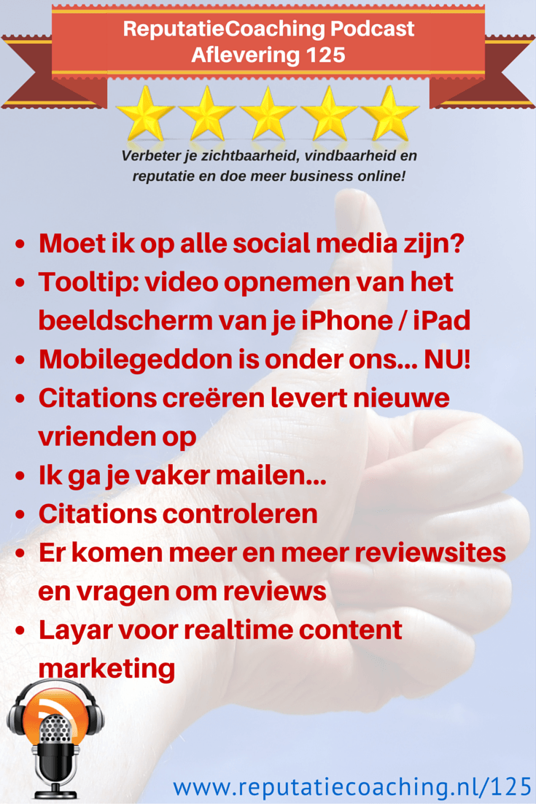
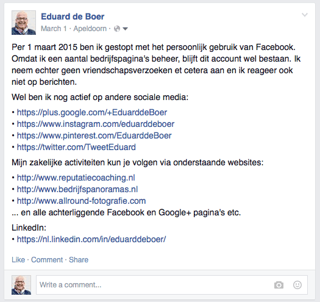
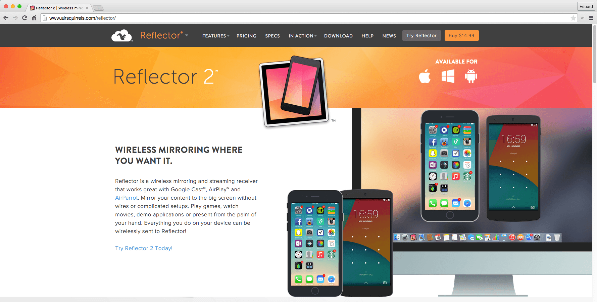
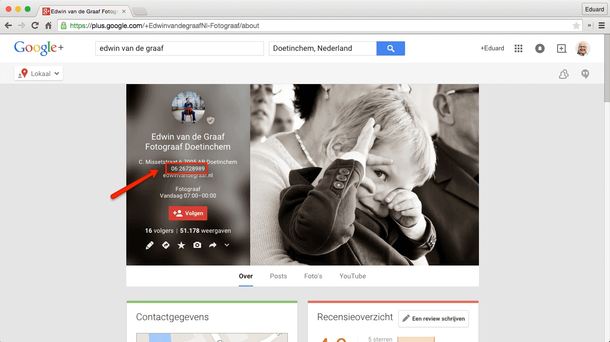
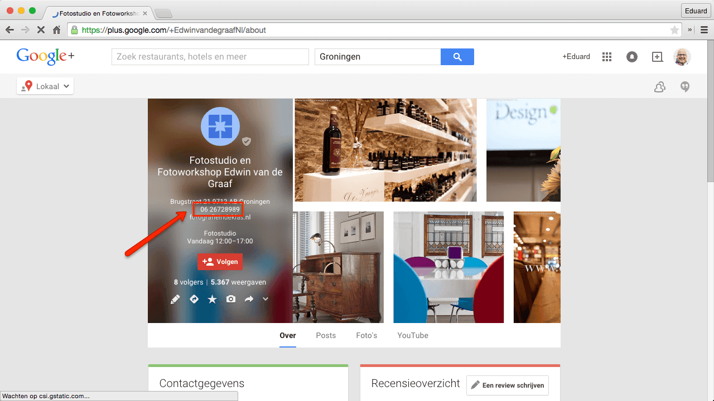
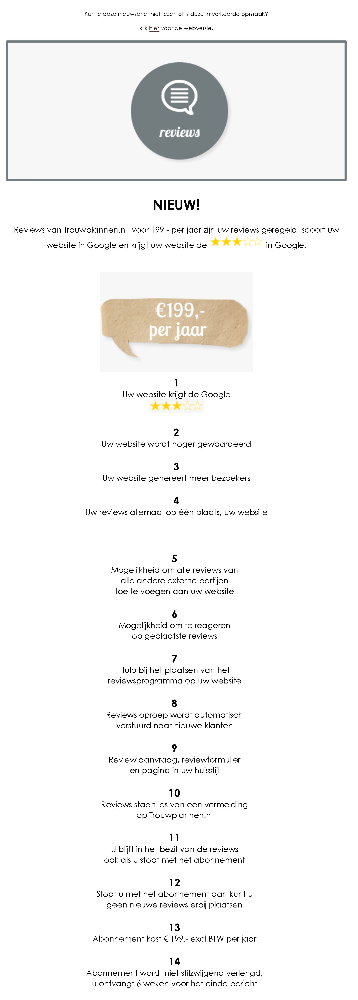

> **Historisch archief.** Deze aflevering verscheen op 23-04-2015 als onderdeel van ReputatieCoaching (2012–2016). De oorspronkelijke tekst is hieronder historisch bewaard. Diensten, contactgegevens, links, tools en adviezen kunnen inmiddels verouderd zijn.



**Transcriptiestatus:** Volledige transcriptie uit het oorspronkelijke archief.

**
De podcast is vandaag iets later online gekomen dan normaal. Reden hiervoor is dat ik gisteren er niet aan toe kwam. Ik hoop dat de onderwerpen van vandaag dat meer dan goed maken. Dus hierbij eerst een kort overzicht van de onderwerpen in deze podcast.**

**Ik begin vandaag weer met een tooltip, dit keer over het opnemen van het beeld van je iPhone of iPad, als je een instructievideo wilt maken van, zoals in mijn geval, een app. Daarna een update over Mobilegeddon, de mobile friendly update die inmiddels al twee dagen actief is. Zijn er al waarnemingen van de impact? Ik Verder kreeg ik een leuke mail van Martin een fotograaf uit Rotterdam. Hij schreef dat hij heel veel nieuwe vrienden heeft gekregen, sinds hij begonnen is het met bouwen aan zijn citations.**

**Ook ga ik je vaker mailen, zonder je te willen spammen. Ik leg je zo uit wat ik daarmee bedoel. Vervolgens heb ik een heel verhaal over het controleren van citations, waarom dat belangrijk is. Op zich een goede ontwikkeling: er komen steeds meer branchespecifieke reviewsites bij. Ik geef je echter een praktijkvoorbeeld waarvan ik eerder deze week een promotiemail ontving, dat volgens mij de unique selling points niet echt goed tot hun recht laat komen.**

**De podcast van vandaag sluit ik af met een demonstratie van de “Layar” technologie om je te laten zien wat er nu al mogelijk is op het gebied van contentmarketing, door gebruik te maken van augmented reality.**

Hallo en hartelijk welkom bij deze aflevering van de ReputatieCoaching Podcast. Ik ben Eduard de Boer, ReputatieCoach. Dit is dé podcast die jou helpt om meer business te genereren, doordat jouw website beter gevonden wordt, zowel lokaal als landelijk en doordat ik je uitleg hoe je je online reputatie kunt verbeteren. Dit alles helpt je om je bedrijf en jezelf beter op de online kaart te plaatsen.

De podcast kun je vinden op [www.reputatiecoaching.nl/125](https://www.reputatiecoaching.nl/125/). Daar vind je niet alleen de tekst, maar ook video’s waar ik het in deze uitzending over heb, alsmede afbeeldingen, links enzovoorts. Bovendien is de podcast te beluisteren in [iTunes](https://www.reputatiecoaching.nl/itunes), op [Stitcher](https://www.reputatiecoaching.nl/stitcher) en ook op [TuneIn Radio](http://tunein.com/radio/ReputatieCoaching-Podcast-p655084/). Ik raad je aan om je op één van die drie kanalen te abonneren op de podcast, zodat je geen aflevering hoeft te missen!

## Moet ik op alle social media zijn?

Oh, voordat ik overga op de onderwerpen voor vandaag… Iemand vroeg mij afgelopen weekend: moet ik als ondernemer echt op alle social media “zijn”? Tja, daarover verschillen de meningen, dus mijn mening is waarschijnlijk net zo goed en waardevol als die van alle andere mensen die je dezelfde vraag stelt.

Ik zie twee kanten aan deze vraag: een bedrijfsmatige en een reputatiegerelateerde. Vanuit bedrijfsmatig oogpunt vind ik dat je dáár moet zijn, waar je prospects en klanten zijn. Dus zitten de meeste mensen van jouw doelgroep op Twitter, dan zul je echt actief moeten zijn op Twitter. Maar zitten jouw prospects en klanten het meeste op SnapChat of op Ello, dan moet je daar contact met ze leggen. Hetzelfde geldt voor alle andere sociale media: ga naar je doelgroep in plaats van proberen je doelgroep naar het door jóu geprefereerde sociale medium te lokken.

Dan de andere kant: in relatie tot reputatie. Het kan geen kwaad, of beter gezegd: het is verstandig om op alle sociale media wel het profiel met de door jouw gewenste naam te claimen, ook al doe je er niets mee. Upload overal dezelfde profielfoto, indien mogelijk. Als je voorlopig niets met het sociale platform doet, post dan één berichtje, waarin je dat vertelt. Net als ik doe op mijn Facebook pagina, omdat [ik ben gestopt met Facebook](https://www.reputatiecoaching.nl/118/) voor persoonlijk gebruik:



Reden om dit te doen is dat je op die manier persoonsverwisseling kunt voorkomen. Stel dat er iemand is die hetzelfde heet als jij en die kans is best groot… Als je zoekt op jouw naam en je vindt het profiel van je naamgenoot, waarop allemaal “foute” content staat, dan kan dat dus ten onrechte met die content aan jou worden geassocieerd.

Laat ik dan nu echt overgaan op de onderwerpen voor vandaag…

## Tooltip: video opnemen van het beeldscherm van je iPhone / iPad

Je weet dat ik dikwijls instructievideo’s maak en ik was afgelopen week ook weer met een serie bezig. Die komt binnenkort online. En daarbij ging het over het gebruik van diverse apps op de iPhone. Normaal gebruik ik voor al mijn screen capturing het programma Camtasia van TechSmith. Dat programma is vrij prijzig, maar ik vind het prima werken en doordat ik er goed mee kan omgaan, kan ik in korte tijd een groot aantal instructievideo’s maken.

De meest recente update van Camtasia stelt je ook in staat om het scherm van de iPhone op te nemen. Dat ging een aantal instructievideo’s goed, maar opeens werkte dat niet meer. Ik had verder niets veranderd, maar wat ik ook probeerde, ik kreeg het niet meer aan de gang. Ook op Internet kon ik niet zo snel iets vinden, waarmee ik dit probleem kon oplossen.

En omdat ik verder geen tijd wilde verliezen ging ik op zoek naar een andere oplossing. En die vond ik in het programma “[Reflector 2](http://www.airsquirrels.com/reflector/)”, een tooltje van US$ 14,99.

[](http://www.airsquirrels.com/reflector/)

Dat installeerde ik op mijn iMac en binnen een paar tellen had ik het scherm van mijn iPhone op het scherm van de iMac. Vanaf dat moment kon ik dus gelukkig weer verder. Want in plaats van dat ik via Camtasia het scherm van de iPhone direct opnam, nam ik het nu op via het traject: iPhone naar Reflector naar iMac scherm naar Camtasia.

Het mooie vond ik dat Reflector letterlijk binnen een paar tellen was geïnstalleerd en meteen naar behoren functioneerde, toen ik het opstartte. Mocht jij ook een Mac hebben en soms screencasts willen maken van het scherm van een iPhone, iPod of iPad om bijvoorbeeld het gebruik van apps te laten zien, dan kan ik je in elk geval Reflector van harte aanbevelen!

Zo zie je maar: er zijn meerdere wegen die naar Rome leiden.

## Mobilegeddon is onder ons… NU!

Sinds twee dagen is het nieuwe algoritme van Google actief… Het algoritme waar sommige bedrijven of webmasters blij mee zijn, terwijl anderen het vervloeken. Want aan de ene kant kan deze verandering meer omzet opleveren voor de bedrijven die hoger worden vertoond en aan de andere kant kan het bedrijven de das om doen, omdat ze nu niet meer worden vertoond in de zoekresultaten.

Maar goed, op zich wordt de soep niet zo heet gegeten, als die wordt opgediend. Want het betreft slechts alleen de mobiele zoekresultaten. De zoekresultaten op desktops en tablets worden door dit nieuwe algoritme niet aangetast, volgens Google. Verder betreft het alleen de organische resultaten en dus ook niet de lokale resultaten.

Maar wat is de impact? Inmiddels is de update een tweetal dagen operationeel, maar ik ben tot op heden nog geen berichten tegengekomen, waarin mensen de eerste bevindingen delen. Zodra er meer over bekend wordt, laat ik je het weten.

## Citations creëren levert nieuwe vrienden op

Martin Stevens, een [fotograaf uit Rotterdam](http://www.martstevens.com/) en een trouwe luisteraar van de podcast stuurde mij een mail, waarin hij op een heel leuke manier vertelde over hoe het creëren van citations leidt tot meer vrienden.

Die mail wil ik je even voorlezen:

Citations maken heeft een extra effect! Ik krijg er veel vrienden bij die mij graag wat verkopen. Tot in de UK heeft men mij ‘ontdekt’ en mijn spam box loopt prettig vol.

Blijkbaar heeft de mail die ik van mijn nieuw verworven vrienden mocht ontvangen onvoldoende resultaat, dus nu bellen mijn fans me. Prachtig!

Hieronder vind je een op schrift gesteld aanbod van het Telefoonboek. Als goede vrienden spreekt de man mij hardnekkig bij mijn voornaam aan. Zelfs als ik fijntjes vraag: “kennen wij elkaar? “

Onverdroten gaat ‘mijn vriend’ verder en na afloop van het (zie zijn eigen woorden) prettige telefoongesprek stuurt hij me zijn voorstel per mail toe.

Onder de indruk als ik ben heb ik nog niet op mijn persoonlijke download link geklikt. De spanning is me te hoog denk ik.

Met vriendelijke groet,

Martin Stevens

Tja, ik raad bedrijven en ondernemers altijd aan om zich gratis aan te melden op “places.nl”. En als je je daarop aanmeldt, krijg je automatisch een bedrijfsvermelding op telefoonboek.nl en openingstijden.com. Natuurlijk wil telefoonboek.nl je extra diensten verkopen. Mijn advies aan de ondernemers die ik coach is altijd: ik zou het niet doen, want het levert je niet veel extra’s op. Zorg gewoon dat je er een citation hebt en dat is voldoende. Ga daarna gewoon zo snel mogelijk door met aanmaken van de volgende citation op een andere site.

Telefoonboek is niet de enige site die probeert je extra diensten te verkopen; er zijn er meer. Gewoon niet doen. Zeker niet als je een lokaal bedrijf hebt. Heb je alleen een webshop en geen fysieke winkel, dan heb ik heel andere adviezen ten aanzien van je reviewstrategie etc. Maar daar zal ik een andere keer op ingaan.

## Ik ga je vaker mailen…

Het is geen dreigement, hoor! Maar ik ga je wat vaker van mailtjes voorzien en dan niet alleen maar mailtjes waarin ik even vertel dat er een nieuwe aflevering van de podcast is gepubliceerd. Nee, een tijdje geleden had ik ook al het voornemen om interessante, educatieve artikelen die ik links en rechts tegenkom, maar die de podcast niet halen, met je te delen.

Daar ga ik binnenkort mee beginnen. Ik hoop dat je het niet ervaart als spam, maar dat je er je voordeel mee kunt doen. Ik moet nog een beslissing nemen over het moment dat ik de mail verstuur, maar ik zit te denken aan vrijdagmiddag. Dan heb je leuk wat leesvoer voor het weekend.

Of lijkt het je juist handiger op maandagmorgen, zodat je de week kunt beginnen met leesvoer? Waar gaat je voorkeur naar uit, als je die al hebt? Welke dag? Of wil je liever helemaal niet dit soort mailtjes van mij ontvangen. Dat kan ook, heh?

Verder ga ik af en toe nog meer leuke dingen met je delen via de mail. Dus… als je je nog niet hebt geabonneerd, doe dat dan zo snel mogelijk. Op elke pagina van de website kun je je aan de rechterkant inschrijven.

## Citations controleren

Een tijdje geleden heb ik aan de toenmalige abonnees van de nieuwsbrief een werkinstructie gestuurd voor het controleren, opschonen en creëren van citations, ofwel bedrijfsvermeldingen. Die helpen je onder andere om hogerop te komen in de lokale zoekresultaten… Dus bijvoorbeeld als mensen een kapper in Arnhem of een tandarts in Lutjebroek zoeken.

Heb jij die nog niet gehad en wil je die graag ontvangen, stuur me dan even een mailtje, dan stuur ik ’m alsnog ook naar jou.

Het controleren van citations is heel belangrijk. Zo werd ik eerder deze week benaderd door een fotograaf uit Doetinchem. Soms ziet hij zijn lokale vermelding wel staan en soms niet. Dat verbaasde hem en hij nam contact hierover met mij op.

[](https://lh4.googleusercontent.com/-e9Jfpk62dY4/VTjDxHHRMTI/AAAAAAAACH0/uYjtD12lcNw/w1280-h720-no/20150413-Fotograaf-Doetinchem.png)

Het bleek dat fotograaf Edwin de Graaf uit Doetinchem tot voor kort in Groningen woonde. En na enig zoeken op het mobiele nummer, dat hij in de markt communiceert voor zijn bedrijfsactiviteiten, vond ik ook nog een oude lokale bedrijfsvermelding van zijn bedrijf in Groningen:

[](https://lh4.googleusercontent.com/-wX37zLs_5ms/VTjDxEp6xWI/AAAAAAAACHw/9T8QdhWpy38/w1280-h720-no/20150413-Edwin-van-de-Graaf.png)

En dat staat Google niet toe. Je mag best twee locaties bedienen en daarvoor dus twee Google+ Mijn Bedrijfspagina’s hebben, maar dan moet je op z’n minst twee verschillende telefoonnummers in de markt zetten. Anders kun je inderdaad tegen dit soort problemen aanlopen.

Tot zover over het zoeken en aanpassen of verwijderen van oude, niet-actuele citations. Maar wat ook belangrijk is, is het controleren of een citation die je hebt aangemaakt, ook al daadwerkelijk door Google gezien is.

Zo vroeg Martin (waar ik het aan het begin over had) mij eens te kijken naar zijn citations. Volgens zijn eigen zeggen had hij er meer dan 30 aangemaakt, maar kon hij met moeite enkele terugvinden in Google. De eerste die ik pakte om te controleren, was zijn bedrijfsvermelding op allebedrijveninrotterdam.nl.

Ik typte in:

Met deze zoekopdracht vroeg ik Google mij alleen resultaten van ‘allebedrijveninrotterdam.nl’ te tonen, waarop de tekst “mart stevens” voorkwam. Het bleek dat Google wel alle algemene fotograafpagina’s had gecrawld en geïndexeerd, maar dat zijn bedrijfsvermelding nog niet was ontdekt.

Je moet weten dat sites als allebedrijveninrotterdam.nl uit tienduizenden of meer pagina’s bestaan. Ik heb even gekeken en grappig genoeg zijn er van allebedrijveninapeldoorn.nl op dit moment maar liefst 318.000 pagina’s geïndexeerd en van allebedrijveninrotterdam.nl iets meer dan 31.000… 10% van het aantal pagina’s uit Apeldoorn. Waar dat exact door komt, weet alleen Google.

Maar wel kan ik je het volgende vertellen… Google reserveert voor elke site een bepaald “crawl-budget”. Dat budget bepaalt hoeveel pagina’s van een website worden gecrawld om vervolgens te worden geïndexeerd. Als gevolg hiervan kan het dus gebeuren dat een site lang niet helemaal wordt gecrawld en geïndexeerd.

Wanneer een pagina dan een aantal niveaus diep staat, kan het zijn dat Google het crawl-budget liever aan een andere pagina van de site spendeert, dan aan de desbetreffende pagina.

Wat je in zo’n geval kunt proberen is die pagina extra aandacht geven, door ’m bijvoorbeeld te delen op Twitter, in Google+ en op Facebook. Zo is de kans groot dat Google de pagina alsnog gaat indexeren. Soms helpt het ook een pagina met een regelmaat van eens per drie tot vier dagen te pingen. Maar dat is een onderwerp voor een heel andere keer.

Maar goed, wat je hiervan kunt leren is dat je altijd een paar maanden na het creëren van een citation moet controleren of die ook daadwerkelijk in de zoekresultaten voorkomt. Zo niet, dan telt die namelijk dus nog niet mee bij het vaststellen van jouw positie in de lokale zoekresultaten! Geef een dergelijke pagina meer aandacht en liefde om er zo voor te zorgen dat die door Google wordt gezien, gecrawld en geïndexeerd. Want pas dan telt die dus mee als officiële citation voor je positie in de lokale zoekresultaten.

## Er komen meer en meer reviewsites en vragen om reviews

Nieuwe reviewsites schieten als paddenstoelen uit de grond. Zo ontving ik een paar dagen geleden een mailtje van trouwplannen.nl. Zij vertelden vol trots dat je nu voor € 199 per jaar reviews kunt verzamelen op hun site en op je eigen site. In de show notes op [www.reputatiecoaching.nl/125](https://www.reputatiecoaching.nl/125/) heb ik de mail opgenomen:

[](https://lh6.googleusercontent.com/-_amCnUdD9W0/VTjE_U_rqDI/AAAAAAAACIM/CHsFzklml90/w600/Trouwplannen.nl-nieuwsbrief-april.jpg)

Er zitten teksten in, waar ik kanttekeningen bij heb. Laat ik ze eens langslopen…

```
  1. **Uw website krijgt de Google sterren** – Dat klopt, dat geloof ik wel. In elk geval krijg je hiermee niet de sterren in de lokale zoekresultaten en die zijn om te beginnen véél belangrijker. Mijn advies is altijd om minstens 10 tot 12 beoordelingen of reviews te verzamelen op je Google+ Mijn Bedrijf pagina, voordat je überhaupt elders reviews _begint_ te vragen. Want die sterren in de lokale resultaten op Google worden vertoond als prospects een bepaalde dienstverlener in de buurt zoeken. Dat is een mega eyecatcher en zal je in eerste instantie meer opleveren dan de sterren op trouwplannen.nl. Wordt jouw website nu niet op de voorpagina vertoond als je bijvoorbeeld zoekt op “weddingplanner Amstelveen”, dan maken die sterren die je eventueel van trouwplannen.nl bij jouw sitevermelding krijgt ook niet uit. Je kunt beter eerst je lokale vindbaarheid verbeteren en die € 199 voorlopig in de zak houden.
  2. **Uw website wordt hoger gewaardeerd** – De vraag is door wie of wat je website hoger wordt gewaardeerd. OK, als mensen zoeken op je bedrijfsnaam en je wordt vertoond op trouwplannen.nl of met je eigen vermelding, dan klikken ze sneller door naar de desbetreffende pagina. Maar voor zover ik weet, wordt je site echt niet hoger vertoond in de zoekresultaten, hetgeen impliciet een beetje door deze tekst wordt gesuggereerd. Want anders zou iedereen wel de sterretjes bij zijn vermelding plaatsen, dat is namelijk technisch een koud kunstje.
  3. **Uw website genereert meer bezoekers** – Dat is de vraag… Want als jouw pagina nu niet wordt vertoond en jouw vermelding op trouwplannen.nl ook niet op de eerste twee pagina’s is te vinden, dan vraag ik me af hoe die extra bezoekers je kunnen vinden en dus naar je site doorklikken. Hooguit als ze je vinden via trouwplannen.nl of via je eigen bedrijfsnaam. Dat kan leiden tot meer verkeer naar je site.
  4. **Uw reviews allemaal op één plaats, uw website** – Dan hoop ik dat ze niet ook nog op trouwplannen.nl staan, want hoewel uit recente experimenten met het kopiëren van reviews blijkt dat dit geen negatief effect op de ranking lijkt te hebben, weet je nooit wat Google hier in de toekomst van gaat vinden. En als ze ook op trouwplannen staan, dan klopt deze belofte niet.
  5. **Mogelijkheid om alle reviews van alle andere externe partijen toe te voegen aan uw website** – Dit klinkt erg onduidelijk, zelfs voor mij. Ik heb geen idee wat hiermee wordt bedoeld… Of je ook Facebook of Google+ reviews op je site kunt plaatsen?
  6. **Mogelijkheid om te reageren op geplaatste reviews** – Dat is gelukkig, want ik kan me geen reviewstrategie voorstellen als je niet kunt reageren… Je moet tenslotte niet alleen reageren op negatieve reviews, maar ook op de positieve. Zo zien prospects tenminste dat je actief bent met je bedrijf.
  7. **Hulp bij het plaatsen van het reviewsprogramma op uw website** – Dat is een goede service… Hopelijk weten de techneuten van wanten.
  8. **Reviews oproep wordt automatisch verstuurd naar nieuwe klanten** – Dit klinkt wat vaag, ik denk dat ze bedoelen klanten die via trouwplannen.nl bij je komen. Ik ben benieuwd hoe dit anders kan worden gerealiseerd. Hoe gaat het in zijn werk als ik bijvoorbeeld als fotograaf een opdracht krijg van een nieuwe klant die via mijn website binnenkomt… Hoe weet trouwplannen.nl dan wanneer er naar wie een oproep moet worden verstuurd?
  9. **Review aanvraag, reviewformulier en pagina in uw huisstijl** – Klinkt goed, maar lijkt me vanzelfsprekend.
  10. **Reviews staan los van een vermelding op Trouwplannen.nl** – OK, dus je hoeft geen andere betaalde vermeldingen af te nemen van trouwplannen.nl. Dat is tenminste geen koppelverkoop.
  11. **U blijft in het bezit van de reviews ook als u stopt met het abonnement** – Gelukkig maar. Ik raad ook niet voor niets iedereen altijd aan om een kopie in tekst en als image te maken van elke review die over hun bedrijf, product of dienstverlening wordt geplaatst. Als er ooit een bedrijf failliet gaat, of gewoon besluit te stoppen, dan heb je tenminste nog je reviews die je kunt hergebruiken.
  12. **Stopt u met het abonnement dan kunt u geen nieuwe reviews erbij plaatsen** – Dat lijkt me inderdaad logisch, want anders zou iedereen één jaar een abonnement afsluiten, daarna stoppen met betalen en gewoon doorgaan met reviews verzamelen.
  13. **Abonnement kost € 199.- excl BTW per jaar** – Dat is een feit.
  14. **Abonnement wordt niet stilzwijgend verlengd, u ontvangt 6 weken voor het einde bericht** – Goed punt. Er zijn veel teveel van dit soort wurgcontracten die bestaan bij de gratie van de zogenaamde “slapers”: mensen die niet op tijd het contract opzeggen, waardoor ze er weer een tijd aan vast zitten.
```

Zoals je merkt heb ik een aantal vraagtekens bij de eerste helft van de beloftes c.q. “unique” selling points… Nou ja… “Unique”?? Ik zal eens zien of ik binnenkort iemand van trouwplannen.nl in de show kan krijgen om e.e.a. nader toe te lichten, want van deze beloftes krijg ik nog geen warm buikgevoel. OK, ik ben ook geen doorsnee fotograaf die al dit moois krijgt voorgeschoteld…

## Layar voor realtime contentmarketing

Mogelijk kende je de app Layar al. Layar is een technologie, waarbij je de camera van je smartphone ergens op richt, waarna je additionele informatie als een extra laag over het beeld krijgt. Zo is het bijvoorbeeld technisch mogelijk om een gebouw te “scannen”, waarna je de Wikipedia beschrijving van dat gebouw in je scherm krijgt.

Vorig jaar had ik het voorrecht om voor AkzoNobel een fotoreportage te mogen maken van de Raad van Bestuur, alsmede van de CEO ten behoeve van het [financiële jaarverslag van 2014](http://report.akzonobel.com/2014/ar/). Ook was ik bij de video-opnames van de CEO die werden gemaakt ten behoeve van een Layar video in het jaarverslag.

Voor het geval je het nog nooit hebt gezien hoe dat werkt, heb ik voor jou een korte demonstratievideo gemaakt. Deze demonstratievideo heb ik opgenomen in de show notes van deze podcast, op [www.reputatiecoaching.nl/125](https://www.reputatiecoaching.nl/125/). Ik raad je echt aan de video te bekijken om te zien hoe dit er uitziet, als je gewoon een pagina van het jaarverslag scant:

En met die korte demonstratievideo van de interessante “Layar”-technologie kom ik weer aan het einde van deze podcast. Ik hoop dat je er iets aan hebt gehad en dat je er iets van hebt opgestoken.

Als je de podcast leuk vindt en je wilt nog meer op de hoogte blijven, volg me dan ook op Twitter, via [@reputatiecoach1](https://twitter.com/reputatiecoach1).

Heb je inderdaad wat aan alle informatie die ik met je deel, help mij dan met het verder verbeteren en promoten van deze podcast. Abonneer je op de podcast, zodat je altijd meteen de nieuwste uitzending krijgt voorgeschoteld.

Zoek de podcast op, in [iTunes](https://www.reputatiecoaching.nl/itunes) of [Stitcher](https://www.reputatiecoaching.nl/stitcher), geef de podcast een sterrenbeoordeling en laat ook je reactie achter. Door de podcast te beoordelen op iTunes en/of Stitcher breng je de podcast onder de aandacht van een breder publiek.

Je kunt me verder helpen, door de podcast aan te bevelen bij vrienden of collega’s, waarvan je denkt dat ze er hun voordeel mee kunnen doen, of door ’m te delen op Twitter, like’n en delen op Facebook of een “+1” te geven op Google+.

En vergeet niet: ik ben hier om je te helpen! Als je een vraag of een probleem hebt met betrekking tot je online reputatie of de vindbaarheid van je website, kun je een mailtje sturen naar [podcast@reputatiecoaching.nl](mailto:podcast@reputatiecoaching.nl).

Als je dat te lastig vindt, of als je de podcast beluistert terwijl je in de auto zit en je hebt acuut een vraag, spreek dan een boodschap in op de ReputatieCoaching Hotline, op nummer: 084 - 883 15 56. Mogelijk behandel ik je vraag of probleem dan in een artikel of in de podcast.

En je kunt ook rechtstreeks op de website een voicemail achterlaten, door op de tab aan de rechterkant van elke pagina te klikken, en je bericht in te spreken. Dit was [ReputatieCoaching Podcast aflevering 125](https://www.reputatiecoaching.nl/125/) en mijn naam is [Eduard de Boer](http://nl.linkedin.com/in/eduarddeboer/nl).

Ik wens je de komende week weer succes met het werken aan je reputatie, zodat je meteen je reputatie voor jou kunt laten werken!

Tot volgende week!

Doei!

Links naar content die in deze podcast aan bod komt:

```
  * [ReputatieCoaching Podcast in iTunes](https://www.reputatiecoaching.nl/itunes)
  * [ReputatieCoaching Podcast op Stitcher](https://www.reputatiecoaching.nl/stitcher)
  * [ReputatieCoaching Podcast op TuneIn Radio](http://tunein.com/radio/ReputatieCoaching-Podcast-p655084/)
  * [ReputatieCoaching Podcast RSS-feed](https://feeds.reputatiecoaching.nl/ReputatieCoachingPodcast)
  * [Camtasia](https://www.techsmith.com/camtasia.html)
  * [Reflector 2](http://www.airsquirrels.com/reflector/)
  * [Layar](https://www.layar.com)
  * AkzoNobel Annual Report 2014
```
