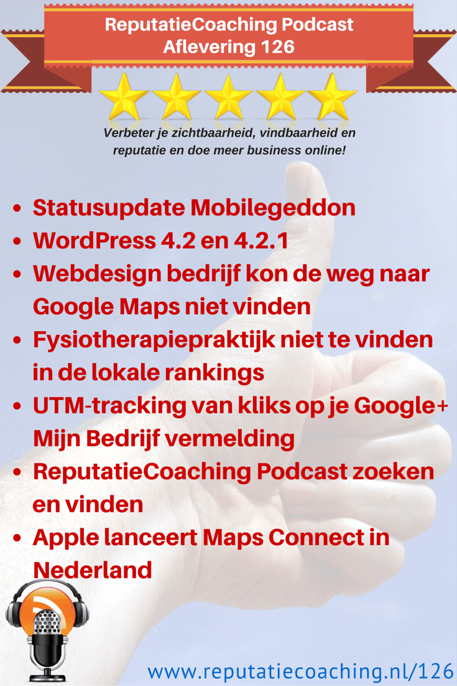
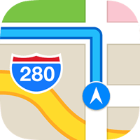
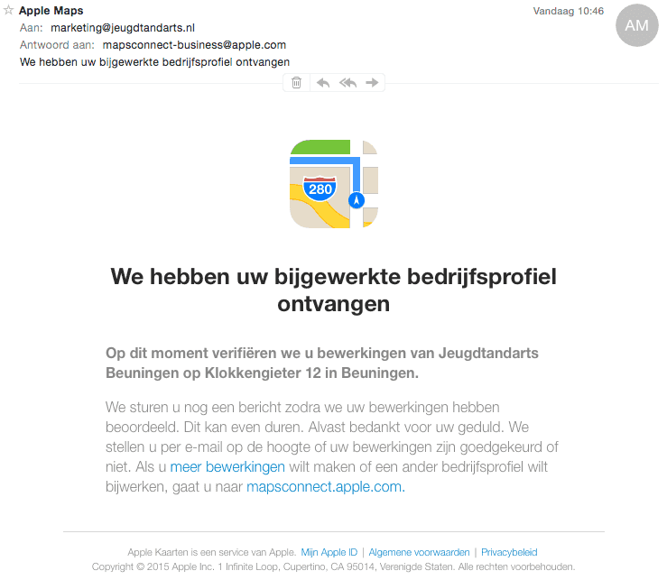

> **Historisch archief.** Deze aflevering verscheen op 30-04-2015 als onderdeel van ReputatieCoaching (2012–2016). De oorspronkelijke tekst is hieronder historisch bewaard. Diensten, contactgegevens, links, tools en adviezen kunnen inmiddels verouderd zijn.



**Transcriptiestatus:** Volledige transcriptie uit het oorspronkelijke archief.

**
Gebruik je WordPress en heb je al een tijdje je WordPress installatie niet bijgewerkt? Luister dan naar het eerste item van vandaag, want WordPress is vorige week vernieuwd. Toen is versie 4.2 uitgekomen, maar inmiddels is 4.2.1 alweer uitgekomen, een security update. Het is echt zaak om je WordPress site zo snel mogelijk bij te werken!**

**Verder had ik een leerzame vraag van een webdesign bedrijf dat wel op Google+ stond, maar de weg naar Google Maps niet kon vinden…**

**De eigenaar van een fysiotherapiepraktijk met vier locaties in het midden van het land raadpleegde mij voor het verbeteren van de positie in de lokale zoekresultaten. Daarvoor heb ik een soort korte scan uitgevoerd om in kaart te brengen waar mijns inziens de zogenaamde ‘quick wins’ liggen om hoger te komen in zowel de lokale resultaten, als de organische zoekresultaten.**

**Standaard kun je in Google Analytics niet zien hoeveel verkeer je naar je website krijgt op basis van kliks uit de lokale zoekresultaten in Google. Ik vertel je hoe je dit met behulp van een zogenaamde UTM-tracking code kunt meten. Zo kun je dus beter in beeld brengen of verkeer vanaf de lokale resultaten ook leidt tot het door jou gewenste resultaat, zoals een inschrijving, het invullen van het contactformulier of het kopen van een product of dienst.**

**Om het voor iedereen gemakkelijk te maken om de podcast te vinden en zich te abonneren op de podcast heb ik vorige week een viertal instructievideo’s gemaakt. Eentje heb ik in de show notes opgenomen. Ook vind je daar de links naar de drie andere video’s.**

Het laatste onderwerp van deze podcast is Apple Maps Connect. Dit is nu goed en wel iets van een week operationeel in Nederland en ik vertel je hoe je je bedrijf op Apple Maps Connect kunt claimen.

Hallo en hartelijk welkom bij deze aflevering van de ReputatieCoaching Podcast. Ik ben Eduard de Boer, ReputatieCoach. Dit is dé podcast die jou helpt om meer business te genereren, doordat jouw website beter gevonden wordt, zowel lokaal als landelijk en doordat ik je uitleg hoe je je online reputatie kunt verbeteren. Dit alles helpt je om je bedrijf en jezelf beter op de online kaart te plaatsen.

De podcast kun je vinden op [www.reputatiecoaching.nl/126](https://www.reputatiecoaching.nl/126/). Daar vind je niet alleen de tekst, maar ook video’s waar ik het in deze uitzending over heb, alsmede afbeeldingen, links enzovoorts. Bovendien is de podcast te beluisteren in [iTunes](https://www.reputatiecoaching.nl/itunes), op [Stitcher](https://www.reputatiecoaching.nl/stitcher) en ook op [TuneIn Radio](http://tunein.com/radio/ReputatieCoaching-Podcast-p655084/). Ik raad je aan om je op één van die drie kanalen te abonneren op de podcast, zodat je geen aflevering hoeft te missen!

## Statusupdate Mobilegeddon

Voordat ik je vertel over de nieuwe WordPress even een statusupdate over Mobilegeddon, de mobielvriendelijke update van Google. Tot op heden heb ik in de Nederlanstalige mobiele resultaten niets gezien. Heb jij al iets gespot? Is het een storm in een glas water? Of zijn we in Nederland één van de laatste landen waar de update wordt doorgevoerd?

Ook collega marketeers hebben nog geen significante wijzigingen waargenomen. Maar goed, vorige week vrijdag zei John Mueller van Google er het volgende over:

From the first day to the next day, I don’t think you’ll see a big change. But if you compare last week to next week, then you should see a big change.

And I’ve seen some blog posts out there have noticed it’s different, and tried to document the difference between the desktop results and new mobile results. So there are definitely people noticing it.

Dus we zullen in Nederland nog even moeten wachten… Maar dat de change eraan zit te komen, is een feit.

Laat ik dan nu overgaan op de onderwerpen voor vandaag…

## WordPress 4.2 en 4.2.1

23 april, ofwel vorige week donderdag is WordPress 4.2 uitgekomen. Deze versie heeft de naam “Powell” gekregen, ter nagedachtenis van de jazzpianist Bud Powell:

De belangrijkste verbeteringen c.q. uitbreidingen hierin zijn:

```
  * Een vernieuwde “Press This” om snel en eenvoudig content te delen via je WordPress blog.
  * Wellicht voor de Nederlanders iets minder essentieel: ondersteuning voor Chiness, Japans, Koreaans. Bovendien ondersteuning voor muzieksymbolen, wiskundige symbolen en hiëroglyfen.
  * Thema’s bekijken in de Customizer en widgets toevoegen en bewerken in real-time.
  * Meer embed codes, dit keer links van Tumblr en Kickstarter
  * Gestroomlijnd updaten van plugins
```

Echter, meteen vier dagen daarna kwam er een security update, versie 4.2.1. Het bleek namelijk dat er een cross-site scripting vulnerability in versie 4.2, alsmede in oudere versies van WordPress zat. Hiermee was het mogelijk om gebruikers aan te maken en zelfs om het administrator wachtwoord te wijzigen.

Al met al is het dus ook voor jou belangrijk om zo snel mogelijk je WordPress bij te werken naar versie 4.2.1. Dan loop je het minste risico.

Een belangrijke waarschuwing bij elke update: maak eerst een goede, volledige backup! Je kunt dit regelen in WordPress met behulp van de plugin BackWPUp of anders mogelijk in het administratiepaneel dat je van je hostingprovider toegewezen hebt gekregen. Vergeet dit niet, want je slaat je echt voor je hoofd, als je dit niet eerst doet en het blijkt dat er tijdens de update iets fout is gegaan, waardoor je website ontoegankelijk is geworden!

## Webdesign bedrijf kon de weg naar Google Maps niet vinden

*Historische afbeelding niet beschikbaar: Google Maps logo*
Ik werd benaderd door de oprichter/eigenaar van een webdesign bedrijf waar ik al een tijdje mee samenwerk. Hij stuurde mij het volgende berichtje via de chat van Google Hangouts:

Jij weet veel meer van Google bedrijfslocaties etc. dan ik. Mag ik jou een kort vraagje stellen?

Als ik gewoon inzoom op Google Maps, komt … nooit beeld. Alle bedrijven om ons heen wel
Maar ik heb geen idee hoe ik dat moet oplossen. Heb jij een tip voor me?

Ik doe altijd mijn uiterste best iedereen te helpen. En vaak kan ik inderaad snel de oorzaak van een bepaald probleem achterhalen. Zo ook in dit geval… Na enig zoeken bleek dat iemand ooit een persoonlijk Google+ profiel had gemaakt met daarin als voornaam het eerste woord van de bedrijfsnaam en als achternaam het woordje “webdesign”. Wel was het profiel keurig voorzien van het bedrijfslogo.

Je kunt persoonlijke Google+ profielen gemakkelijk onderscheiden van zakelijke Google+ Mijn Bedrijf pagina’s… Een zakelijke Google+ Mijn Bedrijf pagina heeft bijvoorbeeld geen vermelding van het geslacht, de opleidingen of woonplaats. Een persoon aan de andere kant heeft geen werk en geen recensies.

Let op voor wat betreft dat laatste: een persoon kan geen recensies verzamelen, maar natuurlijk wel plaatsen. Echter, het is ook mogelijk om recensies te plaatsen bij bedrijven, vanaf een bedrijfspagina. Zelf gebruik ik dat niet bijster vaak, omdat ik meestal reviews post onder mijn eigen naam. Maar het is dus wel mogelijk reviews te posten als bedrijf in plaats van als een individu.

## Fysiotherapiepraktijk niet te vinden in de lokale rankings

*Historische afbeelding niet beschikbaar: Zet je bedrijf op de kaart van TomTom*
Deze week kreeg ik nog een vraag en wel van Frank. Frank is een fysiotherapeut die al enige tijd naar de podcast luistert en hij stuurde me eerder deze week een mailtje met daarin de volgende tekst:

Enkele weken geleden heb ik via je website ook al een bericht gestuurd, maar hier nooit reactie op gehad. Daarom probeer ik het nogmaals via de e-mail.

Al enige tijd luister ik met veel interesse naar je podcasts en heb ik al veel tips die je geeft in de praktijk uitgevoerd. Zo ben ik continue bezig met het maken van nieuwe citations.

Even kort voorstellen.
Wij zijn een fysiotherapiepraktijk in … met 4 locaties. Voorheen hadden we ook 4 verschillende websites, maar dit hebben wij 2 jaar geleden teruggebracht naar 1 website.
De website is met Wordpress gemaakt en is responsive. Dus ook mooi zichtbaar op een mobiel.
Door het vele aantal fysiotherapie praktijken in … is het belangrijk om goed vindbaar te zijn en daar gaat het de laatste tijd mis.
We hebben voor elke locatie een Google+ pagina aangemaakt, maar zijn op dit moment als men zoekt op ‘fysiotherapie …’ of ‘fysiotherapeut …’ niet meer vindbaar in de lokale zoekresultaten.
Wel staan wij daaronder nog steeds als website vermeld, maar ook hier moeten we oppassen dat we niet verder dalen.
Verder zijn we actief op Twitter en Facebook en ook op Pinterest.

Het mooiste scenario is dat wij in de normale zoekresultaten helemaal bovenaan staan en dat wij met onze 4 locaties bovenin staan in de lokale zoekresultaten, maar hoe dit te bereiken?

Heb jij adviezen voor mij en wat kan jij hierin voor ons betekenen?
Ik hoor graag van je.

Helaas heb ik het eerdere bericht waar Frank naar verwijst niet ontvangen. Zo snel mogelijk nadat ik dit bericht ontving, heb ik Frank gemaild dat ik ermee aan de slag ging.

Gedurende zo’n uur ben ik eens gaan snuffelen, wat ik zoal kon vinden. Tegelijkertijd heb ik in de achtergrond de Chrome extensie “N.A.P. Hunter Lite” aan het werk gezet om te zoeken naar citations van alle vier de locaties. Deze citations heb ik in een Google spreadsheet verzameld, waarbij ik de citations per locatie op een tabblad heb gegroepeerd.

Hoewel ik niet ontzettend de diepte in ben gedoken, vond ik al snel de volgende aandachtspunten die actie vereisen:

### Google+

```
  * Er zijn 6 vermeldingen gevonden op Google Maps en Google+, terwijl er maar vier locaties zijn. Er zijn twee locaties dubbel vermeld. Daarvan moet er eentje worden verwijderd. Als je met het verwijderen van Google+ pagina’s aan de slag gaat, moet je er bij het verwijderen op letten, dat je NIET de locatie met de reviews verwijdert! Ook niet de locatie die geverifieerd is.
  * Er is 1 persoonlijk Google+ profiel gevonden met de naam dezelfde naam als de praktijk. Deze moet worden verwijderd.
  * Alle G+ Mijn Bedrijfpagina’s hebben dezelfde omschrijving. Maar die dient uniek te worden gemaakt per locatie. Daarin zou ik dan ook links aanbrengen naar pagina’s op site die gaan over specifieke onderwerpen.
  * Als je een organisatie bent die over meerdere locaties verspreid is, dien je een aparte pagina per locatie op je site te hebben met de gegevens van die locatie. Daar dien je dan vanaf je Google+ Mijn Bedrijf pagina ook naartoe te linken. In deze situatie was het voor drie van de vier locaties correct ingesteld.
  * Het verdient de aanbeveling om voor elke locatie reviews te gaan verzamelen op Google+ Mijn Bedrijf. Mijn advies is om pas na 10–11 reviews op Google+ ook op andere sites reviews te verzamelen. Tenzij je patiënten geen Gmail-adres hebben… Dan adviseer ik je om elders reviews te vragen of te verzamelen.
  * Advies is ook door middel van UTM-tracking codes het verkeer vanaf de lokale bedrijfsvermeldingen naar de website te loggen in Google Analytics.
```

### Website

```
  * De adresgegevens per locatie staan achter een tab die standaard niet zichtbaar is. Dat soort content wordt volgens Google sinds enige tijd niet meer geïndexeerd.
  * Er staat slechts één algemeen telefoonnummer op de site. Op de tabs van de locaties staan niet de telefoonnummers van de locaties. Voor elke lokale moet die hetzelfde zijn als op de G+ pagina.
  * Locatieadres op tab is NIET gemarkeerd met schema.org, terwijl het algemene adres in de footer wel met schema.org is gemarkeerd. Ik zou het locatieadres zeker met schema.org markeren!
  * In de footer staat overal één en hetzelfde adres. Dat is verwarrend, voor Google en ook voor bezoekers van de site. In zo’n geval is mijn advies om het adres in de footer te verwijderen.
  * Locatiepagina’s bevatten een verkeerd type kaart. Moet echt Google Maps kaart zijn, waarop is gezocht op bedrijfsnaam + adres. Dit heb ik ook recentelijk nog verteld in [podcast 123](https://www.reputatiecoaching.nl/123/).
  * De links op de linkspagina op de site zijn allemaal DOFOLLOW (impliciet). Omdat het best een aardig aantal links is, is mijn advies om die links NOFOLLOW te maken om elke illusie van linkbuilding weg te nemen.
  * De titels van de pagina’s op de site kunnen beter. Zo zou ik de titels van de locatiepagina’s liefst hetzelfde maken als de naam van de Google+ pagina + de plaatsnaam en eventueel het telefoonnummer.
  * Tja, wat essentieel is om op de radar van Google en andere zoekmachines te blijven, is steeds verse content produceren. En volgens mij mag dat voor een fysiotherapiepraktijk niet te moeilijk zijn. Instrueer alle therapeuten om dagelijks alle vragen van patiënten op te schrijven en bundel die. Stel op basis daarvan een publicatiekalender samen, bijvoorbeeld onderverdeeld in thema’s, waaronder de artikelen dan worden gepubliceerd.
```

### YouTube

```
  * De praktijk heeft één video op YouTube staan van 15 seconden. Dat is echt te kort om überhaupt indruk te maken op de kijker. Bovendien bevat de video veel te weinig content in de beschrijving.
  * Mijn advies is elke 2–3 weken een nieuwe video te publiceren op YouTube en deze natuurlijk ook op de site te embedden. Net als met de artikelen moet men volgens mij binnen no-time voldoende ideeën voor video’s kunnen spuien.
```

### Overige adviezen (in willekeurige volgorde)

```
  * Slechts 2 locaties staan op Yelp. Mijn advies is om alle locaties op zoveel mogelijk relevante sites aan te melden, dus inderdaad op Yelp, Foursquare en andere.
  * Openingstijden op Google+ / Yelp / website / openingstijden.nl zijn inconsistent. Dit is niet alleen slecht voor de gebruikerservaring, doordat een patiënt voor een dichte deur kan komen te staan, maar ook voor consistentie van je bedrijfsgegevens. Hoewel er volgens mij nooit onderzoek is gedaan naar het effect van inconsistente openingstijden in de citations, adviseer ik om overal dezelfde openingstijden te communiceren.
  * Er is nogal wat inconsistent naamgebruik van de namen van de locaties. Ik kan me voorstellen dat dit historisch zo is gegroeid, maar dit moet echt worden aangepast. Vaak levert het opschonen van citations en zeker van vermeldingen van de bedrijfsnaam heel snel een positief resultaat. Voor het [opschonen van citations](https://www.reputatiecoaching.nl/werkinstructie-opschonen-citations/) verwijs ik graag naar de gelijknamige werkinstructie, elders op de site.
  * Naast inconsistentie vond ik ook enkele incomplete vermeldingen op bijv. telefoonboek.nl en openingstijden.com.
  * Op Independer wordt voor alle vier de locaties hetzelfde telefoonnummer gebruikt. Google raadt aan om een uniek telefoonnummer per locatie te communiceren.
```

Verder vond ik nog een paar kleine puntjes. Zo zie je wat je in een analyse van een klein uur kunt vinden, als je weet waarnaar je moet kijken. Ondanks dat het hem extra werk oplevert, was Frank toch ontzettend blij met de bevindingen en mijn analyse.

Heb jij een lokaal opererend bedrijf en is je website en/of je zakelijke Google+ Mijn Bedrijf moeilijk te vinden? Stuur dan ook eens een mailtje met je vraag of probleem naar [podcast@reputatiecoaching.nl](mailto:podcast@reputatiecoaching.nl) en ik ga kijken wat ik voor je kan betekenen. Dat alles kost je niets en het verplicht je ook tot niets! Pas als ik echt voor je aan het werk ga om je vermelding naar te top te helpen, dan breng ik kosten in rekening.

## UTM-tracking van kliks op je Google+ Mijn Bedrijf vermelding

Ik wil altijd graag weten wat het effect is van mijn inspanningen. Zo gebruik ik Google Analytics voor het meten van het verkeer naar mijn eigen sites en ik adviseer ook opdrachtgevers om hier gebruik van te maken.

Als ik voor een bedrijf aan de slag ga, is het eerste wat ik altijd doe, ervoor zorgen dat Google Analytics wordt gebruikt. Zodra Analytics operationeel is, activeer ik ook liefst zo snel mogelijk het meten van de kliks vanaf de lokale bedrijfsvermelding naar de website. Daarvoor gebruik ik de zogenaamde UTM-tracking van Google Analytics. Hoe dat precies allemaal werkt, ga ik nu even niet op in. Ik wil me even focussen op het tracken van het verkeer naar de site, dat vanaf een lokale bedrijfsvermelding komt.

Dat doe ik door in Google+ Mijn Bedrijf de URL van de bedrijfswebsite iets aan te passen. Zo heb ik bijvoorbeeld voor Allround Fotografie de URL ingesteld, zoals ik die in de show notes heb weergegeven:

Als ik ’m zo uitspreek klinkt die erg complex. Maar in de praktijk valt dat wel mee. Daarom raad ik je aan om de show notes op [www.reputatiecoaching.nl/126](https://www.reputatiecoaching.nl/126/) even na te lezen om de toevoeging van de UTM-code te inspecteren. Het deel vanaf het vraagteken kun je zo overnemen en achter je eigen URL plaatsen, die je in Google+ Mijn Bedrijf hebt vermeld.

Een andere keer zal ik dieper ingaan op UTM-tracking en hoe je dat zoal kunt gebruiken om bijvoorbeeld downloads van een PDF op je site of kliks vanaf een specifieke afbeelding op Pinterest te meten.

## ReputatieCoaching Podcast zoeken en vinden

Het is niet altijd eenvoudig om de podcast te vinden en om dat te vereenvoudigen heb ik een paar instructievideo’s gemaakt. Deze zijn eind vorige week online gekomen. Om te beginnen heb ik een video gemaakt, over hoe je je kunt abonneren in iTunes, het programma van Apple dat zowel beschikbaar is voor MacOS X als voor Windows. Deze video heb ik opgenomen in de show notes:

```
  * de app “Podcasts” op de iPhone, iPod en iPad
  * Stitcher
  * TuneIn Radio
```

Mocht je één van deze apps gebruiken, maar nog niet luisteren naar de podcasts, bekijk dan de desbetreffende instructievideo en abonneer je NU!

## Probleem met TuneIn Radio

*Historische afbeelding niet beschikbaar: TuneIn Radio logo*
Vorige week heb ik de video’s over het zoeken en vinden van de podcast in de verschillende online services gemaakt, waar ik het zojuist over had. Toen zag ik dat door welke oorzaak dan ook, het overzicht van de podcasts op TuneIn Radio al 15 weken niet was bijgewerkt. Daar stond namelijk podcast 110 nog als meest recente aflevering.

Ik mailde de supportafdeling van TuneIn Radio met mijn probleem, maar ironisch genoeg bleek het probleem opgelost toen men mij antwoordde. In elk geval zal ik TuneIn Radio de komende tijd ook weer wat meer in de gaten houden om er zeker van te zijn dat de meest recente podcasts daar ook worden vertoond.

## Apple lanceert Maps Connect in Nederland


In [podcast 99](https://www.reputatiecoaching.nl/99/) vertelde ik je over de dienst Apple Maps Connect die Apple toen had gelanceerd. Alleen was de dienst toen nog niet beschikbaar in Nederland. Wel had ik mijn mailadres in oktober vorig jaar aan Apple gegeven om mij op de hoogte te brengen, zodra de dienst in Nederland zou uitrollen.

Echter, de mail heb ik tot op heden nog niet ontvangen, maar ik las in een blogbericht op een Amerikaanse site dat Maps Connect inmiddels in Nederland beschikbaar moest zijn. Dus ik logde in op [mapsconnect.apple.com](https://mapsconnect.apple.com/) en inderdaad, ik kon een bedrijfsvermelding claimen!

Om te beginnen heb je een Apple ID nodig. Daarvoor kun je gewoon het ID gebruiken, dat je ook gebruikt om in te loggen op iTunes, in de AppStore en dergelijke. Als je een bedrijf claimt voor iemand anders, raad ik je aan het bedrijf onder zijn of haar Apple ID te claimen, of indien nodig een Apple ID voor die persoon aan te maken.

Eenmaal ingelogd moet je eerst de taal kiezen, waarna je moet controleren of het bedrijf al in Apple Maps Connect staat. Zo niet, dan moet je het toevoegen. Als het wel vermeld is, kun je het bedrijf claimen. Daarvan heb ik een instructievideo gemaakt, die je kunt bekijken in de show notes:

Beide keren krijg je een viercijferige PIN te horen die je moet intypen. In de instructievideo over Apple Maps Connect claimde ik de vermelding van de Jeugdtandarts in Beuningen. Vantevoren had ik de telefoniste ingeseind dat ze gebeld zou worden en dat ze even de viercijferige PIN moest opschrijven. Die kreeg ik een paar minuten later van haar en zodoende kon ik door, zonder dat ik zelf het desbetreffende telefoonje moest beantwoorden.

Toen ik eergisteren Allround Fotografie claimde, liep ik tegen een klein probleempje aan. Voor Allround Fotografie heb ik een telefoonnummer dat begint met 087 … En 087-nummers kunnen helaas niet vanuit het buitenland worden gebeld. Ik heb dat toen opgelost met een 055-nummer dat ik ook nog beschikbaar had. Dat nummer verbindt door naar mijn mobiele telefoon, dus dat werkte ook.

Vlak na het claimen van de Jeugdtandarts ontving ik een bevestigingsmail, die ik ook in de show notes heb opgenomen:

[](https://lh6.googleusercontent.com/-dGkzbMcWUto/VUG8uamf7iI/AAAAAAAACIo/2VkIbK1BP-s/w739-h643-no/20150429-MapsConnect-Mail.png)

Ik raad je aan om in elk geval je bedrijf zo snel mogelijk te claimen en/of toe te voegen op Apple Maps. Voorheen ging dat allemaal moeizaam en moest je een achterdeur via Yelp en/of TomTom Places gebruiken en duurde het maanden tot je bedrijf vermeld stond, maar gelukkig hoeft dat nu dus niet meer!

Binnenkort ga ik ook een bedrijf toevoegen via Apple Maps Connect en dan kan ik je hopelijk berichten hoelang het nu duurt, tot je bedrijf op Apple Kaarten staat.

En met dit topic over Apple Maps Connect kom ik dan weer aan het einde van deze podcast. Ik hoop dat je er ook vandaag iets van hebt opgestoken. Al heb je maar als enige ervan opgestoken dat je je moet abonneren op de podcast en dat je jouw bedrijf moet claimen en/of toevoegen op Apple Maps Connect. Dan heb je in elk geval de twee belangrijkste takeaways opgepikt!

Als je de podcast leuk vindt en je wilt nog meer op de hoogte blijven, volg me dan ook op Twitter, via [@reputatiecoach1](https://twitter.com/reputatiecoach1).

Heb je inderdaad wat aan alle informatie die ik met je deel, help mij dan met het verder verbeteren en promoten van deze podcast. Abonneer je op de podcast, zodat je altijd meteen de nieuwste uitzending krijgt voorgeschoteld.

Zoek de podcast op, in [iTunes](https://www.reputatiecoaching.nl/itunes) of [Stitcher](https://www.reputatiecoaching.nl/stitcher), geef de podcast een sterrenbeoordeling en laat ook je reactie achter. Door de podcast te beoordelen op iTunes en/of Stitcher breng je de podcast onder de aandacht van een breder publiek.

Je kunt me verder helpen, door de podcast aan te bevelen bij vrienden of collega’s, waarvan je denkt dat ze er hun voordeel mee kunnen doen, of door ’m te delen op Twitter, like’n en delen op Facebook of een “+1” te geven op Google+.

En vergeet niet: ik ben hier om je te helpen! Als je een vraag of een probleem hebt met betrekking tot je online reputatie of de vindbaarheid van je website, kun je een mailtje sturen naar [podcast@reputatiecoaching.nl](mailto:podcast@reputatiecoaching.nl).

Als je dat te lastig vindt, of als je de podcast beluistert terwijl je in de auto zit en je hebt acuut een vraag, spreek dan een boodschap in op de ReputatieCoaching Hotline, op nummer: 084 - 883 15 56. Mogelijk behandel ik je vraag of probleem dan in een artikel of in de podcast.

En je kunt ook rechtstreeks op de website een voicemail achterlaten, door op de tab aan de rechterkant van elke pagina te klikken, en je bericht in te spreken. Dit was [ReputatieCoaching Podcast aflevering 126](https://www.reputatiecoaching.nl/126/) en mijn naam is [Eduard de Boer](http://nl.linkedin.com/in/eduarddeboer/nl).

Ik wens je de komende week weer succes met het werken aan je reputatie, zodat je meteen je reputatie voor jou kunt laten werken!

Tot volgende week!

Doei!

Links naar content die in deze podcast aan bod komt:

```
  * [ReputatieCoaching Podcast in iTunes](https://www.reputatiecoaching.nl/itunes)
  * [ReputatieCoaching Podcast op Stitcher](https://www.reputatiecoaching.nl/stitcher)
  * [ReputatieCoaching Podcast op TuneIn Radio](http://tunein.com/radio/ReputatieCoaching-Podcast-p655084/)
  * [ReputatieCoaching Podcast RSS-feed](https://feeds.reputatiecoaching.nl/ReputatieCoachingPodcast)
  * [Apple Maps Connect](https://mapsconnect.apple.com)
```
