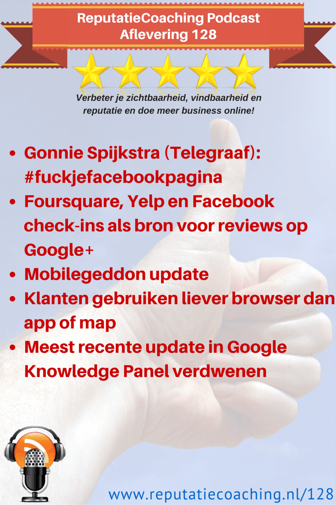
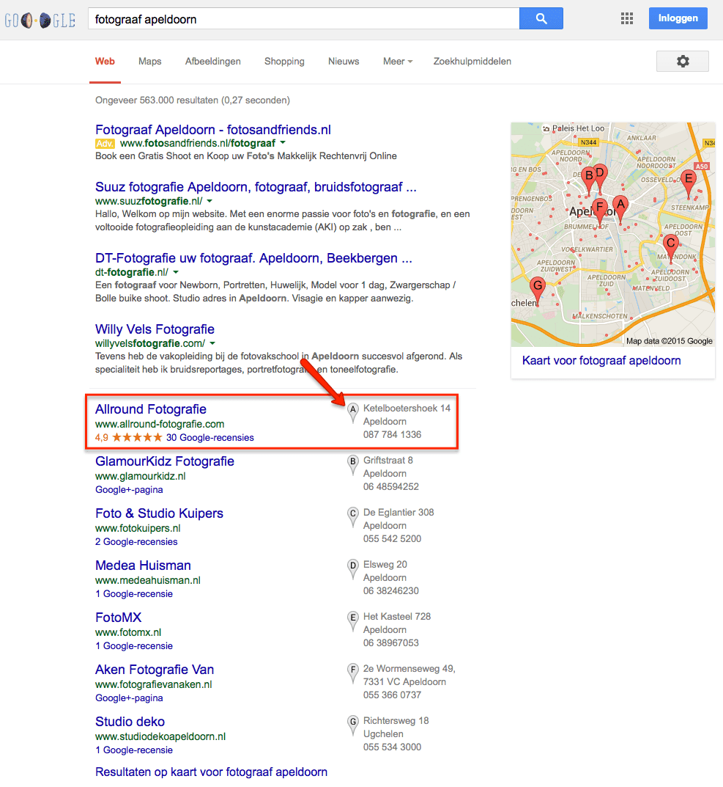
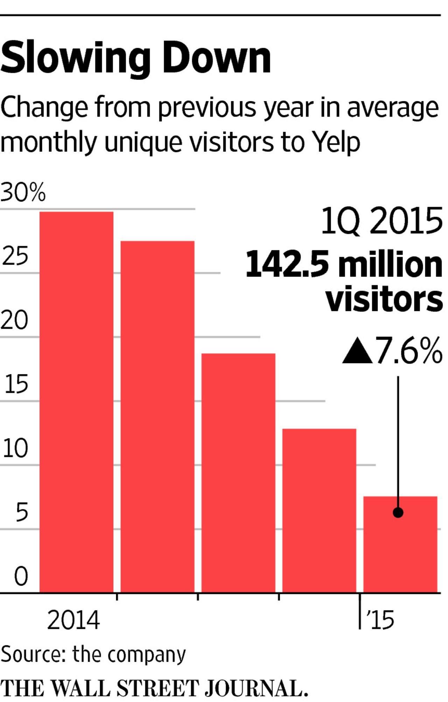
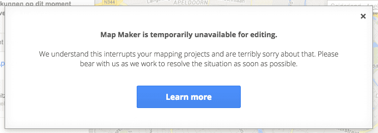
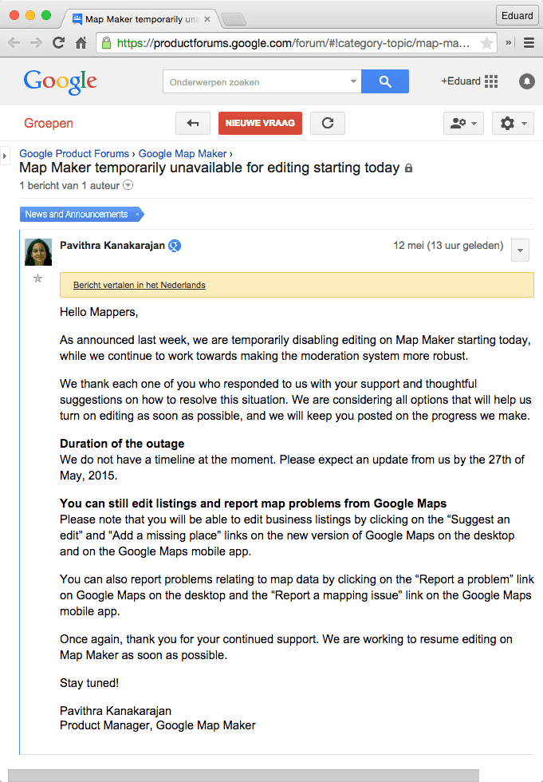
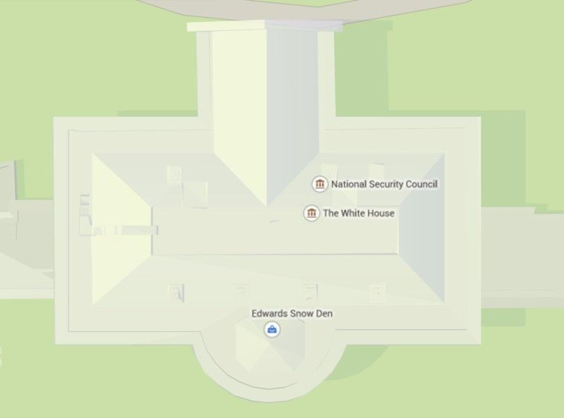
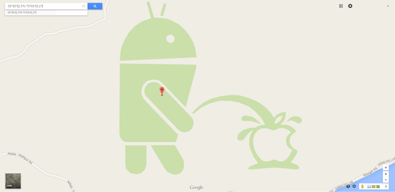
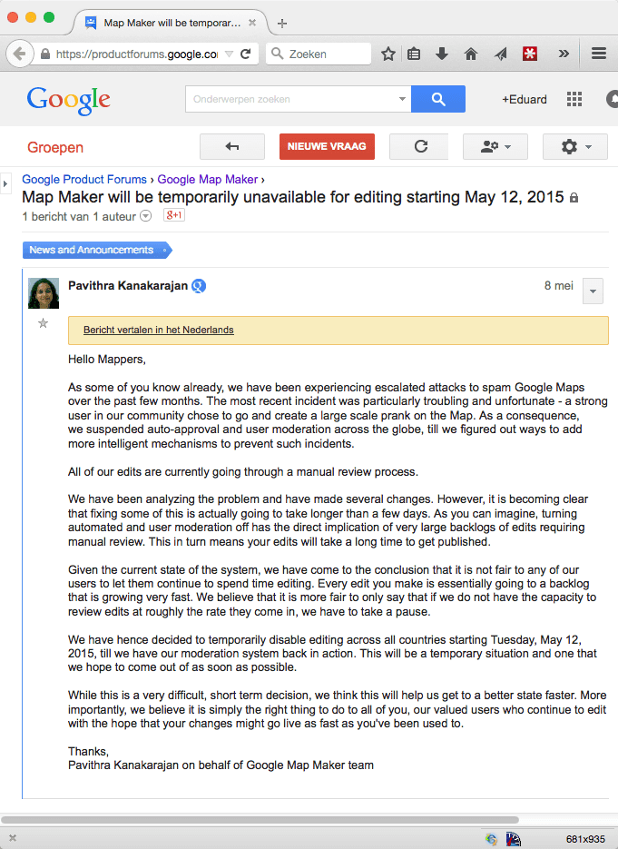
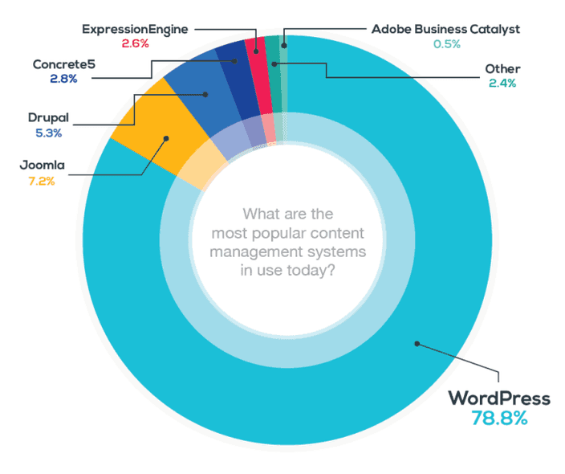
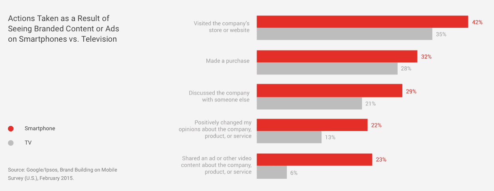

> **Historisch archief.** Deze aflevering verscheen op 14-05-2015 als onderdeel van ReputatieCoaching (2012–2016). De oorspronkelijke tekst is hieronder historisch bewaard. Diensten, contactgegevens, links, tools en adviezen kunnen inmiddels verouderd zijn.



**Transcriptiestatus:** Volledige transcriptie uit het oorspronkelijke archief.

**
Yelp, Foursquare en Nokia Here staan in de etalage en er zijn potentiële kopers! Dat is wat: drie lokaal-georiënteerde bedrijven in de verkoop! Daarover zometeen meer! Een andere lokale site, te weten Google MapMaker heeft tijdelijk haar deuren gesloten.**

**Je wist het mogelijk al, maar WordPress is echt veruit het meest populaire Content Management Systeem! Meer dan 78% van alle website eigenaren gebruikt WordPress!**

**Zoals beloofd heb ik een handleiding gemaakt voor het installeren en configureren van BackWPup voor het maken van backups op Dropbox.**

**Als je Twitter gebruikt, dan zie jij ze wellicht ook vaak binnenkomen… Al die Twitter status e-mail updates! Ik vind dat hinderlijk, dus ik vertel je hoe je daar vanaf kunt komen. Om dat nog beter te illustreren heb ik ook een instructievideo voor je gemaakt.**

**Video views worden vaak gebruikt om het engagement (ofwel “de betrokkenheid) en de populairiteit van video’s en videoplatformen te meten. Maar is dat wel een goede maatstaf? Daar duik ik aan het einde van de podcast in.**

Hallo en hartelijk welkom bij deze aflevering van de ReputatieCoaching Podcast. Ik ben Eduard de Boer, ReputatieCoach. Dit is dé podcast die jou helpt om meer business te genereren, doordat jouw website beter gevonden wordt, zowel lokaal als landelijk en doordat ik je uitleg hoe je je online reputatie kunt verbeteren. Dit alles helpt je om je bedrijf en jezelf beter op de online kaart te plaatsen.

De podcast van vandaag kun je vinden op [www.reputatiecoaching.nl/128](https://web.archive.org/web/20150605073613/http://www.reputatiecoaching.nl/128/). Daar vind je niet alleen de tekst, maar ook video’s waar ik het in deze uitzending over heb, alsmede afbeeldingen, links enzovoorts. Bovendien is de podcast te beluisteren in iTunes, op Stitcher en ook op [TuneIn Radio](http://tunein.com/radio/ReputatieCoaching-Podcast-p655084/). Ik raad je aan om je op één van die drie kanalen te abonneren op de podcast, zodat je geen aflevering hoeft te missen!

## Verandering in Google lokale resultaten? Update doorgevoerd?

Het kan aan mij liggen, maar ik heb de afgelopen anderhalf tot twee weken enorme fluctuaties gezien in de lokale zoekresultaten. Heb jij er iets van gemerkt? Controleer jij af en toe de positie van jouw bedrijf of die van opdrachtgevers van jou in de lokale resultaten? Heb jij die bedrijfsvermeldingen ook ontzettend zien schommelen?

Om te beginnen werden lange tijd geen lokale resultaten vertoond, als je zocht op de zoekterm “fotograaf apeldoorn”. Daarentegen werden ze wèl zichtbaar, als je zocht op de zoekterm “fotograaf in apeldoorn”, dus met het woordje “in” erbij.

Tot zo’n drie à vier weken geleden schommelde Allround Fotografie heen en weer tussen de “B” en de “C”-positie. De vermelding stond vaker op “C”, dan op “B”. Opeens verdween de vermelding van Allround Fotografie helemaal uit de lokale resultaten. Ik had volgens mij niets bijzonders veranderd of gedaan. Dus ik verbaasde mij erover en vroeg me af wat er aan de hand was. Het bleek dat de lokale vermelding nog wel gewoon bestond.

Opeens kwam de vermelding een paar dagen geleden binnen op “E” en nu staat die sinds gisteren op “B” voor de zoekterm “fotograaf in apeldoorn”. Grappig genoeg worden nu opeens op de zoekterm “fotograaf apeldoorn” wèl de zeven lokale resultaten vertoond! En raad eens? Allround Fotografie staat voor die zoekterm nu na heel lange tijd op de “A”-positie!

[](https://lh5.googleusercontent.com/-OLMdY240sF8/VVOD6Au87hI/AAAAAAAACLo/w4qtuaq5Jik/w700-h761-no/20150313-AllroundFotografie-op-A.png)

Dat zie ik zowel op mobiel, als op desktop en het maakt niet uit of ik in een incognitovenster zoek, of in een gewoon venster. Ook het al of niet ingelogd zijn in Google+ verandert niets aan de posities in de lokale vermeldingen.

Het heeft lange tijd geduurd, tot Allround Fotografie kon doordringen tot deze “A”-positie. Mijn gevoel zegt dat dit kan komen doordat heel veel fotografen op hun website schrijven dat zij “allround fotograaf” zijn of dat zij goed zijn in “allround fotografie”. Dat is natuurlijk ook een andere omschrijving om te zeggen dat ze veelzijdig zijn en vrijwel elke vorm van fotografie beheersen. Als ze dan ook nog eens het adres van hun bedrijf op hun site zetten, dan wordt op die manier feitelijk een inconsistente citation gecreëerd: het woord “allround fotografie” met een heel ander adres dan het onze.

Ik denk echt dat dat de oorzaak was, waarom ik Allround Fotografie maar niet naar de top kon krijgen, terwijl ik alle andere lokale bedrijven probleemloos binnen afzienbare tijd naar de “A”-positie kon helpen.

Dus feitelijk heb ik mogelijk ooit in 2007 of zo de verkeerde naam gekozen, als je puur kijkt naar de mogelijkheid om te ranken in de lokale resultaten. Of dat zo blijft, zal de toekomst uitwijzen. Ik houd de positie nauwlettend in de gaten.

Naast de stijging van Allround Fotografie in de lokale zoekresultaten heb ik veel meer veranderingen in de lokale resultaten waargenomen. Is jou iets bijzonder opgevallen? Daar ben ik benieuwd naar! Laat het me weten als jij iets hebt gezien en stuur een berichtje met je bevindingen.

Laat ik dan nu overgaan op de onderwerpen voor vandaag…

## Yelp, Foursquare en Nokia Here in de verkoop

Yelp heeft de afgelopen jaren een enorme groei doorgemaakt. Maar inmiddels vlakt de groei af en mogelijk is langzamerhand het plafond voor Yelp bereikt.

[](https://lh6.googleusercontent.com/-uLVw2L-RH-8/VVOD6fKw8dI/AAAAAAAACKw/vadM_4wdCRo/w486-h761-no/20150508-WSJ-daling-groei-yelp.jpg)

De Wall Street Journal maakte vorige week bekend dat Yelp daarom wellicht op zoek is naar een koper. De oorzaak kan ook zijn dat investeerders in Yelp eind vorige maand teleurgesteld zijn in de resultaten over het eerste kwartaal van 2015.

Ooit heeft Google nog een bod van US$500 miljoen gedaan op Yelp, maar inmiddels is het bedrijf meer dan US$3 miljard waard.

Voor welke partijen zou Yelp een interessante aanschaf zijn? Ten eerste natuurlijk Google, die een tijd geleden ook al Waze opkocht, onder het motto: “If you can’t beat them, buy them!”. Verder zijn natuurlijk Facebook en Microsoft met Bing Local potentiële kopers, evenals Yahoo, dat al een integratie heeft met Yelp.

Een andere, uitermate rijke partij die ook ontzettend veel belangstelling zou kunnen hebben voor Yelp, is Apple. Want Apple kaarten is ooit begonnen met gegevens te gebruiken van Yelp en reviews van Yelp te tonen in de “Kaarten” apps. Nog steeds worden in de “Kaarten” app de reviews van Yelp vertoond, behalve voor hotels en restaurants. Ik kan me niet voorstellen dat Apple het laat gebeuren dat een partij Yelp koopt en Apple al deze reviews kwijtraakt!

Andere kapers op de kust zouden nog bijvoorbeeld Priceline, de eigenaar van Booking.com, Expedia, TripAdvisor en mogelijk ook Zoover kunnen zijn.

Met andere woorden: Yelp zit nu in de luxepositie dat het een groot aantal potentiële kopers tegen elkaar kan uitspelen om zo het onderste uit de kan te halen. We wachten af.

In de tussentijd gaat nu sinds een week of vier het gerucht dat Yahoo voor US$900 miljoen Foursquare wil kopen. Dat het vooralsnog een gerucht is, blijkt wel uit de tegenstellingen in beweringen. De ene partij zegt dat de deal bijna rond is, terwijl je elders leest dat er niet eens sprake is van een overleg tussen beide partijen.

En daar houdt het nog niet mee op. Want volgens een ander gerucht heeft Uber vorige week een bod van US$ 3 miljard gedaan op Nokia Here. Het gaat namelijk niet goed met Nokia Here. Zo heeft het bedrijf onder andere niet de financiële middelen om haar kaarten actueel te houden. In [podcast 41](https://web.archive.org/web/20150312093149/http://www.reputatiecoaching.nl/41/) schreef ik al dat Nokia zo’n US$ 1 miljard per jaar verlies lijdt op “Here”.

De kaarten die vroeger bekend waren onder de naam “NavTeq” zijn uitermate interessant voor Uber, dat inmiddels niet alleen maar taxivervoer biedt, maar meer en meer een logisitieke onderneming wordt. Haar doel is zowel mensen als dingen zo snel mogelijk te bezorgen in diverse steden in de wereld. En daar heb je navigatie voor nodig!

Uber maakt op dit moment voornamelijk gebruik van Google Maps en zou dus mogelijk graag een eigen kaarten- en navigatiesysteem hebben.

Maar ook de drie grote Duitse autofabrikanten BMW, Audi en Mercedes-Benz hebben interesse. Volgens welingelichte bronnen werken zijn daarvoor samen met de Chinese zoekmachine Baidu. Ik kan me inderdaad goed voorstellen dat Baidu ook interesse heeft in een eigen kaartendatabase in combinatie met navigatiesoftware voor China. Wanneer dit consortium Nokia Here koopt, kan het navigatielandschap in Europa mogelijk aardig veranderen. Zo zal TomTom door deze actie een aanzienlijk marktaandeel verliezen, hetgeen wel eens de nekslag kan betekenen, waardoor TomTom failliet gaat of zelf ook overgenomen wordt.

Tenslotte schijnt er ook nog een andere partij een bod te hebben uitgebracht. Maar die partij wil anoniem blijven.

Zoals het er nu naar uitziet, maakt Nokia het resultaat van de verkoop eind mei openbaar. Zodra de koper bekend wordt, laat ik je het weten.

## Google MapMaker tijdelijk gesloten

Nog meer nieuws over kaarten, navigatie en lokale bedrijven: sinds eergisteren heeft Google tijdelijk de toegang tot Google MapMaker dichtgezet: je kunt nu nog wel gegevens raadplegen, maar er worden geen wijzigingen meer geaccepteerd. In de show notes heb ik de afbeelding van het venster opgenomen dat je te zien krijgt, als je naar google.com/mapmaker gaat:

[](https://lh3.googleusercontent.com/-81veCKEObxU/VVOD9NDKUlI/AAAAAAAACLY/NSKNPS-rvSg/w741-h261-no/20150512-MapMaker-closed.png)

In dat window staat een link. Als je daarop klikt, wordt je doorgeleid naar het Google Product Forum voor MapMaker

[](https://lh4.googleusercontent.com/-TlA7kMIYvVk/VVOD7JKhCOI/AAAAAAAACLA/cElI1xRLr8Q/w529-h761-no/20150512-MapMaker-closed-toelichting.png)

Ik heb even vertaald wat je daar kunt lezen:

Zoals vorige week aangekondigd, hebben we het doorvoeren van wijzigingen in Map Maker per vandaag tijdelijk uitgeschakeld, terwijl we eraan werken om het systeem robuuster te maken.

We bedanken iedereen die heeft gereageerd met steunbetuigingen en suggesties over hoe we deze situatie kunnen oplossen. We overwegen alle opties die ons helpen het bewerken van data weer zo snel mogelijk in te schakelen en we houden je op de hoogte van onze voortgang.

We hebben op dit moment geen tijdlijn. Je kunt op 27 mei 2015 een update verwachten.

Besef dat je nog steeds bedrijfsvermeldingen kunt aanpassen door in de nieuwe versie van Google Maps te klikken op “Een bewerking voorstellen” en om via “Een probleem melden” een ontbrekende plaats toe te voegen, zowel in de desktop versie, als in de mobiele app.

Je kunt in Google Maps ook problemen doorgeven door op de “Een probleem melden”-link te klikken in de desktopversie, alsmede in de mobiele app.

Nogmaals bedankt voor jullie niet-aflatende steun. We zijn hard bezig om het bewerken in MapMaker zo snel mogelijk open te stellen.

Deze post is van Pavithra Kanakarajan, de productmanager van Google Map Maker. Aanleiding hiervoor is dat er teveel gaten zaten in MapMaker. Zo was laatst te zien op Google Maps dat Edward Snowden was gevestigd in een vleugel van het Witte Huis:

[](https://lh3.googleusercontent.com/-JUpHYhNCQAw/VVOD8jUlMQI/AAAAAAAACLk/Hkex-I5pxgE/w800-h593-no/20150514-Snowden-WhiteHouse.jpg)

En een andere hack die snel wereldwijd bekendheid kreeg, was het plaatje op de kaart van een Android die urineerde op een appeltje:

[](https://lh6.googleusercontent.com/-EcN2ZyrKu7s/VVOD9UxHwKI/AAAAAAAACL0/C7RRcYB0zD0/w780-h380-no/20150514-Android-pee-Apple.png)

Dat heeft teveel vragen opgeworpen over de beveiliging van, en de processen rondom het gebruik van MapMaker, waardoor de druk op Google om dit te repareren vanuit verschillende kanten flink zal zijn opgevoerd.

Pavithra Kanakarajan waar ik het zojuist over had schreef op 8 mei, dus vier dagen voor het sluiten van MapMaker het volgende:

[](https://lh6.googleusercontent.com/-R8t5g6oyXEw/VVOD67SLiLI/AAAAAAAACK8/aBY3_WeL2-A/w681-no/20150512-MapMaker-closed-aankondiging.png)

Hallo Mappers,

Zoals sommigen van jullie weten hebben we de afgelopen maanden een aantal aanvallen op Google Maps gehad. Het meest recente incident was door een belangrijke gebruiker die onze community verliet, die een grootschalige misselijke grap op de kaart heeft uitgehaald. Als gevolg hiervan hebben we tijdelijk de automatische goedkeuring en gebruikerswijzigingen wereldwijd uitgeschakeld, totdat we intelligente mechanismen hebben geïmplementeerd, om dit soort incidenten te voorkomen.

Alle edits gaan op dit moment door een handmatig review proces.

We hebben het probleem geanalyseerd en enkele wijzigingen bedacht. Het is echter duidelijk geworden dat de implementatie van deze wijzigingen meer tijd kost dan een paar dagen. Zoals je je kunt voorstellen heeft dit alles tot gevolg dat er grote vertraging en achterstand ontstaat in het handmatige goedkeuringsproces. Dit leidt vervolgens tot vertraging in het publiceren van wijzigingen.

Gegeven de huidige staat van het systeem, zijn we tot de conclusie gekomen dat het niet fair is naar onze gebruikers om hen tijd te laten verdoen in het aanbrengen van wijzigingen. Door iedere aanpassing groeit het backlog… En dat groeit snel! Wij vinden dat het eerlijker is om te zeggen dat we niet de capaciteit hebben om de edits die binnenkomen per direct te reviewen: we moeten een pauze inlassen.

We hebben daarom besloten om tijdelijk het aanbrengen van veranderingen uit te schakelen per 12 mei 2015, tot we ons moderatiesysteem goed operationeel hebben. Dit is een tijdelijke situatie, waarvan we hopen dat we er zo snel mogelijk uit komen.

Hoewel dit een moeilijke, kortetermijn beslissing is, denken wij dat het ons helpt om sneller met een betere oplossing te komen. En nog belangrijker: we geloven dat dit het enige juiste is, dat wij voor jullie, onze gewaardeerde gebruikers kunnen doen in de hoop dat jullie wijzigingen straks weer zo snel live komen als jullie gewend waren.

Tot zover de update over MapMaker. Helaas kun je het op dit moment dus tijdelijk niet gebruiken. Ik vond het enorm handig om vaak snel even een Google+ pagina voor een bedrijf te creëren, door het bedrijf op Google MapMaker te plaatsen. Maar goed, zoals het er nu naar uitziet is het tijdelijk.

## WordPress veruit het populairste blogging platform

Uit onderzoek door CodeGuard, een website back-up and monitoring service, is WordPress veruit het meest gebruikte CMS of Content Management Systeem. Het bedrijf heeft gekeken naar 250.000 websites van het midden- en kleinbedrijf. Daaruit kwamen de volgende statistieken over CMS’en naar voren:

[](https://lh5.googleusercontent.com/-EbyYA2ZZrM8/VVOD9gD5zbI/AAAAAAAACLs/uLaoIXRUHCE/w704-h590-no/20150514-marktaandeel-wordpress.png)

```
  * WordPress wordt gebruikt door 78,8% van alle websites
  * Joomla staat op de tweede plaats met een marktaandeel van 7,2%
  * Drupal volgt met 5,3%
  * Connect5 draait op 2,8% van alle websites
  * 2,6% van de websites gebruikt ExpressionEngine
  * De penetratie van Adobe Business Catalyst bedraagt een magere 0,5%
  * De resterende 2,4% is niet nader gespecificeerd
```

Verder bleek dat Akismet de meest geïnstalleerde plugin is en Avada het meest gebruikte thema of template. Ook bleek dat 51% van de websites nog niet mobielvriendelijk was.

De groei van WordPress neemt alleen maar toe. Als je nu bezig bent met het vernieuwen van je site, bijvoorbeeld omdat je ’m mobielvriendelijk wilt maken, dan raad ik je toch echt aan om serieus naar WordPress te kijken, want 78% van de markt is je namelijk al voorgegaan!

Een belangrijk voordeel van zo’n groot marktaandeel is onder andere dat er veel mensen mee bezig zijn en bugs en problemen heel snel worden gedetecteerd en nog sneller worden opgelost. Daardoor loop je hoogstwaarschijnlijk minder risico dan met een CMS dat maar door een handjevol webmasters wordt gebruikt.

## Installeren en Configureren BackWPup met Dropbox

Ik heb het al vaker gehad over “BackWPup”, de WordPress plugin die ik graag gebruik voor het maken van WordPress backups. Voortbordurend op het topic over het “Eigen baas zijn over je data en infrastructuur” in [podcast 127](https://web.archive.org/web/20190822072212/https://www.reputatiecoaching.nl/127/) van vorige week, heb ik inmiddels een handleiding opgesteld en ben ik een instructievideo aan het maken over het installeren en configureren van BackWPup voor automatische backups naar Dropbox.

De handleiding is inmiddels gereviewd en op een haar na gevild, terwijl de video ook bijna gereed is. Ik verwacht dat beide nog deze week definitief worden, waarna ik de handleiding en de video zal sturen naar de abonnees van de mailinglist.

Wil jij ook snel beginnen met het maken van backups van je WordPress installatie, [abonneer je dan NU op de exclusieve mailinglist](https://web.archive.org/web/20140525211114/http://www.reputatiecoaching.nl:80/nieuwsbrief/), waarin ik waardevolle tips met je deel!

## Uitschrijven Twitter e-mail updates


Gebruik jij Twitter? Ontvang jij ook steeds van die status e-mails met aanbevelingen van tweeps die je moet volgen et cetera? Ik vind dat vervelend en zie dat als bandbreedtevervuiling en spam in mijn inbox. Voor de meeste van dit soort mails heb ik filters in Gmail gedefinieerd, waardoor die berichten in elk geval niet in mijn inbox terechtkomen, maar meteen in een aparte Twitter-folder. Zo kan ik mijn aandacht houden op de mails die wèl relevant zijn en waar ik echt iets mee moet.

Desalniettemin scan in dagelijks de diverse social media folders, waarvan de Twitter-folder er dus eentje is. En omdat meer dan 15 Twitter-accounts heb, c.q. beheer, ontvang ik ontzettend veel van dit soort voor mij irrelevante en dus ongewenste update e-mails.

Ik begon me er dermate aan te ergeren dat ik meteen stuk voor stuk alle Twitter accounts ben nagelopen en overal de e-mail instellingen heb aangepast. Daardoor is het nu een stuk rustiger in mijn Twitter-folder. Mail die ik anders toch meteen ongelezen zou verwijderen wordt nu dus niet eens verstuurd en die zie ik dus helemaal niet meer!

Voor het geval jij deze mails ook eigenlijk helemaal niet wilt ontvangen en als je wilt weten hoe je je kunt uitschrijven voor al deze mails moet je even de instructievideo bekijken, die ik in de show notes heb opgenomen:

Oh, verder heb ik een drietal Twitter-accounts verwijderd, waar ik al een paar jaar niets meer mee deed en waar ik van verwachtte dat ik die ook nooit meer nodig zou hebben. Dat schoont weer lekker op!

Het is tenslotte voorjaar, dus een voorjaarsschoonmaak van de mailinglijsten, social media accounts en dergelijke is wel op zijn plaats. Ik zit nu ook weer in de modus waarin ik alle automatisch binnenkomende mails onder de loupe neem en per stuk een besluit neem, of ik die nog wil blijven ontvangen of niet.

## Over video: wat is een “view”? Hoe meet je video engagement?

Video wordt steeds belangrijker, dat is een feit. Het gaat inmiddels zover dat een bedrijf als Volvo haar advertentiebudgetten drastisch aan het veranderen is. Zo geeft de Zweedse auto- en vrachtwagenbouwer nu drie keer meer geld uit aan niet-traditionele (lees: digitale) reclame. Verder doet Volvo niet meer mee aan beurzen, zet minder in op televisie en schrapt bijna alle vormen van sponsoring. Op de Ocean Race na. Het grootste deel van het reclamebudget van Volvo gaat naar… Je raadt het al: YouTube video’s!

Eergisteren bestond YouTube exact 10 jaar. Maar wie had tien jaar geleden een dergelijke kentering verwacht? Wie had in 2005 kunnen bedenken dat een gevestigd bedrijf als Volvo niet meer naar beurzen zou gaan, minder zou adverteren in traditionele media en nagenoeg niets meer zou sponsoren?

Ik denk niemand! Ik hoorde eergisteren ook op televisie dat op dit moment elke minuut maar liefst 300 uur video naar YouTube wordt geüpload. Iets meer dan een jaar geleden was dat nog “maar” 100 uur per minuut.

Maar YouTube is niet meer de enige videogigant! Sterker nog, als je kijkt naar het aantal “views”, dan komt Facebook inmiddels dicht bij YouTube. Vorige maand las ik in een artikel op MarketingLand dat Facebook op dit moment maar liefst meer dan 4 miljard video views per dag heeft!

Toegegeven, YouTube meldde dit aantal al te hebben bereikt in januari 2012 en ook zal het inmiddels wel meer bekeken video’s per dag hebben. Toch wordt Facebook een belangrijke speler.

Je moet hierbij echter een paar zaken niet uit het oog verliezen. Ten eerste zijn alle video’s op Facebook voorzien “autoplay”. Dat betekent dat zij automatisch beginnen met afspelen, zodra ze in de tijdlijn zichtbaar zijn. Video’s die je daarentegen van YouTube embed op je website zijn niet standaard autoplay.

En dat is niet de enige factor die het beeld vertroebelt. Zo wordt de “engagement” (dat is een mooi Engels woord voor “betrokkenheid”) van video’s nog steeds vaak gemeten aan de hand van views. Facebook en Instagram registreren een view, als iemand tenminste drie seconden een video heeft bekeken. Bij YouTube ligt deze grens rond de 30 seconden. Dus als iemand op Facebook traag door zijn of haar tijdlijn scrollt en een video maar 3 seconden draait, terwijl de persoon helemaal niet heeft gekeken, wordt dit geteld als een “view”.

En in deze tijd waarin meer en meer wordt geadverteerd op online videoplatformen maken diverse gezaghebbende organisaties het nóg complexer. Zij definiëren vervolgens een video advertentie als “gezien” wanneer tenminste 50% van de pixels van de advertentie gedurende 2 aaneengesloten seconden zichtbaar waren.

Dat maakt het langzamerhand volslagen onduidelijk en voordat je het weet ga je appels met peren vergelijken!

Het aantal views van een video is eigenlijk niet zo’n goede grootheid. Je zou een veel beter en eerlijker beeld krijgen van de betrokkenheid als je kijkt naar de totale tijd dat iemand een video heeft bekeken. Dat geeft namelijk beter en nauwkeuriger aan of de persoon daadwerkelijk geïnteresseerd, oftewel “engaged”, was. Want als iemand een video van 10 minuten slechts 20 seconden kijkt heeft dat minder waarde, dan dat iemand 8 of 9 minuten van dezelfde video bekijkt.

## “Video’s cruciaal voor mobile marketing” (volgens Google)

Bij uitspraken over het belang van video door Google moet je een beetje uitkijken, want YouTube is natuurlijk eigendom van Google. Dus het gehalte “prediken voor eigen parochie” kan hier wat hoger liggen dan dat een onafhankelijk orgaan dit beweert.

Toch wil ik even inzoomen op het rapport “[Why Online Video Is a Must-Have for Your Mobile Marketing Strategy](https://www.thinkwithgoogle.com/features/online-video-mobile-marketing-strategy.html) ”, dat vorige maand door Google is gepubliceerd. Daarvoor geef ik je een paar statistieken van mobile video:

```
  * 50% van alle bekeken video’s op YouTube wordt op mobiele apparaten bekeken.
  * Mensen zijn 2x meer gefocussed op een online video die ze op een mobiel apparaat bekijken, dan dat ze naar televisie kijken.
  * Mensen die advertenties zien op een mobiel apparaat voelen zich er meer en persoonlijker toe aangetrokken, waardoor de kans op delen van de advertentie groter is dan bij mensen die naar een video op een desktop kijken.
  * 75% van de smartphone kijkers wil de mogelijkheid hebben een advertentie over te slaan of te “skippen”.
  * Meer en meer consumenten beginnen hun zoektocht naar nieuwe informatie het eerst met video. Meer dan 50% van de geïnterviewden gaven aan dat video hen heeft geholpen bij het nemen van aankoopbeslissingen. En YouTube is de nummer 1 videosite voor deze mobiele gebruikers.
  * Unboxing en How-To video’s worden gezien als de meest essentiële videocontent hiervoor, omdat het consumenten een gevoel geeft hoe het is om het product te bezitten.
  * 91% van de smartphone gebruikers (voornamelijk de Millennials) raadplegen hun smartphone voor ideeën, als ze iets (bijna) onbekends moeten doen.
  * Vergeleken met desktopkijkers is de kans groter dat mobiele videokijkers:

    * Een winkel of website bezoeken
    * Een aankoop doen
    * Het bedrijf reviewen
    * Hun mening over een bedrijf aanpassen
    * Content delen
```

In de show notes die je kunt vinden op [www.reputatiecoaching.nl/128](https://web.archive.org/web/20150605073613/http://www.reputatiecoaching.nl/128/) heb ik een grafiek opgenomen waarin je de verschillen in genomen acties kunt zien, naar aanleiding van de vertoning van branded content of advertenties op smartphones en televisies.

[](https://lh3.googleusercontent.com/-ded29p8djQE/VVOD9b1-6II/AAAAAAAACLc/HcP0mwUTR1A/w1072-h416-no/20150514-google-mobile-video-stats.png)

Als je met deze kennis je voordeel wilt doen, houd dan de volgende punten in gedachten:

```
  * Identificeer de “Ik wil …”-momenten waarin consumenten een bepaalde behoefte hebben en jouw merk of bedrijf een rol kan spelen.
  * Vind deze mometen in je hele klanten journey en maak ze het middelpunt van je strategie.
  * Wat zijn de vragen en concerns die de mensen hebben in relatie tot jouw producten en diensten?
  * Creëer “Ik wil …” content voor je website en je YouTube kanaal om je prospects de relevante informatie te geven.
  * Zorg ervoor dat je video’s eenvoudig te vinden zijn: voeg relevante en beschrijvende titels toe, een goede, heldere omschrijving en overige details, voorzie de video van annotaties en infokaarten en voeg natuurlijk ook de relevante tags toe.
```

Ik heb een tijd geleden voor een opdrachtgever een handleiding voor het hoog laten ranken van YouTube video’s in de zoekresultaten geschreven. Die zal ik binnenkort eens onderhanden nemen, actualiseren en dan delen met de mensen die geabonneerd zijn op mijn exclusieve “behind the scenes” tips. Heb jij je nog niet ingeschreven, [schrijf je dan NU in](https://web.archive.org/web/20140525211114/http://www.reputatiecoaching.nl:80/nieuwsbrief/) en mis deze waardevolle tips niet!

Ik weet het, het waren veel losse kleinere topics dit keer, in tegenstelling tot de [podcast van vorige week](https://web.archive.org/web/20190822072212/https://www.reputatiecoaching.nl/127/). Door deze afwisseling in aantal, diepgang en lengte hoop ik dat er telkens voor jou wat bij zit, waar jij iets van opsteekt of je voordeel mee kunt doen!

Dus als je de podcast leuk vindt en je wilt nog meer op de hoogte blijven, volg me dan ook op Twitter, via [@reputatiecoach1](https://twitter.com/reputatiecoach1).

Heb je inderdaad wat aan alle informatie die ik met je deel, help mij dan met het verder verbeteren en promoten van deze podcast. Abonneer je op de podcast, zodat je altijd meteen de nieuwste uitzending krijgt voorgeschoteld.

Zoek de podcast op, in iTunes of Stitcher, geef de podcast een sterrenbeoordeling en laat ook je reactie achter. Door de podcast te beoordelen op iTunes en/of Stitcher breng je de podcast onder de aandacht van een breder publiek.

Je kunt me verder helpen, door de podcast aan te bevelen bij vrienden of collega’s, waarvan je denkt dat ze er hun voordeel mee kunnen doen, of door ’m te delen op Twitter, like’n en delen op Facebook of een “+1” te geven op Google+.

En vergeet niet: ik ben hier om je te helpen! Als je een vraag of een probleem hebt met betrekking tot je online reputatie of de vindbaarheid van je website, kun je een mailtje sturen naar [podcast@reputatiecoaching.nl](mailto:podcast@reputatiecoaching.nl).

Als je dat te lastig vindt, of als je de podcast beluistert terwijl je in de auto zit en je hebt acuut een vraag, spreek dan een boodschap in op de ReputatieCoaching Hotline, op nummer: 084 - 883 15 56. Mogelijk behandel ik je vraag of probleem dan in een artikel of in de podcast.

En je kunt ook rechtstreeks op de website een voicemail achterlaten, door op de tab aan de rechterkant van elke pagina te klikken, en je bericht in te spreken. Dit was [ReputatieCoaching Podcast aflevering 128](https://web.archive.org/web/20150605073613/http://www.reputatiecoaching.nl/128/) en mijn naam is [Eduard de Boer](http://nl.linkedin.com/in/eduarddeboer/nl).

Ik wens je de komende week weer succes met het werken aan je reputatie, zodat je meteen je reputatie voor jou kunt laten werken!

Tot volgende week!

Doei!

Links naar content die in deze podcast aan bod komt:

```
  * ReputatieCoaching Podcast in iTunes
  * ReputatieCoaching Podcast op Stitcher
  * [ReputatieCoaching Podcast op TuneIn Radio](http://tunein.com/radio/ReputatieCoaching-Podcast-p655084/)
  * [ReputatieCoaching Podcast RSS-feed](https://web.archive.org/web/20150228235938/http://feeds.reputatiecoaching.nl:80/ReputatieCoachingPodcast)
```
