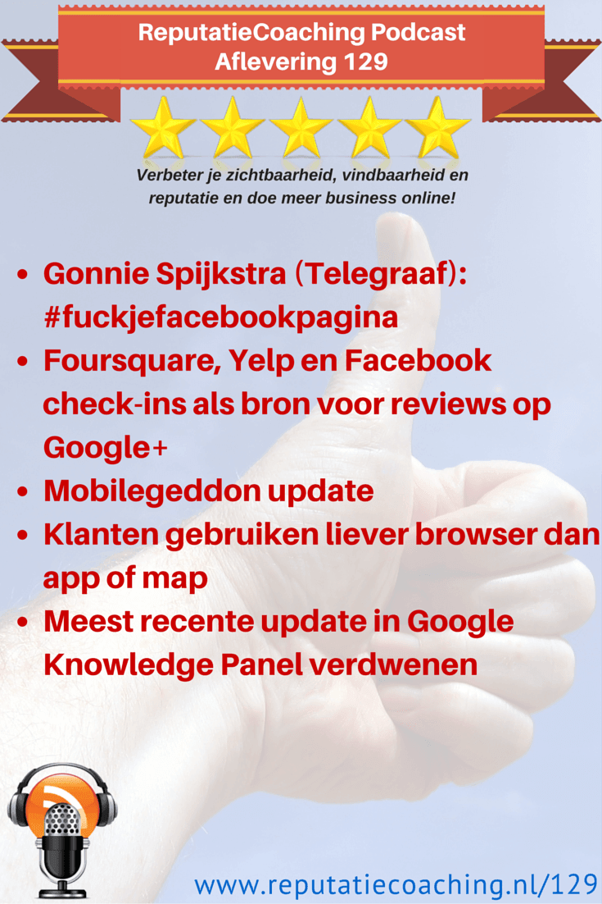
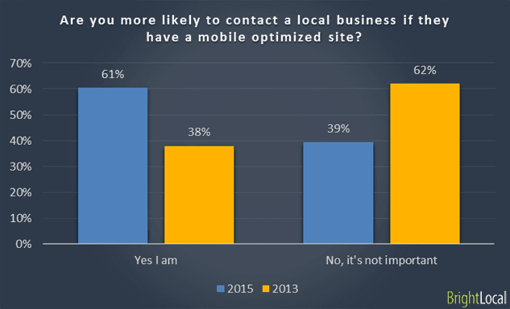

> **Historisch archief.** Deze aflevering verscheen op 21-05-2015 als onderdeel van ReputatieCoaching (2012–2016). De oorspronkelijke tekst is hieronder historisch bewaard. Diensten, contactgegevens, links, tools en adviezen kunnen inmiddels verouderd zijn.



**Transcriptiestatus:** Volledige transcriptie uit het oorspronkelijke archief.

**
Ben jij een Lokale Gids en post jij reviews bij lokale bedrijven op Google+? Kun jij je nog herinneren, waar je de afgelopen jaren ooit bent geweest, waar je een review over zou kunnen posten? Ik zat een beetje klem en kreeg een heldere ingeving die ik zo als eerste met je deel.**

**Vandaag is het 21 mei en zo’n maand geleden, op 21 april kwam Google met “Mobilegeddon”, de update die mobielvriendelijke sites voorrang zou geven boven websites die niet mobielvriendelijk zijn… Maar heeft deze update tot op heden veel impact gehad in Nederland of daarbuiten? Dat vertel ik je straks.**

**Na de hype van mobiele apps gebruiken mensen toch liever een mobiele webbrowser om bedrijfsgegevens op te zoeken. Dit en andere interessante mobiele statistieken heb ik online voor je opgeduikeld.**

**Helaas is de recente Google+ update uit het zogenaamde Knowledge Panel op Google verdwenen. Ik leg je uit wat dat betekent.**

**Als laatste topic van deze podcast heb ik de presentatie van Gonnie Spijkstra bij #SMC055 van afgelopen maandagavond, met als titel: “FUCK je Facebookpagina!”. Die presentatie duurt iets meer dan 21 minuten, dus je kunt je voorstellen dat deze podcast in zijn totaal dan ook iets langer zal duren dan dat je normaal van me gewend bent.**

Hallo en hartelijk welkom bij deze aflevering van de ReputatieCoaching Podcast. Ik ben Eduard de Boer, ReputatieCoach. Dit is dé podcast die jou helpt om meer business te genereren, doordat jouw website beter gevonden wordt, zowel lokaal als landelijk en doordat ik je uitleg hoe je je online reputatie kunt verbeteren. Dit alles helpt je om je bedrijf en jezelf beter op de online kaart te plaatsen.

De podcast kun je vinden op [www.reputatiecoaching.nl/129](https://www.reputatiecoaching.nl/129/). Daar vind je niet alleen de tekst, maar ook video’s waar ik het in deze uitzending over heb, alsmede afbeeldingen, links enzovoorts. Bovendien is de podcast te beluisteren in [iTunes](https://www.reputatiecoaching.nl/itunes), op [Stitcher](https://www.reputatiecoaching.nl/stitcher) en ook op [TuneIn Radio](http://tunein.com/radio/ReputatieCoaching-Podcast-p655084/). Ik raad je aan om je op één van die drie kanalen te abonneren op de podcast, zodat je geen aflevering hoeft te missen!

Eerst nog even een leuk berichtje dat ik gisteren ontving via LinkedIn, van Justo van Gessel:

Ik luister erg vaak naar jouw podcasts tijdens het hardlopen en ik vind ze zo interessant dat ik je ook graag via LinkedIn wilde volgen.
Dus bij deze hoop ik dat je mijn uitnodiging accepteert.

Met vriendelijke groeten,
Justo van Gessel

Natuurlijk accepteer ik je uitnodiging, Justo! Top dat je me via LinkedIn volgt en leuk om te horen dat je vaak naar de podcasts luistert tijdens het hardlopen. Moet ik er een continue beat voor je in mixen om je tempo erin te houden?

Laat ik dan nu overgaan op de onderwerpen voor vandaag…

## Foursquare, Yelp en Facebook check-ins als bron voor reviews op Google+

*Historische afbeelding niet beschikbaar: Google*
Ik heb je een paar maanden geleden verteld dat ik mij toen had aangemeld als Google Local Guide, oftewel een lokale gids. Dat is een programma van Google om mensen te enthousiasmeren en te stimuleren om reviews te posten over lokale bedrijven op Google+.

Dat ging prima! Ik stapte in op Niveau 2 van 4 en na een tijdje promoveerde ik naar Niveau 3, omdat ik toen het aantal van 50 geposte reviews passeerde.

*Historische afbeelding niet beschikbaar: Foursquare*
Nu kom ik niet dagelijks in verschillende winkels of bij diverse zorgverleners of andere lokale bedrijven. Ook probeerde ik mij allerhande lokale bedrijven te herinneren, waar ik ooit was geweest om daar een review bij te posten. Echter, op een gegeven moment kon ik me geen lokale bedrijven meer herinneren, waar ik alsnog een review zou kunnen posten. Dat was nadat ik zo’n 70 reviews had gepost, zo’n drie weken geleden.

Terwijl ik deze podcast maak zit ik alweer op 126 geposte reviews: ik heb er nog 124 te gaan, voordat ik Niveau 4 bereik. En ik heb inmiddels weer helder op het netvlies, waar ik de afgelopen jaren ooit zoal ben geweest. Dat kwam niet, doordat ik opeens me alle bezochte winkels en dergelijke kon herinneren… Maar hoe dan wel??

*Historische afbeelding niet beschikbaar: Logo Yelp*
Je moet weten dat ik al een aantal jaren behoorlijk trouw overal waar ik kom, incheck in Foursquare. Voorheen was dat met de Foursquare app, maar tegenwoordig heet die app “Swarm”. Sinds 1 april 2014, sla ik alle Foursquare checkins ook automatisch op in een Google spreadsheet met behulp van IFTTT.com,

“IFTTT” staat voor “If This Then That”. Daarin heb ik een zogenaamd “recipe” ofwel “recept” gemaakt, dat automatisch de gegevens van elke check-in opslaat in een Google Spreadsheet, zodra ik incheck met Foursquare. Inmiddels staan er alweer 593 regels in de spreadsheet met check-ins van het afgelopen jaar. Logischerwijs zaten er veel duplicaten in, maar toch kreeg ik direct meer inspiratie voor wat betreft de locaties die ik in het afgelopen jaar had bezocht, waar ik dus reviews van kon posten.

Mijn Foursquare geschiedenis gaat een heel stuk verder terug. Dus kan ik voorlopig weer even vooruit. Ik heb een vast moment in mijn agenda gepland om gedurende een uurtje reviews te posten. Als jij actief bent op Foursquare, ga dan eens gewoon grasduinen in je check-ins om inspiratie op te doen…

Naast Foursquare gebruik ik ook Yelp om te pas en te onpas in te checken. Helaas kan ik op Yelp niet mijn historie van checkins terugkijken. Wat je wel kunt doen is kijken bij welke bedrijven jij op Yelp een review hebt gepost, of waarvoor je een tip hebt achtergelaten.

*Historische afbeelding niet beschikbaar: Bedrijfspagina maken op Facebook*
Maar het kan wel met behulp van Facebook! Zelf ben ik persoonlijk niet meer actief op Facebook, maar de kans is groot dat jij op locaties waar je ooit bent geweest, jezelf op Facebook hebt ingecheckt of deze locatie hebt ge-“Like’d”. Dat deed ik voorheen ook. Je vindt al je “Likes” door op je foto te klikken en dan in de horizontale menubalk onder “Meer” te klikken op “Vind ik leuk’s” en de plaatsen waar je bent geweest vind je onder het menuitem “Plaatsen”.

Door achter de URL van je persoonlijke Facebookprofiel respectievelijk de tekst “/likes” of “/map” toe te voegen, kom je hier ook. Doe hier je voordeel mee om terug te reizen in de tijd en weer helder voor de geest te krijgen, waar je ooit zoal bent geweest.

Samenvattend heb ik een paar tips voor je, als je meer reviews op Google+ wilt posten om zo hogerop te komen in de niveau’s:

1. Bepaal welke service je wilt gebruiken om je bezochte locaties bij te houden (Foursquare, Yelp, Facebook, Google+)
2. Ga vanaf nu beter registreren waar je zoal komt
3. Mocht je langs een locatie komen, waar je ooit in het verleden bent geweest, check dan even snel in, zodat je die locatie weliswaar op de verkeerde datum, maar in elk geval wèl geregistreerd hebt om later een review over te posten.

Op die manier ontlast je je geheugen en houd je voldoende inspiratie voor locaties om reviews over te posten.

## Mobilegeddon update

Het leek alsof de online wereld zou instorten per 21 april 2015… De mobielvriendelijke update van Google zou hier de oorzaak van zijn. Inmiddels is dat iets meer dan vier weken geleden en wat was het effect tot op heden? Ik heb eens gekeken in Google Analytics naar de statistieken (en dan met name naar het aantal bezoekers vanaf mobiel) van een site die nog niet mobielvriendelijk is.

Daar lijkt het aantal mobiele bezoekers met 26% gedaald ten opzichte van de vier weken ervoor: van 10.537 naar 7.732 unieke mobiele bezoekers. Deze daling kan toeval zijn, dus om dit enigszins te staven heb ik naar een paar voorgaande 4-wekelijkse perioden gekeken. Ook toen lag het aantal mobiele bezoekers zo rond de 10.000, dus er lijkt sprake van een daling.

Bijna alle sites die ik beheer zijn reeds mobielvriendelijk, dus daar zal ik geen daling kunnen waarnemen. Aan de andere kant heb ik ook niet echt een stijging van mobiel waargenomen, die zou kunnen zijn ontstaan doordat andere, niet-mobielvriendelijke sites in de organische zoekresultaten op mobiele apparaten zijn gedaald.

Mocht jouw site nog niet mobielvriendelijk zijn, heb jij er iets van gemerkt? Heb je al eens in je mobiele statistieken op Google Analytics gekeken? Wat heb jij waargenomen?

Ik monitor ook een aantal lokale zoektermen en tot op heden heb ik daar ook nog niet veel verandering in gezien, zelfs sites die niet mobielvriendelijk zijn, staan nog steeds op vrijwel dezelfde posities als voorheen. Soortgelijke berichten komen uit de rest van de wereld. Volgens sommigen komt dit, doordat veel bedrijven alsnog onder de druk van die onheilsdatum van 21 april 2015 hun website mobielvriendelijk hebben gemaakt.

Het kan ook zijn dat Google de weging of mate van ranking initieel laag heeft gehouden en die de komende tijd opschroeft. Dat lijkt in het verleden wel eens vaker gebeurd. Eerst is de impact gering en naarmate de tijd voortschrijdt, wordt het effect groter.

Dit zullen we over de komende maanden beter kunnen zien.

## Klanten gebruiken liever browser dan app of map

Een tijdlang moest je als bedrijf mee in de trend om een eigen app te hebben. Zonder je eigen ‘app’ telde je niet mee. Ook leek het erop dat je in elke directory-app of branche-specifieke app vermeld moest staan, wilde je volgens de sales reps niet ten onder gaan in het mobiele strijdgewoel.

Mogelijk was dat een tijdje het geval. Maar tegenwoordig liggen de kaarten anders. Zo vond ik in het artikel “[Survey: Consumers Prefer Mobile Browser To Apps For Local Information](http://searchengineland.com/survey-consumers-prefer-mobile-browser-to-apps-for-local-information-220962)” op Search Engine Land een paar leuke bevindingen van een onderzoek door BrightLocal, die ik graag met je deel.

Het onderzoek is uitgevoerd onder 900 Amerikaanse consumenten. Zoals altijd geldt voor buitenlandse onderzoeken is het een beetje de vraag of de resultaten ook representatief zijn voor Nederland, maar het is hoedanook leuk om eens doorheen te lopen.

Wat in elk geval interessant is om te vernemen is dat lokale bedrijven met een mobielvriendelijke site (met de juiste informatie) een overduidelijk voordeel hebben ten opzichte van mobielonvriendelijke sites. Maar liefst 61% van de geïnterviewden neemt liever contact op met een bedrijf met een mobielvriendelijke site. Overigens was dit in 2013 nog maar 39%. Dit is dus een significante stijging die we deels denk ik ook kunnen toeschrijven aan de enorme groei van het gebruik van mobiele apparaten in de afgelopen twee jaar.



Verder gebruikt 50% van de respondenten een mobiele browser, als ze op zoek zijn naar een lokaal bedrijf, 40% een mobiele kaarten-app en slechts 10% een andere mobiele app. Met andere woorden: als je een mobielvriendelijke website hebt die ook nog eens goed scoort in de lokale zoekresultaten, alsmede in de mobiele kaarten-apps, dan is dat voor je vindbaarheid en het aantal nieuwe bezoekers 9x belangrijker dan dat je ofwel je eigen mobiele app hebt, of in een relatief onbekende mobiele directory-app staat.

Maar welke informatie vinden de mensen dan het belangrijkst, als ze je website op hun mobiel bekijken? Zijn het foto’s, reviews, de openingstijden? Welnu, die verdeling is als volgt:

```
  * Het fysieke adres scoort 52%
  * Een kaart en routebeschrijving scoort 47%
  * Openingstijden 44%
  * Telefoonnummer 37%
```

Voor de overige gegevens verwijs ik je graag naar het plaatje in de show notes, op [www.reputatiecoaching.nl/129](https://www.reputatiecoaching.nl/129/):


De vraag blijft natuurlijk of je al deze bevindingen mag combineren en gebruikers per se de juiste gegevens willen raadplegen op de mobielvriendelijke website, of dat het hen gewoon gaat over de relevante en actuele gegevens. Want met de marktpenetratie van Google als zoekmachine in Nederland en in veel andere landen in Europa is dit namelijk ook 1:1 af te beelden op Google.

## Meest recente update in Google Knowledge Panel verdwenen

Voor lokale ondernemers die actief waren op Google+, was het tot voor kort interessant om elke twee tot drie weken een update, liefst met foto of video, te posten op Google+. Want die update met de afbeelding of video werd gedurende die periode vertoond in het knowledge panel aan de rechterkant in de zoekresultaten. Dat gaf een extra stuk exposure en kon ertoe bijdragen dat meer mensen de lokale Google+ pagina of de bijbehorende bedrijfswebsite bezochten.

Maar helaas, sinds een paar dagen wordt de meest recente Google+ update niet meer vertoond. Als je enkel om deze reden eens per paar weken een update publiceerde op Google+, dan kun je er dus mee stoppen…

Aan de andere kant raad ik je juist aan om door te gaan, want je laat sowieso aan Google zien dat je bezig bent met je bedrijf, je communicatie, je marketing, je reviews et cetera. Dus laat deze wijziging voor jou geen showstopper zijn om niet meer te posten op Google+!

## @GonnieSpijkstra (Telegraaf): #fuckjefacebookpagina

*Historische afbeelding niet beschikbaar: #SMC055: Social Media Club Apeldoorn*
Afgelopen maandagavond was het weer de maandelijkse bijeenkomst van de Social Media Club Apeldoorn, bekend onder de naam #SMC055. Er werden twee presentaties gegeven.

Het spits werd afgebeten voor Mattijs Algra, community manager van Centraal Beheer, waarna Gonnie Spijkstra social media manager bij de Telegraaf een presentatie gaf met als titel “FUCK je Facebookpagina!”.

*Historische afbeelding niet beschikbaar: #fuckjefacebookpagina*
Daarin vertelde zij over hoe de Telegraaf inzet op de publicatie van content op haar eigen platform en nauwelijks op Facebook.

In deze podcast deel ik de audio van haar presentatie met je. Neem er gerust de tijd voor, want het verhaal van Gonnie Spijkstra duurt 21 minuten en 14 seconden…

En met deze presentatie van Gonnie Spijkstra kom ik dan weer aan het einde van deze podcast.

Als je de podcast leuk vindt en je wilt nog meer op de hoogte blijven, volg me dan ook op Twitter, via [@reputatiecoach1](https://twitter.com/reputatiecoach1).

Heb je inderdaad wat aan alle informatie die ik met je deel, help mij dan met het verder verbeteren en promoten van deze podcast. Abonneer je op de podcast, zodat je altijd meteen de nieuwste uitzending krijgt voorgeschoteld.

Zoek de podcast op, in [iTunes](https://www.reputatiecoaching.nl/itunes) of [Stitcher](https://www.reputatiecoaching.nl/stitcher), geef de podcast een sterrenbeoordeling en laat ook je reactie achter. Door de podcast te beoordelen op iTunes en/of Stitcher breng je de podcast onder de aandacht van een breder publiek.

Je kunt me verder helpen, door de podcast aan te bevelen bij vrienden of collega’s, waarvan je denkt dat ze er hun voordeel mee kunnen doen, of door ’m te delen op Twitter, like’n en delen op [Facebook](https://www.facebook.com/ReputatieCoaching) of een “+1” te geven op Google+.

En vergeet niet: ik ben hier om je te helpen! Als je een vraag of een probleem hebt met betrekking tot je online reputatie of de vindbaarheid van je website, kun je een mailtje sturen naar [podcast@reputatiecoaching.nl](mailto:podcast@reputatiecoaching.nl).

Als je dat te lastig vindt, of als je de podcast beluistert terwijl je in de auto zit en je hebt acuut een vraag, spreek dan een boodschap in op de ReputatieCoaching Hotline, op nummer: 084 - 883 15 56. Mogelijk behandel ik je vraag of probleem dan in een artikel of in de podcast.

En je kunt ook rechtstreeks op de website een voicemail achterlaten, door op de tab aan de rechterkant van elke pagina te klikken, en je bericht in te spreken. Dit was [ReputatieCoaching Podcast aflevering 129](https://www.reputatiecoaching.nl/129/) en mijn naam is [Eduard de Boer](http://nl.linkedin.com/in/eduarddeboer/nl).

Ik wens je de komende week weer succes met het werken aan je reputatie, zodat je meteen je reputatie voor jou kunt laten werken!

Tot volgende week!

Doei!

Links naar content die in deze podcast aan bod komt:

```
  * [ReputatieCoaching Podcast in iTunes](https://www.reputatiecoaching.nl/itunes)
  * [ReputatieCoaching Podcast op Stitcher](https://www.reputatiecoaching.nl/stitcher)
  * [ReputatieCoaching Podcast op TuneIn Radio](http://tunein.com/radio/ReputatieCoaching-Podcast-p655084/)
  * [ReputatieCoaching Podcast RSS-feed](https://feeds.reputatiecoaching.nl/ReputatieCoachingPodcast)
```
