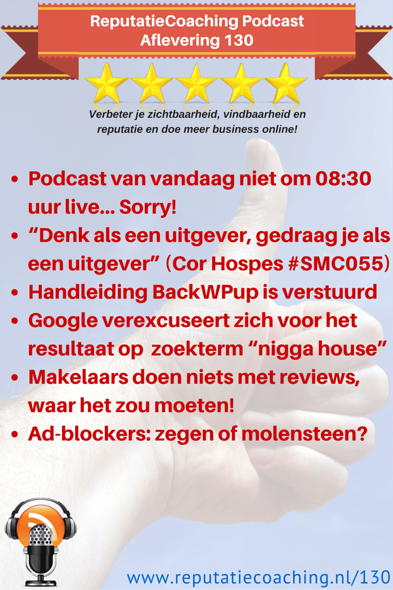
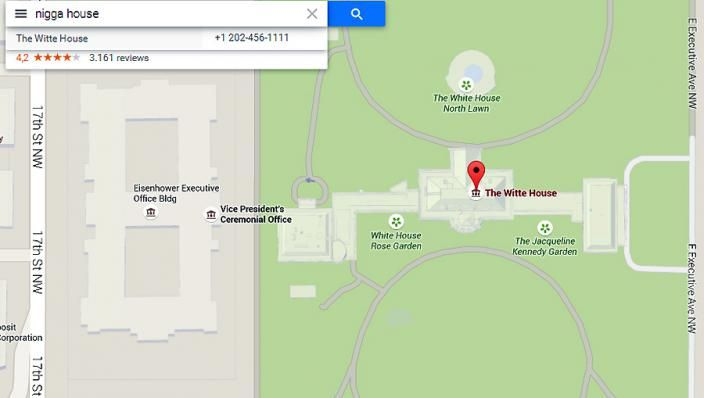
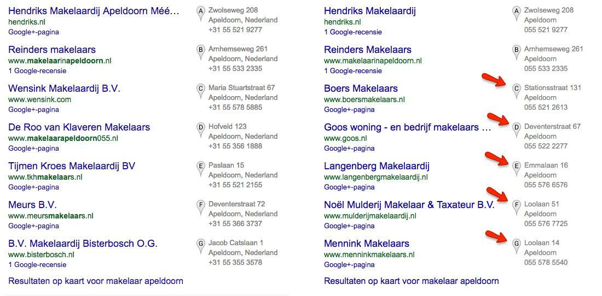
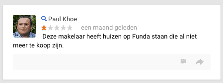
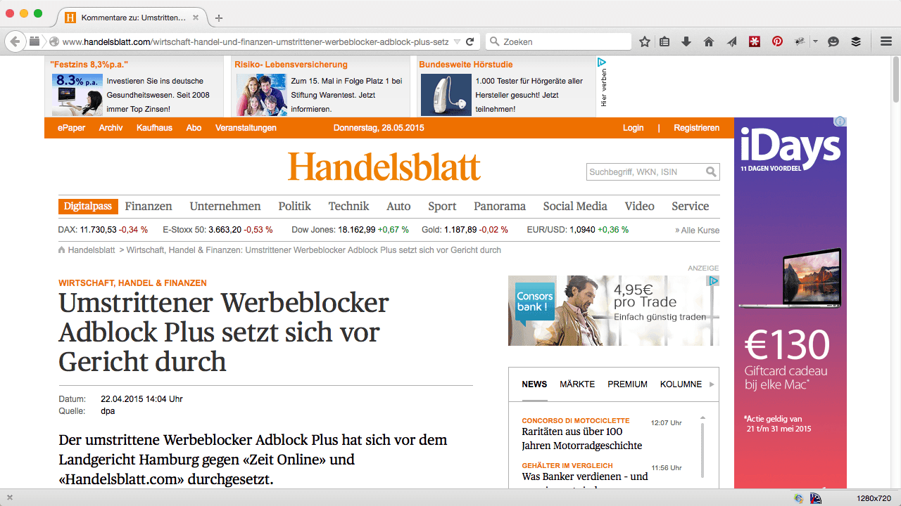
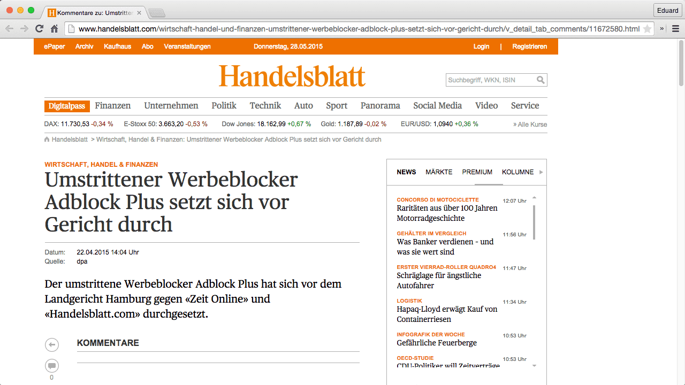

> **Historisch archief.** Deze aflevering verscheen op 28-05-2015 als onderdeel van ReputatieCoaching (2012–2016). De oorspronkelijke tekst is hieronder historisch bewaard. Diensten, contactgegevens, links, tools en adviezen kunnen inmiddels verouderd zijn.



**Transcriptiestatus:** Volledige transcriptie uit het oorspronkelijke archief.

**
Ja, alweer podcast aflevering 130! Ik weet nog goed dat ik 30 weken geleden in [podcast 100](https://web.archive.org/web/20150312095008/http://www.reputatiecoaching.nl/100/) het interview had met Emile Ratelband over de reputatie… Nou ja… laat ik het “issues” noemen, die hij heeft doorgemaakt. En inmiddels ben ik alweer 30 weken verder: de tijd vliegt!**

**De podcast van vandaag had eigenlijk netjes om 08:30 uur online moeten komen en dat is niet gelukt. Hoe dat komt, hoor je zo.**

**Eind vorige week heb ik de presentatie van Cor Hospes van 13 april online gezet, zowel in audio, video als de transcriptie. Mocht je dat gemist hebben: ik kom er zo op terug.**

**Afgelopen week heb ik de handleiding over het backuppen van je WordPress-site met BackWPup inclusief de link naar de instructievideo naar alle abonnees gestuurd. Dus als het goed is hebben meer webmasters inmiddels hun website veiliggesteld op Dropbox.**

**Ik meldde je twee weken geleden in [podcast 128](https://web.archive.org/web/20150605073613/http://www.reputatiecoaching.nl/128/) al dat ik grote schommelingen waarnam in de lokale zoekresultaten. En dat zie ik nog steeds. Mogelijk hangt dit samen met het feit dat Google haar Mapmaker-omgeving tijdelijk heeft afgesloten voor updates… Google geeft zelf ook hints in die richting.**

**Een categorie ondernemers die nog niet echt veel lijkt te doen met reviews, zijn de makelaars. Ik laat je zien waar niet alleen makelaars in Apeldoorn maar ook in de rest van Nederland op dit moment tekort schieten en hoe zij dit kunnen verbeteren.**

**En dan tenslotte: zijn zogenaamde “ad-blockers” een zegen of een molensteen?**

Hallo en hartelijk welkom bij deze aflevering van de ReputatieCoaching Podcast. Ik ben Eduard de Boer, ReputatieCoach. Dit is dé podcast die jou helpt om meer business te genereren, doordat jouw website beter gevonden wordt, zowel lokaal als landelijk en doordat ik je uitleg hoe je je online reputatie kunt verbeteren. Dit alles helpt je om je bedrijf en jezelf beter op de online kaart te plaatsen.

De podcast kun je vinden op [www.reputatiecoaching.nl/130](https://web.archive.org/web/20150605073638/http://www.reputatiecoaching.nl/130/). Daar vind je niet alleen de tekst, maar ook video’s waar ik het in deze uitzending over heb, alsmede afbeeldingen, links enzovoorts. Bovendien is de podcast te beluisteren in iTunes, op Stitcher en ook op [TuneIn Radio](http://tunein.com/radio/ReputatieCoaching-Podcast-p655084/). Ik raad je aan om je op één van die drie kanalen te abonneren op de podcast, zodat je geen aflevering hoeft te missen!

Laat ik dan nu overgaan op de onderwerpen voor vandaag…

## Podcast van vandaag niet om 08:30 uur live… Sorry!

Je weet dat ik mijn uiterste best doe om elke donderdag stipt om 08:30 uur de podcast live te brengen. En meestal lukt me dat prima. Zo ook vorige week: toen kostte de hele voorbereiding en uitwerking van de podcast mij beduidend minder tijd, doordat ik er de audioversie van het verhaal van Gonnie Spijkstra (@gonniespijkstra) in kon mixen. Dat scheelde aanzienlijk tijd en dus was ik ook toen op de woensdag ervoor bijtijds gereed met zowel het inspreken, als het klaarzetten van de transcriptie.

Elke woensdag is voor mij normaal de podcast-dag, dat weet vrijwel iedereen in mijn omgeving. Dan duik ik achter mijn iMac en begin de onderwerpen te zoeken die ik met je wil delen, spreek ik de podcast in en maak ik de transcriptie. Ook zoek ik bijpassende afbeeldingen om de online transcriptie “op te leuken”. Dat doe ik dus op woensdag, zodat alles op donderdagmorgen vlekkeloos live komt.

Maar goed: “Leven is datgene wat er gebeurt, als je andere plannen maakt”, heb ik ooit eens ergens gelezen. Dat was ook nu het geval. Ik had gisteren omstreeks 08:00 uur onze dochter naar school gebracht, om 08:30 boodschappen gedaan voor het avondeten en iets voor negenen zat ik achter mijn computer om te beginnen aan de podcast voor vandaag…

Maar nadat ik zo’n 10 minuten aan het werk was, ontving ik een mailtje van een belangrijke opdrachtgever met het verzoek om vóór 16:00 uur een WordPress website die ik de week ervoor had opgezet, per direct te vullen met relevante, interessante en leerzame content, alsmede de bijbehorende Facebookpagina…

Tja, en wat moet je dan? Dan kun je geen “Nee” zeggen, vind ik. Dus dat kon ik niet en ik ging aan het werk. Foto’s, video’s en lappen tekst werden in de uren daarna aan de WordPress site toegevoegd om body te geven aan de site.

Tegen kwart over twee belde ik met de opdrachtgever en die was (gelukkig) helemaal tevreden met alle content die ik had geproduceerd. En vlak daarna moest ik mijn aandacht weer geven aan het gezinsleven en de beslommeringen van elke dag.

Als gevolg hiervan begon ik dus pas tegen half acht in de avond met het kiezen van de onderwerpen en het uitwerken van de podcast. Voorheen kostte het mij in totaal acht tot negen uur om een podcast van begin tot en met gereedzetten voor publicatie, maar tegenwoordig heb ik dat al terug weten te brengen naar zo’n vijf tot zes uur. Desalniettemin is dat toch een behoorlijke tijd en is dat dus precies de reden dat het me vandaag niet lukte om de podcast exact om 08:30 uur live te laten komen.

Ik hoop dat je me het niet kwalijk neemt, maar ik verwacht ook niet dat je elke donderdagmorgen vanaf 08:25 uur elke minuut de website opnieuw laadt, om te zien of de podcast voor die week al live staat.

Dat is wel een voordeel van podcasts. Je kunt je niet echt permitteren om een week over te slaan, als je niet het risico wilt lopen om luisteraars c.q. abonnees te verliezen, maar het is aan de andere kant geen halszaak als de podcast wel op de geplande dag, maar dan iets later live komt… Toch?

Als jij er anders over denkt, dan hoor/lees ik dat graag. Dus bij deze de vraag of jij het erg vindt, als de podcast af en toe eens niet precies om 08:30 uur ’s ochtends live komt, maar wat later. Maar jou dat echt uit? Laat het me weten onderaan de transcriptie van deze podcast, op [www.reputatiecoaching.nl/130](https://web.archive.org/web/20150605073638/http://www.reputatiecoaching.nl/130/).

## “Denk als een uitgever, gedraag je als een uitgever” door Cor Hospes bij #SMC055

*Historische afbeelding niet beschikbaar: Cor Hospes*
In april was ik ook weer op de maandelijkse Social Media Club Apeldoorn avond, alwaar zowel Jeanet Bathoorn als Cor Hospes een presentatie gaven. Topic van de avond was “Content is #king en #queen”.

De presentatie van Jeanet over “[De 9 WHY’s van Content Marketing](https://web.archive.org/web/20190819230352/https://www.reputatiecoaching.nl/de-9-whys-van-content-marketing-door-jeanetbathoorn-tijdens-smc055/)” kun je elders beluisteren c.q. nalezen. De link daar naartoe vind je in de show notes van deze podcast.

Terugkomend op de presentatie van Cor Hospes. Het onderwerp van zijn presentatie was “[Denk als een uitgever, gedraag je als een uitgever!](https://web.archive.org/web/20170313041940/http://www.reputatiecoaching.nl/denk-als-een-uitgever-gedraag-je-als-een-uitgever-door-cor-hospes-bij-smc055/)”. Hij had zijn presentatie onderverdeeld in 11 concrete handvatten. Deze heb ik in video’s verwerkt met zijn audio eronder. Ook die link vind je terug in de show notes van deze podcast.

In het artikel over zijn presentatie vind je ook nog eens de transcriptie van de presentatie “[Denk Als Een Uitgever, Gedraag Je Als Een Uitgever](https://www.scribd.com/doc/266502035/Denk-Als-Een-Uitgever-Gedraag-Je-Als-Een-Uitgever-Door-Cor-Hospes)”: maar liefst zo’n 17 pagina’s aan waardevolle content. Lees dat op je gemak door en doe er je voordeel mee!

## Handleiding BackWPup is verstuurd

Herinner je je nog het topic “Baas over je eigen infra en je eigen data” in [podcast 127](https://web.archive.org/web/20190822072212/https://www.reputatiecoaching.nl/127/)? Daarin benadrukte ik nogmaals de essentie van het maken van backups. Maar dat was niet alles, want ik deed je in [podcast 128](https://web.archive.org/web/20150605073613/http://www.reputatiecoaching.nl/128/) een belofte… Ik vertelde je dat ik bezig was met het uitwerken van een handleiding om je zo snel mogelijk op gang te helpen met het maken van backups van je WordPress-site naar Dropbox.

*Historische afbeelding niet beschikbaar: How To Backup A Wordpress Site*

Die handleiding is inmiddels af, evenals de bijbehorende instructievideo. Eerder deze week heb ik die verstuurd naar alle mensen die zich hebben geabonneerd op de exclusieve tips. Dit is nu precies zo’n eentje: een exclusieve tip. Er is veel tijd gaan zitten om die handleiding en de bijbehorende video te maken, dus deel ik die alleen met mensen die echt zitten te wachten op dit type content. Mijns inziens zijn dat dus de abonnees.

Echter, treur niet! Heb jij de handleiding nog niet, maar wil jij ook je website niet kwijtraken als gevolg van bijvoorbeeld hackers of malware, schrijf je dan nu nog in op de exclusieve tips via de website. Dan kun jij over een paar dagen ook beginnen met het maken van backups van je website, zodat je weer rustig kunt slapen, zonder je zorgen te hoeven maken over hackers, malware, crashende plugins en wat dies meer zij…

Ik ga je trouwens heus niet spammen, want zelf heb ik ook een bloedhekel aan al die commerciële mails. Ik gebruik Mailchimp, een gerespecteerde mailprovider. Als je daar maar iets teveel gaat spammen worden er eerst vragen gesteld en als het duidelijk is dat je alleen maar ongevraagde en commerciële mails verzendt, dan wordt je de toegang in no-time ontzegd. En dat wil ik niet, dus wees gerust.

Binnenkort kunnen de abonnees nog meer van dit soort waardevolle content tegemoet zien, want zij zijn mij heel dierbaar, dus ik wil hen eventjes nèt een beetje meer geven, dan dat ik hier op de site met de hele wereld deel.

## Google verexcuseert zich voor het lokale resultaat op de zoekterm “nigga house”

Vorige week donderdag net nadat ik [podcast 129](https://web.archive.org/web/20150605073628/http://www.reputatiecoaching.nl/129) had uitgebracht, publiceerde Google een openlijk excuus voor de rotzooi die ze heeft weten te creëren, of beter gezegd: “laten creëren”….

Het bleek namelijk, dat als je op Google Maps zocht op de zoekterm “nigga house” of “nigger house”, de lokale vermelding van het Witte Huis, waar de gekleurde president Barack Obama op dit moment zit, werd vertoond.

[](https://lh5.googleusercontent.com/-10m8bmhC-Y4/VWcJhIOGsHI/AAAAAAAACNs/SNnNGaukrj4/w704-h398-no/20150528-nigga-house-google-maps.jpg)

Het was dit resultaat, waardoor Google dermate in verlegenheid werd gebracht, dat het besloot Mapmaker helemaal te sluiten en zowel maatregelen aan te brengen in Mapmaker, alsmede in de rankingalgoritmes voor de lokale zoekresultaten.

Google formuleerde vorige week dit probleem nog erg netjes… Ik geef je hier mijn eigen bewoordingen de reactie op het Google Maps latlong blog:

We verontschuldigen ons voor het feit dat dit enige tijd kost om te fixen en we willen met jullie delen wat we eraan doen om het probleem daadwerkelijk op te lossen.

Binnen Google werken we er hard aan om mensen díe informatie te geven, waar ze naar op zoek zijn, inclusief informatie over de fysieke wereld om hen heen, door middel van Google Maps.

Onze rankingalgoritmes zijn ontworpen om resultaten te tonen die in lijn zijn met datgene waar mensen naar op zoek zijn. Voor Google Maps betekent dit dat er gebruik wordt gemaakt van content van bedrijven en fysieke plaatsen en andere publieke punten in het web.

Maar deze week hoorden we van een concrete fout in ons systeem: luid en duidelijk! Bepaalde beledigende zoektermen leverden onverwachte resultaten op in Google Maps, doordat mensen deze beledigende termen gebruikten in online discussies over de desbetreffende locatie. Dit leverde ongewenste resultaten, waar gebruikers overduidelijk niet naar op zoek waren.

Ons team is hard aan het werk om dit probleem op te lossen. Voortbordurend op een essentiële algoritmische aanpassing die we ook voor Google Search hebben ontwikkeld, zijn we begonnen ons rankingalgoritme aan te passen om de meerderheid van dit soort zoekpogingen te verbeteren. Dit wordt geleidelijk wereldwijd uitgerold en we blijven continu bezig onze systemen verder te verfijnen. Simpel gezegd: je zou dit soort resultaten niet moeten zien in Google Maps, en wij doen er alles aan om ervoor te zorgen dat je dit inderdaad niet te zien krijgt.

Nogmaals onze oprechte excuses voor de belediging die dit heeft veroorzaakt en we beloven plechtig in de toekomst nog beter ons best te doen.

Laten we deze reactie vanuit verschillende hoeken bekijken. Allereerst vanuit reputatie-oogpunt. Google beseft dat het heeft gefaald en doet datgene wat het volgens het boekje moet doen:

```
  1. Uitleggen wat het probleem is, zonder het exacte probleem op te rakelen en daarmee wederom mogelijk tere snaren te raken.
  2. Toegeven dat het heeft gefaald
  3. Vertellen dat het werkt aan een passende oplossing
  4. Beloven dat Google in de toekomst nóg beter haar best zal doen
```

Ik zei het al: dit is volgens het boekje. Maar dat geeft niet, want zo hoort het! Als je faalt moet je het ruiterlijk toegeven, zeggen dat je werkt aan de oplossing en beterschap beloven. Dus dat doet Google helemaal goed. Hiermee neemt het voor een groot deel de druk van het daadwerkelijke probleem weg. Vanuit reputatieperspectief heb ik er dus niets op aan te merken.

Laat ik het vervolgens vanuit lokale SEO perspectief beschouwen…

Ten eerste een disclaimer: je moet altijd oppassen met het correleren van gegevens en hier direct conclusies aan verbinden voor wat betreft oorzaak / gevolg.

Ik meldde je twee weken geleden in [podcast 128](https://web.archive.org/web/20150605073613/http://www.reputatiecoaching.nl/128/) al dat ik grote veranderingen had waargenomen in de lokale zoekresultaten. Toen stond Allround Fotografie na lange tijd opeens op de “A”-positie. Ik kan je vertellen dat in de anderhalve week daarna er heel veel schommelingen plaatsvonden. Soms stond Allround Fotografie op “A”, soms op “B”, soms op “E” en soms was het helemaal niet te vinden in de 7 lokale resultaten. Maar zo ongeveer sinds een week staat de vermelding steady op de “A”-positie.

Ik houd natuurlijk meer lokale resultaten nauwlettend in de gaten. Zo kijk ik onder andere naar tandartsen in diverse plaatsen in Nederland. En ook de volgorde van de lokale resultaten van de tandartsen in Apeldoorn is flink door elkaar geschud. Zo is de tandarts die tot voor zo’n twee weken op “A” stond, “gedegradeerd” naar de vijfde positie. De vermeldingen op “B” en “C” zijn hetzelfde gebleven. En opeens staan op posities “A”, “D”, “F” en “G” tandartsen vermeld, die voorheen helemaal niet in de 7 lokale resultaten werden vertoond.

En ook de makelaars in Apeldoorn worden door elkaar geschud. In de show notes op [www.reputatiecoaching.nl/130](https://web.archive.org/web/20150605073638/http://www.reputatiecoaching.nl/130/) heb ik een tweetal screenshots opgenomen van de lokale resultaten voor de zoekterm “makelaar apeldoorn”. Het linker overzicht is van 11 februari en het rechter overzicht van vandaag, 28 mei:

[](https://lh5.googleusercontent.com/-FnUM63SY2WY/VWcJgVfsq3I/AAAAAAAACOA/0QJ0nLODnTo/w1007-h496-no/20150528-SERP-makelaar-apeldoorn.jpg)

Helaas heb ik er geen screenshot van, maar ik kan je vertellen dat de periode februari tot en met zo’n twee à drie weken geleden de resultaten vergelijkbaar waren met het linker lijstje.

Het is overduidelijk dat hier heel veel is veranderd: op plaats “C” tot en met “G” zijn allemaal nieuwe resultaten gekomen. Dat is volgens mij best een aardige klap voor de makelaars die eerst wel vermeld stonden, maar die nu niet meer in het lijstje te vinden zijn. Aan de andere kant zijn de makelaars die er nu worden vertoond waarschijnlijk uitermate gelukkig, omdat dit de kans om meer business te doen, kan vergroten.

Volgens mij is Google nog niet gereed met alle aanpassingen, want zo is Google Mapmaker ook nog steeds niet opengesteld voor wijzigingen. Dus of de resultaten zoals je ze nu ziet de komende tijd zullen blijven, is de vraag. We zullen het zien…

## Makelaars doen niets met reviews, waar het zou moeten

Ik had het zojuist over makelaars, in dit geval in Apeldoorn. Het blijft verwonderlijk dat de meeste makelaars nog steeds niet begrijpen hoe de huidige online wereld functioneert en hoeveel waarde mensen hechten aan reviews. Want vrijwel geen enkele makelaar is echt bezig reviews te verzamelen, noch reageren ze op reviews.

In [podcast 108](https://web.archive.org/web/20150312095217/http://www.reputatiecoaching.nl/108/) in december 2014 kwam dit ook al eens aan bod. Toen vertelde ik je over hoe makelaar Jeroen Reinders alom tegenwoordig is op alle sociale media. In de screenshot die je in de show notes van podcast 108 kunt zien, stond Hendriks Makelaardij toen ook al op “A”, evenals nu, maar had toen nog geen reviews.

Guess what? Hendriks Makelaardij heeft er sinds december maar liefst één review bij! Alleen denk ik dat dit niet een review is van iemand waar ze het aan hebben gevraagd, of die persoon een review wilde posten.

Dit is typisch een voorbeeld van falend reviewmanagement. Want als je op de tekst “1 Google recensie” klikt zie je iets waar je als makelaar al helemaal niet vrolijk van zou worden: een negatieve beoordeling van maar één ster!

De tekst van de recensie luidt: “*Deze makelaar heeft huizen op Funda staan die al niet meer te koop zijn.*”. Die recensie is alweer een maand oud op dit moment en de makelaar heeft er nog steeds niet op gereageerd:

[](https://lh4.googleusercontent.com/-oNgRExwQgWQ/VWcJhaHgLJI/AAAAAAAACN0/j1siEsE3r8k/w449-h168-no/20150528-review-makelaar-hendriks-apeldoorn.png)

Oh oh oh… Wat een blunder! Want hoe denk je dat dit overkomt op mensen die op Google een makelaar in Apeldoorn zoeken, gewoontegetrouw op het eerste lokale resultaat klikken en vervolgens eens de recensies induiken? Het kan niet anders, dan dat Hendriks hierdoor kansen mist!

Ik wilde eens zien hoe de Google+ pagina van Makelaardij Hendriks er uitzag en ging op zoek. Toen bleek ook nog eens dat Hendriks een tweede Google+ pagina heeft die redelijk mooi is opgemaakt met foto’s, maar dat die pagina niet is geclaimd. Gelukkig voor de makelaar kan hij het gemakkelijk oplossen door de juiste pagina te claimen en te koppelen aan de website. Daarna kan de oude pagina worden verwijderd.

Het bijzondere is overigens dat ook Reinders Makelaars een dubbele vermelding heeft in Google+ met dezelfde NAPT-gegevens.

De derde makelaar in de rij, “Boers Makelaars” blijkt ook twee Google+ pagina’s te hebben, “Goos” en “Langenberg” hebben er wel netjes slechts eentje. De op één na laatste in de lijst “Noël Mulderij Makelaar & Taxateur B.V.” heeft er ook eentje, maar heeft de Google+ pagina nog niet geclaimd. En de laatste “Mennink Makelaars” hebben ook twee Google+ pagina’s.

Dubbele vermeldingen in Google+ zijn niet toegestaan en kunnen mogelijk zelfs leiden tot verwijdering uit de zoekresultaten. Ik kan me zo voorstellen dat de desbetreffende makelaars daar niet op zitten te wachten.

Daarom hierbij mijn adviezen aan de makelaars:

```
  1. Claim je (juiste!) Google+ pagina
  2. Verwijder eventuele andere Google+ pagina’s
  3. Ga minstens een stuk of tien reviews verzamelen op Google+ (bij vijf krijg je de sterretjes al te zien!)
```

En voor makelaars met meerdere kantoren heb ik nóg een tweetal adviezen:

```
  1. Claim de pagina’s voor elke locatie
  2. Verwijs vanaf elke Google+ pagina naar de juiste pagina op je site, waar de gegevens van de desbetreffende locatie staan
```

Om dit topic over reviewmanagement voor makelaars af te sluiten nog even het volgende. Het is echt niet zo, dat alleen de makelaars in Apeldoorn geen extern gerichte reviewstrategie hebben. Een korte zoektocht langs de lokale vermeldingen van makelaars in een tiental grote steden van Nederland laat zien dat er nog geen enkele makelaar tenminste vijf recensies lijkt te hebben op Google+. Wel verzamelen sommige makelaars beoordelingen op Funda, maar ook lang niet allemaal.

De eerste makelaar die in een stad hiermee hard aan de slag gaat, kan volgens mij zijn of haar business aanzienlijk vergroten, omdat de sterren bij de beoordeling nu eenmaal steeds zwaarder gaan wegen, niet voor de zoekmachines, maar voor de mensen die er gebruik van maken… Oftewel: hun potentiële klanten!

## Ad-blockers: zegen of molensteen?

Weet je nog dat ik het in [podcast 108](https://web.archive.org/web/20150312095217/http://www.reputatiecoaching.nl/108/) had over de Chrome extensie “AdBlock Plus”? Dat is een extensie die zijn uiterste best doet om zoveel mogelijk reclame te blokkeren. En daar worden mediabedrijven niet blij van, want die verdienen een deel van hun omzet aan reclame. Als er geen advertenties meer worden vertoond, krijgen ze minder kliks en dalen dus hun inkomsten.

In april hebben de Duitse bedrijven Zeit Online en Handelsblatt een proces aangespannen tegen AdBlock Plus, maar hebben dat verloren. In de show notes heb ik twee screenshots opgenomen. De eerste is van een artikel op Handelsblatt zonder gebruik te maken van AdBlock Plus:

[](https://lh6.googleusercontent.com/-eNG0JJlFmxU/VWcJgr_5WEI/AAAAAAAACNw/x6n3njx5gNE/w1006-h566-no/20150528-handelsblatt-firefox-zonder-adblock.png)

De tweede screenshot laat het effect van AdBlock Plus heel duidelijk zien. Kijk maar eens in de show notes en zoek zelf de verschillen. Ik denk dat het dan wel duidelijk wordt, waarom steeds meer mensen kiezen voor ad-blockers:

[](https://lh4.googleusercontent.com/-8HoU5ZwR2UA/VWcJgdQNlLI/AAAAAAAACN4/X5PyC4J_B74/w1006-h566-no/20150528-handelsblatt-chrome-met-adblock.png)

RTL en ProSiebenSat1 dachten meer geluk te hebben en daagden het bedrijf achter AdBlock Plus ook voor de rechter. Maar ook zij vingen bot. Volgens de rechtbank mogen gebruikers zelf bepalen of zij advertenties willen blokkeren of niet.

Wat vind jij hiervan? Gebruik jij al een ad-blocker? Zo nee, is dat bewust of onbewust? Of stoor jij je helemaal niet aan alle reclame en aan het feit dat je op YouTube eerst altijd verplicht bent een aantal seconden naar een advertentie te kijken? Laat het me weten onderaan de show notes van deze podcast, op [www.reputatiecoaching.nl/130](https://web.archive.org/web/20150605073638/http://www.reputatiecoaching.nl/130/).

Met dit topic over ad-blockers bekeken vanuit twee perspectieven: die van de eindgebruiker en die van de mediabedrijven, kom ik aan het einde van deze podcast.

Als je de podcast leuk vindt en je wilt nog meer op de hoogte blijven, volg me dan ook op Twitter, via [@reputatiecoach1](https://twitter.com/reputatiecoach1).

Heb je inderdaad wat aan alle informatie die ik met je deel, help mij dan met het verder verbeteren en promoten van deze podcast. Abonneer je op de podcast, zodat je altijd meteen de nieuwste uitzending krijgt voorgeschoteld.

Zoek de podcast op, in iTunes of Stitcher, geef de podcast een sterrenbeoordeling en laat ook je reactie achter. Door de podcast te beoordelen op iTunes en/of Stitcher breng je de podcast onder de aandacht van een breder publiek.

Je kunt me verder helpen, door de podcast aan te bevelen bij vrienden of collega’s, waarvan je denkt dat ze er hun voordeel mee kunnen doen, of door ’m te delen op Twitter, like’n en delen op Facebook of een “+1” te geven op Google+.

En vergeet niet: ik ben hier om je te helpen! Als je een vraag of een probleem hebt met betrekking tot je online reputatie of de vindbaarheid van je website, kun je een mailtje sturen naar [podcast@reputatiecoaching.nl](mailto:podcast@reputatiecoaching.nl).

Als je dat te lastig vindt, of als je de podcast beluistert terwijl je in de auto zit en je hebt acuut een vraag, spreek dan een boodschap in op de ReputatieCoaching Hotline, op nummer: 084 - 883 15 56. Mogelijk behandel ik je vraag of probleem dan in een artikel of in de podcast.

En je kunt ook rechtstreeks op de website een voicemail achterlaten, door op de tab aan de rechterkant van elke pagina te klikken, en je bericht in te spreken. Dit was [ReputatieCoaching Podcast aflevering 130](https://web.archive.org/web/20150605073638/http://www.reputatiecoaching.nl/130/) en mijn naam is [Eduard de Boer](http://nl.linkedin.com/in/eduarddeboer/nl).

Ik wens je de komende week weer succes met het werken aan je reputatie, zodat je meteen je reputatie voor jou kunt laten werken!

Tot volgende week!

Doei!

Links naar content die in deze podcast aan bod komt:

```
  * ReputatieCoaching Podcast in iTunes
  * ReputatieCoaching Podcast op Stitcher
  * [ReputatieCoaching Podcast op TuneIn Radio](http://tunein.com/radio/ReputatieCoaching-Podcast-p655084/)
  * [ReputatieCoaching Podcast RSS-feed](https://web.archive.org/web/20200719034852/https://feeds.reputatiecoaching.nl/ReputatieCoachingPodcast)
  * “[De 9 WHY’s van Content Marketing](https://web.archive.org/web/20190819230352/https://www.reputatiecoaching.nl/de-9-whys-van-content-marketing-door-jeanetbathoorn-tijdens-smc055/)” (Jeanet Bathoorn, tijdens #SMC055, 14 april 2015)
  * “[Sorry for our Google Maps search mess up](http://google-latlong.blogspot.nl/2015/05/sorry-for-our-google-maps-search-mess-up.html)” (Google Maps blog, 21 mei 2015)
```
