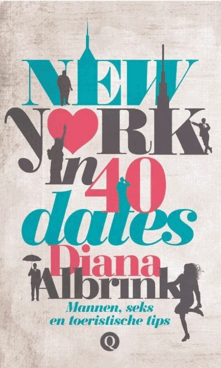

> **Historisch archief.** Deze aflevering verscheen op 4-06-2015 als onderdeel van ReputatieCoaching (2012–2016). De oorspronkelijke tekst is hieronder historisch bewaard. Diensten, contactgegevens, links, tools en adviezen kunnen inmiddels verouderd zijn.



**Transcriptiestatus:** Volledige transcriptie uit het oorspronkelijke archief.

***Historische afbeelding niet beschikbaar: ReputatieCoaching Podcast*
Vandaag komt het boek “New York in 40 dates” van Diana Albrink officieel uit en ik ben vanmiddag bij de lancering van het boek in Dordrecht. Maar vanmorgen heb ik Diana live in de uitzending. Ze vertelt ons zometeen over haar achtergrond, de totstandkoming van het boek en bovendien deelt ze belangrijke aandachtspunten voor beginnende auteurs.**

**En dan is eerder deze week Google Foto’s uitgekomen. Wat betekent dit en wat kun je er zoal mee? Herinner je je nog Frank, de fysiotherapeut uit [podcast 126](https://web.archive.org/web/20190717184040/https://www.reputatiecoaching.nl/126/)? Ik was maandag bij hem en heb een kleine update. Oh ja, laatst deed de site van ReputatieCoaching het niet meer, toen ik alles had overgezet op de nieuwe server. Ik vertel je hoe ik het heb opgelost!**

Hallo en hartelijk welkom bij deze aflevering van de ReputatieCoaching Podcast. Ik ben Eduard de Boer, ReputatieCoach. Dit is dé podcast die jou helpt om meer business te genereren, doordat jouw website beter gevonden wordt, zowel lokaal als landelijk en doordat ik je uitleg hoe je je online reputatie kunt verbeteren. Dit alles helpt je om je bedrijf en jezelf beter op de online kaart te plaatsen.

De podcast kun je vinden op [www.reputatiecoaching.nl/131](https://web.archive.org/web/20150605073649/http://www.reputatiecoaching.nl/131). Daar vind je niet alleen de tekst, maar ook video’s waar ik het in deze uitzending over heb, alsmede afbeeldingen, links enzovoorts. Bovendien is de podcast te beluisteren in iTunes, op Stitcher en ook op [TuneIn Radio](http://tunein.com/radio/ReputatieCoaching-Podcast-p655084/). Ik raad je aan om je op één van die drie kanalen te abonneren op de podcast, zodat je geen aflevering hoeft te missen!

Laat ik dan nu overgaan op de onderwerpen voor vandaag…

## Probleem met migratie WordPress website: website geeft witte blanco pagina!

*Historische afbeelding niet beschikbaar: Wordpress SEO*
Ik heb je verteld dat ik alle sites die ik host, migreer oftewel verhuis naar een andere server. Dus ook ReputatieCoaching moest een tijdje geleden over. Daarvoor had ik al een aantal WordPress sites overgezet, dus ik verwachtte eigenlijk geen probleem en verkeerde in de veronderstelling dat het een klusje van een kwartier tot een half uur zou zijn.

Dat liep echter even anders!! Het kostte me een aantal uren! “Wat was er aan de hand?”, zul je je afvragen. Welnu, het overzetten van de content en het exporteren en importeren van de database verliep snel en moeiteloos. Alleen deed de website het niet, toen ik ging testen!

Tja, gelukkig draaide de originele site gewoon nog naar behoren, dus ik hoefde me geen zorgen te maken en kon in alle rust het probleem beginnen op te lossen.

Ik las op Internet de tip om één voor één de plugins uit te zetten, tot je degene vindt, die het probleem veroorzaakt. Maar hoe doe je dat, als je niet eens kunt inloggen?

De oplossing daarvoor las ik ook ergens. Eigenlijk is de idee heel simpel: verander de naam van elke plugin-directory, door er bijvoorbeeld “.off” aan toe te voegen. Dan wordt die niet meer gebruikt. Maar je mag er ook elke andere gewenste string achter zetten.

Eindelijk vond ik het probleemgeval. Daarna heb ik dus de extensie achter alle andere directorynamen weer verwijderd en de site bleef werken. De boosdoener bleek één of andere Twitter plugin te zijn, die ik toch niet gebruik en dus probleemloos in WordPress kon deactiveren en verwijderen, toen de site het weer deed en ik kon inloggen.

Ik hoop dat het jou niet overkomt, maar onthoud dus het voorgaande als bij het overzetten van je site, of na het installeren van een plugin je WordPress site het niet meer doet.

## Nieuw: Google Foto’s


Je kon altijd al onbeperkt foto’s van maximaal 4 megapixels gratis opslaan op Google+. Afbeeldingen met een hogere resolutie telden dan wèl mee richting de maximale opslagcapaciteit die je bij Google had. Gelukkig kon je het zó instellen dat grotere afbeeldingen automatisch werden verkleind om ze binnen de vier MP te houden.

Sinds eerder deze week heeft Google de foto’s losgekoppeld van Google+ en gaat het product verder onder de naam “Google Foto’s”. Daarbij is de maximale resolutie van gratis foto’s opgeschroefd naar 16 megapixels en de video naar 1080p.

Dat is een enorme gewaagde sprong voorwaarts en hiermee kan Google wel eens Flickr en andere fotodiensten hebben ingehaald! Waarbij Dropbox je nog steeds maar 2GB geeft, Apple 5GB en Flickr weliswaar 1 TeraByte, biedt Google nu dus onbeperkte opslag. En laten we eerlijk zijn: veel fotocamera’s hebben een lagere resolutie dan 16 megapixels! Dus dan heb je het probleem helemaal niet!

En daarmee houdt het nog niet op! Want Google Foto’s biedt veel meer! Zo is het delen van foto’s op Google Foto’s kinderlijk eenvoudig geworden. Ik zal het binnenkort in een instructievideo demonstreren. Maar wat ik helemaal spectaculair vond, was de automatische fotoherkenning door Google, die het zoeken ontzettend simpel maakt! Opeens heb je allemaal categorieën, zoals:

```
  * Eten
  * Auto’s
  * Hemel
  * Bossen
  * Fietsen
  * Bussen
  * Bloemen
  * Stranden
  * Honden
  * Speelplaatsen
  * Boten
  * Parken
  * Bowlen
  * Paarden
  * Dansen
  * Mist
  * Vogels
  * Riffen
  * Vliegtuigen
  * Bier
  * Katten
  * Gorilla’s
  * Posters
  * Bruiloft
  * Branden
  * Zonsondergang
  * Vreugdevuur
  * Watervallen
  * Bergen
  * Grotten
  * Concerten
```

Zo, dan weet je ook meteen wat ik zoal fotografeer met m’n iPhone… Anyway, in de show notes op [www.reputatiecoaching.nl/131](https://web.archive.org/web/20150605073649/http://www.reputatiecoaching.nl/131) heb ik een screenshot opgenomen van het zoekscherm in de Google Foto’s app op mijn iPhone, waarop je een deel van de categorieën goed kunt zien:

[[Historische afbeelding: Zoeken op](https://lh4.googleusercontent.com/-vqjb9tbhPxo/VW74ngnhXNI/AAAAAAAACP8/ftlfIHJJ1Q4/w600/IMG_9951.PNG)](https://lh4.googleusercontent.com/-vqjb9tbhPxo/VW74ngnhXNI/AAAAAAAACP8/ftlfIHJJ1Q4/w600/IMG_9951.PNG)

Wat zijn samengevat de voordelen van Google Foto’s? Ik loop ze even met je door:

```
  1. **Automatische backup** – Je kunt nu gerust zijn in de wetenschap dat al je foto’s en video’s automatisch veilig worden opgeslagen vanaf je smartphone, tablet en desktop. Je kunt het overigens zó instellen dat alleen foto’s naar Google worden gestuurd, als je verbonden bent met WiFi. Zo voorkom je dat je ongewenste kosten maakt in je databundel.
  2. **Overal beschikbaar** – Ongeacht waar je bent kun je je foto’s bekijken: zowel via je smartphone, tablet als op het web.
  3. **Offline beschikbaar** – Zelfs als je offline bent, kun je bij je foto’s.
  4. **Beheer de opslagruimte op je telefoon** – Als je telefoon vol dreigt te geraken kun je veilig foto’s en video’s verwijderen, omdat ze al in je Google account zijn opgeslagen. Je hoeft je dus ook nooit meer zorgen te maken als je per ongeluk een foto van je telefoon verwijdert.
  5. **Spring voor- en achteruit in de tijd** – Navigeer snel, intuïtief en eenvoudig met simpele bewegingen door al je foto’s. Zoom door weken, maanden en jaren van foto’s. Of spring naar een bepaald moment met een paar kliks of taps.
```

Ik heb besloten al mijn foto’s te backuppen naar Google. Alleen zie ik het nog even niet zitten om per folder alle JPG’s naar de browser te slepen om ze zo te backuppen. Dat gaat wel erg veel tijd kosten!

## Google: zoekpogingen “in de buurt” verdubbeld in 1 jaar!

*Historische afbeelding niet beschikbaar: Zet je bedrijf op de mobiele kaarten!*
Het zoekgedrag van Internetters en hun gebruik van zoekmachines is continu aan verandering onderhevig. Zo werd jaren geleden op slechts een enkel woord gezocht en later gingen mensen zoektermen van meerdere woorden intypen. Tegenwoordig typt men hele vragen in, of spreekt men de informatiebehoefte tegen een smartphone die dan de gewenste antwoorden oplepelt.

Het is bekend dat mensen hun smartphone ook steeds meer en vaker gebruiken om lokale bedrijven te vinden, beoordelingen erover te lezen om er vervolgens naartoe te gaan om een product of dienst af te nemen.

In een artikel op Search Engine Land met de titel “[Google Says “Near Me” Searches Have Doubled This Year](https://getpocket.com/a/read/936354100)” las ik dat Google heeft verteld dat het aantal zoekpogingen “in de buurt” of “bij mij in de buurt” afgelopen jaar is verdubbeld!

Dat onderschrijft maar weer eens temeer het belang van goede rankings in de lokale zoekresultaten. Want hoe hoger je komt in de lokale zoekresultaten, des te meer kans je hebt om iemand naar je site te trekken.

En het kan zelfs vanuit het buitenland werken! Een paar weken geleden kreeg ik een mailtje uit de Verenigde Staten op Allround Fotografie binnen, met het verzoek of we over een paar weken een evenement in Apeldoorn konden fotograferen. De opdracht is inmiddels verstrekt en binnenkort kan ik je hier meer over vertellen.

Maar wat is nu het interessante? Ik kon het niet nalaten en ben natuurlijk in Google Analytics gedoken om te zien hoe dit contact tot stand is gekomen… De persoon die contact met ons opnam, heeft gezocht op “photographer Apeldoorn” en zag onze vermelding staan, met daarbij bijna 5 sterren en 31 beoordelingen op Google. Hij klikte door naar de site, bekeek vier pagina’s en nam vervolgens via de “contact”-pagina contact op.

Allround Fotografie scoort inmiddels de “A”-positie en als je dat combineert met de 31 reviews met een gemiddelde van 4,9 op een schaal van 5, dan begrijp je dat het voor iemand uit de VS logisch is om daarop te klikken en als eerste contact mee op te nemen… Zeker als je weet dat bij alle andere fotografen nog (steeds) geen reviewsterren worden vertoond.

Dus zelfs vanuit het buitenland wordt er soms “in de buurt” gezocht…

## Stappenplan fysiotherapeut

Lokaal hoger scoren wordt dus belangrijk. Dat zien steeds meer ondernemers. Een paar podcasts geleden ontving ik een aantal vragen van Frank, een fysiotherapeut over hoe hij zijn website hoger kon laten scoren in de zoekresultaten. Sinds die tijd heb ik een aanzienlijke mailwisseling met hem gehad en afgelopen maandag hebben we elkaar in zijn praktijk ontmoet.

Het was een leuk gesprek, waaruit een aantal zaken naar voren is gekomen. Zo wil hij in de plaats liefst de toppositie bereiken in de lokale vermeldingen en ook goed worden vertoond in de organische resultaten. We hebben besloten dat ik een stappenplan maak dat we in overleg en in het tempo dat hem het beste uitkomt, gaan opvolgen.

Zodra ik er meer nieuws over heb, laat ik je het weten.

## Interview met Diana Albrink over “New York in 40 dates”

[](https://partnerprogramma.bol.com/click/click?p=1&t=url&s=20124&f=TXL&url=http%3A%2F%2Fwww.bol.com%2Fnl%2Fp%2Fnew-york-in-40-dates%2F9200000040900104%2F&name=DianaAlbrink&subid=NY40dates)Hoe leuk kunnen dingen lopen in het leven? Zo ben je wekelijks een podcast aan het produceren en opeens krijg je dan begin januari dit jaar een mailtje van een zekere [Diana Albrink](http://dianaalbrink.com) die graag wil weten hoe je een sterk alter ego of pseudoniem opbouwt als auteur. Ik ben er in [podcast 111](https://web.archive.org/web/20150312095303/http://www.reputatiecoaching.nl/111/) diep op ingegaan en vervolgens is er een leuk contact ontstaan tussen Diana en mij.

We hebben een aantal keren nog diverse zaken besproken en vanmiddag is het zover: dan komt Diana haar eerste boek, getiteld “[New York in 40 dates](https://partnerprogramma.bol.com/click/click?p=1&t=url&s=20124&f=TXL&url=http%3A%2F%2Fwww.bol.com%2Fnl%2Fp%2Fnew-york-in-40-dates%2F9200000040900104%2F&name=DianaAlbrink&subid=NY40dates)” (aff.) officieel uit. Ik ben uitgenodigd om daarbij te zijn, dus ik vertrek in de loop van de middag richting Dordrecht.

**Hieronder staan alleen de vragen…
Luister naar de audio om de antwoorden van Diana te horen!**

```
  1. Diana, leuk dat je live in de show wilde komen! Ontzettend fijn dat je tijd wilde en kon vrijmaken, zo vlak voor de lancering van je boek vanmiddag! Het is je eerste boek en nog niet veel mensen zullen jou kennen. Wil je daarom de luisteraars van de podcast en de lezers van het blog eerst iets vertellen over jou als persoon, je achtergrond, je hobbies, interesses en wellicht ook hoe je in New York verzeild bent geraakt?
  2. OK, je was dus in New York. En daar ging je daten… Hield je een dagboek voor jezelf bij? Of had je toen op een gegeven moment al de idee om daar een boek over te schrijven en ben je al begonnen met verhalen schrijven?
  3. “New York in 40 dates”… Een veel suggererende titel… Wat of wie was je inspiratie voor zowel de verhalen schrijven, als voor de titel? De film “Sex and the City”?
  4. Toen je besloten had een boek te gaan schrijven, hoelang heb je er toen over gedaan om het eerste manuscript te produceren? En hoeveel verhalen zaten daarin?
  5. Was je tijdens het schrijven al begonnen met het zoeken naar een uitgever, of zelfs vóórdat je begon of pas toen het manuscript bijna zijn einde naderde? En was het moeilijk een uitgever te vinden?
  6. Waarin werd je zoal ondersteund door de uitgever en hoe heb je dat ervaren?
  7. Volgens mij bescherm je de privacy van dates in je verhalen. Dat maak ik tenminste op uit de “kill your darlings” die je al hebt gepubliceerd als voorproefje. Maar weten je dates overigens dat er zo’n 6.000 kilometer verderop over hen is geschreven in een boek?
  8. Jouw verhaal is autobiografisch… Ik heb natuurlijk het boek nog niet kunnen lezen omdat het pas vanmiddag officieel uitkomt, dus ik weet niet hoe gedetailleerd of kleurrijk het is… Je foto prijkt echter op je site, je boek en overal. Durf je vanaf morgen nog wel gewoon naar de supermarkt om boodschappen te doen?
  9. Volgens mij nam je contact met me op, vlak nadat het manuscript voor de laatste keer naar de uitgever ging, als ik me het goed herinner. Ik heb toen een groot deel van podcast 111 gewijd aan jouw vraag c.q. vragen. Heb je daar wat aan gehad en heb je er concreet dingen mee gedaan?
  10. Wat was voor jou de top 3 aan tips die ik je heb gegeven, waarvan jij denkt dat ook andere auteurs of auteurs in spé iets aan kunnen hebben?
  11. Heb je verder nog tips voor auteurs in spé, op basis van jouw ervaringen met het publiceren van je eerste boek?
  12. Tenslotte: waar kunnen mensen die interesse hebben in je boek, het boek vinden en kopen? En waar kunnen ze informatie over jou vinden?
```

*Diana, ontzettend bedankt voor je tijd. Ik wens je een heel succesvolle lancering toe, natuurlijk veel verkopen en tot vanmiddag in Dordrecht!*

Dus… vanmiddag vertrek ik naar Dordrecht. Ik zal er foto’s maken en mogelijk ook wat video, dus dan kan ik dat wellicht binnenkort met je delen. Hiermee kom ik dan ook meteen aan het einde van deze podcast.

Als je de podcast leuk vindt en je wilt nog meer op de hoogte blijven, volg me dan ook op Twitter, via [@reputatiecoach1](https://twitter.com/reputatiecoach1).

Heb je inderdaad wat aan alle informatie die ik met je deel, help mij dan met het verder verbeteren en promoten van deze podcast. Abonneer je op de podcast, zodat je altijd meteen de nieuwste uitzending krijgt voorgeschoteld.

Zoek de podcast op, in iTunes of Stitcher, geef de podcast een sterrenbeoordeling en laat ook je reactie achter. Door de podcast te beoordelen op iTunes en/of Stitcher breng je de podcast onder de aandacht van een breder publiek.

Je kunt me verder helpen, door de podcast aan te bevelen bij vrienden of collega’s, waarvan je denkt dat ze er hun voordeel mee kunnen doen, of door ’m te delen op Twitter, like’n en delen op Facebook of een “+1” te geven op Google+.

En vergeet niet: ik ben hier om je te helpen! Als je een vraag of een probleem hebt met betrekking tot je online reputatie of de vindbaarheid van je website, kun je een mailtje sturen naar [podcast@reputatiecoaching.nl](mailto:podcast@reputatiecoaching.nl).

Als je dat te lastig vindt, of als je de podcast beluistert terwijl je in de auto zit en je hebt acuut een vraag, spreek dan een boodschap in op de ReputatieCoaching Hotline, op nummer: 084 - 883 15 56. Mogelijk behandel ik je vraag of probleem dan in een artikel of in de podcast.

En je kunt ook rechtstreeks op de website een voicemail achterlaten, door op de tab aan de rechterkant van elke pagina te klikken, en je bericht in te spreken. Dit was [ReputatieCoaching Podcast aflevering 131][1] en mijn naam is [Eduard de Boer](http://nl.linkedin.com/in/eduarddeboer/nl).

Ik wens je de komende week weer succes met het werken aan je reputatie, zodat je meteen je reputatie voor jou kunt laten werken!

Tot volgende week!

Doei!

Links naar content die in deze podcast aan bod komt:

```
  * ReputatieCoaching Podcast in iTunes
  * ReputatieCoaching Podcast op Stitcher
  * [ReputatieCoaching Podcast op TuneIn Radio](http://tunein.com/radio/ReputatieCoaching-Podcast-p655084/)
  * [ReputatieCoaching Podcast RSS-feed](https://web.archive.org/web/20150802021912/http://feeds.reputatiecoaching.nl:80/ReputatieCoachingPodcast)
  * “[Google Says “Near Me” Searches Have Doubled This Year](https://getpocket.com/a/read/936354100)” (Search Engine Land, 27 mei 2015)
  * [Diana Albrink: Het blog en de auteur](http://dianaalbrink.com)
  * ["New York in 40 dates" op bol.com](https://partnerprogramma.bol.com/click/click?p=1&t=url&s=20124&f=TXL&url=http%3A%2F%2Fwww.bol.com%2Fnl%2Fp%2Fnew-york-in-40-dates%2F9200000040900104%2F&name=DianaAlbrink&subid=NY40dates)
```
