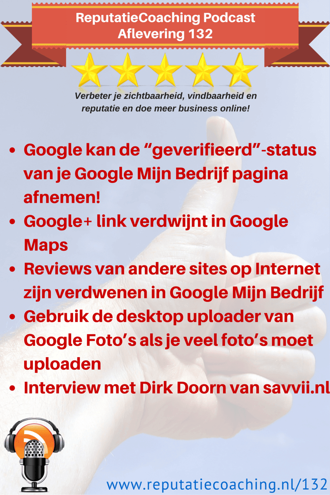

> **Historisch archief.** Deze aflevering verscheen op 11-06-2015 als onderdeel van ReputatieCoaching (2012–2016). De oorspronkelijke tekst is hieronder historisch bewaard. Diensten, contactgegevens, links, tools en adviezen kunnen inmiddels verouderd zijn.

**Transcriptiestatus:** Volledige transcriptie uit het oorspronkelijke archief.

**
Gisteren publiceerde ik het bericht dat Google je geverifieerde bedrijfspagina weer op “ongeverifieerd” kan zetten. Daar kom ik zo nog even op terug, voor het geval je het hebt gemist.**

**In Google Maps is de link naar de Google+ pagina van een bedrijf verdwenen. Wat zal daar achter zitten? Ook zijn reviews van andere sites op Internet uit je Mijn Bedrijf Dashboard verdwenen. Na de intro hoor je er meer over! Bovendien vertel ik je iets meer over mijn eerste upload-ervaringen met Google Foto’s.**

**En ja, ik heb in deze podcast niet veel nieuws, want ik heb ook vandaag weer een gast in de show die ons meer gaat vertellen over WordPress en managed WordPress hosting. En dat interview duurt zo’n 26 minuten.**

Hallo en hartelijk welkom bij deze aflevering van de ReputatieCoaching Podcast. Ik ben Eduard de Boer, ReputatieCoach. Dit is dé podcast die jou helpt om meer business te genereren, doordat jouw website beter gevonden wordt, zowel lokaal als landelijk en doordat ik je uitleg hoe je je online reputatie kunt verbeteren. Dit alles helpt je om je bedrijf en jezelf beter op de online kaart te plaatsen.

De podcast kun je vinden op [www.reputatiecoaching.nl/132](/nl/archief/reputatiecoaching/132/). Daar vind je niet alleen de tekst, maar ook video’s waar ik het in deze uitzending over heb, alsmede afbeeldingen, links enzovoorts. Bovendien is de podcast te beluisteren in [iTunes](https://web.archive.org/web/*/https://www.reputatiecoaching.nl/itunes), op [Stitcher](https://web.archive.org/web/*/https://www.reputatiecoaching.nl/stitcher) en ook op [TuneIn Radio](http://tunein.com/radio/ReputatieCoaching-Podcast-p655084/). Ik raad je aan om je op één van die drie kanalen te abonneren op de podcast, zodat je geen aflevering hoeft te missen!

Laat ik dan nu overgaan op de onderwerpen voor vandaag…

## Google kan de “geverifieerd”-status van je Google Mijn Bedrijf pagina afnemen!

*Historische afbeelding niet beschikbaar: Google+*
Vorige week werd duidelijk dat Google bezig gaat met het opschonen van alle bedrijfspagina’s. [Zo was te lezen dat als je langere tijd niet inlogt op je Google Mijn Bedrijf pagina, je de “geverifieerd”-status kunt kwijtraken](https://web.archive.org/web/*/https://www.reputatiecoaching.nl/google-maakt-paginas-ongeverifieerd-na-inactiviteit/). Want Google ziet dat als geringe betrokkenheid of een gebrek daaraan, waardoor de vermelde data mogelijk niet meer geheel actueel kan zijn.

Heb echter geen angst: als jij je pagina(’s) hebt geverifieerd en je ontvangt en leest nog steeds de mail van het bijbehorende mailadres, dan is er niets aan de hand. Google stuurt namelijk eerst een herinneringsmailtje.

## Google+ link verdwijnt in Google Maps

Even verder over Google+: voorheen kon je in Google Maps doorklikken naar de Google+ pagina van een bedrijf. Maar die link is weggehaald. Met de ontkoppeling van Google Foto’s, waar ik het [vorige week](/nl/archief/reputatiecoaching/131/) over had, de “geverifieerd”-status verwijderen en nu dit is het de vraag waar het heen zal gaan met Google Mijn Bedrijf. Wie weet wordt het weer helemaal kaal gestript en gaan we terug naar de soort Google Places die we een paar jaar geleden nog hadden.

Wat het wordt? Dat weet alleen Google!

## Reviews van andere sites op Internet zijn verdwenen in Google Mijn Bedrijf

En Google gaat nog verder met het veranderen van Google Mijn Bedrijf. Ik had het eventjes gemist, maar ik hoorde eergisteren dat Google circa een maand geleden al de reviews van andere reviewsites op Internet uit het Google Mijn Bedrijf Dashboard heeft gehaald.

Ik denk dat het verzamelen van reviews op veel andere sites met een hoge mate van autoriteit nog zeker zal lonen, omdat Google die sites heus nog wel in de gaten zal houden in haar poging om continu de gebruikerservaring te maximaliseren.

## Gebruik de desktop uploader van Google Foto’s als je veel foto’s moet uploaden

[[Historische afbeelding: Google Foto’s logo](https://lh3.googleusercontent.com/-drtQcSOTSCo/VW70suiamlI/AAAAAAAACPA/FncRkeI5FEA/w200/Google-Photos-icon-logo.png)](https://lh3.googleusercontent.com/-drtQcSOTSCo/VW70suiamlI/AAAAAAAACPA/FncRkeI5FEA/w200/Google-Photos-icon-logo.png)Vorige week vertelde ik je over het vernieuwde Google Foto’s. Ik was dus inmiddels heel voortvarend aan de slag gegaan met het kopiëren van duizenden foto’s naar de “Google Foto’s” folder in mijn Google Drive. Maar toen ik gisteren bezig was op Google Drive in de browser, zag ik dat de hoeveelheid beschikbare opslagcapaciteit op Google Drive aanzienlijk was afgenomen. En dat, terwijl ik nu net vorige week vertelde dat je onbeperkt foto’s kleiner dan 16 MegaPixels kunt uploaden naar Google Foto’s…

Wat was nu het geval? Het blijkt dat als je bestanden rechtstreeks naar Google Drive kopieert op je desktop in Explorer op Windows of Finder op de Mac, dan worden de foto’s niet verkleind en tellen ze dus wel mee in de totale beschikbare opslagcapaciteit.

Na enig zoeken vond ik de “[Google Foto’s Desktop-Uploader](https://photos.google.com/apps)” op de Google Foto’s site. Daarin kon ik simpelweg een directory met daaronder een paar honderd subdirectories met meer dan honderduizend foto’s toevoegen. En terwijl ik deze podcast maak, loopt die upload nog steeds. Het zal ook nog wel even duren tot alle foto’s zijn overgestuurd.

## Interview met Dirk Doorn van savvii.nl

[[Historische afbeelding: Dirk Doorn (savvii.nl)](https://lh6.googleusercontent.com/foSXqQgASWW3WKKbxqfp5Rv6SXBQxdCd41jDrQViWYM=s200-no)](https://lh6.googleusercontent.com/foSXqQgASWW3WKKbxqfp5Rv6SXBQxdCd41jDrQViWYM=s200-no)Hoe bekender en populairder je bedrijf of jij als ondernemer wordt, des te meer verkeer krijg je naar je site.

Waar het eerst niet echt uitmaakte als je website het eventjes niet deed, krijg het offline zijn nu opeens een waarde die je kunt uitdrukken in keiharde Euro’s: omzetverlies, reputatieschade en dergelijke. Dan wordt de uptime van je website cruciaal.

In Amerika en ook elders in de wereld zijn er al langere tijd bedrijven die exclusief zogenaamde “managed WordPress hosting” aanbieden. Sinds enige tijd is er ook zo’n bedrijf in Nederland. Dat bedrijf heet: Savvii, met dubbel ‘v’ en dubbel ‘i’.

[[Historische afbeelding: Logo Savvii](https://lh4.googleusercontent.com/-_cgd3PMcSYo/VXgSqBDd8gI/AAAAAAAACSI/UzKGFSbf91s/w372-h84-no/savvii_logo_RGB.png)](http://www.savvii.nl)

Vandaag heb ik Dirk Doorn van Savvii in de show die ons iets meer hierover gaat vertellen. Laat ik snel overschakelen naar het interview dat zo’n 26 minuten duurt.

```
  1. Hallo Dirk, leuk dat je tijd hebt vrijgemaakt om in de show te zijn. Zoals je wellicht tijdens jouw vooronderzoek hebt gezien ben ik een groot fan van WordPress als CMS en ik ben ervan overtuigd dat het voor een groot deel van de bedrijven en kleine zelfstandigen hèt pakket bij uitstek is, om hun webpresence te realiseren. Voordat we in Savvii en haar diensten duiken: kun je eerst iets over jezelf vertellen, over je achtergrond, vorige werkgevers, je hobby’s en dergelijke? Dan hebben we allemaal een goede indruk wie ik tegenover me heb.
  2. Savvii is niet echt een alledaagse naam en ik kan ‘m, afgezien van het Engelse “savvy” niet echt plaatsen. Dus kun je eerst een tipje van de sluier oplichten hoe jullie op die naam zijn gekomen? Komt het van het Engelse “savvy”?
  3. Dan de diensten, of beter gezegd “de dienst”: managed WordPress hosting… En ALLEEN managed WordPress hosting. Verder niets! Voor de luisteraars die het wel eens hebben gehoord, maar niet precies weten wat het is… Vertel eens: wat is precies managed WordPress hosting en waarin verschilt dit van je eigen website met je eigen domeinnaam hosten op wordpress.com en het zelf installeren van WordPress ergens bij een hosting provider? En is managed hosting ècht het enige wat jullie doen?
  4. Wat zijn de grote voordelen van managed hosting? Kleven er ook nadelen aan? Zo weet ik dat je op wordpress.com geen plugins kunt installeren… Kan dat bijvoorbeeld wel bij jullie?
  5. Duidelijk! Ik begrijp dus dat bij jullie mijn website waarschijnlijk sneller is, de kans op storingen minimaal is en dat jullie ook echt 24 x 7 beschikbaar zijn voor problemen. Daar hangt natuurlijk dan een kostenkaartje aan. Waar moeten potentiële klanten aan denken qua tariefstelling, als ze hun website bij jullie willen onderbrengen?
  6. Wat heb je voor tips voor de luisteraars om je WordPress site sneller te maken?
  7. Op jullie website las ik dat Joost de Valk van Yoast.com zijn website aan jullie heeft toevertrouwd, evenals Karel Geenen die ik vorig jaar in de show had. Welke andere bekende namen hebben zoal de zorg voor de hosting van hun website bij jullie ondergebracht?
  8. Mij is het duidelijk! Eigenlijk moet ik dus ook over! Ik kan me goed voorstellen dat er luisteraars van de podcast of lezers op de website zijn die graag met jullie in contact komen! Waar kunnen zij jullie vinden? Hoe kunnen ze met jullie contact opnemen?
```

Dirk, ontzettend bedankt voor je tijd en succes met het aanbieden en verkopen van jullie WordPress hosting!

\*\*LET OP: In deze show notes vind je alleen de vragen.
Voor de audio verwijs ik je naar de podcast.
(De transcriptie volgt binnenkort)\*\*Tot zover het interview met Dirk Doorn van Savvii.nl. Voor alle duidelijkheid, dit interview is niet gesponsord en ik heb verder geen commerciële banden met Savvii.

Maar ik moet zeggen dat Dirk een aantal waardevolle tips en adviezen heeft verteld, waar we allemaal ons voordeel mee kunnen doen.

Dan kom ik daarmee weer aan het einde van de podcast van deze week. Ik hoop dat je wat had aan mijn nieuwtjes van Google+ en bovenal aan het interview met Dirk.

Als je de podcast leuk vindt en je wilt nog meer op de hoogte blijven, volg me dan ook op Twitter, via [@reputatiecoach1](https://twitter.com/reputatiecoach1).

Heb je daadwerkelijk wat aan alle informatie die ik met je deel, help mij dan met het verder verbeteren en promoten van deze podcast. Abonneer je op de podcast, zodat je altijd meteen de nieuwste uitzending krijgt voorgeschoteld.

Zoek de podcast op, in [iTunes](https://web.archive.org/web/*/https://www.reputatiecoaching.nl/itunes) of [Stitcher](https://web.archive.org/web/*/https://www.reputatiecoaching.nl/stitcher), geef de podcast een sterrenbeoordeling en laat ook je reactie achter. Door de podcast te beoordelen op iTunes en/of Stitcher breng je de podcast onder de aandacht van een breder publiek.

Je kunt me verder helpen, door de podcast aan te bevelen bij vrienden of collega’s, waarvan je denkt dat ze er hun voordeel mee kunnen doen, of door ’m te delen op Twitter, like’n en delen op Facebook of een “+1” te geven op Google+.

En vergeet niet: ik ben hier om je te helpen! Als je een vraag of een probleem hebt met betrekking tot je online reputatie of de vindbaarheid van je website, kun je een mailtje sturen naar [podcast@reputatiecoaching.nl](mailto:podcast@reputatiecoaching.nl).

Als je dat te lastig vindt, of als je de podcast beluistert terwijl je in de auto zit en je hebt acuut een vraag, spreek dan een boodschap in op de ReputatieCoaching Hotline, op nummer: 084 - 883 15 56. Mogelijk behandel ik je vraag of probleem dan in een artikel of in de podcast.

En je kunt ook rechtstreeks op de website een voicemail achterlaten, door op de tab aan de rechterkant van elke pagina te klikken, en je bericht in te spreken. Dit was [ReputatieCoaching Podcast aflevering 132][1] en mijn naam is [Eduard de Boer](http://nl.linkedin.com/in/eduarddeboer/nl).

Ik wens je de komende week weer succes met het werken aan je reputatie, zodat je meteen je reputatie voor jou kunt laten werken!

Tot volgende week!

Doei!

Links naar content die in deze podcast aan bod komt:

```
  * [ReputatieCoaching Podcast in iTunes](https://web.archive.org/web/*/https://www.reputatiecoaching.nl/itunes)
  * [ReputatieCoaching Podcast op Stitcher](https://web.archive.org/web/*/https://www.reputatiecoaching.nl/stitcher)
  * [ReputatieCoaching Podcast op TuneIn Radio](http://tunein.com/radio/ReputatieCoaching-Podcast-p655084/)
  * [ReputatieCoaching Podcast RSS-feed](https://feeds.reputatiecoaching.nl/ReputatieCoachingPodcast)
  * [Savvii](http://www.savvii.nl) (Managed WordPress Hosting)
```
