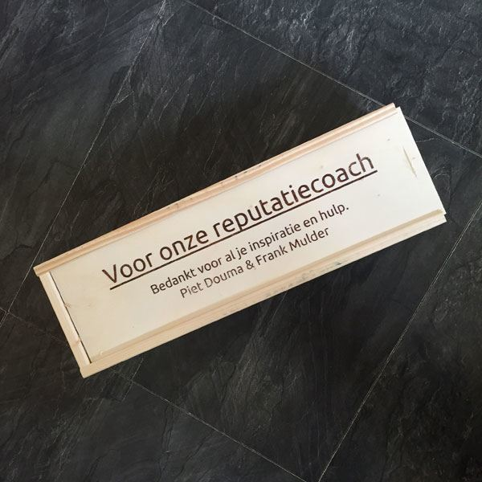
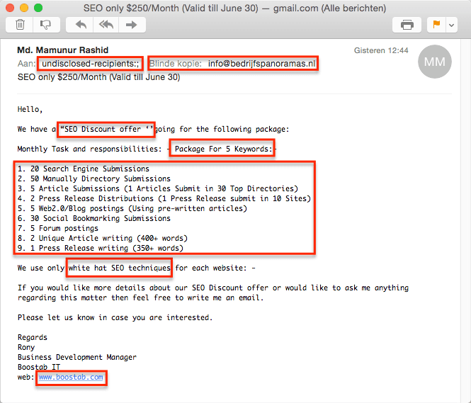
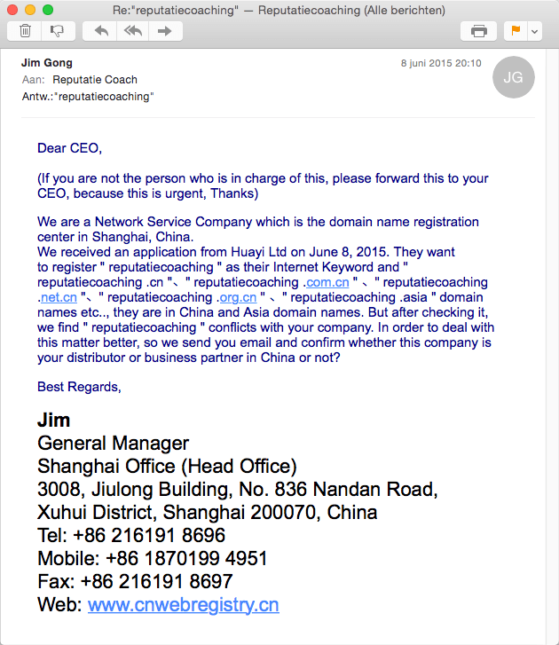
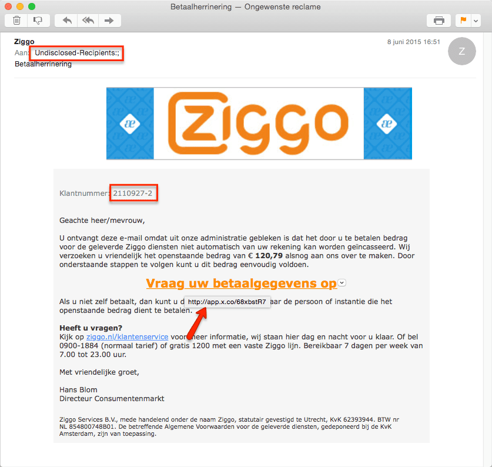

> **Historisch archief.** Deze aflevering verscheen op 18-06-2015 als onderdeel van ReputatieCoaching (2012–2016). De oorspronkelijke tekst is hieronder historisch bewaard. Diensten, contactgegevens, links, tools en adviezen kunnen inmiddels verouderd zijn.



**Transcriptiestatus:** Volledige transcriptie uit het oorspronkelijke archief.

**
Fantastische en ongelofelijk mooie SEO aanbiedingen komen te kust en te keur. Het eerste topic van de twee die ik vandaag voor je heb, gaat over TE mooie aanbiedingen, fraude en phishing. Ik ontving twee prachtige berichten in de mail die ik graag met je deel. Ook denken sommige mensen dat ik mogelijk reputatiecoaching.cn in China wil registreren en dus nemen ze contact op. Weer anderen sturen fake incassos uit naam van Ziggo in de hoop dat ik die betaal.**

**In het tweede deel van de podcast heb ik een interview met Chris van Vleuten, de videomarketingspecialist uit Bergen, Noord-Holland. Hij vertelt over hoe video in de afgelopen jaren is veranderd en ook geeft hij praktische tips als je zelf video wilt gaan maken.**

Hallo en hartelijk welkom bij deze aflevering van de ReputatieCoaching Podcast. Ik ben Eduard de Boer, ReputatieCoach. Dit is dé podcast die jou helpt om meer business te genereren, doordat jouw website beter gevonden wordt, zowel lokaal als landelijk en doordat ik je uitleg hoe je je online reputatie kunt verbeteren. Dit alles helpt je om je bedrijf en jezelf beter op de online kaart te plaatsen.

De podcast van vandaag kun je vinden op [www.reputatiecoaching.nl/133](https://www.reputatiecoaching.nl/133/). Daar vind je niet alleen de tekst, maar ook video’s waar ik het in deze uitzending over heb, alsmede afbeeldingen, links enzovoorts. Bovendien is de podcast te beluisteren in [iTunes](https://www.reputatiecoaching.nl/itunes), op [Stitcher](https://www.reputatiecoaching.nl/stitcher) en ook op [TuneIn Radio](http://tunein.com/radio/ReputatieCoaching-Podcast-p655084/). Ik raad je aan om je op één van die drie kanalen te abonneren op de podcast, zodat je geen aflevering hoeft te missen!

Voor ik overga op de onderwerpen van vandaag even een bedankje. In podcast 126 vertelde ik je over [fysiotherapeut Frank](https://www.reputatiecoaching.nl/126/) die mijn hulp had ingeroepen. Ik heb toen zijn vragen grotendeels beantwoord. Een paar weken geleden ben ik bij hem op bezoek geweest om hem verder op weg te helpen. Ook heb ik inmiddels het toen beloofde stappenplan voor hem opgesteld, dat hem moet helpen met de vier fysiotherapiepraktijken hogerop te komen in de lokale zoekresultaten.

Frank volgt het stappenplan en af en toe stelt hij mij via Google Hangouts een vraagje voor meer informatie. Die samenwerking loopt perfect. Frank is goed bezig met het opschonen en consistent maken van bestaande citations en het creëren van nieuwe citations.

Eergisteren ontving ik een cadeautje per post! Er zat een kistje in met een fles wijn, als dank van Frank en zijn collega Piet. Nou Frank en Piet, jullie ook bedankt voor de fles wijn!

In de podcast heb ik een foto opgenomen van het kistje:

[](https://lh3.googleusercontent.com/-WXxKgyeEUdU/VYGMaukNAEI/AAAAAAAACUo/OfOBUH-lDfM/s600-no/20150617-kistje-wijn.jpg)

Laat ik dan nu overgaan op de onderwerpen voor vandaag…

## Toppositie voor US$250 per maand en eerste plaats op Google!

Je hebt het mij al vaker horen zeggen: als iets te mooi lijkt om waar te zijn, dan is het vrijwel altijd dat: te mooi om waar te zijn… Zo ook de mail met de fantastische aanbieding die ik ontving van een zekere Mohammed Mamunur Rashid. Als ik voor US$250 per maand gebruik maak van zijn diensten, dan doet hij voor 5 trefwoorden het volgende:

[](https://lh3.googleusercontent.com/-_j1Kg3Ih5A4/VYGMZ7spADI/AAAAAAAACUw/MvYJTEwQrEc/w665-h569-no/20150616-SEO-discount-offer.png)

```
  1. 20 zoekmachine aanmeldingen
  2. 50 handmatige directory aanmeldingen
  3. 5 artikelen schrijven, waarvan 1 in de top 30 directories
  4. 2 persberichten schrijven, waarvan 1 in 10 sites wordt gekopieerd
  5. 5 Web/2.0 blog postings met de voornoemde artikelen
  6. 30 social bookmarks
  7. 5 forum posts
  8. 2 unieke artikelen schrijven van meer dan 400 woorden
  9. 1 persbericht schrijven van meer dan 350 woorden
```

Oh ja, en ze garanderen dat ze alleen zogenaamde “*white hat*” technieken zullen gebruiken…

Beste luisteraar van de podcast of lezer van het weblog, ik hoop dat je tegenwoordig niet meer in dit soort aanbiedingen trapt met de illusie dat je daadwerkelijk hogerop zult komen in de zoekresultaten! Vraag je eerst eens af, hoe groot de kans is dat iemand die jou in het Engels benadert, foutloos en perfect Nederlands kan schrijven…

Stel dat Mamunur dat kan… of iemand heeft die dat kan… En je gaat met hem in zee. Mogelijk krijg je tijdelijk een een boost in de zoekresultaten, maar ik kan je garanderen dat je daarna genadeloos diep zult vallen.

In de afbeelding die ik heb opgenomen in de show notes heb ik zo’n beetje alle foute signalen rood omkaderd en dan heb ik zijn naam nog niet eens geaccentueerd. Bovendien wijst de URL naar een site die vrijwel leeg is. Er is een kopje SEO, maar als je daarop klikt, zie je geen tekst, maar word je verzocht een contactformulier in te vullen.

## ReputatieCoaching in China?

Ik kreeg onlangs nog een andere leuke mail. Die kwam uit China. De mail ga ik je niet voorlezen in de podcast, want ik heb de tekst opgenomen in de show notes, op [www.reputatiecoaching.nl/133][133]. Het komt op het volgende neer. Schijnbaar wil iemand in China de domeinnamen “reputatiecoaching.cn”, “reputatiecoaching.com.cn”, “reputatiecoaching.net.cn” en ga zo maar door, registreren. Na grondig onderzoek kwam deze partij erachter dat ik de naam ReputatieCoaching had geclaimd. En ze willen graag weten of deze partij een business partner is van mij in China of niet:

[](https://lh3.googleusercontent.com/-r_CEz6zJ-c0/VYGMavIOTUI/AAAAAAAACU4/hPgdj-gm71c/w630-h727-no/20150617-reputatiecoaching-china.png)

Ze willen nu dat ik contact opneem, waarschijnlijk uit angst dat ik verkeer ga kwijtraken, als mensen zoeken op “reputatiecoach” of “reputatiecoaching”. En dan ben ik natuurlijk aan de beurt: dan zal ik moeten betalen. Het enige wat ik daarop kan zeggen is een citaat uit een oude reclame van de Amro bank, toen deze nog niet was gefuseerd met de ABN… Oud dus… Maar het citaat is:

## Fake incasso van Ziggo

Internetoplichters blijven toch vanalles proberen om mensen geld afhandig te maken. Zo ontving ik laatst een op zich keurig uitziende mail die afkomstig leek van Ziggo. Hierin werd mij verteld dat ik een rekening van EUR 120,79 open had staan, met het verzoek dit zo snel mogelijk over te maken:

[](https://lh6.googleusercontent.com/-I6Sz4-A9jhA/VYGMZ8o_WLI/AAAAAAAACUs/og-Mfqo8jrs/w837-h794-no/20150611-Ziggo-fake.png)

Een paar dingen vielen mij meteen op:

```
  1. De mail was niet aan mij rechtstreeks gericht, maar aan een aantal mensen via BCC… Je ziet dat in het veldje “Aan:”, waarin Undisclosed-Recipients staat. Dat zou Ziggo nooit doen.
  2. Het klantnummer klopt niet met mijn echte klantnummer, waaronder ik bij Ziggo bekend ben.
  3. Als ik met mijn muis over de link beweeg zie ik een bijzondere URL-shortener, namelijk app.x.co. Als je dat intypt als zoekterm op Google, vind je dat dit een URL shortener is van GoDaddy. En ik kan me niet voorstellen dat Ziggo als Internet provider haar betaalsysteem onderbrengt bij GoDaddy in de Verenigde Staten!
```

Oh ja, toen ik met een browser, waarin ik eerst alle cookies en dergelijke had gewist, naar de pagina toe ging, kreeg ik de melding dat het bijbehorende account over haar quota was…

Al met al was dit dus niet kosher. Zo zie je maar weer dat je altijd goed moet oppassen met alle berichten die je ontvangt, ook al zien ze er nog zo legitiem uit.

## Interview met videomarketingspecialist Chris van Vleuten

[](https://nl.linkedin.com/in/vanvleuten)Een paar jaar geleden heb ik op een avond van de PSA, de Public Speaking Association in Utrecht, Chris van Vleuten leren kennen. En kort gezegd: Chris doet video. In dit interview ga ik proberen van hem los te peuteren wat de kracht van video is, hoe je in deze moderne tijd video voor jou kunt laten werken en hopelijk kan Chris ook nog tips geven voor mensen die zelf aan de gang willen met video.

**Hieronder vind je alleen de vragen die ik Chris heb gesteld.
Voor de dialoog verwijs ik je naar de audio.**

```
  1. Hallo Chris. Wij spreken elkaar een paar keer per jaar, denk ik. Maar omdat de luisteraars jou nog niet kennen, is het voor hen prettig om iets meer te vernemen over de persoon Chris van Vleuten. Dus Chris, kun je iets meer over jezelf vertellen: je achtergrond, hoe je in video bent gerold, je hobby’s en dergelijke?
  2. Je bedrijf heet FV Media en als ik me het goed herinner werk je samen met je compagnon, Almar. Kun je iets meer over jullie bedrijf vertellen… En wat voor soort video’s jullie schieten, voor wat voor klanten en dergelijke?
  3. Is de marketingwaarde of kracht van video de afgelopen jaren in jouw ogen toegenomen als gevolg van videosites als YouTube, Vimeo, Dailymotion en de sociale media? En zien jullie als gevolg hiervan ook een groei in het aantal opdrachten?
  4. Wat vind je van de meerderheid van de video’s op Internet? Vanuit jouw professionele ogen gezien? (Laten we portrait of verticaal gefilmde video er even buiten laten. Dat is natuurlijk sowieso “NOT DONE!” :-)
  5. Als we dan eens in de wereld van DoeHetZelf videografie duiken… Veel ondernemers en/of webmasters willen eigenlijk zelf wel iets met video gaan doen, maar hebben geen idee hoe ze het moeten aanpakken… Om te beginnen: moet je tegenwoordig een dure professionele videocamera hebben om goed ogende video’s voor Internet te maken? Ik lees ook dat veel mensen tegenwoordig filmen met een digitale spiegelreflexcamera en ik maak zelfs dikwijls simpele opnames hier op kantoor met een 1080p Full HD webcam. Wat zijn jouw ideeën daarover? Is dat vloeken in de kerk?
  6. Welke adviezen heb jij voor de beginner ten aanzien van (volgens mij) belangrijke onderdelen, als: achtergrond c.q. omgeving waarin je filmt, gebruik van statief, geluidskwaliteit en dergelijke?
  7. Wat zijn typische beginnersfouten die iedereen moet vermijden als hij of zij video schiet?
  8. Chris, bedankt voor je tijd en uitleg. Ik heb weer ontzettend veel geleerd! Dat is het leuke van dit soort interviews: ik krijg meestal zo’n 15 tot 20 minuten gratis training van de pros! Maar goed, als ondernemers of organisaties in Noord-Holland een kwalitatief goede video gemaakt willen hebben: waarom moeten ze dan FV Media inhuren en hoe en waar kunnen ze jullie bereiken? Ga lekker los: nu mag je commercieel zijn!
```

Chris, nogmaals dank en hopelijk weer eens tot snel!

Voorbeeld van een drone video uit de serie “Bergen van Boven” van FV Media:

## 23 reviewbedrijven aangeschreven

*Historische afbeelding niet beschikbaar: excellent-reputatie*
Tot zover het interview met Chris van Vleuten. Om je ook in de zomermaanden van hopelijk interessante content te voorzien heb ik een 23-tal reviewbedrijven aangeschreven, te weten:

```
  1. Ekomi
  2. Klantenvertellen
  3. Patientenreview
  4. Trustpilot
  5. ZorgkaartNederland
  6. Independer
  7. ANWB garagereviews
  8. Zoover
  9. Thuiswinkel.org
  10. Tripadvisor
  11. Kieskeurig
  12. Feedback Company
  13. Vakantiepanel
  14. KiyOh
  15. Ervaringensite.nl
  16. Webwinkelkeur
  17. Wugly
  18. Telefoonboek
  19. Zorgkiezer
  20. Vergelijkmondzorg.nl
  21. Patientenvertellen.nl
  22. Tandartservaring.nl
  23. Booking.com
```

Mogelijk benader ik de komende tijd nog een paar bedrijven. 5 bedrijven hebben inmiddels al toegezegd graag te willen deelnemen aan het interview, waaronder Trustpilot, KiyOh en Feedback Company. Telefoonboek heeft uitdrukkelijk te kennen gegeven dat zij niet mee willen werken. Dat is jammer, maar ik respecteer hun keuze om niet in de schijnwerpers te willen.

Volgende week vinden de eerste interviews al plaats… En mocht jij dus nog vragen hebben waarvan je graag wilt dat ik die stel, stuur ze dan snel op, zodat ik ze nog kan meenemen. Ik heb al wel een aantal vragen, maar een paar van jullie is ook altijd leuk!

En met deze aankondiging kom ik dan weer aan het einde van deze podcast. Ik hoop dat je ’m weer leuk vond en dat je iets hebt opgestoken van zowel de topics over phishing en fraude, maar natuurlijk van het verhaal van Chris. Ik heb in elk geval er uit meegenomen dat ik toch echt altijd vooraf een soort scriptje moet maken, voordat ik begin met het opnemen van een video.

Als je de podcast leuk vindt en je wilt nog meer op de hoogte blijven, volg me dan ook op Twitter, via [@reputatiecoach1](https://twitter.com/reputatiecoach1).

Heb je inderdaad wat aan alle informatie die ik met je deel, help mij dan met het verder verbeteren en promoten van deze podcast. Abonneer je op de podcast, zodat je altijd meteen de nieuwste uitzending krijgt voorgeschoteld.

Zoek de podcast op, in [iTunes](https://www.reputatiecoaching.nl/itunes) of [Stitcher](https://www.reputatiecoaching.nl/stitcher), geef de podcast een sterrenbeoordeling en laat ook je reactie achter. Door de podcast te beoordelen op iTunes en/of Stitcher breng je de podcast onder de aandacht van een breder publiek.

Je kunt me verder helpen, door de podcast aan te bevelen bij vrienden of collega’s, waarvan je denkt dat ze er hun voordeel mee kunnen doen, of door ’m te delen op Twitter, like’n en delen op Facebook of een “+1” te geven op Google+.

En vergeet niet: ik ben hier om je te helpen! Als je een vraag of een probleem hebt met betrekking tot je online reputatie of de vindbaarheid van je website, kun je een mailtje sturen naar [podcast@reputatiecoaching.nl](mailto:podcast@reputatiecoaching.nl).

Als je dat te lastig vindt, of als je de podcast beluistert terwijl je in de auto zit en je hebt acuut een vraag, spreek dan een boodschap in op de ReputatieCoaching Hotline, op nummer: 084 - 883 15 56. Mogelijk behandel ik je vraag of probleem dan in een artikel of in de podcast.

En je kunt ook rechtstreeks op de website een voicemail achterlaten, door op de tab aan de rechterkant van elke pagina te klikken, en je bericht in te spreken. Dit was [ReputatieCoaching Podcast aflevering 133][1] en mijn naam is [Eduard de Boer](http://nl.linkedin.com/in/eduarddeboer/nl).

Ik wens je de komende week weer succes met het werken aan je reputatie, zodat je meteen je reputatie voor jou kunt laten werken!

Tot volgende week!

Doei!

Links naar content die in deze podcast aan bod komt:

```
  * [ReputatieCoaching Podcast in iTunes](https://www.reputatiecoaching.nl/itunes)
  * [ReputatieCoaching Podcast op Stitcher](https://www.reputatiecoaching.nl/stitcher)
  * [ReputatieCoaching Podcast op TuneIn Radio](http://tunein.com/radio/ReputatieCoaching-Podcast-p655084/)
  * [ReputatieCoaching Podcast RSS-feed](https://feeds.reputatiecoaching.nl/ReputatieCoachingPodcast)
  * [Chris van Vleuten](https://nl.linkedin.com/in/vanvleuten) (profiel op LinkedIn)
  * [FV Media](http://www.fvmedia.nl)
```
