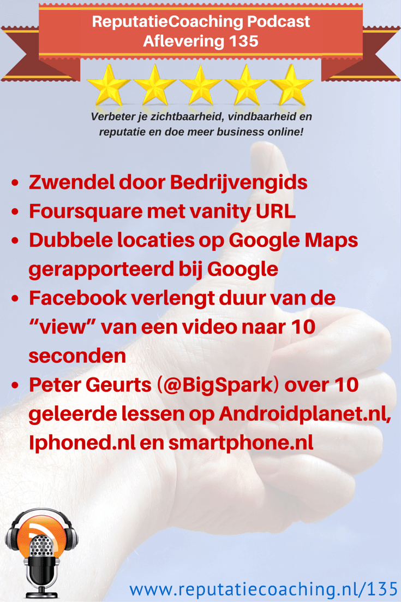
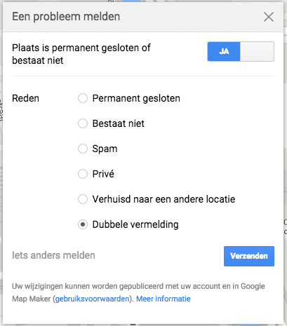
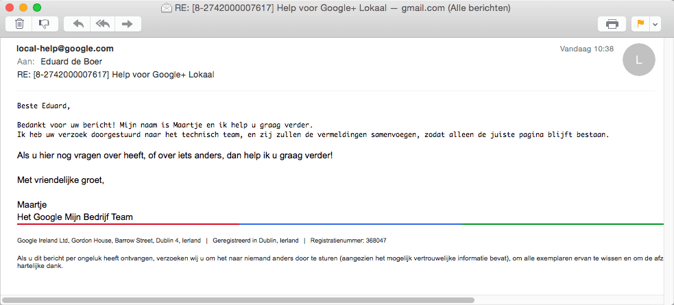
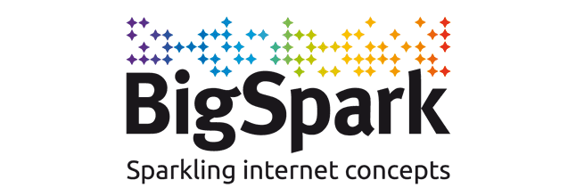

> **Historisch archief.** Deze aflevering verscheen op 2-07-2015 als onderdeel van ReputatieCoaching (2012–2016). De oorspronkelijke tekst is hieronder historisch bewaard. Diensten, contactgegevens, links, tools en adviezen kunnen inmiddels verouderd zijn.



**Transcriptiestatus:** Volledige transcriptie uit het oorspronkelijke archief.

**
Ik ontving eergisteren weer een leuke mail van Martin Stevens, de fotograaf uit Rotterdam: hij werd weer eens telefonisch lastiggevallen door een bedrijfsvermeldingssite op een naar zwendel riekende manier. Daar begin in de podcast van vandaag mee. Daarna vertel ik je hoe je een mooie vanity URL kunt claimen op Foursquare.**

**Verder heb ik bij Google samen met een ondernemer die ik begeleid een paar dubbele locaties op Google Maps gerapporteerd. Intussen heeft Facebook de lengte van video “views” aangepast om daarmee een eind te maken aan gemopper door Internetmarketeers.**

**Ik sluit de podcast van vandaag af met de eerste drie van 10 geleerde lessen door Peter Geurts, oprichter van BigSpark, het bedrijf achter Androidplanet.nl, Iphoned.nl en smartphone.nl.**

Hallo en hartelijk welkom bij deze aflevering van de ReputatieCoaching Podcast. Ik ben Eduard de Boer, ReputatieCoach. Dit is dé podcast die jou helpt om meer business te genereren, doordat jouw website beter gevonden wordt, zowel lokaal als landelijk en doordat ik je uitleg hoe je je online reputatie kunt verbeteren. Dit alles helpt je om je bedrijf en jezelf beter op de online kaart te plaatsen.

De podcast kun je vinden op [www.reputatiecoaching.nl/135](https://www.reputatiecoaching.nl/135/). Daar vind je niet alleen de tekst, maar ook video’s waar ik het in deze uitzending over heb, alsmede afbeeldingen, links enzovoorts. Bovendien is de podcast te beluisteren in [iTunes](https://www.reputatiecoaching.nl/itunes), op [Stitcher](https://www.reputatiecoaching.nl/stitcher) en ook op [TuneIn Radio](http://tunein.com/radio/ReputatieCoaching-Podcast-p655084/). Ik raad je aan om je op één van die drie kanalen te abonneren op de podcast, zodat je geen aflevering hoeft te missen!

Laat ik dan nu overgaan op de onderwerpen voor vandaag…

## Zwendel door Bedrijvengids

Laat ik op voorhand zeggen dat ik niet weet over welke bedrijvengids dit mailtje van Mart Stevens gaat. Dus ik beschuldig geen enkel specifiek bedrijf en ook geen bepaalde website. Maar als je de inhoud van de mail hoort, dan besef je weer eens temeer dat je ontzettend alert moet zijn en kritisch moet luisteren, als je gebeld wordt over één of andere bedrijfsvermelding.

Martin schreef het volgende…

Dit is interessant. Zojuist wordt ik gebeld door iemand die beweert te bellen voor de Bedrijvengids. Hij stelt zich voor en ratelt vervolgens een heel verhaal af waarbij de goede man mij duidelijk maakt dat ik de “vorige keer” afzag van een uitgebreide vermelding vanwege de kosten, namelijk € 895. Doorratelend vraagt hij mij of mijn mening nog steeds ongewijzigd is of dat de vermelding voor eenmalig € 195 goed vermeld kan worden.

Nu wordt het spannend. Uiteraard zeg ik tegen de beller dat ik met hen niet in zee wil en dus niet geïnteresseerd. “Prima” antwoord de man vlot en adequaat, “dan zullen wij uw basisvermelding voor eenmalig € 195 handhaven en wens ik u een prettige dag”.

Nu moet ik razendsnel zijn en gelukkig ben ik goed wakker. Nog voordat de hoorn er op wordt gegooid zeg ik ferm: “NEE” zodat ook dat duidelijk op de eventuele bandopname staat om vervolgens direct daarna duidelijk te maken dat ik nergens mee akkoord ga, dus ook niet met welke vermelding dan ook. Nu vraagt de man wat ik bedoel. Kijk, zowaar interactie! Pas nu kan ik de man uitleggen dat ik nergens vermeld wil worden als ik daar voor moet betalen, bevestigt de man dit en kondigt hij aan mij uit het “systeem” te halen en verbreekt de verbinding.

“Tot volgend jaar”, denk ik in mijn hoofd. Hopelijk ben ik dan weer net zo wakker als nu.

Met vriendelijke groet,

Martin Stevens

Nogmaals: ik beschuldig geen enkel specifiek bedrijf, maar dit is gewoon ongehoord! Zoals Martin terecht veronderstelde zal de dialoog zelfs wel zonder toestemming worden opgenomen, zodat ze altijd in hun recht staan, mocht je ze voor de rechter slepen. Jij bent dan kansloos, omdat je hebt toegestemd.

Dit soort fraude- en zwendelpraktijken zijn vandaag de dag schering en inslag. Ik vertel altijd en overal tijdens trainingen en webinars dat je *nooit ofte nimmer* zou moeten betallen voor een basisvermelding ergens op een directorysite. Het is logisch dat als je meer features wilt op een directorysite, je mogelijk zult moeten betalen. Zo laten sommige sites je betalen als je wilt dat jouw vermelding zonder reclame wordt weergegeven, of als je reviewsterretjes bij je bedrijfsvermelding in de zoekresultaten wilt en dergelijke.

Daarmee is het concept dus: basis is gratis. Wil je meer, dan moet je betalen.

Tegenwoordig houdt de basis vaak in, dat “alleen” jouw bedrijfsnaam, vestigingsadres, postcode, plaats en telefoonnummer wordt vermeld. Bij sommige sites moet je al betalen, als je een link naar je website erbij wilt. Dat zou ik dus niet doen.

Want als je alleen gaat voor een hogere ranking in de lokale zoekresultaten, dus voor lokale SEO, dan volstaat de basisvermelding voor jou. Het is namelijk een volledige NAPT: Naam, Adres, Postcode / Plaats en Telefoonnummer!

Daarom is mijn advies dat je voor een basisvermelding niet moet betalen.

## Foursquare met vanity URL

*Historische afbeelding niet beschikbaar: Foursquare*
Er is overigens één uitzondering op mijn regel dat je niet zou moeten betalen voor een basisvermelding van je bedrijf op een willekeurige directorysite. Maar ook die uitzondering vertel ik altijd aan ondernemers die ik begeleid. Dat is de vermelding bij Foursquare. Als je je bedrijf claimt op Foursquare op de standaard manier, dat is dus zonder te betalen, dan kan het lang duren voordat je daadwerkelijk met je bedrijfsvermelding aan de slag kunt.

Je kunt ervoor kiezen om een speedy verificatie te doen, door eenmalig US$20 te betalen. Mijn advies in het geval van Foursquare is: DOEN! Betaal eenmalig die US$20! Je vermelding op Foursquare is ontzettend krachtig, dus dat moet je er echt voor over hebben.

En als je dan je bedrijf hebt geclaimd op Foursquare, moet je natuurlijk zoveel mogelijk bedrijfsgegevens vermelden of corrigeren. Vergeet de openingstijden niet, evenals je website, korte bedrijfsomschrijving en dergelijke.

Maar wat ook heel belangrijk is, is dat je niet je Twitter-handle invult, evenals je website, maar dat je je Twitter account verifieert. Dat gaat als volgt:

```
  * Login op Foursquare
  * Klik op je locatie
  * Klik “Manage your listing”
  * Onder “Social Connections”, klik “Add Twitter” en login op Twitter met de juiste gegevens.
```

Het voordeel hiervan is dat je een mooie vanity URL krijgt op Foursquare. In plaats van de initiële complexe URL, krijg je dan: foursquare.com/ . Zo is bijvoorbeeld de vanity URL voor Allround Fotografie: [foursquare.com/allroundfoto](https://foursquare.com/allroundfoto).

## Dubbele locaties op Google Maps gerapporteerd bij Google

*Historische afbeelding niet beschikbaar: Zet je bedrijf op de mobiele kaarten!*
Ik help verschillende mensen om hun bedrijfsvermeldingen hogerop te krijgen in de lokale zoekresultaten. Een vast onderdeel daarvan is altijd het onderzoeken of er één en slechts één bedrijfspagina in Google staat. Meestal volstaat het om in Google+ of op Google Maps te zoeken naar de bedrijfsvermelding. Dan kom je eventuele duplicaatpagina’s vaak snel op het spoor. En duplicaten in Google Maps of Google Mijn Bedrijf werken nadelig voor je lokale rankings.

Eerder deze week kwam ik voor een bedrijf met een paar locaties maar liefst vier extra vermeldingen tegen voor twee locaties.

Tot op heden lukte het altijd om dubbele pagina’s te claimen of te laten claimen door de bedrijfseigenaar, om ze daarna te verwijderen. Maar voor deze ging dat niet en dus heb ik ’m in Google gerapporteerd als “dubbele vermelding”, met een verwijzing naar de originele Google+ Mijn Bedrijf pagina.

Dat doe je in Google Maps door te klikken op de locatie en daarna op de tekst “Een bewerking voorstellen”. Voor een dubbele pagina klik je op “Plaats is permanent gesloten of bestaat niet”, zodat er “Ja” naast komt te staan. Dan selecteer je “Dubbele vermelding”, zoals je kunt zien op het plaatje, dat ik in de show notes op [www.reputatiecoaching.nl/135](https://www.reputatiecoaching.nl/135/) heb opgenomen:



Iets minder dan 24 uur later kreeg ik een keurig mailtje van Google, dat mij informeerde dat Google het probleem in behandeling heeft genomen:

[](https://lh3.googleusercontent.com/-8fIBMLZS9_Y/VZURlIlDdKI/AAAAAAAACeI/xexy0K4fqCs/w983-h445-no/20150701-google-local-help.png)

Nu ben ik benieuwd of ik ook nog een bevestiging krijg, als de actie daadwerkelijk is uitgevoerd. Dat hoop ik je binnenkort te kunnen vertellen.

## Facebook verlengt duur van de “view” van een video naar 10 seconden

*Historische afbeelding niet beschikbaar: Facebook*
In [podcast 128](https://www.reputatiecoaching.nl/128/) vertelde ik je over de verschillen in definitie en tijdsduur van zogenaamde video “views” op de diverse platformen. Zo vond Facebook toen dat een gebruiker een video had bekeken, als de video tenminste drie seconden had gespeeld. Dat is natuurlijk wel erg kort en zo kom je als ondernemer natuurlijk wel heel snel op een groot aantal “views”.

Het nadeel was ook dat videomarketeers op Facebook heel hoge kosten maakten, doordat video’s al heel snel werden gemarkeerd als “bekeken”, nog voordat de video goed en wel was bekeken.

Daarom heeft Facebook sinds deze week de definitie van een “view”, of beter gezegd de tijdsduur van een “view” aangepast. Nu geldt een video als bekeken, als die tenminste 10 seconden heeft gespeeld.

Het leuke voor marketeers is weer, dat ze hier handig op kunnen inspringen. Want als je een heel sterke Call to Action aanbrengt binnen de eerste tien seconden, dan is de kans groot dat iemand doorklikt en je dus niet betaalt voor de “view”.

## Peter Geurts (BigSpark) over 10 geleerde lessen op Androidplanet.nl, Iphoned.nl en smartphone.nl

Eind vorige maand was ik in Nijmegen bij #WPM024, dat staat voor “WordPress Meetup Nijmegen”: een WordPress evenement dat elk kwartaal wordt georganiseerd in Nijmegen. Die avond werden er twee presentaties gehouden: eentje over het verbeteren van de useability van websites voor mensen die visueel beperkt zijn en een tweede presentatie over de 10 geleerde lessen op Androidplanet.nl, Iphoned.nl en smartphone.nl.

Deze tweede presentatie werd gegeven door Peter Geurts, oprichter van BigSpark, het bedrijf achter de drie websites die ik zojuist noemde.

[](https://lh4.googleusercontent.com/-JKbCBO8aD6U/VZUSY4nNcCI/AAAAAAAACew/leNhwzJbSiA/w646-h220-no/logo-bigspark.png)Met zijn toestemming (en die van de organisatie van #WPM024) geef ik je vandaag de introductie van Peter Geurts, en de eerste drie geleerde lessen. Deze drie lessen zijn:

```
  1. Bouw een solide basis voor je website
  2. Bepaal je focus
  3. SEO best practices
```

Laat ik dan nu overschakelen naar de presentatie door Peter Geurts van BigSpark…

**Voor het daadwerkelijke verhaal van Peter Geurts verwijs ik je naar de podcast**

Ik vond de presentatie van Peter iets te lang om in zijn geheel op te nemen in de podcast, dus dat is de reden dat ik ’m in drieën heb geknipt. Zo heb je ook alweer iets om naar uit te kijken in de podcast van volgende week.

Als je de podcast leuk vindt en je wilt nog meer op de hoogte blijven, volg me dan ook op Twitter, via [@reputatiecoach1](https://twitter.com/reputatiecoach1).

Heb je inderdaad wat aan alle informatie die ik met je deel, help mij dan met het verder verbeteren en promoten van deze podcast. Abonneer je op de podcast, zodat je altijd meteen de nieuwste uitzending krijgt voorgeschoteld.

Zoek de podcast op, in [iTunes](https://www.reputatiecoaching.nl/itunes) of [Stitcher](https://www.reputatiecoaching.nl/stitcher), geef de podcast een sterrenbeoordeling en laat ook je reactie achter. Door de podcast te beoordelen op iTunes en/of Stitcher breng je de podcast onder de aandacht van een breder publiek.

Je kunt me verder helpen, door de podcast aan te bevelen bij vrienden of collega’s, waarvan je denkt dat ze er hun voordeel mee kunnen doen, of door ’m te delen op Twitter, like’n en delen op Facebook of een “+1” te geven op Google+.

En vergeet niet: ik ben hier om je te helpen! Als je een vraag of een probleem hebt met betrekking tot je online reputatie of de vindbaarheid van je website, kun je een mailtje sturen naar [podcast@reputatiecoaching.nl](mailto:podcast@reputatiecoaching.nl).

Als je dat te lastig vindt, of als je de podcast beluistert terwijl je in de auto zit en je hebt acuut een vraag, spreek dan een boodschap in op de ReputatieCoaching Hotline, op nummer: 084 - 883 15 56. Mogelijk behandel ik je vraag of probleem dan in een artikel of in de podcast.

En je kunt ook rechtstreeks op de website een voicemail achterlaten, door op de tab aan de rechterkant van elke pagina te klikken, en je bericht in te spreken. Dit was [ReputatieCoaching Podcast aflevering 135](https://www.reputatiecoaching.nl/135/) en mijn naam is [Eduard de Boer](http://nl.linkedin.com/in/eduarddeboer/nl).

Ik wens je de komende week weer succes met het werken aan je reputatie, zodat je meteen je reputatie voor jou kunt laten werken!

Tot volgende week!

Doei!

Links naar content die in deze podcast aan bod komt:

```
  * [ReputatieCoaching Podcast in iTunes](https://www.reputatiecoaching.nl/itunes)
  * [ReputatieCoaching Podcast op Stitcher](https://www.reputatiecoaching.nl/stitcher)
  * [ReputatieCoaching Podcast op TuneIn Radio](http://tunein.com/radio/ReputatieCoaching-Podcast-p655084/)
  * [ReputatieCoaching Podcast RSS-feed](https://feeds.reputatiecoaching.nl/ReputatieCoachingPodcast)
  * [BigSpark](http://bigspark.com/)
  * [@BigSpark](https://twitter.com/bigspark) (Twitter)
  * [Peter Geurts](https://nl.linkedin.com/in/petergeurtsnl) (LinkedIn)
  * [Androidplanet.nl](http://www.androidplanet.nl/)
  * [Iphoned.nl](http://www.iphoned.nl/)
  * [Smartphone.nl](http://www.smartphone.nl/)
  * [Yoast SEO plugin](https://yoast.com/wordpress/plugins/seo/) voor WordPress
  * [Übersuggest](http://ubersuggest.org/)
  * [Google Adwords Zoekwoordplanner](https://adwords.google.nl/KeywordPlanner)
```
