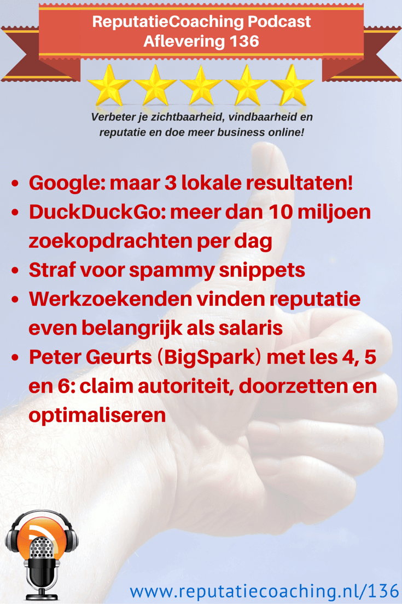
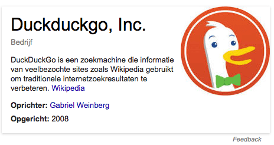

> **Historisch archief.** Deze aflevering verscheen op 9-07-2015 als onderdeel van ReputatieCoaching (2012–2016). De oorspronkelijke tekst is hieronder historisch bewaard. Diensten, contactgegevens, links, tools en adviezen kunnen inmiddels verouderd zijn.



**Transcriptiestatus:** Volledige transcriptie uit het oorspronkelijke archief.

\*\*[](/wp-content/uploads/2012/12/Reputatie-Coaching-Podcast-logo-200x200.jpg)Eerder deze week meldde ik dat Google nog maar 3 lokale resultaten vertoont. Daarover zo meer. DuckDuckGo groeit al maar verder… Dat is het tweede topic.\*\*

**Het derde onderwerp van vandaag gaat over “spammy snippets” en het vierde punt van vandaag gaat erover dat werkzoekenden tegenwoordig de reputatie van een bedrijf net zo belangrijk vinden als het salaris.**

**Ik sluit de podcast van vandaag af met het tweede deel van het verhaal van Peter Geurts van BigSpark over de 10 geleerde lessen bij het opbouwen van zijn bedrijf. Vandaag heb ik les 4,5 en 6 voor je.**

Hallo en hartelijk welkom bij deze aflevering van de ReputatieCoaching Podcast. Ik ben Eduard de Boer, ReputatieCoach. Dit is dé podcast die jou helpt om meer business te genereren, doordat jouw website beter gevonden wordt, zowel lokaal als landelijk en doordat ik je uitleg hoe je je online reputatie kunt verbeteren. Dit alles helpt je om je bedrijf en jezelf beter op de online kaart te plaatsen.

De podcast kun je vinden op [www.reputatiecoaching.nl/136](https://www.reputatiecoaching.nl/136/). Daar vind je niet alleen de tekst, maar ook video’s waar ik het in deze uitzending over heb, alsmede afbeeldingen, links enzovoorts. Bovendien is de podcast te beluisteren in [iTunes](https://www.reputatiecoaching.nl/itunes), op [Stitcher](https://www.reputatiecoaching.nl/stitcher) en ook op [TuneIn Radio](http://tunein.com/radio/ReputatieCoaching-Podcast-p655084/). Ik raad je aan om je op één van die drie kanalen te abonneren op de podcast, zodat je geen aflevering hoeft te missen!

## Google beperkt lokale resultaten tot 3!

Afgelopen zondag bespeurde ik een verandering in de vertoning van de lokale zoekresultaten. Eerst dacht ik dat het browser-gerelateerd was, maar dat bleek onjuist. Het verschil wat ik zag, was gebaseerd op het al of niet ingelogd zijn in Google+, Gmail of een andere Google service. Aan de andere kant zag ik de vernieuwing wel, terwijl ik was ingelogd in de reguliere Gmail, maar weer niet, als ik was ingelogd in Google Apps for Business.

Enfin, of het een experiment is of niet, dat weet ik op dit moment (nog) niet. Maar in plaats van 7 lokale zoekresultaten kreeg ik opeens nog maar 3 lokale resultaten vertoond, gelabeld van “A” tot en met “C”. Er waren dus maar liefst 4 verdwenen.

In de show notes heb ik ook een afbeelding hiervan opgenomen:

[*Historische afbeelding niet beschikbaar: 20150705-fotograaf-apeldoorn-chrome*](https://www.reputatiecoaching.nl/wp-content/uploads/2015/07/20150705-fotograaf-apeldoorn-chrome.png)

Vanaf maandag las ik in diverse communities op Google+ dat andere mensen ook deze vernieuwde weergave hadden waargenomen. En ook zagen sommigen voor het ene account het vernieuwde 3-pack wel, terwijl ze het niet zagen, als ze waren ingelogd met een ander account.

Ik vind deze vernieuwde weergave absoluut geen verbetering. Want het viel me ook op dat de link naar de Google+ pagina helemaal niet meer werd getoond! Met andere woorden: het lijkt erop, alsof het belang van Google Mijn Bedrijf pagina’s vanuit het perspectief van Google afneemt. Want hoe kun je nu nog bezoekers naar je Google Mijn Bedrijf pagina trekken? Puur op basis van organisch ranken van berichten die je post en die dan wellicht worden geïndexeerd en vertoond als iemand op bepaalde gerelateerde zoektermen zoekt?

Waar dit heengaat zullen we wel zien. Ik ga nu in elk geval over op de onderwerpen voor vandaag…

## DuckDuckGo: meer dan 10 miljoen zoekopdrachten per dag

Herinner je je nog DuckDuckGo: die zoekmachine die wèl waarde hecht aan je privacy? Eén van de weinige zoekmachines die geen gegevens van je opslaat, niets persoonlijks logt en dergelijke? Nou… Die begint toch aardig te groeien!

[](https://lh4.googleusercontent.com/-HsJS9LthWXU/VZ2DSF22qUI/AAAAAAAACfg/m4Gn33cJcOg/w464-h246-no/20150709-duckduckgo-google.png)Zo maakte het zo’n twee weken geleden bekend, dat ze voor het eerst 10 miljoen zoekopdrachten op één dag hebben verwerkt. Dat staat natuurlijk nog steeds in geen vergelijk met Google en andere zoekgiganten, maar het geeft wel aan dat ook dit kleine kuikentje langzaamaan een groot eendje aan het worden is:

[[Historische afbeelding: DuckDuckGo stats](https://lh6.googleusercontent.com/NsRcWTZjYJ9AIKMpOhXBsrd2K9glvS98MuNqlQmf8SY=w1457-h855-no)](https://lh6.googleusercontent.com/NsRcWTZjYJ9AIKMpOhXBsrd2K9glvS98MuNqlQmf8SY=w1457-h855-no)In de show notes van deze podcast heb ik een grafiek opgenomen, waarin je de groei van DuckDuckGo kunt zien. Het blijkt dat DuckDuckGo een hele snelle groei is gaan doormaken, sinds Edward Snowden zo’n twee jaar geleden bekendmaakte op welke schaal en hoe de NSA in de Verenigde Staten alles en iedereen digitaal afluistert.

## Straf voor spammy snippets

Reviewsterretjes doen het altijd goed bij bedrijfsvermeldingen, zeker als je concurrenten geen sterretjes bij hun vermelding hebben. Het hebben van reviewsterren op je eigen paginavermelding levert geen directe meerwaarde op; met andere woorden: je scoort er dus niet direct hoger mee, door ze te implementeren.

Ik gebruikte bewust tweemaal het woord: “direct”. Want indirect kan het hebben van sterren wel meer kliks naar je site opleveren, in de situatie die ik je net vertelde. Meer verkeer naar je site kan wel leiden tot een hogere positie in de zoekresultaten. Dus op die manier kunnen reviewsterretjes op je eigen site indirect leiden tot hogere rankings, meer verkeer, nog hogere rankings en ga zo maar door.

Zelf heb ik tot op heden geen spectaculaire resultaten gezien. Maar je kunt je voorstellen dat als webmasters of ondernemers dit horen of lezen, ze per se op alle pagina’s op hun site reviewsterretjes moeten hebben.

Dat riekt naar misbruik. En Google houdt niet van misbruik. Laatst werd aan John Mueller van Google in een Webmaster Central Office-hours hangout gevraagd of Google dit misbruik of onjuist gebruik van rich snippets straft in de vorm van een degradatie in de zoekresultaten.

John zei vrij vertaald het volgende:

We schakelen de rich snippets voor de desbetreffende pagina uit, tot we er zeker van zijn dat we ze kunnen vertrouwen.

Dus met andere woorden: als Google vindt dat je iets fout doet met de rich snippets voor reviewsterretjes, dan kan het dus gebeuren dat ze worden uitgeschakeld.

Maar nu is de vraag: “Wat beschouwt Google als fout of wanneer vindt het algoritme het onterecht, dat je reviewsterretjes op je site plaatst?”. Ik loop even een paar belangrijke do’s en don’ts met je langs:

```
  * Je voorpagina kan om te beginnen geen sterretjes bevatten, omdat de reviews slaan op een concreet product of een dienst die je levert. En die staat vrijwel nooit op de voorpagina. Dus hoe hard je het ook probeert: de kans is uitermate klein dat je de sterren op je voorpagina krijgt.
  * Het tweede wat je niet moet doen is op alle achterliggende pagina’s van je site hetzelfde aantal reviews publiceren. Want zoals ik al zei: reviews slaan op een bepaald product of een specifieke dienst, niet op je algemene dienstverlening of je hele productassortiment.
  * Je moet het aantal reviews / beoordelingen ook niet opblazen, want vergeet niet: Google ziet vrijwel alles wat er online is en ondanks dat ze bij de Google Mijn Bedrijf vermelding in de Knowledge Graph niet meer vertellen waar je allemaal reviews hebt, zullen ze die heus wel meten. En dus weten ze ook of je loopt te bluffen, of dat je een realistisch aantal toont, als je zelf met behulp van microdata reviewsterren aan je site toevoegt.
  * En als je een stukje code krijgt van een reviewbedrijf, waar jij reviews verzamelt, om je reviews in de zoekresultaten te krijgen, dan moet je overigens die code niet 2x op dezelfde pagina plaatsen. Want ook daar wordt Google niet blij van; dat heb ik al een keer bij een bedrijfswebsite gezien.
  * Het laatste, eigenlijk nog belangrijker, maar wat veel bedrijven vergeten, is ook daadwerkelijk reviews op de eigen site publiceren, liefst op een pagina met als titel “Reviews”. Dat snappen de bezoekers, dus dat snapt Google ook.
```

## Werkzoekenden vinden reputatie even belangrijk als salaris

Ik las een leuk artikel op de site Recruitment Grapevine, met als titel: “[Company reputation as important as pay for job seekers](http://www.recruitmentgrapevine.com/article/2015-06-22-company-reputation-as-important-as-pay-for-job-seekers)”. Het was geen grootschalig uitgevoerd onderzoek: er zijn slechts 200 werkzoekenden in de VS bevraagd.

[[Historische afbeelding: Reputatie bedrijf net zo belangrijk als salaris](https://lh4.googleusercontent.com/O_UP-F6KGprCSsOBwJCrjjzfgjfBAL2x5M9d2pt4-P4=w500-h350-no)](https://lh4.googleusercontent.com/O_UP-F6KGprCSsOBwJCrjjzfgjfBAL2x5M9d2pt4-P4=w500-h350-no)

Kort gezegd bleek uit het onderzoekje dat de reputatie van het bedrijf net zo belangrijk is als het salaris, als het gaat om de motivatie van de kandidaat om er te solliciteren. Nog een paar interessante statistieken uit datzelfde onderzoek:

```
  * 9 van de 10 kandidaten gebruiken de bedrijfswebsite als de primaire bron van informatie over een bedrijf
  * 52% gebruikt zoekmachines om te zien wat er over een bedrijf is te vinden
  * 45% van de ondervraagden vraagt bij collega’s over de indruk die zij hebben van het bedrijf
```

Wat kunnen we hier zoal uit leren? Ten eerste dat je als bedrijf er veel aan moet doen om op je eigen site uit te blinken als werkgever. Dat kun je doen met testimonials van medewerkers en wat nog mooier is, is met behulp van videotestimonials. Dat is een stuk moeilijker te faken en dat schept wel heel snel vertrouwen. In het artikel wordt trouwens ook nog vermeld dat je er als bedrijf voor moet zorgen dat je website dynamisch is en contentgedreven.

Wat minstens zo belangrijk is, is dat ook je klanten positief over je spreken. Dus dat pleit dan weer voor het verzamelen van reviews op diverse sites die naar boven komen, als je zoekt op je eigen bedrijfsnaam.

Doe je dat trouwens regelmatig? Of gebruik je een tool of dienst voor online monitoring om te zien wat er over jouw bedrijf wordt geschreven? Zelfs zoiets simpels als Google Alerts of Mention, waar ik het al eens eerder over heb gehad, kan jou op de hoogte houden van wat er online over jouw bedrijf wordt geschreven, zodat je snel en adequaat op dialogen kunt inhaken en mogelijk virtuele lucifers kunt doven, voordat je massaal moet uitrukken om hele online bosbranden te blussen.

In het artikel “[Reputatiemanagement: vergeet je de zoekmachines niet?](https://www.frankwatching.com/archive/2015/06/25/reputatiemanagement-vergeet-zoekmachines-niet/)” op Frankwatching las ik nog een extra bevestiging hiervoor. Daarin is het volgende te lezen:

75 procent van de websiteverlaters komt alsnog terug naar de site, maar 25 procent dus niet. Ook hier haakt weer een deel af om later weer terug te komen, en een deel om nooit meer terug te komen, enzovoort. Een deel van de verlaters zal op Google zoeken naar de bedrijfsnaam, een logische zoekopdracht. Hierbij zal een uitstekende online reputatie de conversie verhogen, maar er kunnen ook een aantal zaken naar voren komen die de conversie kunnen schaden, dan wel de conversiewaarde doen verlagen.

Het is dus essentieel dat je als bedrijf ook aan je online reputatie werkt en er alles aan doet om online zo smetteloos mogelijk te worden vertoond. Dus publiceer als bedrijf ook continu verse interessante content om zo de zoekresultaten mogelijk te domineren, als mensen op je bedrijfsnaam zoeken.

## Peter Geurts (BigSpark) met les 4, 5 en 6: autoriteit, doorzetten en optimaliseren

[](/wp-content/uploads/2015/07/Peter-Geurts.jpg)[Vorige week](https://www.reputatiecoaching.nl/135/) had ik Peter Geurts in de show met een presentatie die hij in juni gaf in Nijmegen tijdens de WordPress Meetup. In de presentatie deelde hij 10 geleerde lessen, die hij heeft moeten doormaken bij de opbouw van zijn bedrijf BigSpark, het bedrijf achter Androidplanet.nl, Iphoned.nl en smartphone.nl. De drie lessen hij in de [vorige podcast](https://www.reputatiecoaching.nl/135/) deelde, waren:

```
  * _Bouw een solide basis voor je website_ – Je kunt beter in het begin gelijk kiezen voor een goed WordPress hosting platform en dan maar wat meer kosten maken, wil je tijdens de opbouw van je bedrijf niet telkens geconfronteerd worden met overbelaste servers en dergelijke.
  * _Bepaal je focus_ – Denk goed na over waar jij toegevoegde waarde gaat bieden op jouw vakgebied. En richt je website meteen navenant in. Schroom ook niet om de structuur om te gooien als blijkt dat je initiële focus onjuist blijkt.
  * _SEO best practices_ – Begin je zoektermen zoektocht in Google Trends, check je zoektermen voor nog meer suggesties in Übersuggest, kies de juiste op basis van Google Keywordplanner en gebruik de SEO plugin van Joost de Valk om je artikelen te positioneren voor maximale ranking.
```

Vandaag gaan we door met de drie volgende geleerde lessen:

```
  * Claim autoriteit
  * Zet door, vooral bij tegenslagen
  * Optimaliseer facetten als CTR (Click Through Rate)
```

**Voor het daadwerkelijke verhaal van Peter Geurts verwijs ik je naar de podcast**

En met deze 3 lessen van Peter Geurts kom ik dan ook vandaag weer aan het einde van deze podcast. Volgende week krijg je de geleerde lessen 7 tot en met 10. Trefwoorden daarvoor zijn: “overwinningen vieren”, “tools”, “onderhoud” en “veranderen”.

Als je de podcast leuk vindt en je wilt nog meer op de hoogte blijven, volg me dan ook op Twitter, via [@reputatiecoach1](https://twitter.com/reputatiecoach1).

Heb je inderdaad wat aan alle informatie die ik met je deel, help mij dan met het verder verbeteren en promoten van deze podcast. Abonneer je op de podcast, zodat je altijd meteen de nieuwste uitzending krijgt voorgeschoteld.

Zoek de podcast op, in [iTunes](https://www.reputatiecoaching.nl/itunes) of [Stitcher](https://www.reputatiecoaching.nl/stitcher), geef de podcast een sterrenbeoordeling en laat ook je reactie achter. Door de podcast te beoordelen op iTunes en/of Stitcher breng je de podcast onder de aandacht van een breder publiek.

Je kunt me verder helpen, door de podcast aan te bevelen bij vrienden of collega’s, waarvan je denkt dat ze er hun voordeel mee kunnen doen, of door ’m te delen op Twitter, like’n en delen op Facebook of een “+1” te geven op Google+.

En vergeet niet: ik ben hier om je te helpen! Als je een vraag of een probleem hebt met betrekking tot je online reputatie of de vindbaarheid van je website, kun je een mailtje sturen naar [podcast@reputatiecoaching.nl](mailto:podcast@reputatiecoaching.nl).

Als je dat te lastig vindt, of als je de podcast beluistert terwijl je in de auto zit en je hebt acuut een vraag, spreek dan een boodschap in op de ReputatieCoaching Hotline, op nummer: 084 - 883 15 56. Mogelijk behandel ik je vraag of probleem dan in een artikel of in de podcast.

En je kunt ook rechtstreeks op de website een voicemail achterlaten, door op de tab aan de rechterkant van elke pagina te klikken, en je bericht in te spreken. Dit was [ReputatieCoaching Podcast aflevering 136](https://www.reputatiecoaching.nl/136/) en mijn naam is [Eduard de Boer](http://nl.linkedin.com/in/eduarddeboer/nl).

Ik wens je de komende week weer succes met het werken aan je reputatie, zodat je meteen je reputatie voor jou kunt laten werken!

Tot volgende week!

Doei!

Links naar content die in deze podcast aan bod komt:

```
  * [ReputatieCoaching Podcast in iTunes](https://www.reputatiecoaching.nl/itunes)
  * [ReputatieCoaching Podcast op Stitcher](https://www.reputatiecoaching.nl/stitcher)
  * [ReputatieCoaching Podcast op TuneIn Radio](http://tunein.com/radio/ReputatieCoaching-Podcast-p655084/)
  * [ReputatieCoaching Podcast RSS-feed](https://feeds.reputatiecoaching.nl/ReputatieCoachingPodcast)
  * “[Company reputation as important as pay for job seekers](http://www.recruitmentgrapevine.com/article/2015-06-22-company-reputation-as-important-as-pay-for-job-seekers)” (Recruitment Grapevine, 22 juni 2015)
```
