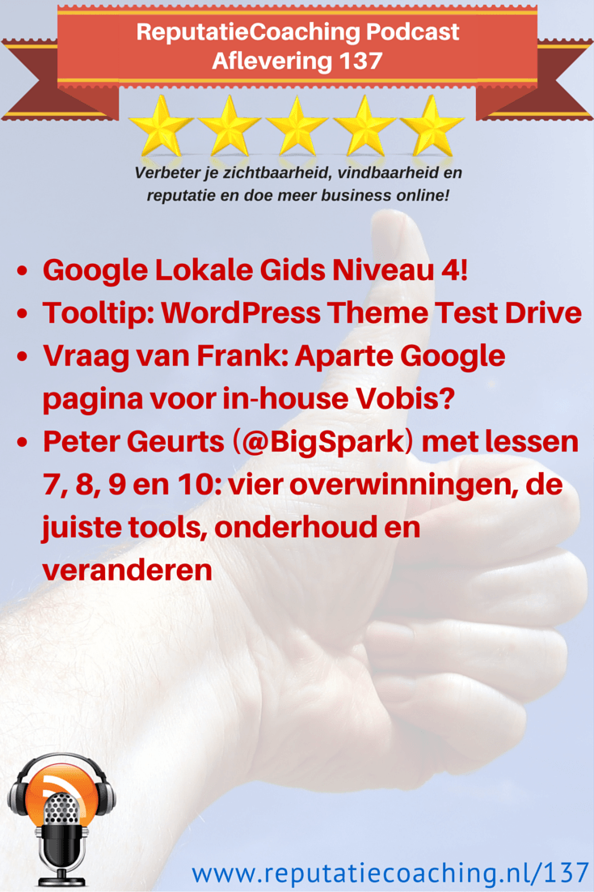
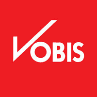

> **Historisch archief.** Deze aflevering verscheen op 16-07-2015 als onderdeel van ReputatieCoaching (2012–2016). De oorspronkelijke tekst is hieronder historisch bewaard. Diensten, contactgegevens, links, tools en adviezen kunnen inmiddels verouderd zijn.



**Transcriptiestatus:** Volledige transcriptie uit het oorspronkelijke archief.

\*\*[](/wp-content/uploads/2012/12/Reputatie-Coaching-Podcast-logo-200x200.jpg)Sinds afgelopen maandag ben ik een Google Lokale Gids Niveau 4… Dat betekent dat ik meer dan 200 reviews op Google heb geplaatst. Daarover zo meer.\*\*

**Ook heb ik een tooltip voor je, als je eens wilt experimenteren met verschillende themes in WordPress, zonder meteen je officiële site om zeep te helpen.**

**Frank uit Nijmegen gaat zijn bedrijf uitbreiden: naast het witgoed en de consumentenelektronica, krijgt hij nu een Vobis-vestiging in zijn pand. Hij wil graag weten hoe hij hier maximaal lokaal rendement uit kan halen. Dus daar duik ik in.**

**Tenslotte heb ik als laatste topic voor vandaag de resterende 4 lessen van Peter Geurts van BigSpark.**

Hallo en hartelijk welkom bij deze aflevering van de ReputatieCoaching Podcast. Ik ben Eduard de Boer, ReputatieCoach. Dit is dé podcast die jou helpt om meer business te genereren, doordat jouw website beter gevonden wordt, zowel lokaal als landelijk en doordat ik je uitleg hoe je je online reputatie kunt verbeteren. Dit alles helpt je om je bedrijf en jezelf beter op de online kaart te plaatsen.

De podcast kun je vinden op [www.reputatiecoaching.nl/137](https://www.reputatiecoaching.nl/137/). Daar vind je niet alleen de tekst, maar ook video’s waar ik het in deze uitzending over heb, alsmede afbeeldingen, links enzovoorts. Bovendien is de podcast te beluisteren in [iTunes](https://www.reputatiecoaching.nl/itunes), op [Stitcher](https://www.reputatiecoaching.nl/stitcher) en ook op [TuneIn Radio](http://tunein.com/radio/ReputatieCoaching-Podcast-p655084/). Ik raad je aan om je op één van die drie kanalen te abonneren op de podcast, zodat je geen aflevering hoeft te missen!

Laat ik dan nu overgaan op de onderwerpen voor vandaag…

## Google Lokale Gids Niveau 4

Ik vertelde je al eerder dat ik als doel had om het niveau 4 te bereiken van het Google Lokale Gidsen programma. Niet dat het me iets oplevert of zo, maar puur omdat ik vond dat ik dat moest bereiken. Met dat doel in het achterhoofd ben ik flink aan de slag gegaan.

Zo haalde ik mijn hele geschiedenis van check-ins op Yelp en Foursquare erbij en ook ging ik nog eens virtueel door de verschillende wijken van Apeldoorn kijken op Google Maps om te zien waar ik ooit zoal was geweest voor een boodschap of om iets anders te doen.

Omdat ik vrij krap zit in mijn tijd had ik elke vrijdagmorgen een uurtje hiervoor in de agenda gepland. En afgelopen vrijdag had ik flink inspiratie: ik ging van 176 reviews op 3 juli naar 217 reviews! Ik ging echt als een speer. Binnen een uur en drie minuten heb ik die eindsprint uitgevoerd. En toen kwam maandagmorgen het mailtje waar ik verlangend naar uitkeek, met daarin onder andere de tekst:

Omdat u uw 200ste review op Google heeft geschreven, bent u nu een Lokale gids niveau 4.

[[Historische afbeelding: Google Lokale Gids Niveau 4](https://lh5.googleusercontent.com/6z_XaBs2E0QoNmvFXESuw085U4OXe--OADvUWbvKlTI=w481-h964-no)](https://lh5.googleusercontent.com/6z_XaBs2E0QoNmvFXESuw085U4OXe--OADvUWbvKlTI=w481-h964-no)

Tja, voor het presentje hoef ik het denk ik niet te doen, maar laat ik niet te voorbarig zijn en eerst zien wat Google mij opstuurt. Waarschijnlijk is ’t een Lokale Gids t-shirt of zo. Ik zie het wel. En voor die vermeldingen op de verschillende social media kanalen moet ik nog een webformulier invullen.

In elk geval heb ik die grens doorbroken, die mij op [19 februari](https://www.reputatiecoaching.nl/116/) nog zo extreem ver weg leek, want toen had ik slechts 21 reviews op mijn konto. Dus ik kan nu iets rustiger aan doen met het posten van reviews op Google. Ook hoef ik niet meer zo in mijn verleden te grasduinen op zoek naar locaties waar ik een review over kan posten.

Wel ben ik voornemens door te gaan met het posten van reviews op Google. Dus ik laat het item in de agenda staan, al verkort ik het nu naar een halfuur, in plaats van een heel uur.

## Tooltip: WordPress Theme Test Drive

[*Historische afbeelding niet beschikbaar: Wordpress SEO*](https://www.reputatiecoaching.nl/wp-content/uploads/2012/12/Wordpress-logo-2-e1433334691596.jpg)Ik heb vandaag weer een tooltip voor je en dit keer is die ook weer voor WordPress. Het kan wel eens voorkomen dat je na verloop van tijd bent uitgekeken op het theme dat je in gebruik hebt voor je huidige website. Maar je kunt natuurlijk niet zomaar straffeloos even testen met een ander theme. Want stel dat je daarmee de complete layout van je site onderuit haalt, dan is dat slecht voor de gebruikerservaring van de bezoekers die in de tussentijd je site aan doen.

Daarvoor heb ik een oplossing gevonden en wel in de vorm van de plugin “[Theme Test Drive](https://wordpress.org/plugins/theme-test-drive/)”. De link naar deze plugin vind je in de show notes op [www.reputatiecoaching.nl/137](https://www.reputatiecoaching.nl/137/). Die plugin stelt je in staat om een ander theme te kiezen, dat jij alleen ziet, zolang je bent ingelogd als administrator. Alle andere bezoekers krijgen dus nog steeds je normale, bekende theme te zien. Zo kun je dus in alle rust testen.

Dus als jij overweegt een ander theme in gebruik te gaan nemen, dan kan ik je in elk geval de plugin “[Theme Test Drive](https://wordpress.org/plugins/theme-test-drive/)” van harte aanbevelen.

## Vraag van Frank: Aparte Google pagina voor in-house Vobis?

[](/wp-content/uploads/2015/07/logo-vobis.png)Een tijdje geleden stuurde Frank uit Nijmegen mij weer eens een leuke en vooral interessante vraag, die ik graag in deze podcast behandel. Hij schreef het volgende:

Al bezig zijnde met bovenstaande dacht ik natuurlijk ook na over hoe ik de Vobis-formule op de kaart moet gaan zetten in Nijmegen. Hierbij rijzen er vragen waar je wellicht een antwoord op hebt.

Dus het bedrijf blijft Grootaarts Euronics heten en het Vobis-concept gaat hierin geïntegreerd worden met een eigen logo en huiskleuren. Doordat Vobis een bij velen bekende computerformule is, blijft de eigen identiteit hiervan belangrijk.

Maar hoe zit dat als ik een tweede winkel ga registeren op een adres kan dat en is het verstandig? Of geeft dat problemen met Google. Wat is hierin het advies? Ga ik bij alle websites waar ik geregistreerd sta nog een bedrijf aanmelden?

En gaan we hiervoor apart reviews vragen?

Het voordeel hiervan is natuurlijk dat als iemand op computerwinkel gaat zoeken deze bekende formule in de zoekresultaten gaat tegenkomen binnen Google. Dat zou natuurlijk het mooiste zijn.

Ik hoop dat je ons wat tips kunt geven, hoe we dit moeten gaan aanpakken.

Tot zover de vraag van Frank. Nou Frank, wat zit jij hiermee in een ontzettende luxe positie! Want je hebt nu de kans en de gelegenheid om het vanaf het begin goed aan te pakken. Op die manier hoef je dus geen oude, inconsistente bedrijfsvermeldingen en dergelijke op te sporen en op te schonen… Je begint namelijk met een totaal schone lei. Dat is de perfecte startpositie!

Laat ik de benodigde stappen eens doorlopen:

```
  * _Lokaal telefoonnummer_ – Om te beginnen heb je een apart lokaal telefoonnummer nodig. Niet alleen om je bedrijfscommunicatie te stroomlijnen, maar bovenal om te voorkomen dat je problemen krijgt met je citations. Want, zoals je weet, zijn citations de combinatie van bedrijfsnaam, adres, postcode, plaats en telefoonnummer. Als je dan nu opeens een ander telefoonnummer bij je Euronics gaat registreren kan dat een negatief effect hebben op je lokale Euronics vermelding en ook nog eens op je nieuw te maken Vobis vermelding.
  * _Aparte website_ – Mijn advies is om een aparte website in te richten (als dat mag), met een welluidende naam, waar bij voorkeur ook het woord Nijmegen in zit. Google hecht minder waarde aan zogenaamde “exact match domain names”, maar het kan ook geen kwaad. Bovendien helpt het je om deze Vobis locatie te onderscheiden van de Vobis vestiging in Arnhem. Als het niet mag, heb je een locatiepagina op de Vobis-site nodig als soort van thuisbasis, waar je overal naar kunt verwijzen. Bij voorkeur heeft zo’n pagina een URL als in: “_/vestiging/gelderland/nijmegen_”.
  * _Inschrijving bij de Kamer van Koophandel_ – Ik zou een aparte rechtspersoon registreren bij de Kamer van Koophandel. Denk daarbij aan de naam en een goede bedrijfsomschrijving, alsmede de categorie of categorieën waarin je bij de KvK wilt worden ingedeeld. Daarbij moet je al wel je telefoonnummer en domeinnaam hebben voor maximaal rendement. Ik zou er niet voor kiezen om een “handelend onder” te nemen. Reden is niet fiscaal of juridisch, want daar heb ik relatief weinig kaas van gegeten: daar moet je fiscalist of jurist voor zijn en dat ben ik niet. Maar mijn reden is dat je dan gratis en voor niets een groot aantal citations krijgt.
```

Tja, vanaf daar komt dan weer de standaard werkwijze om de hoek kijken: je moet citations maken, waardevolle content publiceren, reviews verzamelen en dergelijke. Ik denk dat het aardig lastig kan worden om bijvoorbeeld lokaal te scoren op “computers nijmegen” of “tablet nijmegen”.

Als je wilt, Frank, kan ik wel eens een onderzoekje doen naar waar je dan zoal citations moet plaatsen, waar je collega’s in Nijmegen zoal vermeld staan en wat zij publiceren aan lokaal georiënteerde content. Laat maar weten als je daar behoefte aan hebt.

## Peter Geurts (@BigSpark) met lessen 7, 8, 9 en 10: vier overwinningen, de juiste tools, onderhoud en veranderen

[*Historische afbeelding niet beschikbaar: Peter Geurts (BIgSpark)*](https://www.reputatiecoaching.nl/wp-content/uploads/2015/07/Peter-Geurts.jpg)In de vorige twee podcasts heb ik telkens een deel van de presentatie van Peter Geurts van BigSpark in de podcast opgenomen. In deze presentatie die hij in juni tijdens #WPM024 in Nijmegen gaf, vertelt Peter over de geleerde lessen tijdens het opbouwen en uitbouwen van BigSpark, het bedrijf achter de websites: Androidplanet.nl, Iphoned.nl en Smartphone.nl.

[In de vorige podcast](https://www.reputatiecoaching.nl/136/) kwamen de volgende drie geleerde lessen aan bod:

```
  * _Claim autoriteit_ – Soms moet je geluk hebben maar door uitgebreide en diepgaande achtergrondartikelen te schrijven over actuele trends, apps en andere ontwikkelingen kan het zijn dat je content wordt opgepikt door de media. Gebruik dat en melk dat als het ware uit.
  * _Blijf doorzetten_ – Als het tegenzit en je bent bijvoorbeeld opeens niet goed meer vindbaar in de zoekresultaten: blijf kalm, vraag hulp van specialisten en werk aan een oplossing. Geef dus niet op!
  * _Optimaliseer_ – Meten is weten. Google biedt een gratis meet- en analysetool, onder de naam “Analytics”. Als je dat nog niet gebruikt: installeer het vandaag nog en begin met meten. Hetzelfde geldt voor “Google Search Console”. De combinatie van beide tools kan je enorm helpen om bijvoorbeeld de CTR (dat staat voor “Click Through Rate”) van je content te verhogen.
```

Vandaag heb ik het laatste deel voor je, met hierin de laatste vier lessen van Peter Geurts:

```
  * Vier je overwinningen
  * Gebruik de juiste tools
  * Regelmatig onderhoud aan je website
  * Blijf veranderen
```

Laat ik dan nu overgaan op de presentatie van Peter…

**Voor het daadwerkelijke verhaal van Peter Geurts verwijs ik je naar de podcast**

Dat is eigenlijk wat ik met jullie wilde delen over tien geleerde lessen vandaag. Het waren er eigenlijk wel meer dan honderd denk ik, maar we hebben geprobeerd er in ieder geval tien te delen. Ik zal ze nog een keer benoemen:

```
  * Het begint bij een goede basis.
  * Bepaal vervolgens een focus, waar je je op wil richten, waar je goed in wil worden.
  * Zorg vervolgens dat waar je goed in wil worden, wie je wil bereiken dat daar een soort SEO best-practices onderliggend aan is. Dat is de beste manier om verkeer naar je website te trekken.
  * Op het moment dat je je dat eigen hebt gemaakt, ga je autoriteit claimen.
  * Moet je af en toe even doorzetten om dat tot een succes te brengen.
  * En ga je optimaliseren op basis van de data die gewoon voor iedereen beschikbaar en toegankelijk is.
  * Je gaat je overwinningen vieren,
  * handige tooltjes gebruiken,
  * met regelmaat onderhoud aan je website plegen om te zorgen dat het ook in de toekomst het goed blijft doen.
  * En pas je aan bij de ontwikkelingen en sta er bij stil waar het met Internet naartoe gaat.
```

***Good luck!** Dat is wat ik jullie op basis hiervan wil toewensen!*

Ik hoop dat je het interessant en leerzaam vond, deze manier waarop ik de presentatie van Peter Geurts met je heb gedeeld. Laat eens weten, wat je ervan vond. Reageer in onderaan de show notes, op [www.reputatiecoaching.nl/137](https://www.reputatiecoaching.nl/137/).

Als je de podcast leuk vindt en je wilt nog meer op de hoogte blijven, volg me dan ook op Twitter, via [@reputatiecoach1](https://twitter.com/reputatiecoach1).

Heb je inderdaad wat aan alle informatie die ik met je deel, help mij dan met het verder verbeteren en promoten van deze podcast. Abonneer je op de podcast, zodat je altijd meteen de nieuwste uitzending krijgt voorgeschoteld.

Zoek de podcast op, in [iTunes](https://www.reputatiecoaching.nl/itunes) of [Stitcher](https://www.reputatiecoaching.nl/stitcher), geef de podcast een sterrenbeoordeling en laat ook je reactie achter. Door de podcast te beoordelen op iTunes en/of Stitcher breng je de podcast onder de aandacht van een breder publiek.

Je kunt me verder helpen, door de podcast aan te bevelen bij vrienden of collega’s, waarvan je denkt dat ze er hun voordeel mee kunnen doen, of door ’m te delen op Twitter, like’n en delen op Facebook of een “+1” te geven op Google+.

En vergeet niet: ik ben hier om je te helpen! Als je een vraag of een probleem hebt met betrekking tot je online reputatie of de vindbaarheid van je website, kun je een mailtje sturen naar [podcast@reputatiecoaching.nl](mailto:podcast@reputatiecoaching.nl).

Als je dat te lastig vindt, of als je de podcast beluistert terwijl je in de auto zit en je hebt acuut een vraag, spreek dan een boodschap in op de ReputatieCoaching Hotline, op nummer: 084 - 883 15 56. Mogelijk behandel ik je vraag of probleem dan in een artikel of in de podcast.

En je kunt ook rechtstreeks op de website een voicemail achterlaten, door op de tab aan de rechterkant van elke pagina te klikken, en je bericht in te spreken. Dit was [ReputatieCoaching Podcast aflevering 137](https://www.reputatiecoaching.nl/137/) en mijn naam is [Eduard de Boer](http://nl.linkedin.com/in/eduarddeboer/nl).

Ik wens je de komende week weer succes met het werken aan je reputatie, zodat je meteen je reputatie voor jou kunt laten werken!

Tot volgende week!

Doei!

Links naar content die in deze podcast aan bod komt:

```
  * [ReputatieCoaching Podcast in iTunes](https://www.reputatiecoaching.nl/itunes)
  * [ReputatieCoaching Podcast op Stitcher](https://www.reputatiecoaching.nl/stitcher)
  * [ReputatieCoaching Podcast op TuneIn Radio](http://tunein.com/radio/ReputatieCoaching-Podcast-p655084/)
  * [ReputatieCoaching Podcast RSS-feed](https://feeds.reputatiecoaching.nl/ReputatieCoachingPodcast)
  * [Theme Test Drive](https://wordpress.org/plugins/theme-test-drive/) (Plugin voor WordPress om nieuwe themes zonder risico te testen)
  * [BigSpark](http://bigspark.com)
  * [Peter Geurts op LinkedIn](https://nl.linkedin.com/in/petergeurtsnl)
  * [Google Search Console](http://www.google.com/webmasters/)
  * [Google Analytics](http://www.google.com/analytics/)
  * [Screaming Frog SEO Spider](http://www.screamingfrog.co.uk/seo-spider/)
  * [Visual Website Optimizer](http://visualwebsiteoptimizer.nl)
  * [Hotjar](https://www.hotjar.com)
  * [Ahrefs](https://ahrefs.com)
  * [Majestic](https://nl.majestic.com)
  * [SearchMetrics](http://www.searchmetrics.com)
  * [Pingdom](http://tools.pingdom.com/fpt/)
  * [Mailchimp](http://www.mailchimp.com)
```
