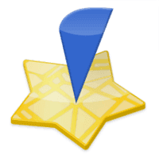
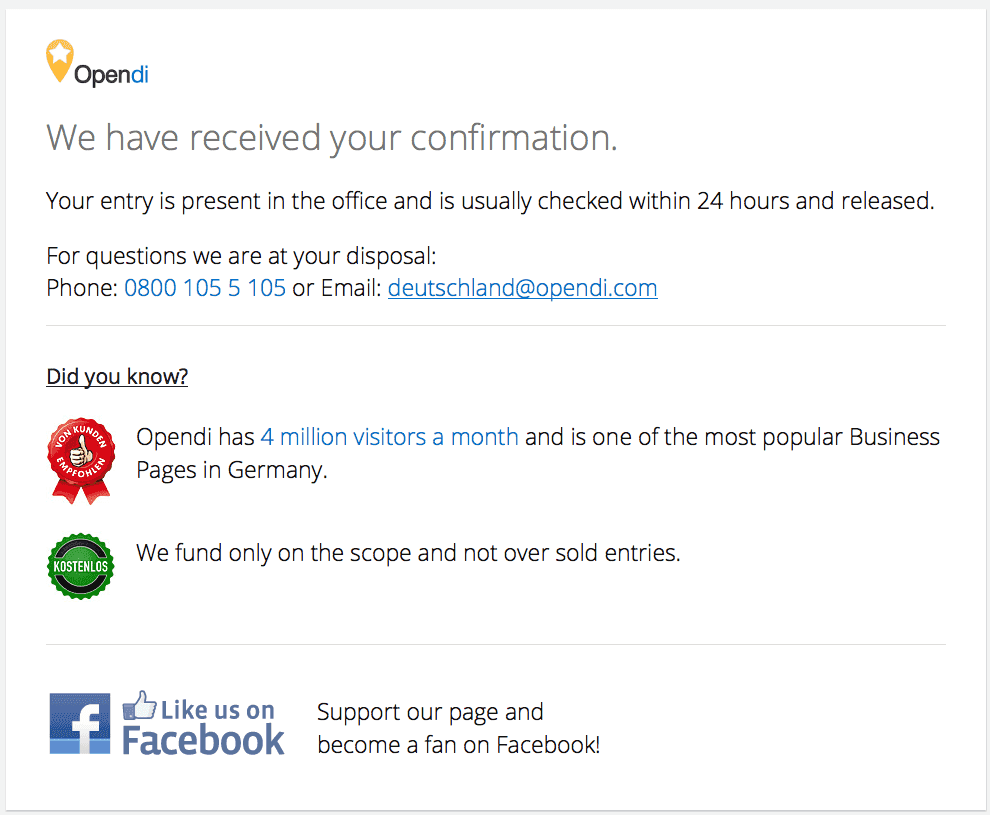
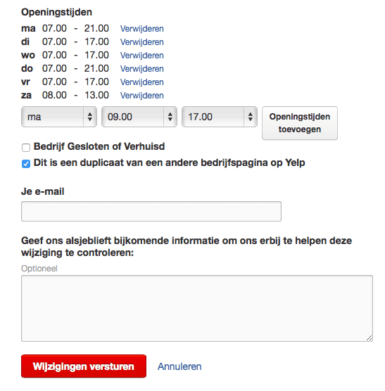
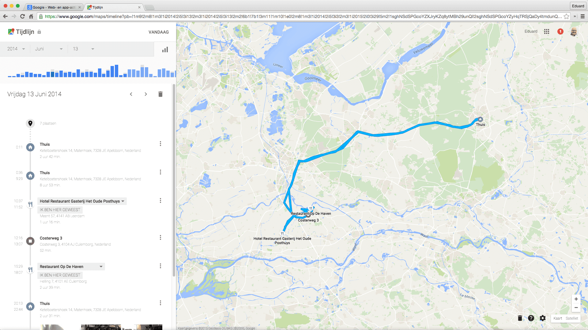

> **Historisch archief.** Deze aflevering verscheen op 6-08-2015 als onderdeel van ReputatieCoaching (2012–2016). De oorspronkelijke tekst is hieronder historisch bewaard. Diensten, contactgegevens, links, tools en adviezen kunnen inmiddels verouderd zijn.



**Transcriptiestatus:** Volledige transcriptie uit het oorspronkelijke archief.

***Historische afbeelding niet beschikbaar: ReputatieCoaching Podcast*
Volgens mij is Nederland zo’n beetje halverwege de zomervakantie, want ik zie de afgelopen weken wat minder bezoek dan de maanden ervoor. Ook het aantal downloads van de podcast blijft iets achter. Toch had ik dit jaar in juli driemaal meer downloads dan vorig jaar! Dus als je het bezoek en het aantal downloads in een breder perspectief plaatst, zit er een enorme groei in. En daar doe ik het natuurlijk voor!**

**Het eerste topic voor vandaag gaat over het verwijderen van een vermelding uit Opendi.nl en het tweede onderwerp is over het verwijderen van een dubbele vermelding uit Yelp.**

**Nokia heeft trouwens eindelijk haar (online) kaartendienst HERE verkocht voor het schamele bedrag van US$ 2,7 miljard.**

**En op Google Maps kun je nu op “Je Tijdlijn” zien waar je zoal exact bent geweest en waar je foto’s hebt gemaakt die zijn te vinden op Google Foto’s.**

**Ik sluit de podcast van vandaag af met een interview met Wouter Krusemann van patientenreview.nl.**

Hallo en hartelijk welkom bij deze aflevering van de ReputatieCoaching Podcast. Ik ben Eduard de Boer, ReputatieCoach. Dit is dé podcast die jou helpt om meer business te genereren, doordat jouw website beter gevonden wordt, zowel lokaal als landelijk en doordat ik je uitleg hoe je je online reputatie kunt verbeteren. Dit alles helpt je om je bedrijf en jezelf beter op de online kaart te plaatsen.

De podcast kun je vinden op [www.reputatiecoaching.nl/140](https://www.reputatiecoaching.nl/140/). Daar vind je niet alleen de tekst, maar ook video’s waar ik het in deze uitzending over heb, alsmede afbeeldingen, links enzovoorts. Bovendien is de podcast te beluisteren in [iTunes](https://www.reputatiecoaching.nl/itunes), op [Stitcher](https://www.reputatiecoaching.nl/stitcher) en ook op [TuneIn Radio](http://tunein.com/radio/ReputatieCoaching-Podcast-p655084/). Ik raad je aan om je op één van die drie kanalen te abonneren op de podcast, zodat je geen aflevering hoeft te missen!

Laat ik dan nu overgaan op de onderwerpen voor vandaag…

## Vermelding verwijderen uit opendi.nl


Twee weken geleden ben ik behoorlijk diep ingegaan op citations, het belang ervan en dergelijke. De Summer Citations Sequence loopt alweer ruim twee weken en elke dag komt er nog steeds een korte instructievideo online, waarin ik je laat zien hoe je een citation kunt creëren op een bepaalde site.

Zo komt straks overigens de instructievideo live, waarin ik je laat zien hoe je je bedrijf kunt aanmelden op provincialegids.nl, een regionaalgeoriënteerde site waarop alleen bedrijven uit Gelderland zich kunnen aanmelden. Dus die site is goed voor het versterken van je bedrijfsvermelding in de regio, of beter gezegd: de provincie.

Maar meer citations is niet altijd goed. In elk geval kunnen inconsistente citations tegen je werken. Gemiddeld zoek ik eens per half jaar op de bedrijfsnaam en het telefoonnummer van bedrijven die ik help om te zien wat er naar naar boven komt.

Zo vond ik laatst op Opendi.nl een oude bedrijfsvermelding van een tandartspraktijk die inmiddels een nieuwe naam heeft. Uit ervaring weet ik dat het vaak lastig is om een vermelding verwijderd te krijgen en soms gaat het ook fout.

Ik heb toen de volgende mail gestuurd:

In uw bestand staat nog de oude naam van onze praktijk: Tandheelkundig Jeugdcentrum Beuningen.

<http://beuningen-beuningen.tel.opendi.nl/103375.html>

Tegenwoordig heet de praktijk: Jeugdtandarts Beuningen

De overige gegevens zijn:
Jeugdtandarts Beuningen
Klokkengieter 12
6641 GG Beuningen
Tel. 024 - 677 3782
<http://www.jeugdtandarts.nl/beuningen>

Kunt u dit aanpassen en ons berichten als dit is doorgevoerd?

Bedankt en met vriendelijke groet,

Eduard de Boer – webmaster

Volgens mij is het verzoek simpel en duidelijk: gewoon de naam wijzigen alstublieft. Oh ja, bericht mij ook even als de aanpassing is doorgevoerd…

Slechts 1 uur en 24 minuten later kreeg ik een reactie. Dat stemde bij uitermate hoopvol, totdat ik de inhoud las:

hartelijk dank voor uw informatie.

De vermelding is van onze homepage tel.opendi.nl verwijderd.
Houd er a.u.b. rekening mee dat het enige tijd kan duren voordat deze wijziging door zoekmachines zoals Google is verwerkt.
Daardoor kan uw vermelding nog in de resultaten van deze zoekmachines staan.

Met vriendelijke groet
Arne Dehn

- editorial team-

Oeps!! Dat was niet de bedoeling! Nu hebben ze de hele vermelding verwijderd, terwijl mijn verzoek toch echt anders luidde.

Maar goed, ik moest dus vervolgens het bedrijf opnieuw aanmelden. Doordat ik alle gegevens in een spreadsheet had staan was dat zo gebeurd, maar toch… Als je niet oplet bij het doorgeven van een wijziging, kan je vermelding dus zomaar worden verwijderd.

Als je je wilt inschrijven bij Opendi,nl kun je de instructies volgen van de instructievideo die ik heb opgenomen in de show notes, op [www.reputatiecoaching.nl/140](https://www.reputatiecoaching.nl/140/).



De instructievideo’s zijn nuttig, krijg ik dikwijls te horen. Maar ze kunnen ook tegen me werken. Dat had ik een tijdje geleden al eens en nu weer. En dat had ook met Opendi.nl te maken… Zo kreeg ik half juli een mail met de tekst:

Dus heb ik de persoon in kwestie gemaild met de mededeling dat ik niets met zijn verzoek kon en of hij iets meer informatie kon sturen, zodat ik hem mogelijk wel verder kon helpen. Dat heeft hij gedaan en vervolgens heb ik hem de contactgegevens van de klantenafdeling van Opendi gestuurd, die ik vlak daarvoor nodig had voor de Jeugdtandarts.

Vervolgens stuurde hij me een berichtje dat hij het verzoek tot verwijdering had ingediend. Een paar dagen later was zijn vermelding ook daadwerkelijk verdwenen.

## Dubbele vermelding in Yelp

*Historische afbeelding niet beschikbaar: Logo Yelp*
Naast dat inconsistente vermeldingen niet goed zijn voor je citationprofiel, zijn dubbele vermeldingen met dezelfde gegevens ook niet goed. Want die kunnen door de zoekmachines worden gezien als spam.

Daarom is het dus zo belangrijk dat je met een zekere regelmaat je eigen citationprofiel onderzoekt om te zien wat je tegenkomt. Het kan namelijk zomaar gebeuren dat je niet eens zelf een citation ergens maakt, maar dat die ontstaat, doordat iemand anders je bijvoorbeeld op Foursquare of Yelp toevoegt, omdat ze je niet zo 1–2–3 kunnen vinden.

Dat overkwam Frank van Fysiotherapie Douma. Hij had voor één locatie opeens twee vermeldingen op Yelp staan en vroeg mij wat te doen. Hoewel zijn oudste vermelding mooie foto’s bevatte, had de nieuwste vermelding wèl een review!


En dat weegt natuurlijk veel zwaarder bij de keuze welke je moet verwijderen, want jij weet ook wel dat het enorm lastig is om reviews op Yelp te verzamelen die ook daadwerkelijk blijven staan. Dus heeft hij de vermelding zonder de review verwijderd. Dat was binnen no-time voor elkaar.

Je kunt namelijk in Yelp op de pagina met de bedrijfsvermelding aan de rechterkant onder de openingstijden klikken op de tekst: “Info van bedrijf bewerken”. Op het volgende scherm kun je dan aanvinken dat het een duplicaat is van een andere bedrijfspagina op Yelp. Daarvan heb ik een screenshot opgenomen in de show notes.


Als je zoiets doorgeeft, is het van belang dat je zoveel mogelijk informatie toevoegt, zodat degene die je verzoek in behandeling neemt, niet echt hoeft te zoeken. Dus in dit geval zou je natuurlijk je e-mailadres opgeven, een korte tekst en een link naar de originele bedrijfsvermelding. Ook zou ik er nog heel uitdrukkelijk bij zetten dat die originele vermelding moet blijven staan.

Helaas is het verwijderen van duplicaten of het aanpassen van gegevens niet op alle directorysites zo eenvoudig. Was dat maar waar!!!

## Nokia verkoopt HERE voor US$ 2,7 mld aan BMW, Mercedes en Audi

Een paar weken geleden vertelde ik je in [podcast 128](https://www.reputatiecoaching.nl/128/) dat Nokia Here in de etalage stond en dat onder andere een consortium van BMW, Mercedes en Audi volgens de geruchten potentieel geïnteresseerd was. En deze groep heeft laatst inderdaad Nokia HERE gekocht en wel voor de somma van US$ 2,7 miljard; een enorm bedrag!

Voor Nokia is het een grote verliespost, omdat zij de dienst HERE in 2007 heeft gekocht voor maar liefst US$ 8 miljard! Over een afschrijving gesproken: zo’n 650 miljoen dollar per jaar… Ouch!

Dus lijkt het erop alsof BMW, Mercedes en Audi een goede deal hebben, maar vergeet niet dat het onderhouden van de kaarten zo’n slordige US$ 1 miljard per jaar kost! Daarvoor moet je volgens mij aardig wat licensies verkopen.

Volgens diverse bronnen op Internet blijft HERE een open platform. Of dat zo is, zullen we in de toekomst zien…

## Je tijdlijn: bezoek de wereld die je hebt verkend

Als je zonder enige moeite alle plekken wilt herinneren, waar je bent geweest: of het nu een museum was tijdens je vakantie of een leuke bar een paar maanden geleden? Vanaf een tijdje geleden kan Google Maps je daarbij helpen.

Google rolt “Je Tijdlijn” geleidelijk uit naar alle gebruikers. Je Tijdlijn is een handige manier om alle plekken te onthouden waar je bent geweest op een bepaalde dag, in een specifieke maand of een bepaald jaar.



Je Tijdlijn helpt je om je routines in de echte wereld te visualiseren, trips te herinneren die je hebt gemaakt en geeft je zicht op de plaatsen waar je je tijd hebt doorgebracht.

En als je Google Foto’s gebruikt, dan krijg je ook nog eens de foto’s op de desbetreffende dag, tijd en plaats te zien om je te helpen je herinneringen op te frissen.

Je Tijdlijn is privé en dus alleen voor jou zichtbaar. Ook bepaal je zelf welke locaties onthouden moeten worden en welke niet. Zo kun je dus gemakkelijk een hele dag of zelfs je hele geschiedenis verwijderen wanneer jij dat wilt.

Op dit moment is het alleen beschikbaar op desktops en Android telefoons. Ongetwijfeld komt het binnenkort ook beschikbaar op iOS.

## Interview met Wouter Krusemann van patientenreview.nl

*Historische afbeelding niet beschikbaar: Wouter Krusemann*
Vandaag heb ik Wouter Krusemann van patientenreview.nl in de show. Wouter komt ons iets meer vertellen over het bedrijf en de producten c.q. diensten die het levert.

```
  1. Hallo Wouter, leuk dat je in de show wilde komen om ons iets meer te vertellen over patientenreview.nl en haar diensten. Voordat we we wereld van reviews in duiken, denk dat dat het goed is voor de luisteraars, als je eerst even iets over jezelf vertelt: je achtergrond, waar je zoal hebt gewerkt en hoe je bij patientenreview.nl verzeild bent geraakt.
  2. Wellicht kennen sommige luisteraars van de podcast of lezers van het weblog jullie wel, maar hoe is het bedrijf ontstaan?
  3. Kortgezegd bieden jullie de mogelijkheid om reviews te verzamelen. Conceptueel is dat allemaal hetzelfde: een klant typt een review, je bericht de ondernemer of zorgverlener, je berekent wat statistieken en je publiceert de review. Wat interessant is, is de vraag wat jullie nog meer bieden. En hoe gaat jullie systeem om met negatieve reviews? Bieden jullie nog andere producten / diensten?
  4. Het is natuurlijk echt puur Nederlands, om dan de vraag te stellen: “Wat kost dat?”. Met andere woorden: hoe zit jullie prijsstructuur in elkaar? (Indien gratis: hoe zit dan het verdienmodel in elkaar?)
  5. Als ReputatieCoach hecht ik grote waarde aan reviews, niet alleen aan het verzamelen, maar ook aan het spreiden van reviews over verschillende reviewsites: zowel commerciële als gratis sites. Wat is jullie visie op het spreiden van reviews?
  6. Hoe zien jullie reviews? Verwachten jullie dat reviews de komende vijf jaar nog belangrijker worden, dan nu? Waarom denk je dat?
  7. Ik las dat jullie in minder dan 2 minuten meer dan 200 reviews kunnen genereren? Op welke (mogelijk creatieve) wijze adviseren jullie klanten om reviews te vragen aan hun klanten of patiënten?
  8. Kunnen we binnenkort nog nieuwe ontwikkelingen verwachten op jullie platform? Zo ja, kun je een tipje van de sluier oplichten?
  9. Voor dit onderzoek heb ik 23 bedrijven een e-mail gestuurd met het verzoek of ze aan het interview willen meewerken. 5 hebben er positief gereageerd. Hoedanook zijn er best aardig wat concurrenten voor jullie. Als je dan klanten naar je toe wilt trekken, moet je jezelf onderscheiden. Wat zijn jullie unique selling points? Waarom moeten zorgverleners nu per se voor jullie kiezen?
  10. Dankje voor je tijd, Wouter. Wat mij betreft kun je nu je commerciële pet opzetten en vertellen waarom de zorgverleners onder de luisteraars van de podcast nu toch echt voor jullie moeten kiezen om ook hun reviews te verzamelen! Barst maar los!
```

Het is duidelijk. In de show notes op de website zal ik ook de links die je hebt genoemd in het interview opnemen, zodat mensen niet hoeven te zoeken.

Bedankt voor je tijd!

**Beluister het interview in de podcast**

Als je de podcast leuk vindt en je wilt nog meer op de hoogte blijven, volg me dan ook op Twitter, via [@reputatiecoach1](https://twitter.com/reputatiecoach1).

Heb je inderdaad wat aan alle informatie die ik met je deel, help mij dan met het verder verbeteren en promoten van deze podcast. Abonneer je op de podcast, zodat je altijd meteen de nieuwste uitzending krijgt voorgeschoteld.

Zoek de podcast op, in [iTunes](https://www.reputatiecoaching.nl/itunes) of [Stitcher](https://www.reputatiecoaching.nl/stitcher), geef de podcast een sterrenbeoordeling en laat ook je reactie achter. Door de podcast te beoordelen op iTunes en/of Stitcher breng je de podcast onder de aandacht van een breder publiek.

Je kunt me verder helpen, door de podcast aan te bevelen bij vrienden of collega’s, waarvan je denkt dat ze er hun voordeel mee kunnen doen, of door ’m te delen op Twitter, like’n en delen op Facebook of een “+1” te geven op Google+.

En vergeet niet: ik ben hier om je te helpen! Als je een vraag of een probleem hebt met betrekking tot je online reputatie of de vindbaarheid van je website, kun je een mailtje sturen naar [podcast@reputatiecoaching.nl](mailto:podcast@reputatiecoaching.nl).

Als je dat te lastig vindt, of als je de podcast beluistert terwijl je in de auto zit en je hebt acuut een vraag, spreek dan een boodschap in op de ReputatieCoaching Hotline, op nummer: 084 - 883 15 56. Mogelijk behandel ik je vraag of probleem dan in een artikel of in de podcast.

En je kunt ook rechtstreeks op de website een voicemail achterlaten, door op de tab aan de rechterkant van elke pagina te klikken, en je bericht in te spreken. Dit was [ReputatieCoaching Podcast aflevering 140](https://www.reputatiecoaching.nl/140/) en mijn naam is [Eduard de Boer](http://nl.linkedin.com/in/eduarddeboer/nl).

Ik wens je de komende week weer succes met het werken aan je reputatie, zodat je meteen je reputatie voor jou kunt laten werken!

Tot volgende week!

Doei!

Links naar content die in deze podcast aan bod komt:

```
  * [ReputatieCoaching Podcast in iTunes](https://www.reputatiecoaching.nl/itunes)
  * [ReputatieCoaching Podcast op Stitcher](https://www.reputatiecoaching.nl/stitcher)
  * [ReputatieCoaching Podcast op TuneIn Radio](http://tunein.com/radio/ReputatieCoaching-Podcast-p655084/)
  * [ReputatieCoaching Podcast RSS-feed](https://feeds.reputatiecoaching.nl/ReputatieCoachingPodcast)
  * [Patientenreview.nl](http://www.patientenreview.nl)
```

Titel: 140:

Keywords:
