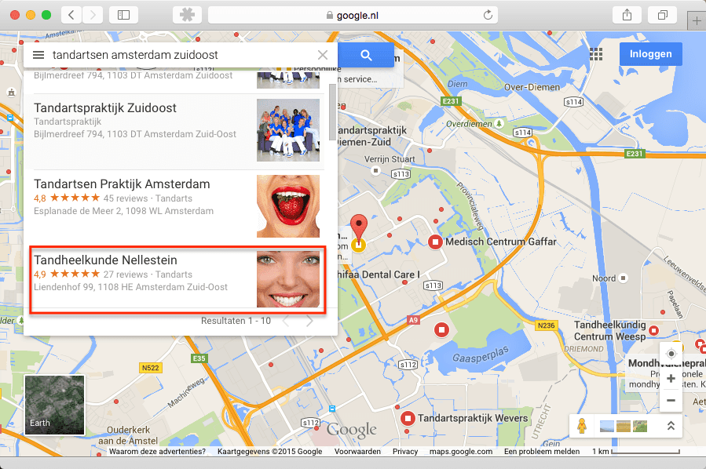
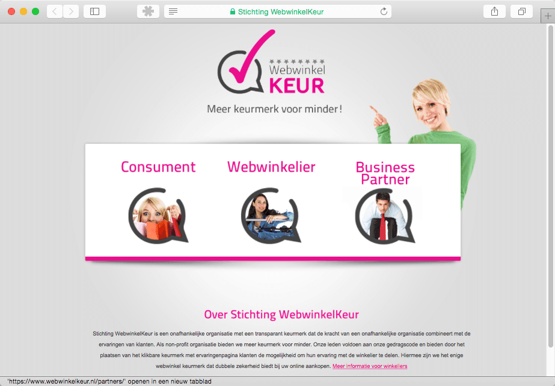

> **Historisch archief.** Deze aflevering verscheen op 13-08-2015 als onderdeel van ReputatieCoaching (2012–2016). De oorspronkelijke tekst is hieronder historisch bewaard. Diensten, contactgegevens, links, tools en adviezen kunnen inmiddels verouderd zijn.



**Transcriptiestatus:** Volledige transcriptie uit het oorspronkelijke archief.

***Historische afbeelding niet beschikbaar: ReputatieCoaching Podcast*
Had je door dat ik de afgelopen twee weken niet aanwezig was? Ik hoop dat je het niet hebt gemerkt, maar ik was met het gezin op vakantie in Spanje. Alle instructievideo’s die je nu dagelijks live ziet komen, had ik in mei al gemaakt en als privé (dus ontoegankelijk voor anderen) geüpload naar YouTube, waarna ik ze gepland online liet en laat komen, nèt voor het begeleidende artikel online gepubliceerd wordt. Ook de podcasts had ik van tevoren ingesproken en samengesteld.**

**Alleen moest ik tijdens mijn vakantie wel direct melding maken van de vernieuwde lokale zoekresultaten, vond ik. Maar nu ben ik dus weer terug in Nederland en weer volop aan de slag!**

Het eerste onderwerp voor vandaag komt van Ron Steenkist uit Amsterdam: hij vraagt hoe het komt dat zijn lokale bedrijfsvermelding voorbij wordt gestreefd door niet-geoptimaliseerde sites. Bij een snelle analyse komen daar wel wat leuke zaken naar boven, dus blijf luisteren!

Het tweede en tevens laatste onderwerp in deze podcast is een interview met Jelmer van der Linden van Webwinkelkeur.

Hallo en hartelijk welkom bij deze aflevering van de ReputatieCoaching Podcast. Ik ben Eduard de Boer, ReputatieCoach. Dit is dé podcast die jou helpt om meer business te genereren, doordat jouw website beter gevonden wordt, zowel lokaal als landelijk en doordat ik je uitleg hoe je je online reputatie kunt verbeteren. Dit alles helpt je om je bedrijf en jezelf beter op de online kaart te plaatsen.

De podcast kun je vinden op [www.reputatiecoaching.nl/141](https://www.reputatiecoaching.nl/141/). Daar vind je niet alleen de tekst, maar ook video’s waar ik het in deze uitzending over heb, alsmede afbeeldingen, links enzovoorts. Bovendien is de podcast te beluisteren in [iTunes](https://www.reputatiecoaching.nl/itunes), op [Stitcher](https://www.reputatiecoaching.nl/stitcher) en ook op [TuneIn Radio](http://tunein.com/radio/ReputatieCoaching-Podcast-p655084/). Ik raad je aan om je op één van die drie kanalen te abonneren op de podcast, zodat je geen aflevering hoeft te missen!

Laat ik dan nu overgaan op de onderwerpen voor vandaag…

## Vraag van Ron Steenkist

Het blijkt wel dat de website-artikelen en alle video’s die over tandartsen gaan, ook daadwerkelijk door tandartsen worden gelezen en bekeken. Zo ontving ik eerder deze week het volgende bericht:

Wat doe jij het goed man, met je links en citations berichtgeving. Ben erg georiënteerd op de USA voor wat betreft local search kennis.. Maar heb al veel bruikbaars van je blogs gehaald . Dankje daarvoor.

Met mijn site Tandheelkunde Nellestein scoor ik hoog in de zoekresultaten. Alleen met zoekopdracht in Maps sta ik niet meer bij de eerste 3… Bij zoekopdracht: “tandartsen amsterdam zuidoost” word ik voorbij gestreefd door niet geoptimaliseerde sites.

Op tandheelkunde en tandheelkundige klinieken sta ik wel bij de eerste 3.

Mijn site in wording implantologie amsterdam zuidoost wordt door mijn local optimalisatie wel goed vermeld. Implantologie Amsterdam Zuidoost is in het buurpand gevestigd.

Hoe Google te bewegen tandartsen en tandheelkunde als één te zien:) Zou ik de tags op mijn website moeten veranderen?

Dank voor al je werk.

[](https://lh6.googleusercontent.com/-mgO5xCaeAPU/Vcw2OpQWYPI/AAAAAAAACkc/615CCxZdUW8/w899-h598-no/20150813-tandartsen-amsterdam-zuidoost.png)

Mijn antwoord aan Ron was als volgt:

Dankje voor je leuke feedback en je vragen. Een paar korte opmerkingen / waarnemingen:

1. Je site is niet mobielvriendelijk, dat zou ik zeker aanpakken met een herontwerp. Tip: laat bij het herontwerp de site baseren op WordPress
2. Op “tandartsen amsterdam zuidoost” scoor je bij mij op mobiel (in Apeldoorn) #3 en op desktop ook #3
3. Je hebt recentelijk geen reviews op Google verzameld.
4. Het telefoonnummer op je site is niet klikbaar.

Verder zal ik je vragen / probleem behandelen in de podcast van aankomende donderdag als je het goed vindt.

Aiii… Toen ik nog verder ging kijken, zag ik dat er probleem van een heel andere orde speelde… Een probleem dat magnitudes groter was, dan de zaken die ik in eerste instantie had gemaild. Dus ik stuurde zo snel mogelijk nog een mailtje, een paar minuten na de eerste mail…

Het grootste probleem zag ik in de snelle analyse over het hoofd!! Stom van me!

Op je site toon je (in leesbare tekst) het telefoonnummer 020–760**2992** op de contactpagina, maar het nummer dat rechtsboven staat is: 020–760**2882**. Dat staat echter in een image en wordt dus niet door Google gezien, noch herkend!
(Als je snel kijkt, lijken de 8 en de 9 best op elkaar).

Het nummer 020–760**2992** komt op een 7-tal sites voor. Maar op Google Maps sta je óók met 020–760**2882**, evenals op 1.150 andere pagina’s op het web:

Dus daar raakt Google als eerste al de weg kwijt…

Begin maar eens met 020–760**2882** als primair nummer op je site te melden en ga gestaag door met citations creëren… ;-)

Met vriendelijke groet,

Eduard

Zoals je weet is het essentieel om je telefoonnummer consistent te houden en echt overal hetzelfde telefoonnummer te vermelden. Het zal wel even duren voordat Google die 1.150 vermeldingen heeft geassocieerd met het correcte nummer. Aan de andere kant zou het ook nog wel eens kunnen meevallen, wanneer Google de hele website heeft gecrawld en de verwijzingen naar het oude nummer kwijt is.

Het is vast niet zo snel als het wijzigen van een telefoonnummer in Google Mijn Bedrijf. Als je daar iets aanpast, zie je het resultaat vrijwel direct erna terug in de zoekresultaten.

# Interview met Jelmer van der Linden van Webwinkelkeur

Het interview met Jelmer had ik ook voor mijn vakantie al opgenomen. Echter ging er toen iets fout, waardoor er ontzettend veel ruis in de antwoorden van Jelmer kwam en die ruis werd erger naarmate zijn antwoorden langer werden. Zodra ik begon te spreken, was de ruis weer weg.

Jelmer vond ook dat zijn verhaal niet zo goed tot zijn recht kwam en is zo vriendelijk geweest om de antwoorden waar de meeste ruis in zat, opnieuw op te nemen tijdens mijn vakantie en die naar mij te sturen. Dus in het interview dat zo volgt, zitten nog één of twee antwoorden met wat ruis, maar de overige zijn vervangen door de nieuwe opnames.

[](https://www.webwinkelkeur.nl)

Vandaag heb ik dus Jelmer van der Linden van de [Stichting WebwinkelKeur](https://www.webwinkelkeur.nl) in de show. Jelmer komt ons iets meer vertellen over het bedrijf en de producten c.q. diensten die het levert.

**In het interview komen de volgende vragen aan bod.**
**Beluister de audio voor de antwoorden van Jelmer.**

```
  1. Hallo Jelmer, leuk dat je in de show wilde komen om ons iets meer te vertellen over WebwinkelKeur en haar diensten. Voordat we we wereld van reviews in duiken, denk ik dat het goed is voor de luisteraars, als je eerst even iets over jezelf vertelt: je achtergrond, waar je zoal hebt gewerkt en hoe je bij WebwinkelKeur verzeild bent geraakt.
  2. Wellicht kennen sommige luisteraars van de podcast of lezers van het weblog jullie wel, maar hoe is het bedrijf ontstaan?
  3. Kortgezegd bieden jullie de mogelijkheid om reviews te verzamelen. Conceptueel is dat allemaal hetzelfde: een klant typt een review, je bericht de ondernemer of zorgverlener, je berekent wat statistieken en je publiceert de review. Ik heb natuurlijk wel jullie site bestudeerd, maar wat interessant is voor de luisteraars, is de vraag wat jullie nog meer bieden. En hoe gaat jullie systeem om met negatieve reviews? Bieden jullie nog andere producten / diensten?
  4. Het is natuurlijk echt puur Nederlands, om dan de vraag te stellen: “Wat kost dat?”. Met andere woorden: hoe zit jullie prijsstructuur in elkaar en wat krijgen mensen ervoor?
  5. Als ReputatieCoach hecht ik grote waarde aan reviews, niet alleen aan het verzamelen, maar ook aan het spreiden van reviews over verschillende reviewsites: zowel commerciële als gratis sites. Wat is jullie visie op het spreiden van reviews?
  6. Hoe zien jullie reviews? Verwachten jullie dat reviews de komende vijf jaar nog belangrijker worden, dan nu? Waarom zijn jullie die mening toegedaan?
  7. Kunnen we binnenkort nog nieuwe ontwikkelingen verwachten op jullie platform? Zo ja, kun je een tipje van de sluier oplichten?
  8. Voor dit onderzoek heb ik 23 bedrijven een e-mail gestuurd met het verzoek of ze aan het interview willen meewerken. 5 hebben er positief gereageerd. Hoedanook zijn er best aardig wat concurrenten voor jullie. Als je dan klanten naar je toe wilt trekken, moet je jezelf onderscheiden. Wat zijn jullie unique selling points? Waarom moeten ondernemers of zorgverleners nu per se voor jullie kiezen?
  9. Dat was wat ik zo’n beetje wilde vragen. Wat mij betreft kun je nu je commerciële pet opzetten en vertellen waarom de luisteraars van de podcast nu toch echt voor jullie moeten kiezen om ook hun reviews te verzamelen! Barst maar los!
```

Het is duidelijk. In de show notes op de website zal ik ook de links die je hebt genoemd in het interview opnemen, zodat mensen niet hoeven te zoeken.

Bedankt voor je tijd!

En met dit interview met Jelmer van der Linden kom ik dan weer aan het einde van de podcast van deze week.

Als je de podcast leuk vindt en je wilt nog meer op de hoogte blijven, volg me dan ook op Twitter, via [@reputatiecoach1](https://twitter.com/reputatiecoach1).

Heb je inderdaad wat aan alle informatie die ik met je deel, help mij dan met het verder verbeteren en promoten van deze podcast. Abonneer je op de podcast, zodat je altijd meteen de nieuwste uitzending krijgt voorgeschoteld.

Zoek de podcast op, in [iTunes](https://www.reputatiecoaching.nl/itunes) of [Stitcher](https://www.reputatiecoaching.nl/stitcher), geef de podcast een sterrenbeoordeling en laat ook je reactie achter. Door de podcast te beoordelen op iTunes en/of Stitcher breng je de podcast onder de aandacht van een breder publiek.

Je kunt me verder helpen, door de podcast aan te bevelen bij vrienden of collega’s, waarvan je denkt dat ze er hun voordeel mee kunnen doen, of door ’m te delen op Twitter, like’n en delen op Facebook of een “+1” te geven op Google+.

En vergeet niet: ik ben hier om je te helpen! Als je een vraag of een probleem hebt met betrekking tot je online reputatie of de vindbaarheid van je website, kun je een mailtje sturen naar [podcast@reputatiecoaching.nl](mailto:podcast@reputatiecoaching.nl).

Als je dat te lastig vindt, of als je de podcast beluistert terwijl je in de auto zit en je hebt acuut een vraag, spreek dan een boodschap in op de ReputatieCoaching Hotline, op nummer: 084 - 883 15 56. Mogelijk behandel ik je vraag of probleem dan in een artikel of in de podcast.

En je kunt ook rechtstreeks op de website een voicemail achterlaten, door op de tab aan de rechterkant van elke pagina te klikken, en je bericht in te spreken. Dit was [ReputatieCoaching Podcast aflevering 141](https://www.reputatiecoaching.nl/141/) en mijn naam is [Eduard de Boer](http://nl.linkedin.com/in/eduarddeboer/nl).

Ik wens je de komende week weer succes met het werken aan je reputatie, zodat je meteen je reputatie voor jou kunt laten werken!

Tot volgende week!

Doei!

Links naar content die in deze podcast aan bod komt:

```
  * [ReputatieCoaching Podcast in iTunes](https://www.reputatiecoaching.nl/itunes)
  * [ReputatieCoaching Podcast op Stitcher](https://www.reputatiecoaching.nl/stitcher)
  * [ReputatieCoaching Podcast op TuneIn Radio](http://tunein.com/radio/ReputatieCoaching-Podcast-p655084/)
  * [ReputatieCoaching Podcast RSS-feed](https://feeds.reputatiecoaching.nl/ReputatieCoachingPodcast)
  * [Stichting Webwinkelkeur](https://www.webwinkelkeur.nl)
```
