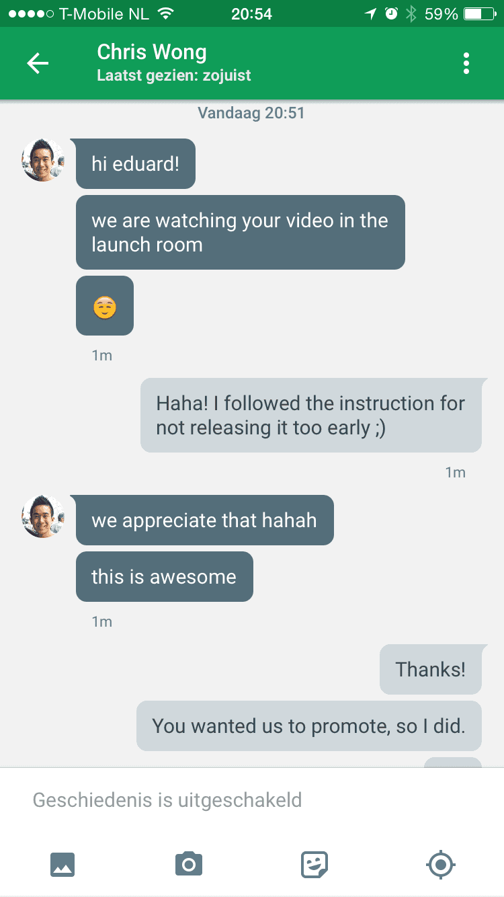
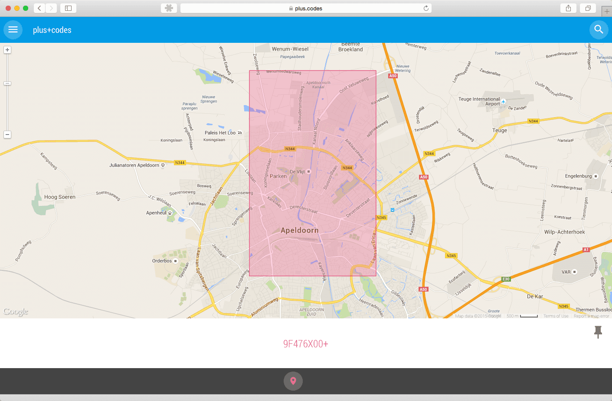
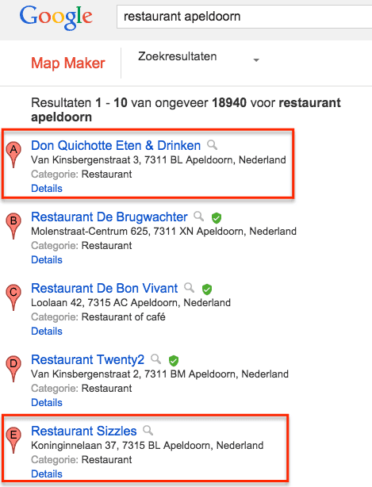
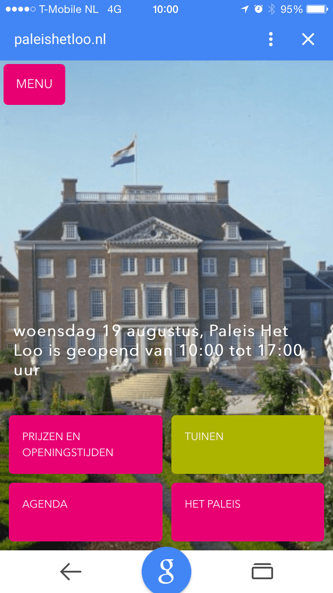

> **Historisch archief.** Deze aflevering verscheen op 20-08-2015 als onderdeel van ReputatieCoaching (2012–2016). De oorspronkelijke tekst is hieronder historisch bewaard. Diensten, contactgegevens, links, tools en adviezen kunnen inmiddels verouderd zijn.

**Transcriptiestatus:** Volledige transcriptie uit het oorspronkelijke archief.

***Historische afbeelding niet beschikbaar: ReputatieCoaching Podcast*
Eerder deze week is WordPress 4.3 met codenaam “Billie” uitgekomen. Naast vele bugfixes zijn er ook enkele vernieuwingen en verbeteringen in deze nieuwe versie. Daar begin ik de podcast van vandaag mee.**

**Gisteren had ik een gesprek met luisteraar Romano, naar aanleiding van een mail met enkele interessante vragen die hij laatst had gestuurd. Daar ga ik op in.**

**En het kon ook niet uitblijven… Ik heb weer eens een behoorlijk aantal topics over Google. Het eerste Google topic gaat over #gHelp, ofwel “Help on Social”.**

**Google introduceerde eerder dit jaar de zogenaamde pluscodes… Wat zijn pluscodes en wat is *jouw* pluscode?**

**John Mueller van Google vertelde in een Hangout dat het prima is om alleen een mobiele site te hebben, omdat die ook op de desktop kan worden gevonden.**

**Je moet met hedendaagse websites wel oppassen met zogenaamde “lazy content”. Wat dat is en waarom je daarmee moet oppassen vertel ik je zometeen. En voor de SEO-specialisten die zich eindloos tot in het extreme focussen op zoektermanalyses heb ik slecht nieuws: het zoeken en vinden gaat drastisch veranderen!**

**Weet je trouwens wat 42% van de mensen doet op de smartphone, als ze aan het winkelen zijn? Dat hoor je straks!**

**Ik sluit de podcast van vandaag af met 6 positieve kanten van negatieve reviews. Wil je weten wat die zijn? Blijf luisteren!**

Hallo en hartelijk welkom bij deze aflevering van de ReputatieCoaching Podcast. Ik ben Eduard de Boer, ReputatieCoach. Dit is dé podcast die jou helpt om meer business te genereren, doordat jouw website beter gevonden wordt, zowel lokaal als landelijk en doordat ik je uitleg hoe je je online reputatie kunt verbeteren. Dit alles helpt je om je bedrijf en jezelf beter op de online kaart te plaatsen.

De podcast kun je vinden op [www.reputatiecoaching.nl/142](/nl/archief/reputatiecoaching/142/). Daar vind je niet alleen de tekst, maar ook video’s waar ik het in deze uitzending over heb, alsmede afbeeldingen, links enzovoorts. Bovendien is de podcast te beluisteren in [iTunes](https://web.archive.org/web/*/https://www.reputatiecoaching.nl/itunes), op [Stitcher](https://web.archive.org/web/*/https://www.reputatiecoaching.nl/stitcher) en ook op [TuneIn Radio](http://tunein.com/radio/ReputatieCoaching-Podcast-p655084/). Ik raad je aan om je op één van die drie kanalen te abonneren op de podcast, zodat je geen aflevering hoeft te missen!

Laat ik dan nu overgaan op de onderwerpen voor vandaag…

## WordPress 4.3 (“Billie”) is uit!

Ik zei het zojuist al: [WordPress 4.3](https://wordpress.org/news/2015/08/billie/) is uit. De codenaam van deze versie is “Billie”, ter nagedachtenis van de jazz zanger “Billie Holiday”.

De belangrijkste wijzigingen zijn:

```
  * Nu wordt een deel van de opmaaktaal Markdown ondersteund: je kunt koppen van een bepaald niveau laten beginnen met het gewenste aantal ‘#’. Zo is een H1 1 hashtag, een H2 2 hekjes enzovoorts. Een bullet list begin je met een asterisk of sterretje, een genummerde lijst met 1 en een spatie. Een quote begin het door een groter-dan teken in te voeren “>”.
  * Je kunt je site icoon nu instellen en bewerken in WordPress
  * Nieuwe passwords worden niet meer per mail verspreid, maar die stel je op de site in met een reset-link.
  * Je kunt menu’s nu ook op mobiele apparaten bewerken
  * De admin-interface werkt soepeler op meer apparaten
  * Standaard staan reacties op pagina’s uit
  * … nog wat kleine aanpassingen
```

Bekijk de video die ik in de show notes heb opgenomen voor meer informatie (2m15):

## Gesprek met Romano

Romano stuurde me laatst een mailtje met enkele vragen, waar ik gisteren al met hem over heb gepraat via Skype.

Zijn e-mail was als volgt:

Allereerst, echt heel erg toffe podcast.
Samen met Frankwatching naar mijn mening de beste Nederlandstalige marketing podcast.

Probeer nu alle afleveringen terug te luisteren.

Zal binnenkort wanneer ik me weer eens bevind in die verschrikkelijke iTunes interface een review achterlaten.

Ik heb twee vragen die te maken hebben met citations en dan met name de schrijfwijze van het telefoonnummer en het adres.

Allereerst over het telefoonnummer…

De Nederlandse taalboekjes en dergelijke zeggen dat een telefoonnummer als volgt geformat moet worden: 0181 - 47 11 11 (Is bijvoorbeeld van het gemeentehuis Brielle)

Echter, Google lijkt er anders over te denken. Want wanneer ik Google op ‘Brielle gemeentehuis telefoonnummer’, dan zie ik 0181 471 111 … Geen streepje dus en andere gegroepeerd.

Zou ik al mijn citations en die van mijn klanten en de Google Mijn Bedrijf vermeldingen beter kunnen aanpassen naar wat Google laat zien of de officiële Nederlandse standaard handhaven?

Consistentie is key bij local, dat weet ik. Dus het is het één of het ander…

Ditzelfde probleem heb ik ook bij mijn straatadres. Officieel is dat: “Dr de Snooplein 12”, waarbij “Doctor” is geschreven als “D-r”.

Google denkt echter dat het moet zijn: Doctor de Snooplein 12, met “Doctor” voluit geschreven.

Alle Nederlandse instellingen lijken echter aan te geven Dr de Snooplein (met “Doctor” dus afgekort tot “Dr”) en ik heb nog nooit iemand Doctor de Snooplein (voluit) zien gebruiken, op onze vrienden van Google na dan.

Tjonge Romano, dankjewel voor die opening! Ik kan beide vragen eigenlijk in één keer beantwoorden. Wat ik nu ga zeggen klinkt voor de hand liggend, maar is niet gebaseerd op keiharde feiten of mededelingen uit de Googleplex. Het is gebaseerd op wat ik links en rechts als soort van aannames erover heb gelezen.

Het lijkt logisch dat Google niet eist dat ALLE citations op ALLE websites in de wereld voor 100% identiek zijn. Dat zou ondoenlijk zijn. Bovendien heb je ook partiële citations, bijvoorbeeld alleen de vermelding van een straatnaam, een telefoonnummer of een bedrijfsnaam. Een bedrijfsnaam alleen is ook een citation, zelfs als die niet gelinkt is.

Er wordt gedacht dat Google probeert citations eerst te generaliseren in een soort van intern formaat en natuurlijk zal er dan wel een “waarde” aan worden gegeven, volgens een bepaalde, voor de wereld buiten Google onbekende formule. In dit gegeneraliseerde formaat zullen telefoonnummers worden omgewerkt, zodat ze vergeleken kunnen worden.

Als op een Nederlandse directorysite het nummer 06–12345678 wordt vertoond, relateert Google dit aan Nederland en zal er voor de volledigheid +31 aan koppelen en de ‘0’ weglaten, waardoor het nummer dus wordt weergegeven als: +31 6 12345678.

Maar als hetzelfde nummer op een Spaanse site wordt vertoond, zal Google er waarschijnlijk: +34 6 12345678 van maken om het te vergelijken met andere Spanjegerelateerde vermeldingen.

Op een vergelijkbare manier worden adressen gegeneraliseerd. Google kent algemene en officiële afkortingen als “Dr.”, “Prof.” en dergelijke. Hoewel Google vaak openbare bronnen gebruikt voor haar gegevens, zag ik op de site van het Kadaster dat de officiële schrijfwijze inderdaad “[Dr de Snooplein 12](http://brielle.kadasterdata.nl/dr%20de%20snooplein/12)” is, dus geschreven als “D-r”.

Zo wordt mogelijk de afkorting “Dr” door Google zelf voluit gescheven in het kader van de generalisatie waar ik het zojuist over had.

Maar goed, waar wil ik nu naartoe met dit verhaal? Consistentie is noodzaak, dat klopt. Maar ga je niet vermoeien met dit soort details van exacte schrijfwijzem. Vertrouw op de intelligentia binnen Google die dit al lang geleden voor je hebben opgelost. Belangrijker is dat je overal het juiste adres en juiste telefoonnummer specificeert, in combinatie met de juiste bedrijfsnaam en dergelijke.

Let echter wel op de bedrijfsnaam, dat je die overal hetzelfde schrijft, zoals die staat geregistreerd bij de Kamer van Koophandel. Zo zijn er meer dan [30 sites die (volgens mij) hun gegevens van de Kamer van Koophandel krijgen en herpubliceren](/nl/archief/reputatiecoaching/138/). Dus om die gekoppeld te krijgen aan jouw bedrijf en alle andere citations, moet er voor de gegevens zoveel mogelijk overeenkomst zijn. En een belangrijk onderdeel daarvan is natuurlijk ook je bedrijfsnaam.

Ik hoop dat ik hiermee je vragen heb beantwoord, Romano.

## #gHelp voor Google’s “Help on Social”

Het eerste Google-gerelateerde topic gaat over “Help on Social”…

Afgelopen dinsdag was de lancering van een nieuwe dienst van Google, met de naam “[Help on Social](https://web.archive.org/web/*/https://www.reputatiecoaching.nl/help-on-social-ghelp-introductie-google/)”. Dit is een crowdsourced dienst, waarbij Google gebruik maakt van de community om die vragen over de producten via Twitter te laten beantwoorden, in plaats van in de Google Product Forums.

Deze laatste verdwijnen natuurlijk niet: “Help on Social” is een aanvulling, een near-realtime helpdesk voor Google producten. Google verbetert op die manier de gebruikerservaring, doordat mensen hun vraag op Twitter kunnen stellen en de “community” die beantwoordt.

Toen ik dinsdagavond rond negen uur zag dat de eerste officiële vermeldingen vanuit Google over de nieuwe dienst online kwamen, vond ik dat het juiste moment was aangebroken om de video en het reeds geschreven blogartikel handmatig te publiceren.

Vlak daarna kreeg ik via Google Hangout een leuk berichtje van Chris Wong, de productcoördinator van Google. Ik heb een screenshot hiervan opgenomen in de show notes, op [www.reputatiecoaching.nl/142](/nl/archief/reputatiecoaching/142/):

[](https://lh4.googleusercontent.com/-J3hs4u0FsqQ/VdSPcFUtvfI/AAAAAAAACmg/4rDLppF6U6w/w516-h918-no/20150818-ChrisWong-Hangout.png)

Hij schreef:

we are watching your video in de launch room

this is awesome

Dat is toch leuk om dat dan uit de koker van Google te horen te krijgen!

## Wat is jouw pluscode?

Verder met Google… Ik heb wel eens gehoord dat de vraag die veruit het meest onder jongeren wordt gesteld als ze elkaar mobiel bellen, luidt:

Ik vraag me af hoelang het zal duren, tot dit is vervangen door:

Wat is een pluscode, waarvoor kun je pluscodes gebruiken en moet je nu al meteen de juiste pluscode in al je citations gaan gebruiken?

Een pluscode is een indicatie voor een locatie. Zo is de pluscode van ons huis 9F476X4J+WC. En dat heeft dus niets met ons toilet te maken, hoor! De code is als volgt samengesteld:

```
  * De eerste vier karakters (“9F47”) geven een gebied in de wereld aan van zo’n 100 bij 100 kilometer
  * De volgende twee karakters (“6X”) wijzen op de stad, zo’n 5 bij 5 kilometer
  * De laatste twee karakters voor het plusteken (“4J”) wijzen op de buurt, zo’n 250 bij 250 meter
  * En de code achter de ‘+’, “WC” in dit geval, geeft een gebied van 14 bij 14 meter aan
```

Deze gegevens over de indeling heb ik van Google. Grappig genoeg zijn de kaders die ik te zien krijg rechthoekig en niet vierkant. Maar ik denk dat de totale oppervlakte wel aardig klopt.

In de show notes heb ik wat screenshots opgenomen, waarin ik dit laat zien. Let vooral op het steeds specifieker worden van de code onder de kaart naarmate ik verder inzoom.

[](https://lh4.googleusercontent.com/-WCGrIgloPDk/VdSQF87XpPI/AAAAAAAACm4/cxUnbwf3Cog/w1397-h918-no/20150819-pluscode-apeldoorn-1.png)

[](https://lh4.googleusercontent.com/-y8hpIR-xCLY/VdSQF6Wg8yI/AAAAAAAACm0/PApVV66BbwM/w1397-h918-no/20150819-pluscode-apeldoorn-2.png)

Het systeem is gebaseerd op het concept van “[Open Location Codes](https://github.com/google/open-location-code)”. Op GitHub vind je Open Source code om hiermee om te gaan.

Daar kun je lezen dat de nauwkeurigheid van OLC nóg verder kan worden opgevoerd. Als je de rechthoek de wordt aangegeven met de code van 10 karakters verdeelt in een rechthoek van 4 bij 5, geeft één enkel karakter het gewenste rechthoekje van 3,5 bij 2,8 meter aan.

Google meldt verder over deze [Pluscodes](https://plus.codes) het volgende:

```
  * Iedere locatie heeft één unieke pluscode
  * Je kunt pluscodes bewaren in je browser door ze te bookmarken. Wanneer je de bookmarkt opent, wordt de locatie vertoond.
  * Als je de pagina [http://plus.codes](https://plus.codes) hebt geopend op je computer of telefoon, wordt een kopie bewaard, zodat je de code altijd kunt raadplegen, zelfs als je offline bent.
  * Je kunt nog geen routebeschrijvingen krijgen naar pluscodes, de site toont alleen een kompas
```

Deze codes zijn bij uitstek geschikt om locaties in gebieden of steden aan te geven, die geen adres hebben. Een dergelijke code is in elk geval een stuk korter dan GPS-coördinaten.

Surf eens naar [plus.codes](https://plus.codes) en kijk wat jouw plus code is.

Maar moet je je pluscode al gebruiken in je citations? Hmmm… ik denk het nog niet. Kijk eerst eens of het hele concept van de pluscodes serieus doordringt in de markt van cartografen, satellietfotografen, online telefoonboeken en directory sites. Eén ding weet ik wel, als je op reguliere post alleen nog maar een pluscode ziet staan of als je TomTom om een pluscode vraagt, ben je te laat met het aanpassen van je citations!

## Google MapMaker toont geverifieerde vermeldingen

Google [MapMaker](https://www.google.nl/mapmaker) is onlangs voor zes landen geopend; de rest van de wereld kan nog steeds geen wijzigingen doorvoeren en wacht lijdzaam tot de heropening van MapMaker. Toch is Google er wel mee bezig, ook in de landen die nog niet geopend zijn.

Zo is onlangs een nieuwe feature geïntroduceerd, waarbij MapMaker naast geverifieerde vermeldingen een groen schildje vertoont. Ik heb hiervan een screenshot opgenomen in de show notes:

[](https://lh4.googleusercontent.com/-faA3wljwNrc/VdSQ2zoPYCI/AAAAAAAACng/ch_pNmdgC3U/w469-h614-no/20150819-mapmaker-verified-1.png)

Het leuke is dat je op die manier ook snel en gemakkelijk duplicaten van je bedrijfsvermelding kunt vinden, want die zijn dus niet geclaimd c.q. geverifieerd. Typ de bedrijfsnaam en het adres in de zoekbalk op MapMaker en kijk wat er wordt vertoond. Kijk maar eens naar het andere screenshot van MapMaker, waarin ik zoek op “fysiotherapie douma hilversum”. Dan zie je dat er één vermelding bestaat, die niet is geverifieerd. Dat is dan meteen ook de duplicaatpagina:

[](https://lh5.googleusercontent.com/-IyMFfsP-k5A/VdSQ200a0-I/AAAAAAAACnc/cABEK6XdRwg/w451-h506-no/20150819-mapmaker-verified-2.png)

## “Alleen mobiele site is prima”, volgens Jogn Muller van Google

Laatst zei John Mueller in een Hangout dat het voor Google prima is, als een bedrijf alleen een mobiele site heeft. Die wordt geïndexeerd en ook in de desktop versie van Google Search vertoond. Andersom kan het gebeuren dat een mobielonvriendelijke site niet of lager in de mobiele zoekresultaten voorkomt.

Later nuanceerde hij deze uitspraak iets op Google+. Hij schreef:

Zo zie je hoe snel bepaalde uitspraken uit hun verband kunnen worden getrokken.

## Pas op met “lazy content”

Op Search Engine Roundtable las ik over zogenaamde “lazy content”. Dat is content die pas na het laden van de pagina wordt vertoond, of als een gebruiker naar beneden scrollt of ergens op klikt. In een aantal situaties kan Google die content niet lezen en dus ook niet indexeren. Dat geldt zowel voor desktopversies van websites, als voor mobiele websites.

Als alle content al in de pagina zit bij het laden van de pagina, is de kans groot dat die wel wordt geïndexeerd, ook voor gebruik in de mobiele zoekresultaten. Maar als content later wordt geladen en vertoond in reactie op een bepaalde handeling door de gebruikter, kan dit dus tot problemen leiden.

De oorzaak hiervan ligt in het feit dat als Googlebot de pagina laadt, het niet weet wat het precies moet doen om de niet-vertoonde content zichtbaar zichtbaar te maken, als het iets specifieks is.

John Mueller raadt webmasters dan ook aan de feature “Fetch as Google” te gebruiken, om te zien of alle content daadwerkelijk wordt geladen en dus ook geïndexeerd kan worden.

## Zoeken in Google verandert drastisch

De wereld van zoekmachines is continu aan verandering onderhevig. Waar we vroeger ellenlange keywordonderzoeken deden, worden deze vandaag de dag al een stuk korter, omdat zoekmachines ook steeds beter worden in het “begrijpen” van de content.

Ook het zoekgedrag van mensen verandert. Mobiele telefoons hebben geleid tot betere spraakherkenning en als je de Google app installeert op je smartphone kun je tegen Google praten, net als tegen Google Glass. In plaats van “OK, Glass”, moet je dan zeggen “OK, Google”. Deze feature doet het niet als je de app in het Nederlands gebruikt. Om tegen de app te kunnen kletsen, moet je ’m eerst op Engels zetten.

Als je dan bijvoorbeeld zegt: “OK Google… Loo Palace Apeldoorn”, dan worden de zoekresultaten vertoond, zoals die standaard op het mobiele apparaat worden weergegeven. Maar wat vervolgens kan, is simpelweg revolutionair… Op de vraag: “OK Google… How old is it?”, wordt je meteen verteld dat Paleis het Loo 329 jaar is en uit 1686 stamt.

[[Historische afbeelding: Paleis het Loo gevonden met Google](https://lh5.googleusercontent.com/EwSqAEIp3_qbbqQOiIr7xBDppEToaPivEFIqrYtmm74=w516-h918-no)](https://lh5.googleusercontent.com/EwSqAEIp3_qbbqQOiIr7xBDppEToaPivEFIqrYtmm74=w516-h918-no)

[](https://lh4.googleusercontent.com/-W1WgeRqrJtE/VdSRoDnjwUI/AAAAAAAACn0/J7npQCH9DC8/w516-h918-no/20150819-google-het-loo-1.png)

Wellicht zal een eerste zoekpoging van mensen nog erg concreet zijn, maar als je zo met zoekmachines kunt omgaan, dat je dus als het ware doorvraagt op datgene, waar je net op hebt gezocht, dan vereist dat heel andere technieken dan alleen maar keywordanalyse.

Nu heb ik het wel even gehad met Google in deze podcast. Nog wat geheel anders…

## 90% van winkelbezoekers gebruikt smartphone in de winkel

Wist je dat in Amerika zo’n 90% van het winkelende publiek zijn of haar smartphone gebruikt tijdens het winkelen? Dat blijkt uit een [onderzoek](http://marketingland.com/survey-90-percent-of-retail-shoppers-use-smartphones-in-stores-135759) dat is uitgevoerd onder 12.000 willekeurig gekozen Amerikanen.

54% van de mensen gebruikt de smartphone voor het vergelijken van de prijs om te zien of die elders mogelijk goedkoper is, 48% zoekt naar productinformatie en 42% checkt online reviews van het product!

Oeps! Hoorde je dat? 42% van de mensen checkt online reviews van producten die ze in een winkel zien en overwegen aan te schaffen. Daaruit blijkt ook maar weer eens temeer dat reviews steeds belangrijker worden. Mogelijk hechten we er in Nederland nog niet zoveel waarde aan als in de VS, maar dat is volgens mij slechts een kwestie van tijd…

## 6 positieve kanten aan negatieve reviews

Maar al te vaak hoor ik van ondernemers dat ze geen reviews durven te gaan vragen uit angst voor negatieve reviews. Als jij die mening ook bent toegedaan, dan heb ik slecht nieuws voor je!

*Historische afbeelding niet beschikbaar: Werf goede en positieve reviews voor je producten en diensten*

Want de reviews over je product of dienst worden toch wel geschreven, of jij er om vraagt of niet! En wat nog erger is, is dat voornamelijk mensen met een slechte ervaring uit zichzelf negatieve reviews posten!

Als jij dat niet eens in de gaten hebt, er niets mee doet en ook geen reviews vraagt, dan zul je dus zien dat je bedrijf gemiddeld laag beoordeeld zal worden.

Bekijk het van de andere kant: als het goed is zijn je meeste klanten tevreden. Als je dan iedereen vraagt om een review ergens te posten, dan wordt de gemiddelde teneur al snel een stuk positiever. OK, lang niet iedereen die je vraagt, post een review, maar sommigen geven meestal wel gehoor aan een dergelijk verzoek. Het werkt helemaal goed, als je mensen vraagt of ze je willen *helpen* met het verbeteren van de kwaliteit van je diensverlening of zorgverlening. Want mensen *helpen* graag!

Maar zijn negatieve reviews echt zo erg? Betekent een negatieve review dat je de deuren kunt sluiten? Nee, een negatieve review is echt niet het einde van de wereld. Zo las ik op het weblog van GetFiveStars een post van Mike Blumenthal, met als titel “[6 Good Things About Negative Reviews](http://blog.getfivestars.com/6-good-things-about-negative-reviews/)”.

Mike schrijft dat het voor een bedrijfseigenaar soms lastig kan zijn om een negatieve review anders te bekijken, dan als een persoonlijke aanval.

Mike somt de volgende 6 positieve kanten aan negatieve reviews op:

```
  1. _Meer vertrouwen door consumenten en meer conversies_ – Consumenten beseffen dat niemand perfect is en verwachten eigenlijk ook wel wat slechte of minder positieve informatie over een product of plaats. Sterrenbeoordelingen blijken overigens geen invloed te hebben op koopgedrag, maar recensies des temeer. Als een consument alleen maar 5-sterren reviews ziet, kan dit verdacht overkomen.
  2. _Betere kwaliticatie van prospects_ – Een negatieve recensie kan ook betekenen dat een bepaald product of een bepaalde dienst niet voor de schrijver van de review bestemd is. Zo kun je dus klanten vinden die wèl goed bij je product of dienst passen!
  3. _Als het niet bijster slecht is, is het wel goed_ – De meeste lezers van reviews kijken snel over de positieve reviews om dan meteen door te gaan naar de minder goede om daarin een patroon te herkennen. Als ze kunnen leven met de slechtste beschreven situaties, dan zullen ze heus nog wel business met je willen doen.
  4. _Indruk maken op prospects en toekomstige klanten_ – Consumenten weten dat je fouten kunt maken. Het gaat de meesten erom hoe je ze oplost of afhandelt! Als dat vertrouwen schept, dan zullen ze eerder bij je kopen.
  5. _Kans om ontevreden klanten te bereiken en op te leiden_ – Soms zijn klanten gefrustreerd of ontevreden over je bedrijf, je product of dienst, maar zien ze het niet zitten om een oplossing te vragen. Door publiekelijk of persoonlijk te reageren op een review heb je nóg een kans om die klant alsnog tevreden te stellen. Wellicht verwijderen of herschrijven ze hun review dan wel! Zelfs als ze dat niet doen, laat je aan toekomstige klanten zien hoe jij met problemen omgaat!
  6. _Kans om te verbeteren_ – Niet alle negatieve reviews zijn nuttig. Maar als je patronen erin kunt herkennen, zijn dát punten waarop je je product of dienstverlening kunt verbeteren.
```

Steek dus je hoofd niet in het zand voor reviews, maar ga ze verzamelen en reageer erop! Gebruik negatieve reviews als een springplank naar betere dienstverlening, betere producten of een algehele betere klantervaring!

En met deze wijze lessen kom ik dan weer aan het einde van deze 142e podcast. Het zit er weer op voor vandaag!

Als je de podcast leuk vindt en je wilt nog meer op de hoogte blijven, volg me dan ook op Twitter, via [@reputatiecoach1](https://twitter.com/reputatiecoach1).

Heb je inderdaad wat aan alle informatie die ik met je deel, help mij dan met het verder verbeteren en promoten van deze podcast. Abonneer je op de podcast, zodat je altijd meteen de nieuwste uitzending krijgt voorgeschoteld.

Zoek de podcast op, in [iTunes](https://web.archive.org/web/*/https://www.reputatiecoaching.nl/itunes) of [Stitcher](https://web.archive.org/web/*/https://www.reputatiecoaching.nl/stitcher), geef de podcast een sterrenbeoordeling en laat ook je reactie achter. Door de podcast te beoordelen op iTunes en/of Stitcher breng je de podcast onder de aandacht van een breder publiek.

Je kunt me verder helpen, door de podcast aan te bevelen bij vrienden of collega’s, waarvan je denkt dat ze er hun voordeel mee kunnen doen, of door ’m te delen op Twitter, like’n en delen op Facebook of een “+1” te geven op Google+.

En vergeet niet: ik ben hier om je te helpen! Als je een vraag of een probleem hebt met betrekking tot je online reputatie of de vindbaarheid van je website, kun je een mailtje sturen naar [podcast@reputatiecoaching.nl](mailto:podcast@reputatiecoaching.nl).

Als je dat te lastig vindt, of als je de podcast beluistert terwijl je in de auto zit en je hebt acuut een vraag, spreek dan een boodschap in op de ReputatieCoaching Hotline, op nummer: 084 - 883 15 56. Mogelijk behandel ik je vraag of probleem dan in een artikel of in de podcast.

En je kunt ook rechtstreeks op de website een voicemail achterlaten, door op de tab aan de rechterkant van elke pagina te klikken, en je bericht in te spreken. Dit was [ReputatieCoaching Podcast aflevering 142](/nl/archief/reputatiecoaching/142/) en mijn naam is [Eduard de Boer](http://nl.linkedin.com/in/eduarddeboer/nl).

Ik wens je de komende week weer succes met het werken aan je reputatie, zodat je meteen je reputatie voor jou kunt laten werken!

Tot volgende week!

Doei!

Links naar content die in deze podcast aan bod komt:

```
  * [ReputatieCoaching Podcast in iTunes](https://web.archive.org/web/*/https://www.reputatiecoaching.nl/itunes)
  * [ReputatieCoaching Podcast op Stitcher](https://web.archive.org/web/*/https://www.reputatiecoaching.nl/stitcher)
  * [ReputatieCoaching Podcast op TuneIn Radio](http://tunein.com/radio/ReputatieCoaching-Podcast-p655084/)
  * [ReputatieCoaching Podcast RSS-feed](https://feeds.reputatiecoaching.nl/ReputatieCoachingPodcast)
  * [WordPress 4.3 (“Billie”)](https://wordpress.org/news/2015/08/billie/)
  * [Open Location Code](https://github.com/google/open-location-code) (Source code voor OLC op GitHub)
  * “[Survey: 90 Percent Of Retail Shoppers Use Smartphones In Stores](http://marketingland.com/survey-90-percent-of-retail-shoppers-use-smartphones-in-stores-135759)” (Marketing Land, 20 juli 2015)
  * “[Plus codes: A new way to help pinpoint places on the map](http://google-latlong.blogspot.nl/2015/08/plus-codes-new-way-to-help-pinpoint.html)” (Google Latlong blog, 12 augustus 2015)
  * “[Google: We Can’t See All Lazy Loaded Content On Mobile](https://www.seroundtable.com/google-mobile-lazy-load-content-mobile-20759.html)” (Search Engine Roundtable, 17 augustus 2015)
  * “[6 Good Things About Negative Reviews](http://blog.getfivestars.com/6-good-things-about-negative-reviews/)” (GetFiveStars, 18 augustus 2015)
```
