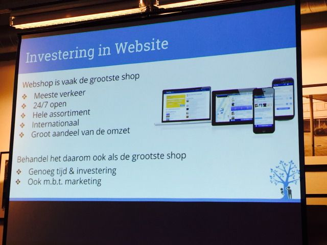

> **Historisch archief.** Deze aflevering verscheen op 17-09-2015 als onderdeel van ReputatieCoaching (2012–2016). De oorspronkelijke tekst is hieronder historisch bewaard. Diensten, contactgegevens, links, tools en adviezen kunnen inmiddels verouderd zijn.

**Transcriptiestatus:** Volledige transcriptie uit het oorspronkelijke archief.

***Historische afbeelding niet beschikbaar: ReputatieCoaching Podcast*
Afgelopen maandag was ik bij #SMC055, ofwel Social Media Club Apeldoorn. Het onderwerp van de avond luidde “Zoeken en gevonden worden: SEO en SEA”. Er waren twee sprekers. Sabine Roex beet het spits af en gaf de eerste presentatie.**

**Sabine is medeoprichter van [Hide and Seek](http://hide-and-seek.nl). Voor Hide and Seek werkte Sabine twee jaar bij Google op het Europese hoofdkantoor in Dublin. Eerst in het New Business Development Team en daarna als Account Manager voor Google’s grootste Travel klanten in Nederland.**

**Dus je zult vast wel het één en ander opsteken van haar verhaal, dat bijna 35 minuten duurt. Dus deze podcast is daarmee iets langer dan normaal.**

Hallo en hartelijk welkom bij deze aflevering van de ReputatieCoaching Podcast. Ik ben Eduard de Boer, ReputatieCoach. Dit is dé podcast die jou helpt om meer business te genereren, doordat jouw website beter gevonden wordt, zowel lokaal als landelijk en doordat ik je uitleg hoe je je online reputatie kunt verbeteren. Dit alles helpt je om je bedrijf en jezelf beter op de online kaart te plaatsen.

Deze aflevering van de podcast kun je vinden op [www.reputatiecoaching.nl/146](/nl/archief/reputatiecoaching/146/). Daar vind je niet alleen de tekst, maar ook afbeeldingen, links enzovoorts. Bovendien is de podcast te beluisteren in [iTunes](https://web.archive.org/web/*/https://www.reputatiecoaching.nl/itunes), op [Stitcher](https://web.archive.org/web/*/https://www.reputatiecoaching.nl/stitcher) en ook op [TuneIn Radio](http://tunein.com/radio/ReputatieCoaching-Podcast-p655084/). Ik raad je aan om je op één van die drie kanalen te abonneren op de podcast, zodat je geen aflevering hoeft te missen!

Voordat ik overschakel naar de presentatie van Sabine, waarschuw ik je nogmaals dat die 34m55s duurt. Dus ik hoop dat je er even rustig voor gaat zitten, dat je trein vertraging heeft of dat je in de file staat.

Laat ik dan nu meteen doorgaan naar de presentatie van [Sabine Roex](https://nl.linkedin.com/in/sabineroex)…


*Dankjewel voor de leuke intro. Ik zei net al dat het een tijd geleden is dat ik heb gesproken. Want als je bij Google werkt, dan moet je overal naartoe en elke keer weer vertellen wat Google te vertellen heeft. Maar anderhalf jaar geleden zijn een Google collega en ik voor onszelf begonnen. En het is lang geleden dat ik voor een groep heb gestaan. Dus spannend! Maar ook leuk.*

*Hier iets meer over mij en Hide and Seek. Ik ben na mijn studie eigenlijk met iets heel anders begonnen, namelijk in de scheepvaart business. Tijdens een traineeship bij A.P. Møller- Maersk leerde ik heel veel over de commerciële wereld, maar het ging mij wat te langzaam. Dus ik dacht ‘wat is nou echt snel en waar kan ik… wat gaat echt snel in deze wereld?’, dus ben ik voor Google gegaan en online advertising. En ik denk eigenlijk dat er niet veel sneller is, waar zoveel ontwikkelingen zijn elke keer weer. En waar je zo ‘on the bomb’ moet blijven om te zorgen dat je de anderen voor blijft. Na Google zei één Google collega tegen mij ‘Joh, waarom gaan we het niet zelf doen?’. We werkten bij Google met heel veel agencies samen waarvan wij dachten ‘Doen die het wel echt goed voor de klant? Of doen ze het beter voor zichzelf?’ en ‘Hoe kunnen wij als agency zorgen dat de klant echt het beste krijgt?’ Dat we naar resultaten kijken en dat we niet alleen kijken van ‘Hoe kunnen ze zoveel mogelijk budget uitgeven?’ maar ‘Hoe kunnen we zorgen dat ze zoveel mogelijk uit het budget halen?’ Binnen Google hebben we daar veel mogelijkheden voor gezien. En dan met name in Search. Maar ook valkuilen. En ik wil jullie vanavond eigenlijk niet alleen over Google Search vertellen, maar ook wat meer van AdWords laten zien, omdat het allemaal uit één interface te regelen is. Wat echt bijzonder is, wat je daar allemaal mee kan doen. Ik wil jullie een kleine introductie geven. Maar wat volgens ons eigenlijk het belangrijkste is van alles, is dat je als je aan de slag gaat hele duidelijke doelstellingen moet hebben. Dat je heel goed moet weten waar je mee aan de slag gaat en dat er dus ook een paar valkuilen zijn.*

*Ik moest bedenken waar ik het vandaag over zou hebben, want ik kan hier acht uur lang over praten en nou moet ik het in drie kwartier doen. Dus heb ik hier even wat dingen op een rijtje gezet. Ik begin met online adverteren in het algemeen om te laten zien welke doelstellingen je online allemaal kan bepalen en welke kanalen je daar voor in kan zetten. Natuurlijk ga ik daar vooral in op SEA. Dus het Search Engine verhaal. Ook vanuit Google maar niet alleen Google doet het natuurlijk, ook de andere zoekmachines. Dan wil ik ook ingaan op wat je nog meer kan doen. Omdat toch eigenlijk voor de verschillende marketingdoelstellingen andere kanalen naast SEA voor adverteren ook heel interessant kunnen zijn. En ik wil aanstippen wat het belang is van het meten van resultaten en dat je ook zorgt dat je een passende website hebt.*

*Toen dacht ik: ‘Wat is nou een merk dat het bijna overal goed doet?’ Ik bedoel, branding doen ze top, ze zorgen voor loyaliteit, ze zijn vindbaar, online en offline, en ze zorgen voor conversie. Nike kan je overal vinden. Je weet als je een winkel wil vinden hoe je die moet zoeken. Je kan Nikes in elke winkel altijd vinden. Zij omarmen ook echt het begrip online en wat je online kan doen. En daarom geef ik hier ook even een paar voordelen van online en wat je daarmee kan doen.*

*Het allergrootste voordeel van online is eigenlijk het enorme bereik dat je hebt. Er zijn geen grenzen, er zijn geen deuren. Je kunt altijd online gevonden worden. Niet alleen nationaal, maar je kan de cirkel zo groot maken als je wil. Daarbij is het zo dat je al online kunt adverteren voor vijf euro per dag, of zelfs een euro per dag. En dan kun door alles zo specifiek mogelijk in te stellen, ook nog eens mensen voor dat bedrag binnenhalen die voor jou relevant zijn. Ben jij heel lokaal, dan kader je dat af, zet je het in Google Geo. En dan zeg je bijvoorbeeld ‘Ik wil alleen Apeldoorn’ en ga je geen geld verspillen over de grens. Ook is het zo dat resultaten heel erg meetbaar zijn. En dat is ook een groot verschil met bijvoorbeeld tv of radio. Daar weet je niet precies hoeveel verkopen een advertentie oplevert. Maar bij online adverteren kan je alles meten doordat je heel goed kan tracken. Dus je kan eigenlijk elke keer zien, ‘goh, diegene heeft op een advertentie geklikt’ in welke vorm dan ook. Tekst advertentie, banner advertentie, video advertentie. Als ze binnen dertig dagen een aankoop doen, of welke periode je ook instelt, dan kan je tracken, oké, dit is via die campagne gekomen. Ik weet precies hoe en wat en ik weet ook nog eens wat de kosten waren. Daar ga ik later nog nader op in. En het mooie van online zijn de verschillende manieren. Je kan eigenlijk iedereen online met welk format dan ook bereiken. Ik zal jullie laten zien dat een tekstadvertentie, die vaak droog overkomt, eigenlijk niet zo droog is en wat voor kansen daar liggen. Maar ook banners natuurlijk, video en tegenwoordig heb je heel veel adverteervormen die uitklappen en waar je met je muis over gaat. Eigenlijk kun je op iedere manier waarvan jij denkt dat die bij een doelgroep past een Ad uitzetten en je doelgroep bereiken.*

*Daarbij is het direct. En daarmee bedoel ik: er is geen video of reclame op tv zo direct dat je het direct kan kopen als online. Je klikt op een Ad en je bent bij het product en bam, je kan het kopen. En dat is ook het hele grote voordeel en een mega kans van online. Maar ik sta hier dus vooral om over Search Engine te vertellen. Wat ik al zei, er zijn verschillende searchengines, maar de allergrootste is toch wel Google. Ik zal het onderdeel van Google behandelen dat over adverteren gaat. En later zal Max het onderdeel behandelen dat over het onbetaalde adverteren gaat. Daar zit een heel groot verschil in. Mensen denken vaak dat ik alles weet. Maar bij Google wordt dat bijvoorbeeld heel erg gescheiden gehouden. Zodat wij ons puur concentreerden op de onderdelen waar het geld verdiend werd en niet op het logaritme voor SEO. Dus daar ga ik straks zelf ook een stukje bijleren.*

\_[](https://web.archive.org/web/*/https://www.reputatiecoaching.nl/wp-content/uploads/2015/09/20150914-SMC055-Sabine-Roex-01.jpg)\_

*Maar wat ik vooral ook wil vertellen is dat Search vaak heel droog over komt, maar eigenlijk heel veelzijdig is. Je kunt aan je merk werken door te linken naar termen die bij je merk passen, en door te linken naar termen die bijvoorbeeld te maken hebben met oorzaken of gevolgen van iets dat jij verkoopt. En je kunt daar ook het juiste bericht bij vertellen. Daar waar bijvoorbeeld SEO een iets langzamer project is en moeilijker qua meterdata om je bericht te plaatsen, kan je met SEA je bericht eigenlijk heel snel heel goed plaatsen. Daarbij is het natuurlijk zo, qua conversie, dat je eigenlijk op een Search Ad klikt en direct op een productpagina zit waar jij je product kan kopen. Daarbij is het belangrijk dat er veel concurrentie op Search is, dus je moet altijd zorgen dat je advertentietekst scherp is, dat je hem goed gebruikt, dat je er je promoties in kwijt kan en dat je je dus op die manier onderscheidt van de anderen. Ik kom daar later nog op terug. Uiteraard is vindbaarheid belangrijk maar wat hier ook staat is dat je moet zorgen dat je op alle momenten bereikbaar bent. Dus als mensen zoeken op hun telefoon terwijl ze in de trein zitten en als ze achter hun pc zitten. En als je merkt dat iemand zoekt op een mobiel geef je een ander bericht dan wanneer iemand op een pc zoekt. En als iemand dicht in de buurt is, haal je hem de winkel binnen, maar is hij verder weg, dan stuur je hem naar de webshop. Daar kan je elke keer op bijsturen en je bericht op instellen. En als je weet dat die doelgroepen verschillen dan geef je hen ook elke keer een op de doelgroep gericht bericht.*

*Dus daarom zeg ik hier ook: zorg dat je shop gevonden wordt, zowel online als offline. En als diegene om de hoek is, dan is het handiger om hem je winkel in te halen dan om diegene naar de webshop te sturen. Hier heb ik een voorbeeldje van branding waar niet zo snel aan gedacht wordt. Omdat men vaak alleen zoekt op merknaam of heel erg product gerelateerde onderwerpen maar als ik op hoofdpijn zoek, dan kom je ook bij medicijnen voor hoofdpijn. Dus terwijl mensen vaak de mogelijkheden van Search onderschatten en zich niet realiseren dat ze daar ook gevonden worden, kan je ook gaan denken ‘Wie wil mijn product? Waar zoekt men nog meer op, dat relevant kan zijn voor mijn product?’. Daar kan je op inspelen om een heel breed en relevant publiek te bereiken. En elke keer kan je ook weer kijken hoe klein je het wil maken, ook afhankelijk van het budget wat je te besteden hebt uiteraard.*

*Het andere punt dat ik noemde is dat het heel erg belangrijk is dat je in één klik op de juiste pagina komt. Nu is het wel zo dat je er altijd voor moet zorgen dat je flow naar de website ook klopt. Dus wanneer iemand zoekt op schoenen moet er een goede advertentie komen met schoenen en schoenendeals die onderscheidend is van de anderen en je moet ook meteen op de juiste pagina komen. En daar ligt ook een verantwoordelijkheid bij degene die gaat adverteren. Dat je op zijn website kan zoeken met goede filters. Zodat ik bijvoorbeeld niet op de algemene schoenenpagina kom als ik op leren schoenen zoek, maar op die pagina die alleen maar over leren schoenen gaat. Omdat ik anders veel meer moet klikken om daadwerkelijk tot die conversie te komen. Daarbij is het zo dat er meer doorgeklikt zal worden naarmate jij relevanter bent voor het zoekwoord, en naarmate jij relevanter bent als landingspagina. Dan zal Google jou ook hoger waarderen en relevanter vinden in de resultaten op de zoekterm. En daarmee gaan dan uiteindelijk ook jouw kosten naar beneden.*

***Vraag: Wat betekent conversie?***

*Ja. Hele goede. Conversie is eigenlijk een doel op de website. Dus dat kan een verkoop zijn of het invullen van een contactformulier of het aanvragen van een offerte. Het is eigenlijk het doel waar je naartoe werkt. Het is een goeie vraag. Want heel veel websites worden gemaakt en dan vraag ik: ‘Wat is het doel van deze website?’. En dan antwoordt men: ‘Ja, maar hier staat toch veel informatie?’. Maar wat wil je dan? Want vaak is er een reden waarom je een website hebt. Dus zorg ook dat er een conversie is. Dat men contact op kan nemen. Dat men een e-mail kan sturen en dat kun je dan meten om je resultaten te meten. Vaak kan je een conversie zien als een verkoop, maar er zijn dus heel veel verschillende vormen. En inderdaad: als er vragen zijn, dan hoor ik die graag.*

*Zoals ik net al zei, wordt Search eigenlijk vaak gezien als een saaie droge advertentie. Hier heb ik twee kleine voorbeelden genomen. Maar wat je niet ziet, is hoeveel je eigenlijk in een advertentie kwijt kan.*

\_[](https://web.archive.org/web/*/https://www.reputatiecoaching.nl/wp-content/uploads/2015/09/20150914-SMC055-Sabine-Roex-02.jpg)\_

*Dus hier bijvoorbeeld zie je dat er eigenlijk al twee keer wordt aangegeven hoe je kan besparen op deze laarzen. Of hier kun je zien dat er veel volgers zijn, waardoor je kan laten zien dat je daar ook mee kan engagen, dus dat je via Google plus ook contact met hen kan opnemen. Hier geef je veel mogelijkheden om contact te zoeken, bijvoorbeeld door een beladvertentie. Of daar ook waar het adres staat, daarbij kan je ook zoeken ‘Find a store near you’ dus je kunt ze je winkel binnenhalen. En het laatste belangrijke onderdeel van deze advertentie zijn de USP’s dus Unique Selling Points. Dat zijn dingen waarmee jullie je onderscheiden, die je kan benoemen. Denk bijvoorbeeld aan ‘Free Ship to store’ dus gratis snelle levering, retouren, dat soort dingen. Het zijn extraatjes voor een klant om die over te halen om bij jou te kopen. Gratis verzendkosten kunnen de klant over de streep trekken om voor jou te kiezen in plaats van die ander die dat niet heeft. Dus daar waar je normaal eigenlijk denkt dat een searchadvertentie saai is en dat je er eigenlijk maar weinig in kan, zie je hier al dat je er echt heel veel in kwijt kan en dat deze advertentievorm geschikt is voor heel veel verschillende doelstellingen.*

*AdWords kan veel meer dan Search. Ik weet niet of iedereen bekend is met AdWords? AdWords is dé tool van Google en het is eigenlijk de interface dus het systeem van Google waarmee je advertenties online kan inkopen met veilingwerking. Vroeger werd heel veel in bulk ingekocht. Dus je ging naar Nu.nl en je zei: ‘mag ik van jullie 5000 vertoningen kopen’, dat kocht je dan in één keer. Nu heeft Google een veiling waarbij je eigenlijk elke keer dat er een bannerruimte vrijkomt wordt geboden om die te vullen. In Nederland vindt bijvoorbeeld 98% van het verkeer plaats op websites die aangesloten zijn bij het Google Display Netwerk zoals nu.nl of Voetbal International, Voetbal Primeur. Zij geven allemaal de ruimte die ze niet direct kunnen verkopen aan Google, zodat Google kan zorgen dat er advertenties op komen. En op die manier gaat een stukje van de opbrengst naar degene die het verhaal of degene die de website heeft en naar Google. En bij een Display Netwerk en Google Search gaat het er natuurlijk om dat je kan inkopen met zoekwoorden.*

*Dus als je naar AdWords kijkt en Analytics eigenlijk daarnaast, kun je vanuit AdWords heel veel verschillende dingen doen. Met heel veel verschillende formats. Dus verschillende advertentievormen. Op Google Search kan je dus met tekstadvertenties werken, op Display kan je met banners werken. Maar er zijn ook tekstadvertenties die op websites komen en Google Shopping, wie van jullie kent dat? Wat Google nu doet is dat ze proberen verticals te maken zoals ze dat noemen in de Search, dus op Google.nl kan je algemeen gaan zoeken op alles maar als je op reizen wilt zoeken, vluchten of hotels, dan kan je gewoon via Google.nl/shopping zoeken. Zo maken ze eigenlijk weer subcategorieën onder Search. Dus wanneer je echt alleen op zoek bent naar een product en niet wil weten hoe je dat product gebruikt, dan kan je naar Google Shopping gaan, en daar kan je ook je producten aanbieden. En dat werkt zo dat deze woorden vanuit je website kunnen worden opgenomen. Ze worden eigenlijk automatisch uit de website getrokken en in een keer bij Google Shopping aangeboden dus als je dan gaat zoeken op een product dan krijg je meteen productfoto’s. Maar dit is misschien wat eh….haha.*

*En YouTube is zoals ik al zei ook een van de grote Google producten. Google maakt er nog steeds geen winst op maar wij gebruiken het wel ook heel veel om de doelgroep te bereiken. Dat is met name ook een jongeren doelgroep die natuurlijk veel op YouTube zit. Hier kan je dan bijvoorbeeld de Prerolls inzetten die mensen vaak irritant vinden, de filmpjes voor andere filmpjes. Ook als je zoekt op YouTube kan je daar met advertenties gevonden worden.*

\_[](https://web.archive.org/web/*/https://www.reputatiecoaching.nl/wp-content/uploads/2015/09/20150914-SMC055-Sabine-Roex-04.jpg)\_

*Analytics is natuurlijk … Wie gebruikt er van jullie Analytics? Want dat is de gratis tool van Google om je website en al je data uit te kammen en te kijken wie er op mijn website komt, hoe oud het publiek is, wat zijn hun interesses, hoe lang blijven ze. Analytics is heel erg belangrijk omdat je daar ook de kwaliteit kan meten van het verkeer dat op je website komt, waar ik ook nog op in zal gaan. Ik liet ook even de slide met alle Google producten zien omdat je naast de doelstellingen die je hebt met Search online ook heel erg goed andere passende kanalen kan zoeken. Dus als je bijvoorbeeld je merk bekend wil maken, mensen kennis wil laten maken met je product, dan kan het zo zijn dat er niet gezocht wordt naar dat product. Dat het nieuw is, dat er eigenlijk qua zoekvolumes nog niet zoveel te vinden zal zijn. Dus kan je ook overwegen om gebruik te maken van banners of YouTube om daar op die manier het merk onder de aandacht te brengen. Ook bij conversie is het wel zo dat Search één van de allerbelangrijkste kanalen is, juist ook omdat Google Search dat is waar mensen zoeken, dus mensen laten al heel erg duidelijk hun behoefte zien. Bij banners is men eigenlijk niet aan het zoeken, dus is de weg naar de conversie langer. Dus dan maak je ze eerst bekend met het product en later gaan ze er dan naar zoeken en dan komen ze terug om het bij je te kopen.*

*Voor vindbaarheid zijn Mobile Search en Google Shopping het allerbelangrijkst om te zorgen dat je daar gevonden wordt waar men je zoekt. Dus ook op die manier kun je bekijken welke mix belangrijk is om te zorgen dat je a. jouw dienst onder de aandacht krijgt maar ook b. zorgt dat de juiste mensen ook daadwerkelijk bij je kopen of met jou contact zoeken. Dus als wij met klanten kijken dan gaan wij altijd na ‘wat past er bij jullie en welke mix aan kanalen gaan we bij jullie inzetten’. Een hele belangrijke die ik ook eventjes wil benoemen is remarketing. Zijn jullie bekend met remarketing? Ja? Het hele irritante achterna blijven zitten van klanten die al ooit op je website zijn geweest? Wij merken dat iemand op je website komt. Hij accepteert je cookies en vervolgens komt hij op een lijst te staan waardoor je hem als hij daarna op een andere website is weer achterna kunt zitten met een advertentie over jouw website. Wat wij zien is dat remarketing nu echt bijna altijd wordt ingezet, en remarketing is ook één van de vormen die zorgt voor conversie. Dus voor een aankoop of een contactmoment. Omdat je vaak ziet dat men niet direct koopt. Het duurt een paar dagen voordat iemand die in contact is gekomen met je website overgaat tot een aankoop. Om diegene eraan te blijven herinneren om het product te komen kopen of een dienst af te nemen, kan je ze daarom achterna zitten met remarketing om te zorgen dat je ze later toch nog binnen kan halen. Je kan hier op heel verschillende manieren mee aan de slag. Zo kan je er voor kiezen om die van 14 dagen geleden te bewaren of die van een halfjaar geleden of je gaat mensen die een halfjaar geleden gekocht hebben nu weer achterna. Dus het is ook bij remarketing niet zo dat iedereen maar op één lijst komt en je er allemaal achteraan gaat, maar dat er ook weer heel veel verschillende strategieën zijn om met remarketing aan de slag te gaan. En interessant hierbij is ook dat je niet alleen kan remarketen wat er bij jouw op je website komt. Als je bijvoorbeeld evenementorganisator bent en je hebt een YouTube kanaal, dan kan je ook vanuit YouTube heel specifiek kiezen om degenen die een bepaalde video hebben bekeken, ook nog eens elders te bereiken. Of degenen die op een bepaald kanaal zijn gekomen.*

*Dus onthoud dat overal veel data van jullie wordt verzameld om daar praktisch mee om te kunnen gaan. Meten is daarbij zoals gezegd heel belangrijk. Want wat we eigenlijk vaak zien, en dat is best wel schokkend, is dat veel bedrijven eigenlijk aan de slag gaan zonder dat er gemeten wordt. Dus er wordt gewoonweg geld ingezet en best wel flink zonder dat er eigenlijk wordt gekeken komt hier resultaat uit? Dus er wordt geschoten met hagel om maar gewoon te kijken wat er binnenkomt en maar aan te nemen dat dat van je campagnes is. Dus wij zeggen dat je altijd moet meten wat er gebeurt op je website en dit is eigenlijk het voorbeeld wat ik eerder had moeten laten zien. Hier heb ik een aantal voorbeelden van conversies. Dus als je een website hebt: ga heel goed na of het verkeer dat binnenkomt, daadwerkelijk kwaliteitsverkeer is. Dat kan je natuurlijk zien door wat er aan verkopen binnenkomt, maar je kunt het ook zien aan het aantal mensen dat zich aanmeldt voor nieuwsbrieven, het aantal mensen dat lang op de website blijft, mensen die veel pagina’s bekijken en natuurlijk door de contactformulieren die worden ingevuld en de offerteaanvragen. Maar zorg altijd dat je het meet. Want voordat je het weet ben je heel lang bezig en neem je aan dat er verkopen komen via de campagnes en blijkt uiteindelijk dat het helemaal niet via de campagnes komt. Hier hebben we heel veel fouten gezien. Dit is het allerbelangrijkste, ook omdat er in online adverteren heel veel geld kan omgaan. Dus zorg altijd dat je meet.*

\_[](https://web.archive.org/web/*/https://www.reputatiecoaching.nl/wp-content/uploads/2015/09/20150914-SMC055-Sabine-Roex-06.jpg)\_

*En daarom heb ik ook een rekenvoorbeeld toegevoegd om een idee te geven van wat het eigenlijk kan kosten en wat een verkoop online bijvoorbeeld kost. En aan de hand hiervan kan je dan ook gaan bedenken: ‘Is het voor mij okay om online te gaan adverteren?’. Je kunt bijvoorbeeld nagaan wat de kosten per klik zijn. En hoeveel klikken je nodig hebt voor 1 conversie en wat dan uiteindelijk de kosten per conversie zijn. Hierbij moet je ook bedenken dat de kosten per conversie variëren per product en per industrie. Een domeinregistratie, als je een domeinnaam gaat zoeken, die kost wel 12 euro per klik. Als je dan veel kliks nodig hebt voor er 1 aankoop wordt gedaan, dan moet je berekenen hoe duur dat is en of je je dat wel kan veroorloven. Om dit even uit te leggen: conversieratio is het aantal klikken dat nodig is op je website om tot 1 conversie te komen. Dus het kan zijn dat je voor een verkoop bijvoorbeeld wel 50 klikken nodig hebt om 1 verkoop te realiseren. Dan is je conversieratio 2%. Dus om het hier nog iets te illustreren heb ik een voorbeeld genomen. Als een klik 50 cent kost en je conversieratio is 20% dan betekent het dat er 50 klikken nodig zijn om 1 verkoop te realiseren. Dat betekent dat je alleen al aan online 25 EUR kwijt bent. Dit is super belangrijk om altijd mee te nemen omdat je dan moet bedenken, heb ik zo’n marge om daarmee aan de slag te gaan?*

***Vraag: Hoe kom je er achter dat je 50 klikken nodig hebt?***

*Ja dat is een goeie. Je komt erachter dat je 50 klikken nodig hebt door bijvoorbeeld Google Analytics te gebruiken. En door in de data van je website te gaan kijken, dus daarom is het ook heel erg belangrijk dat wanneer je ….*

*Nee, Google Analytics is een gratis tool van Google en staat los van AdWords. Dus je kunt altijd je data bekijken en daar heel veel uithalen. En het is ook altijd verstandig om voordat je gaat adverteren eerst te zorgen dat je data opbouwt en dat je weet wat dit is. Niet dat je gewoon pats boem gaat beginnen zonder dat je enig verkeer ooit op je website hebt gehad. Je moet eerst een idee hebben van wat het verkeer doet op je website en hoeveel klikken nodig zijn om tot 1 bijvoorbeeld aankoop te komen. Maar een conversie kan ook een contactformulier zijn en als jij dan weet dat er 10 contactformulieren nodig zijn om 1 dienst of product te verkopen, dat kan ook, maar dan moet je hier ook nog achter zetten 50 cent x 50 x 10 dat nodig is om tot een uiteindelijke verkoop te komen.*

*Dus het is altijd voordat je aan de slag gaat heel erg belangrijk om deze rekensom te maken en om te kijken: ‘Is het voor mij rendabel om dit te doen?’. Dan hangt de conversieratio vaak ook nog af van de advertentievorm die je inzet, dus wanneer je met zoeken gaat adverteren is die hoger dan wanneer je met YouTube of banners of video gaat adverteren. Dus je moet er dan ook nog rekening mee houden dat dit bedrag hoger wordt als je bijvoorbeeld niet met Search maar met video’s of banners aan de slag gaat.*

***Vraag: Waar gaat het geld heen?***

*Naar Google.*

*Je hebt hier natuurlijk wel enorme vervuiling in zitten. Mensen die komen op de website, zien iets en denken: ‘Hé interessant, ik ga meteen even bellen’. Die mensen raak je dus kwijt in het proces want die bellen, en dan heb je dus een hele succesvolle conversie die nu niet wordt meegenomen.*

*Ja, en je moet ook bedenken dat als je bijvoorbeeld aan de slag gaat met Display of veelal met de meer op branding gerichte adverteervormen, dat je daardoor meer zoekvolume krijgt, waardoor mensen misschien niet per se op een betaalde advertentie klikken maar op een onbetaalde, dus uiteindelijk zie je ook al wel dat er vaak via andere kanten conversies binnenkomen die natuurlijk niet worden toegekend aan het adverteerstuk. Daarom moet je ook nooit uitgaan van 1 aankoop, maar je conversieratio baseren op minstens 1000 bezoekers. Je moet niet vanuit 1 aankoop denken dat die tekenend is voor alle aankopen. Als je echt aan de slag gaat, kan je ook pas vanaf 50 aankopen gaan zeggen dat ergens een trend in zit. En niet meteen vanaf de eerste aankoop.*

\_[](https://web.archive.org/web/*/https://www.reputatiecoaching.nl/wp-content/uploads/2015/09/20150914-SMC055-Sabine-Roex-07.jpg)\_

*Bij de kwaliteit van verkeer kan een Online Agency helpen, om te zorgen dat verkeer binnenkrijgt dat zo goed mogelijk binnen je doelgroep past tegen zo laag mogelijke kosten. Maar 2% beter te worden kun je zelf ook veel doen als adverteerder. Daarom is het dus heel erg belangrijk om te zorgen dat de website waar het verkeer naar toe gaat heel erg goed in elkaar zit. Dat heeft verschillende elementen. Je moet zorgen dat de website technisch goed is, dus snel. Vaak is een website te langzaam. Maar als jij meer dan 6 seconden moet wachten nadat je op een banner klikt, haak je af. E dat betekent dus ook dat bijv. 80% van het verkeer waarvoor jij betaalt, niet eens langer dan 1 seconde op je website blijft omdat je website te langzaam is.*

*Idiot Proof, dat is eigenlijk de allerbelangrijkste die er tussen staat. Want met adverteren wil je vaak nieuw publiek bereiken. De mensen die je al kennen die wil je liever niet met advertenties bereiken maar je wil nieuwe mensen binnen halen. Maar nieuwe mensen hebben meer informatie nodig dan de mensen die je al kennen. Die moeten op een website komen en precies weten wat daar te doen. Niet zelf hoeven nadenken, die website moet kant en klaar zijn. De enige knop waar ze op moeten drukken, is de knop waar jullie willen dat ze op drukken en niet de knop waarvan zij denken dat ze er op moeten drukken. Dus zorg altijd dat als jij met adverteren aan de slag gaat, er op de website niets anders kan gebeuren dan dat wat jullie voor ogen hebben met het geld dat jullie investeren in het adverteren. Aanbod is ook heel belangrijk. Want als jij vijf producten hebt en de concurrent heeft er honderd, dan is het logisch dat iemand gemakshalve naar die winkel te gaan waar 100 producten te vinden zijn. Ook dat zijn dingen om mee te nemen. Vraag je af of jouw shop eigenlijk wel kwalitatief goed genoeg is om advertenties voor te kopen om verkeer aan te jagen.*

*Dan goede prijzen, en er is nog een hele rits maar dit zijn voor mij de belangrijkste. Goede prijzen zijn ook heel erg belangrijk. Want online ben je in 1 seconde van de ene shop in de andere. En ga je vergelijken en kan je zo kijken wat doet Van Haren, wat doet Schuurman Schoenen en dan ben je weer terug. Zorg daarom ook altijd dat je prijzen kloppen maar zorg ook dat je competitief bent. Niet alleen met de prijs van het product maar ook van de verzendkosten, servicekosten al dat soort dingen. Vooral de gierige Nederlander vergelijkt en vergelijkt en vergelijkt en ze zien het in 1 seconde als ze iets ergens anders goedkoper kunnen krijgen. Wat ik ook al aankaartte tijdens de advertenties is ook heel erg belangrijk op de website. Zorg altijd dat mensen weten waarom ze bij jou moeten kopen. Herhaal, herhaal, herhaal, herhaal. Zeg hier is het gratis, hier kun je retourneren, mensen willen zeker zijn en niet hoeven zoeken of ze moeten retourneren, niet hoeven zoeken hoe lang het duurt voor er geleverd wordt, het moet heel duidelijk zichtbaar zijn daar waar men landt.*

*En als laatste heb ik hier betrouwbaarheid genoemd. En dat gaat over het betalen, dus als er betaald wordt op de website. zorg dan dat men durft te betalen op je website maar zorg ook dat je bijvoorbeeld keurmerken hebt. Thuiswinkel etc. waardoor degene die op je website komt en bij jou gaat kopen weet dat ze dit bij een betrouwbare partij koopt. Met de punten die ik net noemde, kan je ervoor zorgen dat die 2% conversie beter wordt, maar we zien eigenlijk dat vaak het gemiddelde ligt op 3%, dus moet je je voorstellen dat 33 klikken vaak nodig zijn om tot 1 aankoop te komen. Nu is 50 cent niet eens duur dus kan je je maar voorstellen wat het kost om online te adverteren.*

\_[](https://web.archive.org/web/*/https://www.reputatiecoaching.nl/wp-content/uploads/2015/09/20150914-SMC055-Sabine-Roex-08.jpg)\_

*De online shop wordt vaak niet ondergewaardeerd. Ik nam net al Schuurman Schoenen als voorbeeld. Dat is een klant van ons met 44 winkels in het noorden en het oosten van het land. Maar geen enkele winkel heeft zoveel verkeer als de webshop. Die trekt niet alleen het meeste verkeer, het meeste bezoek, hij is 24/7 open, het hele assortiment staat er. Je kan internationaal, makkelijk over de grens en het is een megagroot aandeel van de omzet. En vaak zie je dat bij grotere bedrijven die ook losse winkels hebben de webshop eigenlijk de grootste winkel is. Maar die wordt niet vaak behandeld als de grootste winkel. En dat is 1 van de punten die wij ook altijd aankaarten: ‘Waarom zitten er in elke winkel vijf man?’ Er werken vijf mensen in de winkel, er wordt marketing gedaan, en voor de webshop wordt er weinig gedaan. Dus wij zeggen altijd: behandel je webshop ook echt als die belangrijkste winkel en zorg dat er super veel aandacht gaat naar hoe die eruit ziet, dat die functioneert en dat daar de prijzen goed staan en dat de goede marketing gedaan wordt om ook te zorgen dat die shop gezien wordt. Omdat je ook vaak ziet dat webshops bestaan maar gewoonweg niet gevonden worden en dat er heel veel betaald is om een webshop te maken maar vervolgens niet om daar ook bezoekers naartoe te trekken.*

***Vraag: Dus is de conclusie?***

*Internationaal gaan, het meertalig zijn van de koper, zoekopdracht, toch minimaal een aantal talen…*

*Nou, als je internationaal denkt, stel je wil Engeland erbij halen en jij kan heel makkelijk Engelse advertenties inzetten, maar je moet natuurlijk wel het verkeer ook naar een Engelstalige website halen en dan is het met… bedrijven nemen vaak een Engelse en een Nederlandse website. Maar wil jij Italië dan binnenhalen of Frankrijk, dan heb je al een probleem. Dus daar is meertaligheid zeker belangrijk.*

\_[](https://web.archive.org/web/*/https://www.reputatiecoaching.nl/wp-content/uploads/2015/09/20150914-SMC055-Sabine-Roex-09.jpg)\_

*Dus wat ik al zei, ook aan het begin, het online speelveld is eindeloos. Ik heb maar een fractie verteld en ben alleen maar aan de Google producten toegekomen. Naast Google heb je uiteraard Facebook waar je kan adverteren, LinkedIn, noem maar op. Je hebt ook nog alle andere veel grotere netwerken buiten Google, kijk ernaar maar zorg altijd dat je echt iets zoekt dat bij jou specifiek past. Ook wanneer je aan de slag gaat met AdWords, veel bedrijven denken altijd dat het op 1 manier gaat voor alle bedrijven, terwijl het juist super specifiek is per bedrijf ook omdat het moet aansluiten op jouw website en jouw website is weer specifiek en individueel opgezet. Kies daarom goed welke tool bij je past, denk erover na wat je wil bereiken. Wil je een naam vestigen of wil je echt voor conversie gaan? Kies daarbij welk kanaal het beste past en ook welk formaat. Meet alles wat te meten is. Je kan elke knop op je website meten, alles wat je maar wil meten, is te meten en doe dat ook. Want voordat je het weet… je moet ook altijd bekijken hoe hoog je bounce is, dus hoeveel bezoekers komen op je website die zonder enige interactie weggaan. Als dat aantal hoog is, kijk dan uit met adverteren omdat je gewoonweg marketing budget weggooit en zorg eerst dat je shop in orde is.*

*Dus weet dat het belangrijk is en weet dat het de grootste shop kan zijn, maar ga voorbereid aan de slag. Dat was het. Als er vragen zijn. Zijn er nog vragen?*

Tot zover de presentatie van Sabine Roex van Hide and Seek.

Als je de podcast en dit soort content als de presentatie van Sabine Roex leuk vindt, volg me dan via de verschillende kanalen: je kunt me vrijwel overal vinden.

Heb je inderdaad wat aan alle informatie die ik met je deel, help mij dan met het verder verbeteren en promoten van deze podcast. Abonneer je op de podcast, zodat je altijd automatisch de nieuwste uitzending krijgt voorgeschoteld en neem je voor deze week tenminste één andere persoon over de podcast te vertellen. Dat kan een vriend of vriendin zijn, een zakenrelatie, een collega. Het maakt niet uit. Vertel gewoon één persoon over de podcast.

Op de website kun je me een berichtje sturen en zelfs een gratis consult inboeken. Ook kun je me bellen op 084–8831556 en zelfs rechtstreeks op de website een voicemail achterlaten.

Dit was [ReputatieCoaching Podcast aflevering 146](/nl/archief/reputatiecoaching/146/) en mijn naam is [Eduard de Boer](http://nl.linkedin.com/in/eduarddeboer/nl).

Ik wens je de komende week weer succes met het werken aan je reputatie, zodat je meteen je reputatie voor jou kunt laten werken!

Tot volgende week!

Doei!

Links naar content die in deze podcast aan bod komt:

```
  * [ReputatieCoaching Podcast in iTunes](https://web.archive.org/web/*/https://www.reputatiecoaching.nl/itunes)
  * [ReputatieCoaching Podcast op Stitcher](https://web.archive.org/web/*/https://www.reputatiecoaching.nl/stitcher)
  * [ReputatieCoaching Podcast op TuneIn Radio](http://tunein.com/radio/ReputatieCoaching-Podcast-p655084/)
  * [ReputatieCoaching Podcast RSS-feed](https://web.archive.org/web/*/https://www.reputatiecoaching.nl/ReputatieCoachingPodcast)
  * [Hide and Seek](http://hide-and-seek.nl)
  * [Sabine Roex op LinkedIn](https://nl.linkedin.com/in/sabineroex)
```
