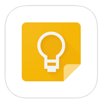
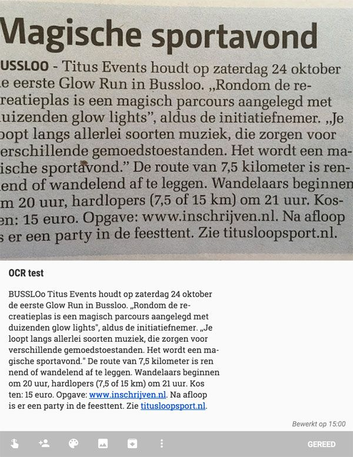

> **Historisch archief.** Deze aflevering verscheen op 1-10-2015 als onderdeel van ReputatieCoaching (2012–2016). De oorspronkelijke tekst is hieronder historisch bewaard. Diensten, contactgegevens, links, tools en adviezen kunnen inmiddels verouderd zijn.

**Transcriptiestatus:** Volledige transcriptie uit het oorspronkelijke archief.

***Historische afbeelding niet beschikbaar: ReputatieCoaching Podcast*
Het probleem van vorige week is echt helemaal opgelost: de server zoemt lekker en de bandbreedte is nog steeds toereikend. Ik heb net nog gekeken en inmiddels hebben de bijna 6.000 downloads al meer dan 22 GB aan bandbreedte verbruikt! Ik ben dus blij dat ik de content op een echt Content Delivery Netwerk heb geplaatst!**

**Overigens zag ik gelukkig bijtijds de toename in bandbreedte op de server. Want weet je nog dat ik in het kader van de Summer Citations Sequence een instructievideo postte over het aanmelden van je bedrijf bij de website provincialegids.nl? Welnu, als je naar die site gaat is al enige tijd het volgende te lezen:**

**Hetzelfde geldt trouwens voor localbiz.nl. Die site hoef je je ook niet meer proberen aan te melden, want die vertoont een identieke melding.**

**Dus dat kan er ook gebeuren. En het lijkt erop alsof niemand er naar omziet, want dit probleem speelt al een aantal weken. Maar goed, laten we ons richten op de podcast van vandaag…**

**Welke onderwerpen heb ik vandaag voor je?**

**Ik begin vandaag met een tooltip. Dan over het verband tussen de reputatie van een bedrijf en de salarissen en een site die onzichtbaar gehackt is.**

**Ook werd ik eerder deze week gebeld door een tandarts die een negatieve review had gekregen en mij vroeg hoe hij ermee moest omgaan.**

**Na jaren kwam ik dankzij Jeroen achter een probleem op de website, dat er waarschijnlijk voor heeft gezorgd dat er vaak een achterstand was van de podcasts op Stitcher en TuneIn Radio. Dat is nu volgens mij echt voorgoed opgelost.**

**Ik vertel je vandaag ook iets over het hergebruik van reviews en ik sluit de podcast van vandaag af met vijf tips om meer reviews te krijgen.**

Hallo en hartelijk welkom bij deze aflevering van de ReputatieCoaching Podcast. Ik ben Eduard de Boer, ReputatieCoach. Dit is dé podcast die jou helpt om meer business te genereren, doordat jouw website beter gevonden wordt, zowel lokaal als landelijk en doordat ik je uitleg hoe je je online reputatie kunt verbeteren. Dit alles helpt je om je bedrijf en jezelf beter op de online kaart te plaatsen.

De podcast van vandaag kun je vinden op [www.reputatiecoaching.nl/148](/nl/archief/reputatiecoaching/148/). Daar vind je niet alleen de tekst, maar ook video’s waar ik het in deze uitzending over heb, alsmede afbeeldingen, links enzovoorts. Bovendien is de podcast te beluisteren in [iTunes](https://web.archive.org/web/*/https://www.reputatiecoaching.nl/itunes), op [Stitcher](https://web.archive.org/web/*/https://www.reputatiecoaching.nl/stitcher) en ook op [TuneIn Radio](http://tunein.com/radio/ReputatieCoaching-Podcast-p655084/). Ik raad je aan om je op één van die drie kanalen te abonneren op de podcast, zodat je geen aflevering hoeft te missen!

Laat ik dan nu overgaan op de onderwerpen voor vandaag…

## Tooltip van de week: Google Keep


Het is weer eens tijd voor een tooltip. De tooltip van deze week is “Google Keep”. Ik denk dat de kans groot is, dat je er nog nooit van hebt gehoord. Laat ik proberen uit te leggen wat Google Keep is.

Het is eigenlijk een tooltje om losse notities en lijstjes in de cloud te bewaren. Dat klinkt wel erg simpel, dus waarom ben ik er zo van gecharmeerd?

Ten eerste, omdat het een simpele webapplicatie is: simpel qua gebruik en ook qua toepasbaarheid. Maar mede daarom zo sterk: het doet wat het moet doen!

Je kunt bovendien niet alleen tekst invoeren bij je notities, maar je kunt ook foto’s invoegen, links enzovoorts. Bovendien kun je ze voorzien van een kleur om onderscheid tussen verschillende notities te maken.

En wat helemaal mooi is: je kunt ook dicteren. Daarbij doet Google Keep zijn best om je spraak om te zetten in tekst. Dat werkt best redelijk! Bovendien wordt ook de opname van je audio bij de notitie toegevoegd. Dit alles wordt dus veilig opgeslagen in de cloud.

Je kunt er dus ook ToDo-lijstjes mee bijhouden, boodschappenlijstjes en dergelijke. In de show notes heb ik een video opgenomen, waarin kort wordt uitgelegd wat de app allemaal kan en doet:

Wat de app ook nog eens kan, is OCR: Optical Character Recognition. Als je een foto van tekst of een scan van een tekst uploadt, dan doet Google Keep zijn best om die voor je om te zetten in digitale tekst, die je dus kunt kopiëren en plakken! In de show notes heb ik een screenshot opgenomen, waarin dit wordt geïllustreerd, aan de hand van een foto van een kort krantenartikel:



En omdat de app uit de Google “stal” komt, kun je ook nog eens notities met één klik bewaren als een Google Document op Google Drive!

Natuurlijk kun je je notities ook snel doorzoeken op tekst, alsmede op kleur, op basis van audio, reminders en dergelijke.

Lange tijd was Google Keep alleen beschikbaar als webapplicatie en als app op Android. Maar sinds zo’n twee weken is de app er ook voor de iPhone.

Ik had er al eens eerder naar gekeken, maar toen was er nog geen iPhone app. En dat was toen voor mij de reden om Keep links te laten liggen. Maar sinds een paar dagen is er dus een iOS app en daarmee veranderde alles voor mij opeens.

Keep is op dit moment één van mijn meest gebruikte apps. Zo heb ik een paar lijstjes gedeeld met Suzanne, mijn vrouw. Laatst gebeurde het me, terwijl ik in de supermarkt de onderdelen van de boodschappenlijst in het winkelwagentje laadde om ze daarna af te vinken, ik opeens weer nieuwe boodschappen op het lijstje zag verschijnen! Zo real-time werkt die app!

Voorheen gebruikte ik Trello, ook een app om lijsten bij te houden en dergelijke. Die blijf ik ook wel gebruiken, maar dan meer voor het opzetten van de structuur en indeling van projecten, cursussen, trainingen en zo.

Keep zie ik meer als een app voor het bijhouden van vluchtige notities. Maar goed, ik werk tot nu toe naar volle tevredenheid mee en dus vond ik het even leuk om je erop attent te maken.

## Reputatie bedrijf belangrijkere motivatie dan salaris!


Iets van anderhalve week geleden las ik een leuk artikel over het “Winning Talent”-onderzoek op de website ‘De Ondernemer’. Daarin stond geschreven dat werkgevers die niet zo’n goede naam hebben, op jaarbasis gemiddeld ruim 3.400 EUR meer salaris per werknemer betalen, dan bedrijven met een goede reputatie.

Dan praat je alleen nog maar over de hogere salarissen en niet eens over kosten als gevolg van reputatieschade, mogelijk lage motivatie en productiviteit en het personeelsverloop et cetera.

Wist je overigens dat bij een salarisverhoging van maar liefst 10%, slechts 23% van de professionals over te halen is om bij een werknemer met een minder goede reputatie te gaan werken? En 54% van de Nederlandse werknemers zou een baan bij een werkgever met een slechte reputatie meteen afwijzen!

Andersom geldt dat een sterk employer brand zorgt voor *lagere* loonkosten. Van de Nederlandse werknemers zou 45 procent een baan bij een great place to work meteen accepteren, zonder dat ze een salarisverhoging verwachten. 18 procent zou een kleine salarisvermindering van 2 procent accepteren en 12 procent is zelfs bereid om 5 procent in loon te dalen.

En welke 5 factoren zijn nu het meest bepalend voor een sterk employer brand ofwel een goede reputatie? Ik geef je ze hier:

```
  * Doorgroei- en ontwikkelingsmogelijkheden (aantrekkelijk voor 36%)
  * Baanzekerheid (35%)
  * Verantwoordelijkheid en autonomie (25%)
  * De organisatie heeft dezelfde normen en waarden als de werknemer (20%)
  * Werken in een prettig team (20%)
```

Dus als jij met je bedrijf mensen wilt werven en behouden, dan weet je waar je aan moet werken!t

## Site onzichtbaar gehackt!

Afgelopen week onderzocht ik de site van een opdrachtgever. Visueel zag die er goed uit en voor mijn idee laadde die ook best aardig snel. Maar soms had ik het gevoel dat site wat stroperig werkte…

Als onderdeel van alles wat ik zoal doe bij het onderzoeken van een site, checkte ik ook de [laadtijd van de website](/nl/archief/reputatiecoaching/114/) en andere karakteristieken in Pingdom, een tool waar ik al een instructievideo voor heb:

Vervolgens zag in de lijst van opgevraagde onderdelen de meest vage domeinnamen verschijnen, en bestanden met namen als “bt”, “net”, “trk” en dergelijke erin. Dat zag er niet goed uit!

Ik heb via FTP de hele site gedownload en met behulp van allerhande search tools getracht die bestandsnamen in de source code terug te vinden. Dat leidde tot niets. In plaats van meer dan 400 MB handmatig door te gaan spitten, koos ik voor een andere aanpak…

Ik richtte een tijdelijke webserver in, waarop ik een schone versie van WordPress 4.3.1 installeerde. Daarna plaatste ik de MySQL backup van webserver terug, nadat ik die op het oog had gescreend op rare content, gevolgd door het template en alle plugins.

Het was bijzonder om te zien dat de site toen slechts gemiddeld zo’n 95 requests per pagina uitvoerde. De laadtijd van de pagina’s ging opeens ook omlaag van bijna 2 seconden naar minder dan 800 milliseconden. Dat was wel de grootste winst.

Daarna hebben we zowel alle bestanden als de database op de originele webserver verwijderd, de content van de tijdelijke webserver teruggezet en natuurlijk ook de database, en alles werkte weer als een zonnetje.

Zo zie je maar dat er niet eens verkeerde content op je site hoeft te staan, of hij hoeft helemaal niet uit de lucht te zijn, terwijl die toch geïnfecteerd kan zijn met malware. Dat is ook het gevaarlijkste: als je site gehackt is, zonder dat je je ervan bewust bent. Een dergelijke situatie kan tijden voortbestaan!

Je moet al zoveel zaken in de gaten houden, dat weet ik. Maar er zit hier toch echt een moraal in dit verhaal. En die luidt: wees je ervan bewust hoeveel requests jouw websitepagina’s gemiddeld genereren en controleer af en toe of dat nog steeds het geval is.

## Tandarts met negatieve review


Ik kreeg eerder deze week een belletje van een tandarts met een probleem… Nou ja… Probleem… Hij kreeg een 2-sterren review zonder verdere toelichting op zijn Google bedrijfspagina en vroeg mij wat te doen.

Omdat hij het onterecht vond, wilde hij eerst bezwaar aantekenen bij Google zelf, maar dat raadde ik hem af. Want dat is zinloos bij een minder positieve review. Dat is nu net waar recensies voor bedoeld zijn: het beoordeling van in dit geval een zorgverlener. En dat kan ook eens iets minder goed zijn.

Ik heb op Google nog eens de richtlijnen opgezocht en deze vrij vertaald. Ze luiden als volgt:

```
  * Post geen spam of fake reviews die bedoeld zijn om scores te verhogen of te verlagen
  * Post geen berichten of links naar content die sexueel getint is of welk geloof of religie dan ook aantast
  * Post geen berichten of links naar content die haatdragend is, bedreigend of lasterlijk in welke vorm dan ook voor om het even welke persoon
  * Post geen berichten of links naar bestanden die virussen bevatten, beschadigde files, “Trojaanse paarden” of andere destructieve of schadelijke software
  * Post geen auteursrechtelijk beschermd materiaal of materiaal waarvan het intellectueel eigendom bij iemand anders berust
  * Doe je niet voor als iemand anders of als een vertegenwoordiger van een individu of een andere soort rechtspersoon
  * Overtreed niet de van toepassing zijnde wet- en regelgeving
  * Gebruik reacties niet als een platform om te adverteren
```

We hebben nog twee dagen gewacht met het reageren op deze review, om te zien of de persoon ’m uit zichzelf er nog af zou halen. Dat gebeurde niet en dus hebben we op woensdag de volgende reactie op de beoordeling gepost:

We betreuren het ten zeerste dat u onze tandheelkundige zorg met twee sterren beoordeelt. Daarom verzoeken wij u vriendelijk om zo snel mogelijk contact op te nemen met onze praktijk, zodat we ons uiterste best kunnen doen om uw eventuele probleem op te lossen of om u alsnog tevreden te stellen.

Wij zien uw telefoontje of mailtje dan ook met belangstelling tegemoet.

Alvast bedankt!

Als ik zo naar de naam van de poster kijk, dan denk ik dat het een zogenaamd wegwerp-account is: iemand maakt dan eventjes snel een account aan, post een review en gooit vervolgens de logingegevens weg.

Boem! Weer een gevalletje van een geschade reptutatie.

Maar gelukkig valt dat wel mee: over het algemeen zijn mensen tegenwoordig slim genoeg om niet meteen een bedrijf of zorgverlener af te schepen als er een keertje een minder positieve review tussen staat.

Je wilt naar de buitenwereld laten zien dat je er continu alles aan doet om de kwaliteit van je dienstverlening of zorgverlening te verbeteren en dat je om je klanten, gasten of in dit geval je patiënten geeft.

En dát is wat mensen willen zien! Dan zijn ze heus wel bereid om een incidentele minder positieve beoordeling door de vingers te zien, Dennis!

## Probleem met de categorie “podcasts” op de site


Hmmmm… Soms gaat er in je enthousiasme wel eens iets onbedoeld verkeerd… En zelf kijk je hier maanden, zo niet jaren overheen!

Dat overkwam mij en het was ook deze keer weer luisteraar Jeroen, die mij erop attent maakte. Jeroen, volgens mij vind je het gewoon leuk om nog eens genoemd te worden! Geintje!

Maar Jeroen in elk geval bedankt! Hij wees mij er namelijk op dat hij op de site podcast 146 las c.q. beluisterde en vervolgens nog een paar recente podcasts wilde beluisteren. Dus klikte hij (logischerwijs) in de rechter zijbalk op de categorie “Podcasts”. Echter, toen kreeg hij een overzicht dat maar liep tot en met podcast 143.

Met andere woorden: podcast 144 en 145 leken er dus niet te zijn!

Ik snapte er niets van! Eerst dacht ik dat ik per ongeluk podcasts 144 en 145 niet in de categorie “Podcasts” had ingedeeld, maar dat was niet het geval. Ze stonden netjes in de juiste categorie.

Opeens bedacht ik me iets… Ik maak gebruik van de plugin Pretty Link Lite, een WordPress plugin om mooie links te maken onder je eigen website, naar andere content, die zowel op je eigen site mag staan, als elders op Internet. Dat komt vaak handig van pas. En ik meende me te herinneren dat ik ooit in een grijs verleden eens een pretty link heb gemaakt, onder [www.reputatiecoaching.nl/podcasts](https://web.archive.org/web/*/https://www.reputatiecoaching.nl/podcasts). Maar die link verwees door naar een playlist op YouTube, waar ik podcast 1 tot en met 35 ooit eens in videovorm heb uitgebracht. Dat is overigens nooit een succes geworden…

Terugkomend op het probleem… Ik verwijderde de pretty link en voilà: bij het verversen van de categoriepagina /podcasts prijkte 147 nu netjes bovenaan als de meest recente podcast!

Een paar dagen later bedacht ik me ook nog eens dat dit hoogstwaarschijnlijk ook de oorzaak was dat ik soms niet de meest recente podcasts op [iTunes](https://web.archive.org/web/*/https://www.reputatiecoaching.nl/itunes), [Stitcher](https://web.archive.org/web/*/https://www.reputatiecoaching.nl/stitcher) of [TuneIn Radio](http://tunein.com/radio/ReputatieCoaching-Podcast-p655084/) zag! Nou Jeroen, wederom scherp opgemerkt!

## Hergebruik van reviews in een positieve reviews video

In podcast 147 van vorige week vertelde ik je er al even kort over… Over het hergebruik van positieve reviews.

Lange tijd dacht men dat Yelp en Google het niet toestonden dat je reviews van hun site herpubliceert. Echter, inmiddels hebben beide partijen daar opheldering over gegeven en wat blijkt: je mag vrijelijk de reviews gebruiken, zij het onder een paar condities, waar ik het nu even niet over wil hebben.

Je kunt simpelweg de reviews kopiëren/plakken naar je eigen site. Daarbij hoef je heus niet bang te zijn voor duplicate content, waar sommige vermeende Internetspecialisten wel eens voor waarschuwen. Tja, natuurlijk moet je niet hele reviewsites gaan kopiëren naar je eigen site, dat spreekt voor zich!

Maar het is natuurlijk mooier om screenshots te maken met een tooltje als [Jing](https://www.techsmith.com/jing.html) en die dan op je site te plaatsen. Dan kunnen mensen ze herkennen op basis van de opmaak en lijkt het alweer een stuk geloofwaardiger…

En nóg weer mooier is om screenshots van reviews op reviewsites te maken, waarin je vervolgens de trefwoorden highlight en die afbeeldingen verwerkt in een video. Vorige week vertelde ik je dat ik er al een paar voor buitenlandse opdrachtgevers heb gemaakt, maar nu heb ik er ook eentje voor een tandarts gemaakt.

Deze positieve reviews video kun je terugkijken in de show notes:

En dus zul je ook een keer of twee tot drie per jaar een nieuwe reviews video moeten maken en uploaden om zo actueel te blijven.

Maar zeg zelf: het is wel krachtig!

Binnenkort ga ik bij een tandarts in Apeldoorn experimenteren met het verzamelen van videoreviews van patiënten. Dat is natuurlijk wel één van de krachtigste vormen van social proof, waarin klanten vertellen hoe tevreden ze zijn!

Heb je hulp nodig bij het maken van een dergelijke video, neem dan gerust contact met me op. Op de website kun je het contactformulier invullen, of je kunt contact met me zoeken via één van de vele manieren die ik je aan het einde van de podcast vertel.

## 5 tips voor het verkrijgen van meer reviews

*Historische afbeelding niet beschikbaar: Reviews*
Wanneer je dan aan de slag gaat met reviewvideo’s, dan zul je nog harder moeten werken aan het verzamelen van je reviews, wil je elke paar maanden voldoende reviews hebben om te gebruiken.

Maar goed, wil je je collega’s of concurrenten vóór blijven, dan zul je sowieso meer reviews moeten verzamelen…

Maar hoe verkrijg je nu meer reviews? Ik geef je een aantal tips:

```
  * **Vraag om een review** – Het lijkt een schot voor open doel, maar nog al te vaak hoor ik ondernemers verzuchten dat ze aan de ene kant bang zijn voor negatieve reviews, maar vervolgens niet willen vragen of iemand een positieve review wil posten als die persoon zegt tevreden te zijn. Het simpelweg vragen van patiënten, gasten of klanten om een paar minuten van hun tijd om een recensie over je te schrijven, gaat je helpen om meer recensies te verkrijgen. Vraag om hulp, zeg dat je continu bezig bent met de kwaliteit van je dienstverlening of zorgverlening te verbeteren. Je kunt ook kaartjes uitdelen met daarop het verzoek om je te beoordelen.
  * **Maak het simpel** – Soms zie ik hele handleidingen voorbij komen, waarin wordt beschreven hoe iemand een recensie op Google kan posten. Dat werkt niet. Stuur alleen je gasten, klanten of patiënten met een Gmail adres een mooie link (die je bijvoorbeeld met Pretty Link Lite maakt op je site), die naar Google verwijst. Plaats links op je site naar de plaatsen waar men een recensie voor je kan achterlaten. Maak bijvoorbeeld een /uwmening pagina, waar je de links op zet.
  * **Beloon mensen** – Officieel mag het niet, dus je moet het niet aan de grote klok hangen. Maar ik zie het maar al te vaak gebeuren, dat ondernemers mensen op enigerlei wijze belonen voor het plaatsen van een recensie. Wat het beste werkt is een soort van verloting of iets dergelijks. Dit kun je promoten om mensen over de streep te trekken om een recensie over je bedrijf en je dienstverlening te posten.
  * **Reageer op reviews** – En doe dat niet alleen op negatieve reviews, maar bedank ook mensen voor hun positieve review. Dat is minstens zo belangrijk!
  * **Verleen goede service** – Het wordt meer en meer gemeengoed beoordelingen te posten. Mensen raken eraan gewend: het komt in hun systeem. Dus naarmate jij je uiterste best doet om de beste dienstverlening te leveren, dan zul je ook positieve reviews aantrekken. Geheid!
```

Tja, geef zelf natuurlijk ook het goede voorbeeld. Post ook eens een review hier en daar, als je een positieve of negatieve ervaring hebt. Maar doe je best objectief te blijven en probeer in het geval van een negatieve ervaring geen hetze te ontketenen of mensen tot aan de enkels af te branden.

Denk ook eens aan al je toeleveranciers… Het bedrijf dat de ICT voor je regelt, je timmerman of klusjesman, de winterschilder, de glazenwasser, de groothandel die trouw elke keer weer je voorraad komt aanvullen en dergelijke.

Wist je trouwens dat je ook kunt inloggen op Google Mijn Bedrijf en dan onder je bedrijfsnaam reviews bij andere bedrijven kunt posten? Post je reviews bij de bedrijven die ik zojuist noemde onder je bedrijfsnaam. Je zult zien dat je ook hier en daar een review terug krijgt.

Het credo “Geef! En u zal gegeven worden!” klinkt wellicht oudbollig en achterhaald, maar ik ben ervan overtuigd dat het in elk geval wel geldt voor reviews. Ook het gezegde “Wie goed doet, goed ontmoet” is hier van toepassing.

En met deze (hopelijk) wijze woorden kom ik dan weer aan het einde van deze aflevering.

Als je de podcast leuk vindt en je wilt nog meer op de hoogte blijven, volg me dan ook op Twitter, via [@reputatiecoach1](https://twitter.com/reputatiecoach1).

Heb je inderdaad wat aan alle informatie die ik met je deel, help mij dan met het verder verbeteren en promoten van deze podcast. Abonneer je op de podcast, zodat je altijd meteen de nieuwste uitzending krijgt voorgeschoteld.

Zoek de podcast op, in [iTunes](https://web.archive.org/web/*/https://www.reputatiecoaching.nl/itunes) of [Stitcher](https://web.archive.org/web/*/https://www.reputatiecoaching.nl/stitcher), geef de podcast een sterrenbeoordeling en laat ook je reactie achter. Door de podcast te beoordelen op iTunes en/of Stitcher breng je de podcast onder de aandacht van een breder publiek.

Je kunt me verder helpen, door de podcast aan te bevelen bij vrienden of collega’s, waarvan je denkt dat ze er hun voordeel mee kunnen doen, of door ’m te delen op Twitter, like’n en delen op Facebook of een “+1” te geven op Google+.

En vergeet niet: ik ben hier om je te helpen! Als je een vraag of een probleem hebt met betrekking tot je online reputatie of de vindbaarheid van je website, kun je een mailtje sturen naar [podcast@reputatiecoaching.nl](mailto:podcast@reputatiecoaching.nl).

Als je dat te lastig vindt, of als je de podcast beluistert terwijl je in de auto zit en je hebt acuut een vraag, spreek dan een boodschap in op de ReputatieCoaching Hotline, op nummer: 084 - 883 15 56. Mogelijk behandel ik je vraag of probleem dan in een artikel of in de podcast.

En je kunt ook rechtstreeks op de website een voicemail achterlaten, door op de tab aan de rechterkant van elke pagina te klikken, en je bericht in te spreken. Dit was [ReputatieCoaching Podcast aflevering 148](/nl/archief/reputatiecoaching/148/) en mijn naam is [Eduard de Boer](http://nl.linkedin.com/in/eduarddeboer/nl).

Ik wens je de komende week weer succes met het werken aan je reputatie, zodat je meteen je reputatie voor jou kunt laten werken!

Tot volgende week!

Doei!

Links naar content die in deze podcast aan bod komt:

```
  * [ReputatieCoaching Podcast in iTunes](https://web.archive.org/web/*/https://www.reputatiecoaching.nl/itunes)
  * [ReputatieCoaching Podcast op Stitcher](https://web.archive.org/web/*/https://www.reputatiecoaching.nl/stitcher)
  * [ReputatieCoaching Podcast op TuneIn Radio](http://tunein.com/radio/ReputatieCoaching-Podcast-p655084/)
  * [ReputatieCoaching Podcast RSS-feed](https://web.archive.org/web/*/https://www.reputatiecoaching.nl/ReputatieCoachingPodcast)
  * [Jing](https://www.techsmith.com/jing.html) - DE ideale en gratis tool voor screenshots en screencasts
  * [Pretty Link Lite](https://wordpress.org/support/plugin/pretty-link) - WordPress plugin voor mooie URL's vanaf jouw domein naar elke plaats op Internet
  * “[Slechte onderneming betaalt meer](http://m.deondernemer.nl/kennis/678667/Slechte-onderneming-betaalt-meer.html)” (De Ondernemer, 25 september 2015)
```
