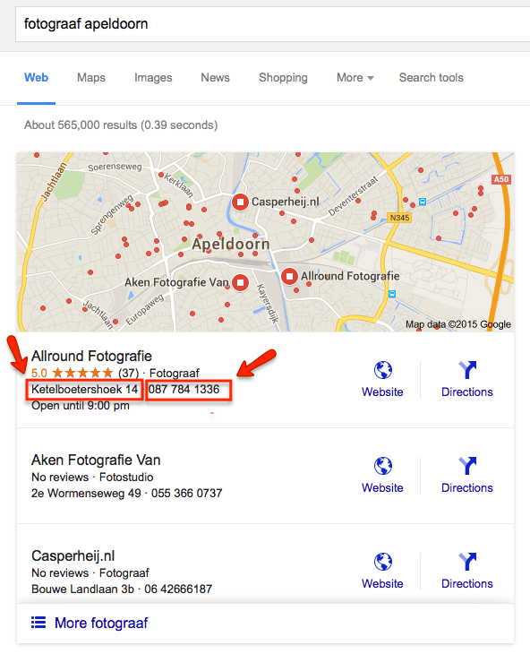
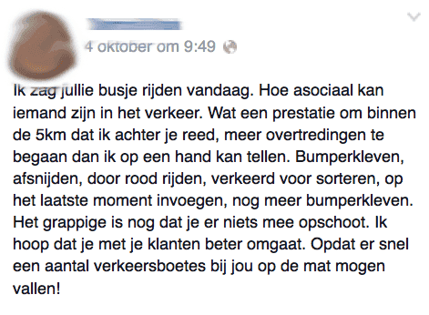
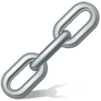
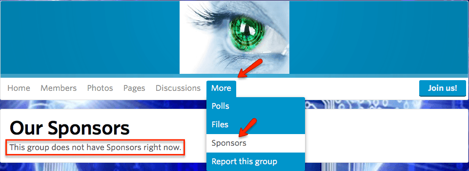
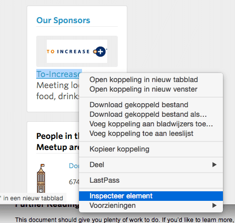
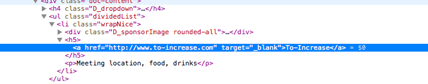
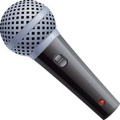

> **Historisch archief.** Deze aflevering verscheen op 8-10-2015 als onderdeel van ReputatieCoaching (2012–2016). De oorspronkelijke tekst is hieronder historisch bewaard. Diensten, contactgegevens, links, tools en adviezen kunnen inmiddels verouderd zijn.

**Transcriptiestatus:** Volledige transcriptie uit het oorspronkelijke archief.

***Historische afbeelding niet beschikbaar: ReputatieCoaching Podcast*
Aanstaande maandag is er weer een #SMC055, ofwel een bijeenkomst van Social Media Club Apeldoorn. De titel voor deze keer is: “Beeldverhaal”.**

**Google blijft aan het veranderen. Ook sinds de grote verandering van het 7-pack naar het 3-pack wijzigt de weergave van de lokale resultaten continu. Recentelijk zijn ze weer aangepast, maar gelukkig nu enigszins ten goede. Ik vertel je er zo meer over.**

**Het derde onderwerp gaat over een gevalletje van potentiële reputatieschade op Facebook, feitelijk door toedoen van iemand anders.**

**Test jij wel eens je site, of die wel functioneert? Ik kwam er deze week achter dat een site van mij het niet goed deed…**

**Laatst werd mij gevraagd wat mijn favoriete RSS-reader was. Blijf luisteren om het antwoord te horen.**

**En het laatste en meest omvangrijke topic van vandaag gaat over ZMVL. “ZMVL” staat voor “ZoekMachine Verantwoorde Linkbuilding”. Ik kan je daar heel veel over vertellen, dus ik heb het in twee delen geknipt. Vandaag heb ik het eerste deel voor je.**

Hallo en hartelijk welkom bij deze aflevering van de ReputatieCoaching Podcast. Ik ben Eduard de Boer, ReputatieCoach. Dit is dé podcast die jou helpt om meer business te genereren, doordat jouw website beter gevonden wordt, zowel lokaal als landelijk en doordat ik je uitleg hoe je je online reputatie kunt verbeteren. Dit alles helpt je om je bedrijf en jezelf beter op de online kaart te plaatsen.

De podcast kun je vinden op [www.reputatiecoaching.nl/149](/nl/archief/reputatiecoaching/149/). Daar vind je niet alleen de tekst, maar ook video’s waar ik het in deze uitzending over heb, alsmede afbeeldingen, links enzovoorts. Bovendien is de podcast te beluisteren in [iTunes](https://web.archive.org/web/*/https://www.reputatiecoaching.nl/itunes), op [Stitcher](https://web.archive.org/web/*/https://www.reputatiecoaching.nl/stitcher) en ook op [TuneIn Radio](http://tunein.com/radio/ReputatieCoaching-Podcast-p655084/). Ik raad je aan om je op één van die drie kanalen te abonneren op de podcast, zodat je geen aflevering hoeft te missen!

Voordat ik begin met de onderwerpen van vandaag nog even wat leuks. Afgelopen weekend heb ik vrienden geholpen die zijn verhuisd naar een boerderij. Waar anderen de tientallen dozen hielpen uitpakken en de inhoud in de kasten opruimden, had ik de schone taak om een aantal lampen op te hangen.

Aan het einde van de dag zaten we gezellig te kletsen onder het genot van een biertje en wat hapjes. Jurgen, die had geholpen met het plaatsen van de afrastering voor de paarden in de weide, vroeg mij wat ik voor werk deed. Ik vertelde dat ik ReputatieCoach was, wat dat inhield en ook over mijn wekelijkse podcast.

Een paar dagen later sprak ik Jurgen en zijn partner Ingeborg op een feestje en zij vertelden me lachend dat ze [podcast 148](/nl/archief/reputatiecoaching/148/) samen in bed hadden liggen luisteren, met de telefoon tussen hen in.

Voor mij was dit de tweede keer dat ik te horen kreeg dat mensen de ReputatieCoaching Podcast in bed beluisteren. Afgelopen maandag liet een andere bekende weten dat hij juist graag de transcriptie scant en dan de interessante delen leest. Dus op die manier bied ik voor eenieder de content aan, via het door hen gewenste kanaal of medium.

En jij? Lees jij ook liever de transcriptie, of beluister je de podcast? Laat het me weten onderaan de show notes van deze podcast, die je kunt vinden op [www.reputatiecoaching.nl/149](/nl/archief/reputatiecoaching/149/).

Laat ik dan nu overgaan op de onderwerpen voor vandaag…

## #SMC055 op 12 oktober 2015: “Beeldverhaal”

*Historische afbeelding niet beschikbaar: #SMC055: Social Media Club Apeldoorn*
Aanstaande maandag, 12 oktober, komen er twee sprekers de avond vullen met (hopelijk) interessante en leerzame presentaties over videomarketing. De eerste spreker vertelt over Periscope: wat het is, wat je er zakelijk en creatief mee kunt doen en bereiken, en hoe je deze toepassing kunt zien in het licht van bijvoorbeeld recente mobile livestreaming ontwikkelingen.

De tweede spreker komt van LVB Networks en zal vertellen over branded channels. Hiermee kun je klanten verslaafd maken, door fantastische videocontent aan te bieden. Tegen 2017 is video verantwoordelijk voor 69% van al het internetverkeer door consumenten.

Hun filosofie: met videomarketing ga je niet zomaar aan de slag. Je moet weten hoe en waar ze bekeken worden, anders is het geen videomarketing.

Dat wordt dus ongetwijfeld interessant! En ik ben gevraagd om deze keer een artikel erover te schrijven op de website van [Social Media Club Apeldoorn](https://smcapeldoorn.nl/). Dit artikel kun je volgende week donderdag op de website van de organisatie tegemoet zien.

## Google vertoont weer telefoonnummer en adres

Eerst waren ze er wel, toen waren ze er niet meer, toen waren ze er eventjes wel, vervolgens weer eventjes niet en nu zijn ze er alweer een tijdje… Ik heb het dan over het adres en het telefoonnummer in de lokale zoekresultaten.

Het wordt er niet duidelijker op. Maar wat wel duidelijk is, is dat Google de afgelopen tijd flink heeft geëxperimenteerd met de weergave van de lokale resultaten!

Per 6 augustus gingen we van het 7-pack naar het huidige 3-pack. Dat heeft een flinke impact gehad op veel lokale bedrijsvermeldingen. Ik zie het in de diverse rank trackers ook duidelijk: per 6 augustus is voor velen het aantal lokale vermeldingen enorm gekelderd. Sommige bedrijven beginnen er weer bovenop te komen en worden nu in het 3-pack vertoond.

Ook verdwenen per 6 augustus het huisnummer en het telefoonnummer uit het 3-pack. Later verdween zelfs ook de straatnaam. En na wat ge-“flipflop” hebben we nu het 3-pack, waarvan ik in de show notes een screenshot heb opgenomen:



Daarin zien we gelukkig weer het volledige adres èn het telefoonnummer!

Nu maar hopen dat het voorlopig zo blijft…

## Negatieve feedback op FB tijdlijn

Persoonlijk maak ik geen gebruik meer van Facebook, maar ik ben manager van een aantal bedrijfspagina’s. Zo zie je nog wel eens iets voorbij komen…


Afgelopen weekend werd op één van die pagina’s het volgende bericht gepost:

Wat een prestatie om binnen de 5km dat ik achter je reed, meer overtredingen te begaan dan ik op één hand kan tellen.

Bumperkleven, afsnijden, door rood rijden, verkeerd voorsorteren, op het laatste moment invoegen, nog meer bumperkleven.

Het grappige is nog dat je er niets mee opschoot. Ik hoop dat je met je klanten beter omgaat.

Opdat er snel een aantal verkeersboetes bij jou op de mat mogen vallen!

Nu weet ik dat de bedrijfseigenaar inderdaad wel pittig kan rijden, maar dat hij werkelijk al het voornoemde deed, kan ik me niet voorstellen. Ik heb het nagevraagd en het bleek dat er inderdaad iemand anders in zijn bedrijfsbus had gereden.

Het punt is dat de bedrijfseigenaar het bericht verborg op zijn tijdlijn, waarop de poster in kwestie het volgende bericht achterliet:

Ook dat bericht werd verborgen, waarna het volgende bericht verscheen:

De persoon die het initiële bericht op de Facebookpagina achterliet, was er duidelijk op uit om het verkeersgedrag aan de kaak te stellen!

Ook dit is een geval van potentiële reputatieschade. Zo krijg je niet eens een negatieve review op basis van je dienstverlening, maar op basis van het verkeersgedrag van iemand anders die tijdelijk jouw busje leent!

Dat is ellendig en je kunt er vrij weinig tegen doen. Het beste is om de berichten gewoon te laten staan en niet in discussie te gaan. Verder gewoon negeren en liefst overstemmen met leuke, interessante en positieve berichten op je tijdlijn.

## Test je site af en toe of ’ie het wel doet…


Testen is en blijft belangrijk. Zo heb ik je al verteld, dat je af en toe moet testen of bijvoorbeeld je webformulier wel werkt, of nog werkt. Ook moet je met enige regelmaat controleren of je backups nog wel netjes op de door jou ingestelde tijden worden gemaakt en ook of ze de juiste data bevatten. Anders kun je in het geval van een calamiteit alsnog niet je website terugzetten.

Wat mij al een paar keer is overkomen, is dat de podcast niet goed naar de diverse sites werd verspreid. Dat heb ik je laatst nog verteld en ik denk dat dat nu eindelijk goed is opgelost.

Maar je moet soms ook je website wel controleren, of die het wel doet. Zo kreeg ik eerder deze week een mail van Google, dat mijn website [www.bedrijfspanoramas.nl](http://www.bedrijfspanoramas.nl) niet benaderbaar was. Dat vond ik gek, want die staat op dezelfde server als al mijn andere websites.

Ik ging naar de site en kreeg een foutmelding, waarin te lezen was dat alle beschikbare resources verbruikt waren. Enig speurwerk in de console van de hosting provider wees uit dat er niets mis was. Vlak daarna deed de site het weer en was ik gerustgesteld.

Maar een dag later kreeg ik dezelfde mail van Google, waarin stond dat de site wederom niet beschikbaar was. Ik ging kijken en zag weer dezelfde foutmelding. Dus stuurde ik een mail naar Antagonist, mijn hosting provider. Binnen een paar uur was na een korte mailwisseling het probleem voorgoed opgelost. Het bleek dat er ergens een probleem zat in de configuratie van de site.

Zelf bekijk ik niet dagelijks al mijn websites, maar ik heb ze wel allemaal in Google Search Console, het vroegere Google Webmaster Tools zitten. Dus als er dan iets fout is, krijg ik in elk geval een berichtje van Google, waarna ik er in kan duiken.

Gebruik je geen Google Search Console, dan raad ik je aan om toch af en toe ook je website te controleren op zijn functionaliteit.

## Mijn favoriete RSS-reader

*Historische afbeelding niet beschikbaar: RSS-logo*
Hoeveel websites bezoek jij elke dag? Veel mensen bekijken dagelijks wel meer dan tien websites, omdat deze sites elke dag nieuwe content publiceren en men niets wil missen. Doe jij dat ook? Maak je dan geen gebruik van RSS-feeds?

Ik hoor je al vragen: “Wat is een RSS-feed?”. RSS staat voor Really Simple Syndication. Het is een manier waarop websites nieuwe content beschikbaar kunnen stellen in de vorm van een soort lijst van recente artikelen. Dat heet een RSS-feed. Het is een XML-file die niet echt gemakkelijk is te lezen. Daarvoor heb je een zogenaamde RSS-reader nodig.

Vroeger gebruikte ik Google Reader, maar sinds die door Google offline is gehaald, gebruik ik Feedly.

Een paar weken geleden werd mij door “[PSD to WordPress](https://psdtowp.net/best-rss-reader-aggregator.html)” gevraagd wat mijn favoriete RSS-reader was. Het antwoord moest in het Engels. Ik vertelde hierover het volgende:

> I’m subscribed to little over 100 RSS-feeds in order to stay up-to-date on what’s happening in all areas, which have my interest. I prefer RSS above Twitter as a source for news. On the other hand, I also notice, I acquire more and more news on Google+ through my participation in various Google+ communities as well as from following various people and companies on Google+. At present, I get about 20–30% from my news from Google+.

I hardly read whole articles in Feedly. When I spot an article I might find interesting, I save the link in Pocket, where I immediately tag it. At a later moment I scan or read the articles, to see whether they are of any use e.g. in a blog post or a podcast. If not, I either delete, or archive the link.

Dus ik ben zelf een groot liefhebber van RSS-feeds. Het stelt mij in staat om niet alleen wekelijks duizenden artikelenkoppen te scannen op potentieel interessante onderwerpen voor onder andere deze podcast, maar ook andere leerzame content die ik interessant vind.

En jij? Gebruik jij een RSS-reader? Ben jij geabonneerd op RSS-feeds? Laat het me nu weten onderaan de show notes op [www.reputatiecoaching.nl/149](/nl/archief/reputatiecoaching/149/).

### ZMVL: ZoekMachine Verantwoordelijke Linkbuilding (deel 1)


Deze week heb ik een lang onderwerp voor je, namelijk ZMVL. Dat staat voor “ZoekMachine Verantwoordelijke Linkbuilding”. Omdat het onderdeel nogal uitgebreid is, heb ik het in twee delen gesplitst. Gedurende de komende 10 minuten of zo, krijg je deze week het eerste deel en in de podcast van volgende week krijg je deel 2.

Ik ben ertoe gekomen om je hier iets meer over te vertellen, door een vraag van Frank, een luisteraar van de podcast. Hij wil met zijn website graag beter gevonden worden. Daarom vroeg hij mij wat hij het beste kon doen om links naar zijn site te verkrijgen.

Laat ik je eerst wat achtergrondinformatie geven. Zoals je weet is het hele algoritme van Google ooit begonnen met alleen maar het tellen van links náár elke pagina op je site en de links die op elke pagina naar andere pagina’s verwezen, op je site en elders op Internet. Daarop werd een bepaalde formule losgelaten en die bepaalde of jouw webpagina’s hoger in de zoekresultaten kwamen, dan die van je concurrent, of niet.

In die beginjaren was het dan ook voldoende om meer links naar je site te krijgen, want meer links bezorgde je een hogere positie. Zo is het concept van linkbuilding ontstaan.

Nog steeds zijn er mensen die denken dat het aantal links naar je site enkel en alleen bepalend is voor je positie in de zoekresultaten. Maar Google heeft heus niet stilgezeten en zag ook dat er veel misbruik werd gemaakt en webmasters simpelweg duizenden of miljoenen links kochten, om zo hogerop te komen.

Daarom heeft Google dit algoritme door de jaren heen steeds verder uitgebreid en verfijnd. Inmiddels zijn er volgens diverse bronnen meer dan 200 factoren die een rol spelen bij de ranking van webpagina’s in de zoekresultaten. Links spelen hierbij nog steeds een belangrijke rol. Maar het gaat echt niet meer om het aantal, ofwel de kwantiteit.

“Veel” betekent in dit geval niet “beter”. Dus bruut meer links naar je site laten verwijzen levert je over het algemeen geen hogere posities meer op. Sterker nog… Google kan tegenwoordig patronen herkennen en doorziet dit soort illegale linkstrategieën en als je een beetje pech hebt, krijg je een penality aan de broek, waardoor je site ofwel keldert naar pagina 34 en verder, of erger nog: helemaal uit de zoekresultaten verdwijnt.

Nee, het gaat echt om de ***kwaliteit*** van de links, niet om de ***kwantiteit***. Een tiental kwalitatief sterke links heeft vaak meer effect dan honderden of duizenden links van willekeurige websites.

En het kost veel tijd, geduld en doorzettingsvermogen om kwalitatief goede links naar je site te verkrijgen. Er is geen korte route of snelle oplossing ervoor. Je zult echt je mouwen moeten oprollen en aan het werk gaan. Ook kun je natuurlijk een gerespecteerd bedrijf of een professionele linkbuilder inhuren.

In dit eerste deel bied ik je een aantal linkbuilding strategieën voor jouw bedrijf, waar jij zelf meteen mee aan de slag kunt. Dus laat ik beginnen…

### De “Rolodex”–methode

De kans is groot dat je niet niet weet wat een Rolodex was. Dat was een rol met allemaal adreskaartjes eraan, waartussen indexkaartjes, gelabeld “A” tot en met “Z” zaten. Op elk kaartje stonden de contactgegevens van een bedrijf of persoon waarvan de naam met die letter begon. Tegenwoordig hebben we daar natuurlijk ons adresboek voor.

Denk aan je contacten, de mensen in je netwerk. Wie heb je allemaal in je adresboek, met wie ben je verbonden op LinkedIn, wie zijn je vrienden op Facebook, wie volg jij en volgt jou op Twitter, Instagram, Pinterest en dergelijke?

Zijn sommige van die contacten ook nog eens goede vrienden van je, die een website hebben? Vraag gewoon of ze naar je willen linken. Daarbij helpt het natuurlijk als het websites van bedrijven of organisaties uit de buurt zijn.

### Testimonial links

Een gemakkelijke manier om links van je zakelijke contacten te krijgen, is contact met hen op te nemen en te zeggen dat je graag op hun website vermeld wilt worden als een tevreden klant of gebruiker van hun producten of diensten. Deze bedrijven willen vaak maar al te graag een testimonial van jou posten, samen met je logo en een link naar je website.

Als je moeite hebt met het vinden van potentiële contacten, probeer dan antwoorden te bedenken op de volgende vragen:

```
  * Wie verzorgt de catering in je bedrijf?
  * Welke plek(ken) gebruik je meermaals voor bedrijfsevenementen of -uitjes?
  * Wie ontwierp je website? En wie ontwierp je huisstijl?
  * Welk bedrijf verzorgt de ICT in jouw kantoor of kantoren?
  * Wie doet je boekhouding?
  * Wie is je fiscaal adviseur?
  * Wie is je advocaat?
  * Heb je een schoonmaakbedrijf in dienst?
  * Wie verzorgt je drukwerk?
```

En ga zo maar door! Denk aan alle bedrijven die jou producten of diensten leveren. Daar zitten er vast wel een paar tussen, die naar jouw website willen linken.

### Gastblogs en expertartikelen

Je hebt wellicht gelezen of gehoord dat Google gastblogs afraadt. Dat is correct en dat klopt niet. Het is correct, in de zin dat je geen content van inferieure kwaliteit (lees: “rotzooi”) moet publiceren om maar links naar je site te krijgen.

En het klopt niet, in de zin dat uitermate unieke, relevante, educatieve en interessante content nog steeds waardevol wordt gevonden, door zowel lezers op Internet, als door de zoekmachines.

Gastblogs en expertartikelen zijn uitermate geschikt om je publiek te vergroten en je content onder de aandacht van meer mensen te krijgen.

Een goede test om te bepalen of het publiceren van een gastblog interessant is, is jezelf af te vragen: “Zou ik ook op die site willen posten, als ik geen link zou krijgen?”. Als het antwoord “Nee” luidt, moet je er niet eens aan beginnen. Dan is je insteek dus fout en doe je het feitelijk voor de backlink.

Ik vertelde je eerder in deze podcast dat ik aankomende maandag een bijeenkomst heb van Social Media Club Apeldoorn, waarvoor ik een gastblog schrijf over de avond. Daarin komt ook een link naar mijn site. En ook al zou ik geen link krijgen, maar zou wel gewoon mijn naam worden vermeld, dan zou ik er alsnog publiceren. Dat is dan dus een legitieme backlink naar mijn site.

Laat ik je een paar suggesties geven voor gastblogs die voor jouw business kunnen werken:

```
  * Schrijf een gastblog of artikel (nou ja, wat is eigenlijk het verschil?) voor industriegerelateerde websites. Veel bedrijven hebben moeite content te produceren voor hun blogs en zijn blij met een kwalitatief goede blogpost.
  * Vraag klanten of business partners of zij geïnteresseerd zijn in content die jij dan aanlevert voor hun blog, die interessant, relevant en leerzaam is voor hun publiek.
  * Bied je expertise aan bij lokale tijdschriften en andere publicaties of het lokale radio- of tv-station en ga er met regelmaat content voor produceren.
```

### Sponsoring / donateurschap

Veel organisaties zijn continu op zoek naar sponsors. In ruil voor een sponsoring of donatie krijg je dan een vermelding op de website van de organisatie, al of niet met een link. Waar je naar op zoek bent, zijn organisaties die inderdaad naar sponsors linken met een zogenaamde “DOFOLLOW” link.

Om potentiële sites te vinden, van organisaties die je kunt sponsoren kun je bijvoorbeeld de volgende zoektermen in Google ingeven:

```
  * “sponsor worden” link naar site
  * “word sponsor” link naar site
  * “wordt sponsor” link naar site
  * “donateur worden” link naar site
  * “word donateur” link naar site
  * “wordt donateur” link naar site
  * “sponsors gezocht” link naar site
  * “donateurs gezocht” link naar site
```

Ik heb in de transcriptie bewust ook grammaticafouten gemaakt, door “word” zowel zonder, als met een “t” te schrijven. Zo vind je toch nog weer extra kandidaten.

Een andere leuke manier om een sponsormogelijkheid te zoeken, is via [meetup.com](http://www.meetup.com). Ga zoeken naar meetups bij jou in de buurt. Als je in de menubalk het kopje “More” ziet staan, klik dan op “Sponsors”.



Als de desbetreffende meetup nog geen sponsor heeft, raad ik je aan om contact op te nemen en te vragen waarmee je hen kunt sponsoren, in ruil voor een vermelding op de pagina van de meetup. Vaak kan dat door de cake of koekjes, of de koffie en thee te sponsoren en dergelijke. En dat is lucratief!



Want sponsorlinks op Meetup.com zijn DOFOLLOW! In de show notes heb ik een screenshot opgenomen, waarin je dat kunt zien:



Ik zal je een geheimpje verklappen… Eentje die niet veel mensen weten. Enkele experts uit de industrie hebben mij verteld dat zij hebben geconstateerd dat je niet meerdere jaren achtereen aan hetzelfde goede doel moet doneren, maar dat het beter is om elk jaar te wisselen en dus telkens een ander goed doel te kiezen.

Het lijkt er namelijk op, alsof Google de koppeling tussen jouw bedrijf, je donateurschap en de website van de gesponsorde organisatie lange tijd blijft onthouden, zelfs lang nadat de link al is verdwenen… Doe daar je voordeel mee!

### Met behulp van foto’s

Er zijn altijd mensen en bedrijven op zoek naar kwalitatief goede en mooie foto’s voor digitale en gedrukte publicaties. Bied de foto’s rechtenvrij aan, maar eis wel naamsvermelding met een link naar je site.

Ook kun je overwegen foto’s te maken voor een evenement, dat wordt georganiseerd door een non-profit stichting in ruil voor een link naar je website.

Zo maak ik af en toe foto’s voor de stichting “Against Cancer”. Dat doe ik puur voor het goede doel, maar ik heb er ook al enkele links door gekregen.

### Ga (lokale) experts interviewen of geef interview


Eén van de gemakkelijkste manieren om links te krijgen is mensen te gaan interviewen. Kies dan natuurlijk bij voorkeur experts uit je plaats om het lokale karakter van eventuele backlinks te versterken.

Want als je mensen prijst om hun kennis, expertise, vakmanschap en dergelijke en vervolgens vraagt voor een interview, is de kans groot dat ze “Ja” zeggen. Wat je vaak zult zien als jij mensen gaat interviewen, is dat zij ook een link naar je website opnemen.

Publiceer die interviews in audiovorm, of alleen de transcriptie, of in de vorm van een samenvatting.

Een alternatieve manier is zelf interviews of een interview te geven. De interviewende partij zal vaak naar jouw content verwijzen door middel van een hyperlink.

Zo werd ik laatst nog geïnterviewd door “PatientenReview.nl”. Dat interview vond plaats door middel van een Google Hangout on Air. Het opgenomen materiaal is later in stukken geknipt en wordt in een vier- of vijftal aparte video’s gepubliceerd. Daarbij komt ook een link naar [www.reputatiecoaching.nl](https://web.archive.org/web/*/http://www.reputatiecoaching.nl).

Bovendien had ik ervoor gezorgd dat ik een balk in beeld had met mijn naam en de titel “ReputatieCoach”. Dat levert op zich ook weer extra verkeer op, door mensen die naar mij op zoek gaan, waar vervolgens ook weer mensen tussen zitten die een link naar de site plaatsen.

### Bied je aan als (gast)spreker / presentator / expert

Kun je gemakkelijk spreken en een presentatie geven over jouw vakgebied? Zoek dan op de termen “spreker gezocht” of “sprekers gezocht”, al of niet in combinatie met je plaatsnaam of de naam van een nabijgelegen (grotere) plaats.

Neem contact op met de lokale Kamer van Koophandel en vraag of zij op zoek zijn naar een spreker voor het eerstvolgende ondernemersevenement, een training, presentatie of wat dan ook.

Vrijwel altijd publiceren organisatoren van evenementen waarvoor zij sprekers zoeken een “bio” of “over de spreker” stukje, waarbij vaak een link wordt geplaatst naar de website van de spreker of het achterliggende bedrijf.

Publiceer op je eigen website een uitgebreidere toelichting op je aankomende presentatie om de kans op meer waardevolle links te vergroten.

En als je een goed speker bent, meld je dan ook aan bij allerhande platformen en organisaties die overzichten geven van sprekers. Daar zitten heus ook wel wat DOFOLLOW-links tussen.

### Lokale organisaties / bedrijvenkringen en dergelijke

Veel bedrijven c.q. ondernemers zijn lid van een brancheorganisatie, een bedrijfsvereniging, een bedrijvenkring, een business club of service club en dergelijke. Deze organisaties hebben ook meestal een site, waar ze hun leden op tonen. Zorg ervoor dat je op een dergelijke site wordt vermeld mèt link!

Zijn de leden verborgen achter een login, bied dan ook hier aan content te produceren voor de site, waar vervolgens wel je bedrijfsnaam en link bij kan komen te staan.

Je kunt op een dergelijke site ook bijvoorbeeld “Het bedrijf van de maand” publiceren: een interview met de directeur / eigenaar / oprichter met relevante bedrijfsgegevens onderaan het interview.

Tot zover het eerste deel over ZMVL, ofwel: “ZoekMachine Veranwoorde Linkbuilding”. Doe hier in elk geval je voordeel mee!

Volgende week heb ik deel twee voor je, met daarin nóg meer ideeën en suggesties voor het legaal verkrijgen van links naar je site.

Als je de podcast en dit soort content leuk vindt, volg me dan via de verschillende kanalen: je kunt me vrijwel overal vinden op de sociale media.

En heb je inderdaad wat aan alle informatie die ik met je deel, help mij dan met het verder verbeteren en promoten van deze podcast. Abonneer je op de podcast, zodat je altijd automatisch de nieuwste uitzending krijgt voorgeschoteld en neem je voor deze week tenminste één andere persoon over de podcast te vertellen. Dat kan een vriend of vriendin zijn, een zakenrelatie, een collega. Het maakt niet uit. Vertel gewoon één persoon over de podcast.

Op de website kun je me een berichtje sturen en zelfs een gratis consult inboeken. Ook kun je me bellen op 084–8831556 en zelfs rechtstreeks op de website een voicemail achterlaten.

En je kunt ook rechtstreeks op de website een voicemail achterlaten, door op de tab aan de rechterkant van elke pagina te klikken, en je bericht in te spreken. Dit was [ReputatieCoaching Podcast aflevering 149](/nl/archief/reputatiecoaching/149/) en mijn naam is [Eduard de Boer](http://nl.linkedin.com/in/eduarddeboer/nl).

Ik wens je de komende week weer succes met het werken aan je reputatie, zodat je meteen je reputatie voor jou kunt laten werken!

Tot volgende week!

Doei!

Links naar content die in deze podcast aan bod komt:

```
  * [ReputatieCoaching Podcast in iTunes](https://web.archive.org/web/*/https://www.reputatiecoaching.nl/itunes)
  * [ReputatieCoaching Podcast op Stitcher](https://web.archive.org/web/*/https://www.reputatiecoaching.nl/stitcher)
  * [ReputatieCoaching Podcast op TuneIn Radio](http://tunein.com/radio/ReputatieCoaching-Podcast-p655084/)
  * ReputatieCoaching Podcast RSS-feed
```
