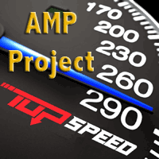
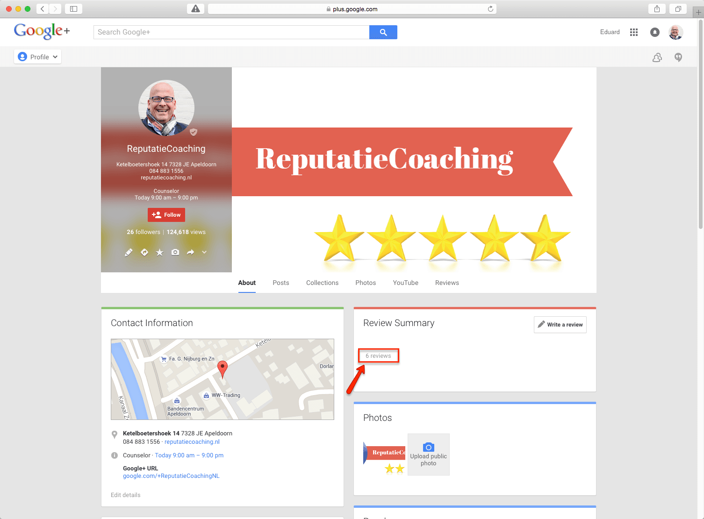

> **Historisch archief.** Deze aflevering verscheen op 15-10-2015 als onderdeel van ReputatieCoaching (2012–2016). De oorspronkelijke tekst is hieronder historisch bewaard. Diensten, contactgegevens, links, tools en adviezen kunnen inmiddels verouderd zijn.

**Transcriptiestatus:** Volledige transcriptie uit het oorspronkelijke archief.

***Historische afbeelding niet beschikbaar: ReputatieCoaching Podcast*
Gisteren had ik weer een bijzondere ervaring, als gevolg van één van mijn instructievideo’s. Dat ging over een “reputatielek”, zoals ik het maar noem, of “citationkaping” of “bedrijfsvermeldingdiefstal”…**

**Google gaat de strijd aan met gehackte sites die foute content verspreiden. Ook heeft Google een nieuw concept gelanceerd, met als codenaam AMP. Wat dat is, hoor je zometeen.**

**Sinds begin deze week heb ik voor ReputatieCoaching een officiële Google Mijn Bedrijf pagina in plaats van een Google+ pagina en kan ik nu zélf reviews vezamelen. Daar ben ik ook druk mee bezig!**

**Twitter laat je tegenwoordig ook video’s via het web uploaden, zij het met wat restricties. Welke dat zijn, vertel ik je zo.**

**Als laatste onderwerp voor vandaag heb ik natuurlijk ZMVL–2, oftewel: “ZoekMachine Verantwoorde Linkbuilding (deel 2)”.**

Hallo en hartelijk welkom bij deze aflevering van de ReputatieCoaching Podcast. Ik ben Eduard de Boer, ReputatieCoach. Dit is dé podcast die jou helpt om meer business te genereren, doordat jouw website beter gevonden wordt, zowel lokaal als landelijk en doordat ik je uitleg hoe je je online reputatie kunt verbeteren. Dit alles helpt je om je bedrijf en jezelf beter op de online kaart te plaatsen.

De podcast kun je vinden op [www.reputatiecoaching.nl/150](/nl/archief/reputatiecoaching/150/). Daar vind je niet alleen de tekst, maar ook video’s waar ik het in deze uitzending over heb, alsmede afbeeldingen, links enzovoorts. Bovendien is de podcast te beluisteren in [iTunes](https://web.archive.org/web/*/https://www.reputatiecoaching.nl/itunes), op [Stitcher](https://web.archive.org/web/*/https://www.reputatiecoaching.nl/stitcher) en ook op [TuneIn Radio](http://tunein.com/radio/ReputatieCoaching-Podcast-p655084/). Ik raad je aan om je op één van die drie kanalen te abonneren op de podcast, zodat je geen aflevering hoeft te missen!

## “Reputatielek” kost je omzet

*Historische afbeelding niet beschikbaar: Logo Mister What*
Voordat ik overga op de overige onderwerpen voor vandaag, even een in zekere zin grappig maar aan de andere kant toch ook uitermate leerzaam intermezzo. Luister wat ik nu weer tegenkwam…

Gisteren werd ik op het telefoonnummer van ReputatieCoaching gebeld door een boze meneer. Die wilde meteen zijn bedrijfsvermelding van de site MisterWhat af hebben.

Ik vertelde dat ik MisterWhat niet ben, maar dat ik gewoon een instructievideo online heb geplaatst, waarin ik mensen uitleg hoe ze zich kunnen aanmelden bij de site MisterWhat.nl. Die boodschap leek niet over te komen.

De persoon die mij belde vertelde met verheven stem, dat zijn bedrijfsvermelding op MisterWhat stond met het telefoonnummer van zijn directe concurrent. En dat mocht onder geen beding: het moest en zou er vandaag nog af moeten!

Nadat ik mijn antwoord een paar keer had herhaald, bedaarde de beller en vertelde dat hij even intern zou overleggen hoe hij hiermee zou omgaan. Ik heb nog wel gezegd dat ik mijn best wilde doen om hun vermelding verwijderd te krijgen.

Eerlijk gezegd betwijfel ik of mijn boodschap werkelijk goed is overgekomen. Ik ben benieuwd…

Maar wat kun je hieruit leren? Het kan dus gebeuren dat je een “reputatielek” hebt, zonder dat je het weet. Een dergelijk “reputatielek” kan ervoor zorgen dat klanten of opdrachtgevers die op zoek zijn naar jou, stiekem worden doorgeleid naar je concurrent, waardoor je dus business misloopt!

Zorg er dus voor dat je op alle sites waar dat kan, je bedrijfsvemelding claimt! Dan kan die tenminste niet zomaar door anderen worden afgenomen of aangepast. Wat je verder nog moet doen, is af en toe alle vermeldingen op Google zoeken, waar wel je bedrijfsnaam, maar niet ***jouw*** telefoonnummer bij staat.

Typ op Google daartoe je bedrijfsnaam in, gevolgd door een mintekentje, en je telefoonnummer tussen aanhalingstekens. Dus bijvoorbeeld:

Soms moet je iets variëren met spaties in je telefoonnummer om nog meer sites te vinden. Maar je krijgt zo wel een idee hoe het werkt.

Dan nu over op de onderwerpen die ik eigenlijk vandaag op de planning had staan…

## Google gaat de strijd aan met gehackte sites


Vorige week meldde Google dat het haar algoritme weer flink heeft aangepast met dit keer als doel om [agressiever gehackte sites met spam te filteren](http://googlewebmastercentral.blogspot.nl/2015/10/an-update-on-how-we-tackle-hacked-spam.html). Deze verandering is van invloed op circa 5% van alle zoekopdrachten. Dat is best omvangrijk.

Aanleiding hiervoor is dat tot op heden Google in 2015 al een toename van gehackte sites van meer dan 180% heeft waargenomen. Dus vond zij het belangrijk hier actie op te ondernemen.

Doel van Google is volgens haar zeggen om zowel mensen die op zoek zijn naar informatie, als website eigenaars te beschermen. Op deze manier voorkomt Google dat mensen per ongeluk bijvoorbeeld malware of andere content van inferieure kwaliteit downloaden.

Als gevolg hiervan kan het gebeuren dat het aantal vertoonde resultaten voor sommige zoektermen afneemt.

## Google introduceert AMP: gebruik jij het al op je site?


Heet van de naald: Google introduceert AMP. AMP staat voor [Accelerated Mobile Pages](https://www.ampproject.org). Het is een Open Source initiatief voor contentpublishers om geoptimaliseerde content voor mobiele apparaten slechts eenmaal te creëren en vervolgens overal direct te laten laden.

Vorige week maakte Google ook bekend dat nu wereldwijd meer zoekopdrachten vanaf mobiele apparaten worden uitgevoerd, dan vanaf desktops. Dus deze verschuiving naar contentconsumptie via mobiele devices vraagt ook om nóg betere performance van websites op smartphones en dergelijke.

AMP HTML is een nieuwe manier om geoptimaliseerde webpagina’s te maken die direct laden op mobiele devices. Het is ontworpen om zogenaamde smart caching te ondersteunen, een voorspelbare performance te leveren en tegelijkertijd prachtige, moderne mobiele content te vertonen.

AMP HTML borduurt voort op bestaande webtechnologieën en is verder niet gebaseerd op templates en dergelijke. Hierdoor kunnen contentproducenten gewoon doorgaan met datgene waar ze goed in zijn: het produceren van content.

Al met al moet het dus mobiele websites versnellen. Ik heb het meteen geactiveerd op mijn site, om te zien wat het in de toekomst gaat bijdragen. To be continued…

## #SMC055 : “Beeldverhaal”

*Historische afbeelding niet beschikbaar: #SMC055: Social Media Club Apeldoorn*
Afgelopen maandag was ik bij de maandelijkse bijeenkomst van Social Media Club Apeldoorn, ook wel bekend onder de naam #SMC055. Het onderwerp van de avond was “Beeldverhaal”. Na afloop heb ik zoals altijd zo snel mogelijk een Storify-bord gepubliceerd met daarin de tweets van de avond op chronologische volgorde.

Dit Storify-bord heb ik ook opgenomen in de show notes van deze podcast, op [www.reputatiecoaching.nl/150](/nl/archief/reputatiecoaching/150/):

Ik was gevraagd om een blogbericht over de avond te schrijven, dus ga ik er hier niet verder in detail op in. Binnenkort kun je op de site van [Social Media Club Apeldoorn](http://smcapeldoorn.nl) het blogbericht lezen.

## Recensies voor ReputatieCoaching

*Historische afbeelding niet beschikbaar: excellent-reputatie-online*
Ooit begon ik met ReputatieCoaching op Google+ als een Google+ pagina. Maar na ruim twee jaar neemt het zulke vormen aan, dat ik het tevens een lokale presence wil geven en bovendien reviews voor ReputatieCoaching wil kunnen verzamelen. Daarvoor moet je dus een lokaal bedrijf aanmaken met een Google Mijn Bedrijf-pagina.

Vanaf dat moment zit je met twee pagina’s: je originele Google+ pagina en je Google Mijn Bedrijf pagina. Dat is vervelend, want waar moet je nu berichten posten en waar gaan mensen je volgen? Dat wekt alleen maar verwarring.

Gelukkig heeft Google daar een oplossing voor: je kunt namelijk een Google+ pagina en een Google Mijn Bedrijf pagina samenvoegen! En als je alles goed hebt staan, is het binnen een paar minuten gepiept. Ik had het in het verleden al een paar keer gedaan voor opdrachtgevers, maar toen is het er altijd bij ingeschoten om een video te maken.

Dus vond ik het eerder deze week het uitgelezen moment om dan eindelijk een instructievideo te maken van het samenvoegen van de Google+ pagina en de Google Mijn Bedrijf pagina van ReputatieCoaching.

Deze instructievideo kun je bekijken in de show notes van deze podcast op [www.reputatiecoaching.nl/150](/nl/archief/reputatiecoaching/150/):

Als ReputatieCoach geen reviews hebben op Google+… Dat is natuurlijk totaal ongehoord! De oorzaak hiervan was dus dat ik ooit de pagina was begonnen als een “gewone” Google+ pagina, waarop je geen reviews kunt verzamelen.

Maar sinds ik eerder deze week de pagina’s heb samengevoegd en wat luisteraars gevraagd naar reviews, heb ik inmiddels het minimale aantal van vijf reviews ontvangen, waardoor de sterretjes ook in de zoekresultaten worden vertoond. Sterker nog, de teller staat al op zes!

Het duurt meestal even, totdat de sterren worden vertoond: ze komen dus niet direct als je magische grens van vijf reviews hebt bereikt. En op dit moment heb ik zelf dus zes reviews en ook nog geen sterren in de zoekresultaten:

[](/wp-content/uploads/2015/10/20151015-serp-rc-6reviews-nostars-2.png)

Ik heb ooit ergens gehoord of gelezen dat je soms het verschijnen van de sterretjes kunt bespoedigen, door tijdelijk op je Google Mijn Bedrijf pagina even de URL naar je website te wijzigen, bijvoorbeeld in die van de contactpagina, in plaats van de hoofdpagina. Google zou dan je Google Mijn Bedrijf pagina binnen een paar minuten opnieuw spideren en indexeren, waarna dan de sterretjes meteen zouden verschijnen…

Nou, ik kan je vertellen dat de URL wel vrijwel meteen binnen enkele minuten wordt gewijzigd, maar dat het niet bijdraagt tot het sneller laten verschijnen van de sterretjes in de zoekresultaten. Ik wacht nu al een paar uur en ik zie ze nog steeds niet…

## Twitter laat je nu ook video uploaden vanaf het web

Een kort nieuwtje over Twitter… Voorheen kon je alleen video’s vanaf je smartphone uploaden naar Twitter. Maar sinds vorige week kan dat ook vanaf het web. @Twitter twitterde hierover:

— Twitter (@twitter) October 8, 2015

Er gelden wel een paar beperkingen:

```
  * Bestandsformaat: MP4 en H264 met AAC-audio
  * Minimale resolutie: 32 x 32
  * Maximale resolutie: 1920 x 1200 (en 1200 x 1900)
  * Breedte-hoogteverhoudingen: 1:2.39 - 2.39:1 bereik (inclusief)
  * Maximale framerate: 40 fps
  * Maximale bitrate: 25 Mbps
  * Videobestanden mogen maximaal 512 MB zijn
  * Video’s mogen een maximale lengte van 30 seconden hebben
  * Je kunt geen mensen taggen in video’s
```

Tot zover over de nieuwste ontwikkeling van Twitter: video’s vanaf het web uploaden…

## ZMVL–2 : ZoekMachine Verantwoorde Linkbuilding deel 2

*Historische afbeelding niet beschikbaar: linkbuilding*
Vorige week had ik je al een flinke dosis tips gegeven voor ZoekMachine Verantwoorde Linkbuilding, dus hoe je veilig bovenal kwalitatief goede links naar je site kunt verkrijgen. Vorige week was deel 1 en daar ga ik nu dus mee verder. Vandaag krijg je deel 2 van me.

### Creatieve samenwerking met lokale bedrijven

Kijk ook eens naar de mogelijkheid voor een creatieve samenwerking met andere lokale bedrijven waar je nu mee samenwerkt of die je zou aanbevelen bij jouw klanten, of daar een gemeenschappelijk belang voor jullie beiden in kan zitten.

Is er bijvoorbeeld de mogelijkheid om gezamenlijk over en weer korting aan te bieden of iets samen te gaan doen met een gemeenschapelijke leverancier? Je zou een kortingbon van de andere leverancier kunnen geven als iemand bij jou voor een bepaald bedrag koopt, of een bepaald lidmaatschap heeft en dergelijke. Wees creatief!

Zo zou bijvoorbeeld een lokale shop voor mobiele telefoons 10% korting kunnen geven aan alle klanten van een lokale computerzaak en vice versa. En dit moet natuurlijk niet alleen via een korte tekst onderaan de kassabon, maar via een link over en weer waarbij beide ondernemers deze korting bij de andere partij op hun website aanbieden. Idealiter vermeld je niet alleen de link, maar ook de bedrijfsnaam, het adres, de postcode, de plaats en het telefoonnummer.

### Links van vacature- of stagesites

Heb je een vacature voor je bedrijf, post deze dan in de lokale en nationale vacaturesites. Dit kan je ook weer links naar je site opleveren. Ga niet als een bezetene tekeer, om te voorkomen dat je een bepaald patroon ontwikkelt dat wordt doorzien door de zoekmachines, waarna je mogelijk afgestraft wordt.

Vermeld bij de vacature natuurlijk je bedrijfsadres, je postcode, plaats, telefoonnummer en de website informatie om zo een volledige (zij het ongestructureerde) citation te verkrijgen.

Sommige vacaturesites staan je niet toe naar een willekeurige pagina op je site te verwijzen: zij eisen dan vaak een aparte vacaturepagina op je site, waarnaar je verwijst.

Vind lokale en nationale vacaturesites op Google met zoekopdrachten als:

```
  * vacature “stad”
  * vacatures “stad”
  * banen in “stad”
  * landelijke vacatures
  * alle vacatures
  * vacature aanmelden
  * vacature “aangeboden functie”
  * vacature 055 (dus met kengetal, voor als je bijvoorbeeld een vacature in Apeldoorn hebt)
```

Zoek je specifiek een student, dan kun je extra zoeken met trefwoord “studentenbaan”. Ook zijn er speciale sites waar je stages kunt aanmelden, als je een stageplek hebt. Is dit relevant voor jou? Ga dan een paar mooie links verzamelen op dit soort sites!

### Ga bloggen

Mischien een beetje een dooddoener, maar vorige week had ik het alleen over gastblogs schrijven. Je kunt natuurlijk zelf ook gaan bloggen. Want met goede content kun je ook links naar jouw content *verdienen*!

Redenen om zelf te gaan bloggen zouden kunnen zijn:

```
  * Het geeft mensen een reden om jou te kiezen, vóór je concurrenten. In tegenstelling tot je concurrenten, help jij daadwerkelijk als je goede, waardevolle en educatieve content biedt. En dat is overigens precies wat ik ook doe: mensen helpen door mijn kennis te delen. Hiermee krijg ik links naar de site en ook opdrachten.
  * Het houdt mensen op je site. Hoe langer ze op je site verblijven, des te groter is de kans dat ze contact met je opnemen, of je in gedachten houden tot ze je daadwerkelijk nodig hebben.
  * Het geeft geloofwaardigheid aan je bedrijf.
  * Het kan je lokale relevantie geven door te bloggen over de lokale gemeenschapsissues die op enigerlei wijze gerelateerd zijn aan je bedrijf.
```

Het is niet altijd even gemakkelijk om met regelmaat te bloggen, maar na verloop van tijd gaat het zeker haar vruchten afwerpen. Hetzelfde geldt voor mij. Zo had ik voor de eerste blogposts en podcasts slechts twee lezers, respectievelijk mijn broer en mijn vader. Nu, inmiddels bijna drie jaar later zijn het er duizenden per maand: zowel lezers op de site, als luisteraars naar de podcast!

Zoek je nog wat originele ideeën die ook links aantrekken? Ik geef je er een paar, want lijstjes doen het nog steeds goed op Internet:

```
  * 7, 10, 15, 25 of meer tips en trucs op je vakgebied.
  * De 10 mythen van je vakgebied
  * De X specialisten op jouw vakgebied
  * etc.
```

Ga gewoon Top X lijstjes publiceren. Zorg ervoor dat ze zinnig zijn, relevant, interessant, educatief of uitdagend. Daarmee vergroot je de kans dat anderen naar jouw lijstjes gaan linken.

Om je links te verkrijgen is het belangrijk je blogposts en Top X lijsten via de sociale media onder de aandacht van je publiek te krijgen. Denk eraan dat goed beeldmateriaal kan helpen om meer kijkers naar je artikel te trekken, waarmee je de kans op links nog verder vergroot.

### Pers en media

Perswebsites hebben veel autoriteit en stralen vertrouwen uit, niet alleen naar mensen, maar dat geldt ook voor de zoekmachines. Het is niet gemakkelijk een link op een nieuwssite of een mediasite te krijgen, dus als je die wel weet te krijgen, dan is dat een teken dat je iets bijzonders hebt te bieden.

Ook in jouw stad of directe omgeving zijn voldoende lokale nieuwsorganisaties of radio- en tv-stations. Gebruik deze media om links met een hoge mate van autoriteit te krijgen om je business een boost te geven.

```
  * Onderzoek je lokale kranten, weekbladen, suffertjes, bloggers, journalisten en dergelijke. Begin ze te volgen op de sociale media, zoals Twitter, hun websites etc. Reageer ook eens op artikelen, zonder meteen te willen verkopen.
  * Heb je iets nieuwswaardigs te melden? Onthoudt dat de media altijd op zoek zijn naar interessante topics voor hun publicaties en uitzendingen! Als je op dat moment een goede lijst van contacten hebt, kun je die snel op de hoogte brengen.
  * Kijk ook eens rond onder je eigen Twitter volgers of Facebook fans. Mogelijk zitten daar mediatijgers tussen, die jou en je bedrijf extra op de online kaart kunnen plaatsen!
```

Ook kun je persberichten posten. Je doel is dan niet om direct backlinks vanaf de nieuwssites te krijgen, maar indirect door sites die het nieuwsbericht oppikken, over je schrijven en wèl een link naar je website vermelden.

### Creëer activiteitenboeken, HOW-TO gidsen en handleidingen

Of het een online tool is, een fysiek apparaat, een programma, een doe-het-zelf project of iets anders: het maakt niet uit… Als je dat documenteert en online publiceert kan dit vaak veel links aantrekken.

```
  * Doe een case study naar een bepaald probleem of iets dergelijks. Mensen houden van praktijkvoorbeelden en getallen. Je zou zelfs met één van je klanten kunnen samenwerken om zo een groter publiek te bereiken.
  * Deel je eigen kennis over je product, dienstverlening of industrie.
  * Maak activiteitenboeken of werkboeken, zoals bijvoorbeeld [goochelaar Aarnoud Agricola](http://www.goochelaar.biz) maakt om niet alleen links naar zijn site te krijgen en ook nog eens om boekingen binnen te halen!
```

### Geef kortingsbonnen en kortingscodes uit

Er zijn talloze sites voor kortingscodes. Zoek op Google maar eens op het trefwoord “kortingscode” en je vindt ze te kust en te keur.

Ik zie bijvoorbeeld niet een tandarts een bon met 10% korting op uw eerstvolgende wortelkanaalbehandeling uitbrengen, dus het is wellicht niet voor elke ondernemer geschikt. Maar wees creatief. Zo zou de tandarts wel een code voor 5% korting op tanden bleken kunnen uitgeven om daarmee links naar de website te verkrijgen.

Even een praktische tip: een groot deel van de kortingscode en kortingsbonnen websites zijn affiliatesites. Daar hoef je dus niet te proberen je aan te melden. Maar als je wat beter zoekt, vind je ook allerhande sites die zelfs DOFOLLOW links naar de websites van de kortingverlenende bedrijven hebben. En DAT zijn nu net de websites waar je naar op zoek bent om een link geplaatst te krijgen!

### Blogger reviews

Als je een programma of online dienstverlening hebt, een product verkoopt, consultancy verleent, of wat dan ook maar verkoopt, dan kun je dat eenvoudig omzetten in één of meer backlinks van hoge kwaliteit…

Hoe? Door het gratis aan bloggers aan te bieden om te reviewen!

Dat doe je als volgt:

```
  * Vind bloggers en podcasters in jouw vakgebied of jouw niche die mogelijk geïnteresseerd zijn in wat jij te bieden hebt. Zo krijg je een lijst met daarop mensen van het meest uiteenlopende pluimage, variërend van YouTubers (dus vloggers), professionele bloggers, hippie bloggers, food bloggers, mommy bloggers en wat dies meer zij.
  * Filter eventuele grote sites of nieuwssites eruit. Stuur de overgebleven bloggers een mailtje waarin je hen vraagt of ze bereid zijn erover te bloggen of het te reviewen. Denk erom, dat je niet om een link vraagt, want dat mag niet volgens de richtlijnen van Google en andere zoekmachines.
  * Stuur je product en laat hen bepalen of ze er iets over willen melden op hun blog of in hun podcast.
```

Vraag ze dan ook nog eens of ze een korte versie van hun review op een reviewsite willen plaatsen en je slaat twee vliegen in één klap!

### Achteraf links

Achteraf links verkrijgen kan ook interessant zijn. Ga op zoek waar je bedrijfsnaam allemaal online wordt vermeld, maar waarbij geen link naar je website staat. Wees proactief en stuur de auteur, webmaster of blogger een berichtje of ze naar je site kunnen linken.

Heel simpel, maar heel krachtig!

Vaak is een simpele reminder voldoende om de auteur in kwestie een link te laten aanbrengen. Want omdat ze je vermelden is de kans groot dat ze je bedrijf, product of dienstverlening waarderen. Althans, ik ga er even van uit dat het geen negatieve recensie is… Maar ook als je daarvan een DOFOLLOW link kunt krijgen kan dat je verder helpen!

Je kunt natuurlijk zoeken in Google, maar ook is het raadzaam om Google Alerts, Mention en Talkwalker te gebruiken om een mailtje te krijgen als er iemand ergens op Internet je bedrijfsnaam vermeldt.

### Gebruik websites van ter ziele gegane bedrijven

Bedrijven die failliet gaan of ophouden te bestaan kunnen een fantastische kans voor links bieden. Vooral e-commerce sites kunnen hier relatief gemakkelijk gebruik van maken.

Gebruik wederom Google Alerts, Mention of Talkwalker voor het in de gaten houden van faillissementen van bedrijven die dezelfde producten of diensten verkopen als jij. Ook kun je op Google zoeken naar dit soort vermeldingen door je bedrijfstak, product of dienstverlening in te typen in combinatie met zoektermen als “faillissement”, “curator” en dergelijke.

Achterhaal de URL van het ter ziele gegane bedrijf en gebruik Ahrefs, Open Site Explorer of Majestic om de backlinks naar deze sites te achterhalen. Benader de sites die naar het failliete bedrijf linken met een nette mail, waarin je vertelt dat de vermelde link niet meer werkt, maar dat ze wellicht kunnen linken naar jouw site, omdat jij vrijwel hetzelfde biedt.

### Zoek naar “niet meer leverbaar” / “niet meer beschikbaar”

Een beetje voortbordurend op de vorige manier kun je ook op zoek gaan naar bedrijven die bepaalde producten of diensten simpelweg *niet* meer leveren.

Vraag of zij een link naar jouw site willen plaatsen, of zoek de backlinks op, die naar website van het bedrijf of de specifieke pagina verwijzen van het product of de dienst die niet meer wordt geleverd. Benader vervolgens de webmasters van de sites waar die backlinks op staan op een soortgelijke manier, als ik zojuist vertelde.

### Laat je links overal achter

Vermeld ook je links overal! Nou ja, wellicht niet letterlijk overal… Maar zet de URL in je E-mail handtekening, in je nieuwsbrief, plaats ’m bij al je social media profielen en zet ’m ook in de omschrijvingen bij je YouTube video’s, verifieer je YouTube-kanaal om te mogen linken naar je site met behulp van annotaties en infokaarten…

Reageer ook eens op blogartikelen van anderen, want daar kun je ook vaak een URL bij vermelden. Doe dat altijd! Maar pas op dat je niet gaat spammen! Zorg ervoor dat je reactie waarde heeft en iets bijdraagt.

Vertel ook gewoon mensen over je site, je producten en je dienstverlening. Ook dat kan links creëren.

### Ook NOFOLLOW links zijn soms waardevol!

Ik heb het vorige week wel over DOFOLLOW links gehad. Natuurlijk wil je daar zoveel mogelijk van hebben om je site hogerop te krijgen in de zoekresultaten. Maar wist je dat NOFOLLOW links ook interessant kunnen zijn?

Die tellen weliswaar niet mee voor je rankings, maar ze kunnen indirect WEL helpen om hogerop te komen in de rankings. Laat ik je uitleggen hoe dat kan…

Stel je voor dat in een artikel op CNN.com of een andere site met enorme aantallen bezoekers, naar een pagina op jouw site wordt gelinkt met een NOFOLLOW link. Dat trekt in elk geval VEEL bezoekers naar jouw webpagina en mogelijk ook de rest van je site… Dat verkeer is een signaal voor Google, dat jouw content interessant is en dus kan daardoor je ranking stijgen.

Aan de andere kant is de kans ook groot dat andere websites naar jouw webpagina gaan linken, omdat CNN er ook naar linkt! En een aantal van die links die zullen ook zeker DOFOLLOW zijn.

Nu snap ik wel dat je niet zo snel vermeld zult worden op een site als die van CNN, maar je snapt de idee. Een NOFOLLOW link op een site die veel verkeer trekt, kan indirect dus toch voor DOFOLLOW backlinks zorgen!1

Ik heb je in de podcast van vorige week en die van vandaag een groot aantal legitieme manieren gegeven om links naar je site te krijgen. Wat vond je ervan? Zaten er een paar tussen, waar je mee aan de slag wilt gaan? Vond je ze bruikbaar? Laat het me weten onderaan de transcriptie van deze podcast, op [www.reputatiecoaching.nl/150](/nl/archief/reputatiecoaching/150/).

Ik hoop in elk geval dat je ook deze podcast en dit soort content leuk vindt. Zo ja, volg me dan via de verschillende kanalen: je kunt me vrijwel overal vinden op de sociale media. Zoek gewoon op: “reputatiecoach”. Dat scoort bijna overal bovenaan!

En heb je inderdaad wat aan alle informatie die ik met je deel, help mij dan met het verder verbeteren en promoten van deze podcast. Abonneer je op de podcast, zodat je altijd automatisch de nieuwste uitzending krijgt voorgeschoteld en neem je voor deze week tenminste één andere persoon over de podcast te vertellen. Dat kan een vriend of vriendin zijn, een zakenrelatie, een collega. Het maakt niet uit. Vertel gewoon één persoon over de podcast.

Oh… en nu het vanaf deze week ook daadwerkelijk kan, post jij nu meteen even een recensie op: plus.google.com/+ReputatieCoachingNL . Dat zou ik ontzettend leuk vinden! Alvast bedankt!

Op de website kun je me een berichtje sturen en zelfs een gratis consult inboeken. Ook kun je me bellen op 084–8831556 en zelfs rechtstreeks op de website een voicemail achterlaten, door op de tab aan de rechterkant van elke pagina te klikken, en je bericht in te spreken.

Dit was [ReputatieCoaching Podcast aflevering 150](/nl/archief/reputatiecoaching/150/) en mijn naam is [Eduard de Boer](http://nl.linkedin.com/in/eduarddeboer/nl).

Ik wens je de komende week weer succes met het werken aan je reputatie, zodat je meteen je reputatie voor jou kunt laten werken!

Tot volgende week!

Doei!

Links naar content die in deze podcast aan bod komt:

```
  * [ReputatieCoaching Podcast in iTunes](https://web.archive.org/web/*/https://www.reputatiecoaching.nl/itunes)
  * [ReputatieCoaching Podcast op Stitcher](https://web.archive.org/web/*/https://www.reputatiecoaching.nl/stitcher)
  * [ReputatieCoaching Podcast op TuneIn Radio](http://tunein.com/radio/ReputatieCoaching-Podcast-p655084/)
  * [ReputatieCoaching Podcast RSS-feed](https://feeds.reputatiecoaching.nl/ReputatieCoachingPodcast)
  * [AMP Project](https://www.ampproject.org) (Accelerated Mobile Pages)
```
