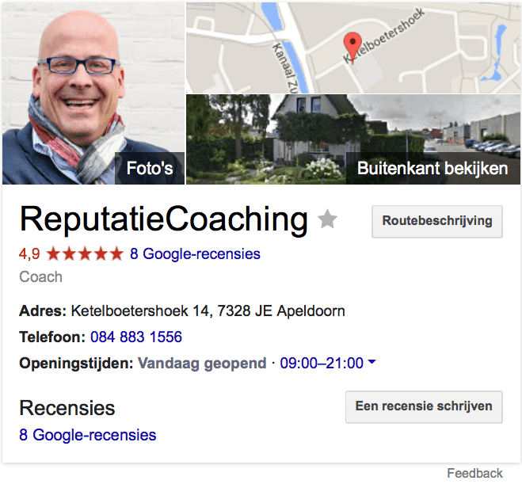
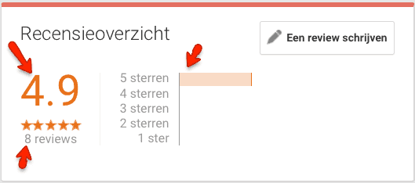
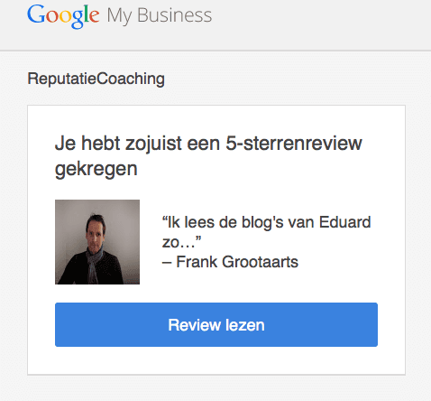

> **Historisch archief.** Deze aflevering verscheen op 22-10-2015 als onderdeel van ReputatieCoaching (2012–2016). De oorspronkelijke tekst is hieronder historisch bewaard. Diensten, contactgegevens, links, tools en adviezen kunnen inmiddels verouderd zijn.



**Transcriptiestatus:** Volledige transcriptie uit het oorspronkelijke archief.

***Historische afbeelding niet beschikbaar: ReputatieCoaching Podcast*
Op het moment van live gaan van deze podcast ben ik onderweg naar Gladbeck in Duitsland. Daar ga ik weer vier dagen belangeloos fotograferen voor Against Cancer.**

**Ik maak elke dag wel gebruik van Jing, een tool om snel en gemakkelijk screenshots te maken van vensters of delen van het scherm. Daarom vind ik het leuk om die vandaag als tooltip met je te delen.**

**Zelfs de ReputatieCoach die ieder bedrijf aanspoort om reviews te gaan verzamelen, is nu ook overduidelijk gereviewd op Google. 8 recensies van 5 sterren, hetgeen volgens Google een gemiddelde van 4,9 oplevert. Dat is bijzonder heh?**

**Over reviews gesproken: Google heeft stricte richtlijnen ten aanzien van reviews. Zolang een review daar niet aan voldoet, wordt die niet vertoond. Wordt de conflicterende factor verwijderd, dan is de review meteen te zien. Ik geef je zo een praktijkvoorbeeld waar dat door kan komen.**

**Tenslotte heb ik wat opnames uit de presentatie van Jojanneke van den Bosch over livestreaming, die ze heeft gegeven tijdens Social Media Club Apeldoorn op 12 oktober jongstleden.**

Hallo en hartelijk welkom bij deze aflevering van de ReputatieCoaching Podcast. Ik ben Eduard de Boer, ReputatieCoach. Dit is dé podcast die jou helpt om meer business te genereren, doordat jouw website beter gevonden wordt, zowel lokaal als landelijk en doordat ik je uitleg hoe je je online reputatie kunt verbeteren. Dit alles helpt je om je bedrijf en jezelf beter op de online kaart te plaatsen.

De podcast kun je vinden op [www.reputatiecoaching.nl/151](https://web.archive.org/web/20190717183523/https://www.reputatiecoaching.nl/151/). Daar vind je niet alleen de tekst, maar ook video’s waar ik het in deze uitzending over heb, alsmede afbeeldingen, links enzovoorts. Bovendien is de podcast te beluisteren in iTunes, op Stitcher en ook op [TuneIn Radio](http://tunein.com/radio/ReputatieCoaching-Podcast-p655084/). Ik raad je aan om je op één van die drie kanalen te abonneren op de podcast, zodat je geen aflevering hoeft te missen!

## Fotograferen voor “Against Cancer”

Voor het geval je het nog niet wist: [Against Cancer](http://againstcancer.nl) geeft een glimlach aan kinderen die bezig zijn met hun race tegen kanker. Laatst had ik bij het fundraising evenement “Golf Against Cancer” reeds foto’s gemaakt. Die kun je bekijken op [Flickr](https://www.flickr.com/photos/againstcancer/albums/72157659202886848).

En nu ben ik mee op reis… Want één van de activiteiten die de stichting tweemaal per jaar organiseert is een reis naar Duitsland voor een aantal gezinnen met kinderen met kanker en hun broertjes en zusjes. Zo ook nu, in oktober: we gaan twee pretparken bezoeken, zodat de gezinnen een paar dagen zorgeloos kunnen genieten.

Samen met collegafotograaf en vriend Martin Stevens ga ik dit vastleggen: deze zieke kinderen met een smile van oor tot oor!

Dus de podcast heb ik iets eerder deze week gemaakt.

## Tooltip: Jing voor screen captures / korte screencasts

[*Historische afbeelding niet beschikbaar: Jing logo*](http://www.techsmith.com/jing.html)Schrijf jij ook dikwijls artikelen, waar je screenshots bij nodig hebt om je verhaal te verduidelijken? Gebruik je daarvoor de PrtScrn functie op je PC of de equivalent op de Mac?

Al jaren gebruik ik hiervoor de tool “[Jing](https://www.techsmith.com/jing.html)” naar volle tevredenheid. Hoewel je met Jing ook screencasts van maximaal 5 minuten kunt maken, gebruik ik het alleen voor het maken van screenshots, dus stilstaande afbeeldingen van vensters.

Voor screencasts (dus video’s van het bedienen van programma’s en websites) gebruik ik de grotere broer van Jing: “[Camtasia](https://www.techsmith.com/tutorial-camtasia-mac.html)”. Maar dat is een onderwerp voor een andere keer.

Terug naar Jing. Op mijn Mac heb ik Jing zó ingesteld, dat ik de tool activeer, als ik CMD-SHIFT-J indruk. Dan kun je het venster kiezen, waarvan je een screenshot wilt maken. Als je dat eenmaal hebt gekozen en je hebt je keuze bevestigd, kun je eventueel de screenshot nog van kaders, teksten, pijlen en dergelijke voorzien, waarna je ’m kunt opslaan of kopiëren naar het clipboard.

Het mooie is dat de tool ook een historie van 2 GB in de cloud voor je bijhoudt. Dat is veel, heel veel. Want ik heb zojuist even teruggekeken en zelfs mijn eerste screenshot van 11 mei 2012 kan ik nu nog steeds terugvinden, na ruim 3 jaar. Dus voordat dat vol zit, ben je wel even bezig!

Ik ga geen instructievideo maken over hoe je Jing gebruikt, want Techsmith, de fabrikant van Jing, heeft een hele reeks heldere [instructievideo’s over het gebruik van Jing](https://web.archive.org/web/20150910110204/https://www.techsmith.com/tutorial-jing-taking-your-first-capture.html) online staan.

De screenshots worden opgeslagen in PNG formaat. Dat staat voor “Portable Network Graphic”. Het nadeel ervan is dat de PNG-bestanden die uit Jing komen, nogal groot zijn. Daarom haal ik die altijd naderhand door compressor.io, om ze te verkleinen. Reden daarvoor is dat ik altijd de gebruikerservaring wil maximaliseren en dus geen overtollig virtueel “vet” aan mijn afbeeldingen wil laten zitten.

Hoe je dat doet, kun je bekijken in een instructievideo die ik een tijdje terug heb gemaakt. Deze video heb ik opgenomen in de show notes voor vandaag, op [www.reputatiecoaching.nl/151](https://web.archive.org/web/20190717183523/https://www.reputatiecoaching.nl/151/):

## ReputatieCoach gereviewd

Vorige week vertelde ik je al dat ik sindskort een Google Mijn Bedrijf-pagina heb voor ReputatieCoaching en dat ik bezig was met het verzamelen van reviews. Hoewel de teller al op zes reviews stond, werden de sterretjes nog niet vertoond bij de bedrijfsvermelding. Zelfs toen de teller de volgende dag op acht reviews stond, bleven de sterren nog ergens zweven in het digitale universum, zonder op de bedrijfsvermelding te landen.

Pas twee dagen later verschenen de sterretjes. Maar nu is de bedrijfsvermelding wat dat betreft natuurlijk wel compleet en geloofwaardig: een [ReputatieCoach](https://plus.google.com/+ReputatieCoaching) die zelf ook reviewsterren heeft:



Ik had het al eens gelezen, maar nu zie ik het zelf ook: Google kan niet goed rekenen! Want als ik een leerling uit groep 4 of hoger vraag: hoeveel is (5 x 8) / 8, dan zal die leerling beslist niet 4,9 zeggen, het gemiddelde dat Google met haar onuitputtelijke computercapaciteit heeft berekend. Toch vindt Google dat de uitkomst van deze rekensom 4,9 moet zijn:



Bijzondere uitkomst voor deze op zich simpele rekensom… Ik heb ooit gehoord of gelezen dat Google voor de gemiddelde reviewscore meerdere bronnen gebruikt, zoals het in het verleden ook zelfs meldde. Toen stonden in de Knowledge Graph van een bedrijf aan de rechterkant ook andere reviewsites vermeld.

Alleen ben ik me er niet van bewust dat ik elders nog reviews heb voor ReputatieCoaching, dus dat maakt dit gemiddelde wel vreemd.

Ik houd het in de gaten…

## Reviews met URLs, adressen en telefoonnummes geweigerd op Google

En als ik het dan toch over reviews heb… Je weet natuurlijk al dat het een regelrechte ramp is om reviews te verzamelen op Yelp. Maar ook Google laat soms reviews niet zien. Alleen lijkt dat niet te komen door zo’n extreem filter, als Yelp toepast.

Nee, Google weigert reviews die niet aan haar richtlijnen voldoen. Ik heb ze al genoemd, maar nu wil ik enkele in iets meer detail behandelen, omdat ik vorige week tegen één van deze richtlijnen aanliep…

```
  * **Advertenties** – gebruik reviews niet om te adverteren, bijvoorbeeld door links naar andere websites of telefoonnummers toe te voegen. Reviews moeten een echte weerspiegeling zijn van je ervaring met een plaats. Plaats reviews niet alleen om de beoordelingen van een plaats te manipuleren.
  * **Spam** – plaats geen spam. Schrijf een echte review van je ervaring met de plaats. Neem geen promotionele of commerciële inhoud op, plaats dezelfde inhoud niet meerdere keren en schrijf geen reviews voor dezelfde plaats via meerdere accounts.
  * **Telefoonnummers of URL’s** – om reviews met advertenties of spam te voorkomen, zijn telefoonnummers of links naar andere websites niet toegestaan in reviews. Als je een bijgewerkt telefoonnummer of bijgewerkte URL wilt toevoegen voor het bedrijf dat je beoordeelt, gebruik je de link ‘Een probleem melden’ om die informatie te melden.
```

Frank Grootaarts uit Nijmegen postte vorige week een recensie voor ReputatieCoaching, dat vertelde Google mij in een mailtje die ik in de show notes heb opgenomen:



Het bijzondere was dat ik dus wel een mail kreeg van Google, dat Frank Grootaarts een review hád gepost, alleen zag ik ’m niet, ook na 10 minuten nog niet. En normaliter kun je een review echt meteen zien, als Google je erop attent maakt.

Ik mailde Frank hierover en vroeg of hij wellicht een URL of telefoonnumer in de recensie had opgenomen. Hij antwoordde mij dat hij inderdaad de URL van zijn website had vermeld:


Pas toen hij de URL had verwijderd was de recensie meteen zichtbaar! Doe hier je voordeel mee: als jij een mail krijgt van Google dat er een recensie over je bedrijf is gepost, maar je kunt ’m niet zien, neem dan contact op met degene die ’m heeft gepost en vraag dit. Grote kans dat als de URL of het telefoonnummer wordt weggehaald, de review meteen zichtbaar wordt!

## Historie van livestreaming volgens Jojanneke van den Bosch


Vorige week was ik bij Social Media Club Apeldoorn. Eén van de sprekers was Jojanneke van den Bosch. Zij vertelde over livestreaming. De titel van haar presentatie luidde: “Livestreaming is here to stay!”. Graag deel ik hier haar verhaal over de geschiedenis van livestreaming:

Dus eigenlijk was zijn taak volbracht. En toen kwam er Qik. En dat was een appje, dat is nu gekocht door Skype en wordt nog gebruikt om videoberichten uit te wisselen met vrienden. Kleine groepjes vrienden. En dat was ook ooit gekoppeld aan Twitter in 2009. En ik ben een beetje een nerd en ik vind het dan leuk om uit te proberen hoe dat dan werkt en dat je kan laten zien wat jij ziet. En dat de wereld dan kan meekijken.

Dus dat waren meestal van die janboerenfluitjes video’s als ‘Ja, ik sta hier nu op de Erasmusbrug’, nou ja, zo. En dan keken mensen mee wat voor weer het was ofzo. En dat was niet echt een superhoge informatiedichtheid, maar het creëerde wel die verbondenheid die we ook al een beetje voelden met Twitter. Een beetje een soort van huiskamer, maar dan door andermans ogen bekeken.

En toen kwam er Ustream. Veel groter platform, is ook nog steeds in de lucht en wordt nog steeds ook corporate gebruikt, waarmee je dus ook livestreams kan uitzenden over de hele wereld. Wordt veel voor events gebruikt, veel voor corporate en toen kwam YouTube live. Wie kijkt er regelmatig of ooit naar YouTube Live kanalen? Maar wie kijkt er vooralsnog met name naar replays op YouTube, gewoon video’s die er staan? Ja, ik ook. Ik kijk af en toe eigenlijk maar naar livestreams op YouTube. Weet jij misschien hoe dat komt?

Ik heb er een beetje een natte vinger theorie over dat je meestal naar dingen gaat die live zijn, waar je zelf iets mee hebt of waar je mee geconfronteerd wordt met je eigen netwerk. Dus als je eerst een stap moet zetten naar een bepaalde website waar livestreams zijn, om te kijken welke livestreams er zijn, dan zijn mensen iets minder geneigd om dat te doen. Maar als ze toevallig op de timeline zitten, en toevallig iets zien wat live is, dan denken ze van: toch even meekijken. En ik merkte dat dat bij mij zo werkt. En dat vind ik grappig. Want als je het me 5 jaar geleden had gevraagd dan had ik gedacht, ‘Dat zou zo te gek zijn, als er websites zijn waar alleen maar livestreams zouden zijn’. Maar menselijk gedrag is vaak helemaal niet zo goed te voorspellen.

Ja, en toen was daar begin dit jaar ineens een hele tijd na deze eerste cluster van livestreamapps, was daar Meerkat. En Meerkat was een app, die in Texas bij South by Southwest, dat is een soort van grote technologisch goeroe festival, een soort van Woodstock maar dan in Amerika en over tech, ook een beetje die sfeer trouwens, daar werd deze app met heel veel bombarie gelanceerd. En het was meteen een megahit.

Iedereen dacht “Okay dus mobiel livestreaming daar zijn we nu voor klaar want we hebben en overal mobiel breedband, we hebben overal mobieltjes met 3G of 4G, WiFi all over the place. Dus de techniek is er klaar voor en wij zijn er ook aan gewend dat we veel delen. Dus de tijd en de techniek zijn er meer klaar voor”. We konden het al, alleen we bleken er op dat moment nog geen behoefte aan te hebben en nu wel. Dus WIJ zijn er klaar voor.

En dat is ook zo’n fundamenteel beeld. Zo’n besef dat je denkt, het gaat niet om die apps, het gaat om jou. En het gaat om ons, en om mij en om jou en om jou en om iedereen die op dit moment aan het streamen is. Wie is er op dit moment aan het streamen? Jij bent aan het streamen, jij bent aan het opnemen voor je podcast. Wie is er nog meer aan het streamen?

Meerkat was dus ook gekoppeld aan Twitter. Superhandig. Want dan kun je weer ergens over struikelen op de timeline, en vervolgens iets moois ontdekken. Maar Twitter zelf dacht: “Ja, maar nu is er een andere onderneming, die heeft iets vreselijk slims bedacht. Dat gaat als een trein. En wij dan?”.

Dus ze hadden een andere startup gezien, Periscope. En ze dachten: “Laten we die voor een x-bedrag kopen en kijken wat er gebeurt…”

Nu hebben ze dat in no-time tot een hoog niveau gekregen, omdat Meerkat ze zo ontzettend voor was. En omdat Meerkat er zo ontzettend goed uit zag. En technisch zo stabiel was. En omdat ook U2 er iedere dag gebruik van maakt. En concerten uitzendt. Nog steeds. En dus niet kiest voor Periscope. Hele interessante machtsverschuiving eigenlijk.

Wat gebeurde er vervolgens? Twitter was een beetje boos. Dus Twitter dacht: “Wij gaan Meerkat de toegang ontzeggen tot onze API, tot ons open netwerk. Zodat je niet meer kan inschrijven met Twitter op Meerkat.”

Beetje kinderachtig. Maar dat kon dus weer wel met Periscope. En wat gebeurt er? Binnen vijf maanden 10 miljoen gebruikers op Periscope. Nu een maand later, wat zal het zijn, bijna 15 miljoen. Het groeit als kool. Omdat wij eraan toe zijn. Dus er zijn dus meer dan 10 miljoen account op Periscope nu. Er zijn heel veel mensen.

En iedere dag zijn er dus 2 miljoen accounts actief. Iedere dag. Ik vind dat best wel veel, want het is namelijk als je het vergelijkt met Twitter en Facebook destijds, een snellere groei dan die twee platforms bij elkaar.

Nou, scopes worden 24 uur bewaard in de Periscope timeline. En je kan ze benaderen via Twitter. Inmiddels zijn er ook webprofielen beschikbaar waar jouw naam ook achter staat, zodat jouw scopes te zien zijn, 24 uur. Daarna zie je ze nog wel maar je kan ze niet meer afspelen.

Tot zover de geschiedenis van livestreaming… Jojanneke was echt één van de pioniers van het eerste uur die begon met livestreaming. Zij weet dan ook als geen ander goed te vertellen hoe je moet beginnen met livestreaming en hoe je meer kijkers krijgt. Daarover vertelt zij het volgende:

En als je die bekijkt dan denk je: “Hé, die mensen die hebben wel meer leuke dingen.”. En dan kun je ze gaan volgen. En zo krijg je een heel nieuwe ecosysteem van volgers en followees. Heel anders dan alleen je gewone Twitter volgers. Want dat merk ik dus ook. Mensen die op Periscope echt, nou ja, helden zijn, helemaal big en huge, die hebben misschien veel minder Twitter volgers.

Maar die hebben dan, weet ik veel, drie miljoen hartjes op Periscope, en die worden uitgenodigd om op de Periscope Summit te gaan spreken en dan zeggen mensen echt van “Oh, wat cool!”. En op Twitter hebben ze misschien 600 volgers. En dan denk ik, hoe kan dat nou zo anders zijn? Omdat het een ander medium is in essentie. Some people are visuals, some people are verbal.

Het zijn gewoon verschillen. En dat vind ik ook zo leuk. Het betekent namelijk –en dat vind ik heel geruststellend– dat de kaarten zijn niet verdeeld. Je hebt de boot per definitie niet gemist. En je kan het maken wat jij wilt dat het is. Vind ik ontzettend geruststellend. Betekent ook dat als je eenmaal wel een hele grote following hebt, ik heb iets van 16.000 mensen op Twitter, en ik vind ze allemaal even lief, eh, dat dat niet betekent dat ik dan op Periscope ineens een gespreid bedje heb.

Dat is helemaal niet zo. Nee, je laat een andere kant zien. Nou, is die dan ook leuk? Of niet? Dat zien we dan nog wel. Jij bent niet degene die dat beoordeelt. Het enige wat jij zelf beoordeelt is of jij er lol in hebt. En of jij het waardevol vindt voor een ander of dat je denkt dat het waardevol is. En dat jij vindt dat de wereld iets mist wat jij graag wil vullen.

Kijk vervolgens naar die mensen die je dus hebt gevonden op Periscope, wie zij volgen en wie hen volgen. Want die volgen elkaar voor een reden. Dat kan zakelijk zijn, maar dat kan ook dat onderwerp zijn. En dat kan ook weer jouw netwerk helpen groeien, als jij er voor kiest om zelf die scopes van mensen te gaan volgen.

En zend, nogmaals, waarde uit. Wees ook zelf actief. Is heel belangrijk hè. Dat je actief bent in andermans scopes. In Nederland zijn we nog niet zo heel erg gewend aan het fenomeen hartjes geven. Dat is een uiting van: ik vind dit leuk. Op Facebook zeg je 1 keer “Leuk”. Maar op Periscope zeg je continue dat je iets leuk vindt, of even of niet of 1 keer. En dat gebeurt in Nederland nog vrij weinig. En in Nederland moeten we nog een beetje wennen aan dat fenomeen hartjes geven.

Sinds enige tijd is er ook Blab. Ken je Blab nog niet? Blab is een tool waarin maximaal vier mensen tegelijk elkaar kunnen zien en met elkaar kunnen praten. Jojanneke vertelde dat er zelfs onlangs een virtueel congres heeft plaatsgevonden over podcasten, dat alleen maar gebruik maakte van Blab:

Dus deze dame, die was dus altijd in beeld, 16 uur ongeveer, echt kanjer. En die had dus van tevoren een hele rij met sprekers besproken voor bepaalde tijdstippen.

En die deelden dus allemaal informatie over hoe zij met Podcasten omgingen, over techniek, over voorbereiding, over audio, over onderwerpen, over voorbereiding, whatever.

En dat vond ik te gek, want ik kon dus gewoon cherry pikken in het programma van “oOh, ja die, en die, en die…”. Geen tickets, geen geld, geen reiskosten, maar je was er meteen bij. En je kon vragen stellen en je kon chatten en je wist meteen wie je moest gaan volgen. Ik vond het te gek.

Ik vond het zo tof, dat ik dacht “Dat wil ik ook…”.

Tot zover wat ik je wilde laten horen uit de presentatie van Jojanneke. Haar hele presentatie was te omvangrijk om in de podcast te embedden. Daarom heb ik de slides van haar volledige presentatie in combinatie met de opgenomen audio embedded in de show notes, die je kunt vinden op [www.reputatiecoaching.nl/151](https://web.archive.org/web/20190717183523/https://www.reputatiecoaching.nl/151/):

En daarmee kom ik wederom aan het einde van deze podcast.

Ik hoop in elk geval dat je ook deze podcast en dit soort content leuk vindt. Zo ja, volg me dan via de verschillende kanalen: je kunt me vrijwel overal vinden op de sociale media. Zoek gewoon op: “reputatiecoach”. Dat scoort bijna overal bovenaan!

En heb je inderdaad wat aan alle informatie die ik met je deel, help mij dan met het verder verbeteren en promoten van deze podcast. Abonneer je op de podcast, zodat je altijd automatisch de nieuwste uitzending krijgt voorgeschoteld en neem je voor deze week tenminste één andere persoon over de podcast te vertellen. Dat kan je partner, een vriend of vriendin zijn, een zakenrelatie, een collega… Het maakt niet uit. Vertel gewoon één persoon over de podcast.

Oh… en nu het vanaf deze week ook daadwerkelijk kan, post jij nu meteen even een recensie op: plus.google.com/+ReputatieCoachingNL . Dat zou ik ontzettend leuk vinden! Alvast bedankt!

Op de website kun je me een berichtje sturen en zelfs een gratis consult inboeken. Ook kun je me bellen op 084–8831556 en ook rechtstreeks op de website een voicemail achterlaten, door op de tab aan de rechterkant van elke pagina te klikken, en je bericht in te spreken.

Dit was [ReputatieCoaching Podcast aflevering 151](https://web.archive.org/web/20190717183523/https://www.reputatiecoaching.nl/151/) en mijn naam is [Eduard de Boer](http://nl.linkedin.com/in/eduarddeboer/nl).

Ik wens je de komende week weer succes met het werken aan je reputatie, zodat je meteen je reputatie voor jou kunt laten werken!

Tot volgende week!

Doei!

Links naar content die in deze podcast aan bod komt:

```
  * ReputatieCoaching Podcast in iTunes
  * ReputatieCoaching Podcast op Stitcher
  * [ReputatieCoaching Podcast op TuneIn Radio](http://tunein.com/radio/ReputatieCoaching-Podcast-p655084/)
  * [ReputatieCoaching Podcast RSS-feed](https://web.archive.org/web/20151006093045/http://feeds.reputatiecoaching.nl:80/ReputatieCoachingPodcast)
  * [OnlineComm Academy](https://web.archive.org/web/20151023044052/http://www.onlinecomm.academy:80/)
```
