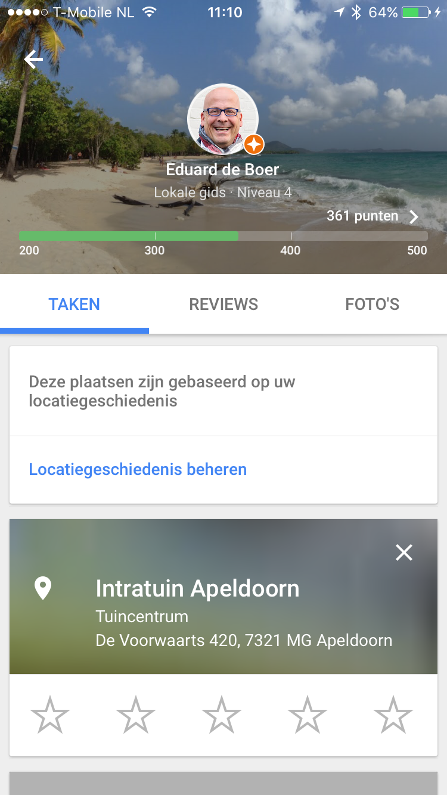

> **Historisch archief.** Deze aflevering verscheen op 12-11-2015 als onderdeel van ReputatieCoaching (2012–2016). De oorspronkelijke tekst is hieronder historisch bewaard. Diensten, contactgegevens, links, tools en adviezen kunnen inmiddels verouderd zijn.



**Transcriptiestatus:** Oorspronkelijke shownotes. Vanaf aflevering 153 werd de podcast niet meer volledig uitgeschreven.

***Historische afbeelding niet beschikbaar: ReputatieCoaching Podcast*
Vanaf vorige week is het format van de podcast iets gewijzigd. Omwille van de tijd die het kost om elke week een podcast te maken en omdat ik ook eens wilde vernieuwen, werk ik de podcast vooraf niet meer helemaal letterlijk uit. Ik heb een lijst met onderwerpen en daarover ga ik je gewoon vertellen.**

**Als gevolg daarvan verdwijnt de volledige transcriptie en moet je het dus met de audioversie doen. Een paar luisteraars gaven hun mening over het nieuwe format.**

Eerder deze week was er een storing bij Antagonist, mijn webhoster. Die was echter heel snel opgelost.

Studenten van de Universiteit van Tilburg hebben mijn hulp en medewerking gevraagd bij een workshop over reputatiemanagement, in december.



Hotels en restaurants in het buitenland kunnen nog wel wat aan hun exposure doen. Naar aanleiding van onze vakantie in Gambia heb ik een Nederlandse ondernemer aldaar wat tips gestuurd.

En als we het dan hebben over bedrijven op de kaart zetten, dan kom je ook zo op het Lokale Gidsen-programma van Google. Dat heeft Google begin dit jaar gestart. Inmiddels is het programma iets aangepast en uitgebreid. Ik zit op niveau 4… Dat was het hoogste niveau, maar nu is er ook een niveau 5 bij gekomen.

Een bedrijf vroeg mij een technische analyse uit te voeren van hun website, zowel op het gebied van techniek en HTML, alsmede kansen om de positie in de zoekresultaten te verbeteren. Waar ik dan zoal in eerste instantie snel naar kijk, hoor je later.

Links die in deze podcast aan bod komen:

```
  * ReputatieCoaching Podcast in iTunes
  * ReputatieCoaching Podcast op Stitcher
  * [ReputatieCoaching Podcast op TuneIn Radio](http://tunein.com/radio/ReputatieCoaching-Podcast-p655084/)
  * [ReputatieCoaching Podcast RSS-feed](https://web.archive.org/web/20151006093045/http://feeds.reputatiecoaching.nl:80/ReputatieCoachingPodcast)
  * [Google Lokale Gidsen programma](https://www.google.com/intl/nl/local/guides/)
  * [Antagonist webhosting](https://www.antagonist.nl)
```
