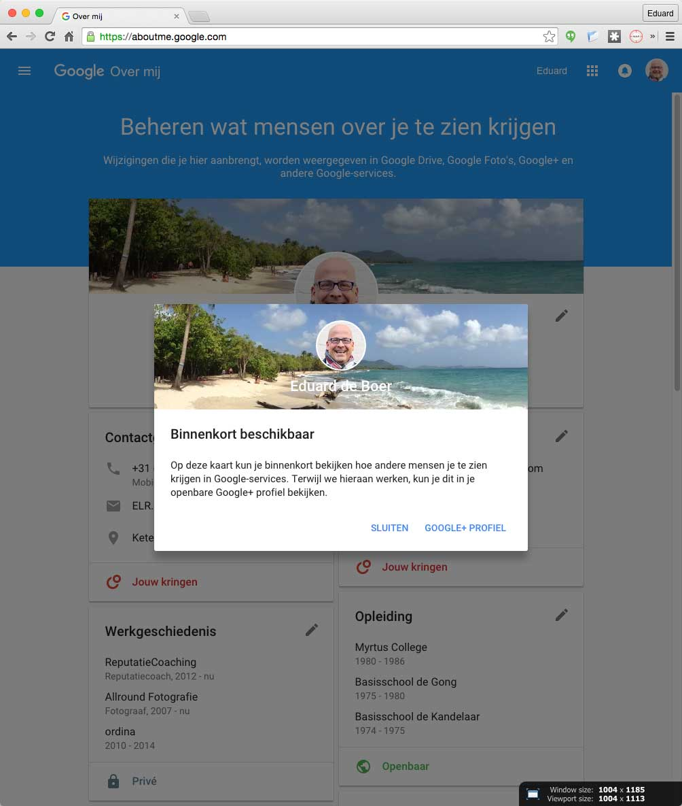
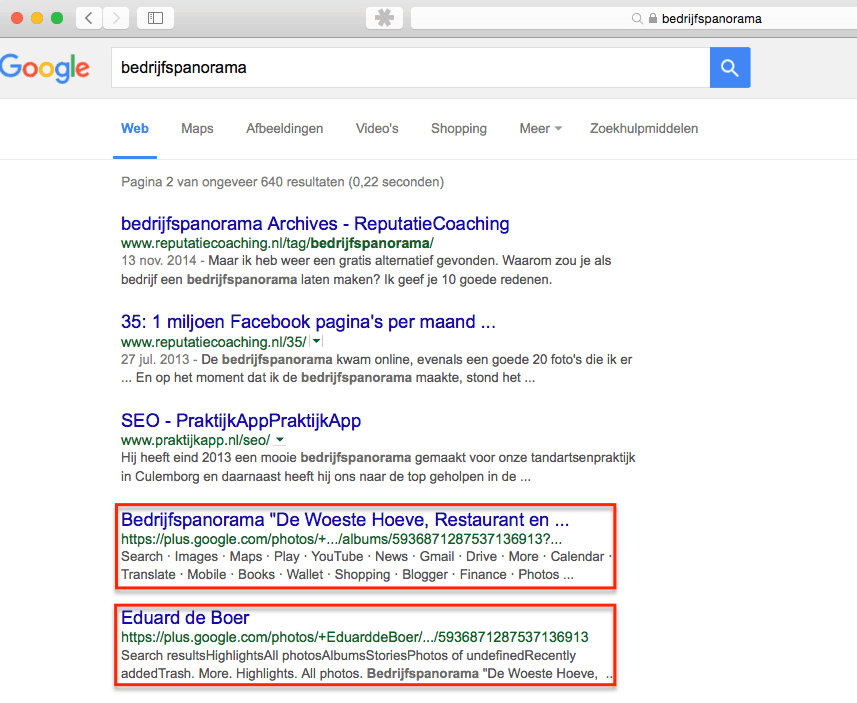
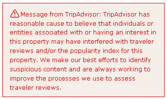

> **Historisch archief.** Deze aflevering verscheen op 19-11-2015 als onderdeel van ReputatieCoaching (2012–2016). De oorspronkelijke tekst is hieronder historisch bewaard. Diensten, contactgegevens, links, tools en adviezen kunnen inmiddels verouderd zijn.

**Transcriptiestatus:** Oorspronkelijke shownotes. Vanaf aflevering 153 werd de podcast niet meer volledig uitgeschreven.

\*\*[*Historische afbeelding niet beschikbaar: ReputatieCoaching Podcast*](https://web.archive.org/web/*/https://www.reputatiecoaching.nl/wp-content/uploads/2012/12/Reputatie-Coaching-Podcast-logo-200x200.jpg)Vandaag begin ik even met je bij te praten over mijn voortgang in het vernieuwde Lokale Gidsen programma van Google. Daarna heb ik wat statistieken over WordPress.\*\*

**Google+ is totaal vernieuwd en daarmee is ook opeens Google About Me geïntroduceerd. Verder stelt Google je in staat om bedrijven met geografische coördinaten aan te maken, in plaats van met een adres. Enkele online fotoalbums van mij op Google Photos beginnen te ranken in de zoekresultaten.**

**Ik heb voor een nog te verschijnen artikel input geleverd over fake reviews. Wat ik daarover heb verteld, wil ik graag met je delen, evenals de vragen die ik kreeg toegestuurd voor het interview door de studenten van de Hogeschool Tilburg.**

**En ik sluit de podcast van vandaag af met 5 tips om de risico’s van WordPress plugins te minimaliseren.**

## [20151119-google-lokale-gidsen-punten

](https://web.archive.org/web/*/https://www.reputatiecoaching.nl/wp-content/uploads/2015/11/20151119-google-lokale-gidsen-punten.jpg)Status Google Lokale Gidsen

Toen het Lokale Gidsen programma door Google werd geïntroduceerd aan het begin van 2015 had ik maar één doel: zo snel mogelijk het hoogste niveau bereiken: niveau 4. Sindskort is er een niveau bijgekomen. Mijn nieuwe doel is nu om dat niveau te bereiken vóór 1 januari 2016!

In deze podcast vertel ik hoe ik twee weken geleden begon met 342 punten en nu inmiddels al op 400 punten zit. Dat doel van die 500 punten is dus zeker realiseerbaar en ik kan je verklappen dat het een stuk gemakkelijker is, dan de initiële eis voor niveau 4: het schrijven van 200 reviews.

## WordPress nieuws

WordPress is verreweg het meest populaire CMS (Content Management Systeem). Het wordt inmiddels op 25% van **ALLE** websites op Internet gebruikt. Daardoor is het ook het meest populaire systeem waarop door kwaadwillenden aanvallen worden uitgevoerd.

Vaak kunnen sites worden gehacked doordat mensen laks zijn met wachtwoorden. Maar ook plugins kunnen kwade bedoelingen hebben. Daarover straks meer.

Een paar weken geleden vertelde ik je over AMP: Accelerated Mobile Pages, een nieuw concept gebaseerd op bestaande technologieën om websites zo snel mogelijk te maken. Daarvoor is een WordPress plugin beschibaar en ik gebruik die nu al een tijdje. In de podcast vertel ik je hoe je al kunt experimenteren met AMP, door te surfen naar http://g.co/ampdemo , de AMP-vriendelijke zoekpagina van Google.

## Google+ vernieuwd

Sinds afgelopen nacht is Google+ totaal veranderd. Een groot deel van het sociale aspect is eruit. De nadruk ligt nu nog op berichten, Collecties en Communities. De voorlopige waarnemingen hoor je in de podcast.

## Google About Me

Heb je al eens gekeken naar Google About Me? Ik verwacht het niet, want ook die service is pas een paar dagen operationeel. Luister naar wat ik je erover te vertellen heb.

[](/wp-content/uploads/2015/11/20151119-aboutme-google.jpg)

## Google My Business met geografische coördinaten

Op Google My Business kun je voor een beperkt aantal landen nu ook de geografische coördinaten bij bedrijfsvermeldingen uploaden. Die kan Google gebruiken als er onduidelijkheden zijn met het adres van een bedrijf, of er helemaal geen adres voor beschikbaar is.

## Google Photos beginnen te ranken

Vorige week viel het me op dat ik voor sommige zoektermen opeens online fotoalbums van Google Photos te zien kreeg. Dus die albums beginnen te ranken op bepaalde trefwoorden.

[](/wp-content/uploads/2015/11/20151119-GooglePhotos-ranking.png)

## Fake reviews

Fake reviews, het blijft een probleem. In de podcast van vandaag vertel ik je over hoe TripAdvisor hiermee omgaat en ertegen doet.

[](/wp-content/uploads/2015/11/TripAdvisor-fraud-warning.gif)

Een journalist heeft mij benaderd over fake reviews, omdat hij daar een artikel over wil schrijven. In de podcast hoor je wat ik die journalist zoal heb verteld.

## Interview over reputatiemanagement door Hogeschool Tilburg

De vragen die ik kreeg toegestuurd voor het interview door de studenten van de Hogeschool Tilburg waren koren op mijn molen. Dat belooft dus een leuk interview te worden. In de podcast hoor je welke vragen de studenten morgen zoal aan mij gaan stellen.

## 5 tips om risico’s van WordPress plugins te minimaliseren

[*Historische afbeelding niet beschikbaar: Wordpress SEO*](https://web.archive.org/web/*/https://www.reputatiecoaching.nl/wp-content/uploads/2012/12/Wordpress-logo-2-e1433334691596.jpg)De kans is groot dat jij ook WordPress gebruikt voor je website: tenminste 25% en ik denk zelfs wel groter. Ben jij ook zo iemand die graag verschillende plugins uitprobeert? Ik wel. Met het installeren van plugins loop je bepaalde risico’s en ik vertel je in deze podcast hoe je die risico’s kunt minimaliseren.

Links naar gerelateerde content die in deze podcast aan bod kwam:

```
  * [ReputatieCoaching Podcast in iTunes](https://web.archive.org/web/*/https://www.reputatiecoaching.nl/itunes)
  * [ReputatieCoaching Podcast op Stitcher](https://web.archive.org/web/*/https://www.reputatiecoaching.nl/stitcher)
  * [ReputatieCoaching Podcast op TuneIn Radio](http://tunein.com/radio/ReputatieCoaching-Podcast-p655084/)
  * [ReputatieCoaching Podcast RSS-feed](https://feeds.reputatiecoaching.nl/ReputatieCoachingPodcast)
  * [Een spreadsheet maken voor uw bulkupload](https://support.google.com/business/answer/3370250?hl=nl) (Google Mijn Bedrijf Help)
  * [Google+ vernieuwd](https://googleblog.blogspot.nl/2015/11/introducing-new-google.html?m=1) (Google Blog, 17 november 2015)
```
