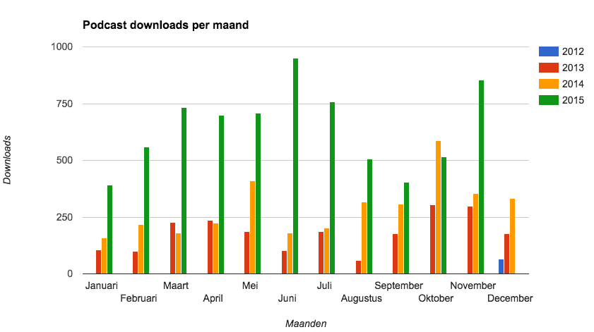
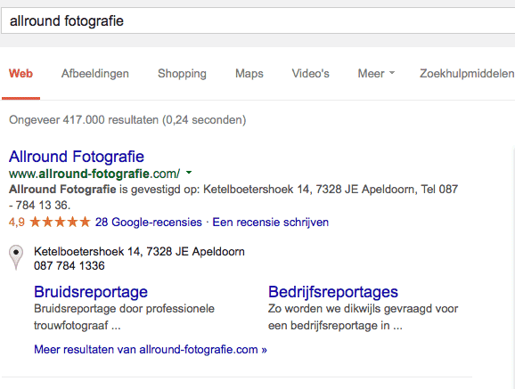
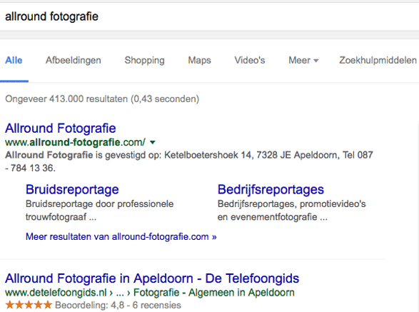
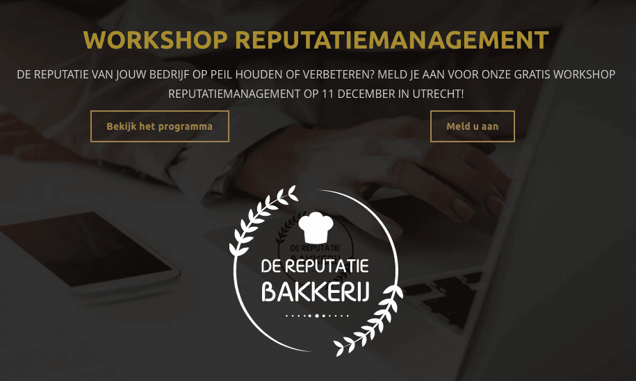

> **Historisch archief.** Deze aflevering verscheen op 3-12-2015 als onderdeel van ReputatieCoaching (2012–2016). De oorspronkelijke tekst is hieronder historisch bewaard. Diensten, contactgegevens, links, tools en adviezen kunnen inmiddels verouderd zijn.



**Transcriptiestatus:** Oorspronkelijke shownotes. Vanaf aflevering 153 werd de podcast niet meer volledig uitgeschreven.

\*\*[*Historische afbeelding niet beschikbaar: ReputatieCoaching Podcast*](https://www.reputatiecoaching.nl/wp-content/uploads/2012/12/Reputatie-Coaching-Podcast-logo-200x200.jpg)Vandaag is een bijzondere dag. Waarom, dat hoor je zo als eerste na de intro van deze podcast!\*\*

**Daarna behandel ik een paar vragen naar aanleiding van [podcast 156](https://www.reputatiecoaching.nl/156/) van vorige week. Verder heb ik weer een paar nieuwtjes van Google. Zo kun je onder andere niet meer vanuit een andere locatie zoeken en is de one-box verdwenen.**

**Er zijn nog een paar plaatsen beschikbaar bij de workshop reputatiemanagement bij “de Reputatiebakkerij” in Utrecht op 11 december aanstaande.**

**Ik sluit de podcast af met een topic over glassdoor, een reviewsite waarop werknemers en ex-werknemers bedrijven kunnen beoordelen op diverse aspecten. Als je een bedrijf hebt èn je hebt mensen in dienst, dan is dit laatste onderwerp zeker relevant voor jou!**

## Podcast is 3 jaar oud!

De podcast is vandaag jarig: hij is 3 jaar geworden! Het klopt op de kop af… Een jaar heeft 52 weken en vorige week was aflevering 156, ofwel 3 x 52. Ik heb dus in die drie jaar geen week gemist!

Ook is het leuk om het aantal downloads te zien stijgen. Zo begon het natuurlijk met de eerste download in december 2012, tot ik tegenwoordig tussen de 500 en de 1.000 downloads per maand heb. In de show notes een grafiek van de groei van het aantal luisteraars.

Daar kun je zien dat er eigenlijk altijd een groei in zit en elke maand van elk jaar meer downloads genereert dan dezelfde maand ervoor in het vorige jaar, behalve oktober dit jaar:

[](/wp-content/uploads/2015/12/20151203-downloads-podcasts.png)

## Vragen naar aanleiding van podcast 156

Blijkbaar riep mijn verhaal uit [podcast 156](https://www.reputatiecoaching.nl/156/) toch nog een aan al vragen op. Luister naar deze podcast voor mijn antwoorden op de volgende vragen:

```
  * Waarom doe jij mee aan het Google Lokale Gidsen programma?
  * Heb je tips voor het Lokale Gidsen programma van Google?
  * Waarom zijn juiste openingstijden zo belangrijk?
  * Waarom moet ik als bedrijf mijn openingstijden op Google zetten? Ik heb ze toch al op mijn website staan?
  * Wat moet je als ondernemer nu (nog) met Google+?
```

## Google verwijdert locatie om vanuit te zoeken

*Historische afbeelding niet beschikbaar: Logo Google*
Lange tijd kon je bij het zoeken in Google de locatie kiezen, van waaruit je wilde zoeken. Dat was vooral handig voor lokale SEO. Maar die feature was op een gegeven moment niet meer beschikbaar. Totdat ik twee weken geleden door iemand erop werd gewezen dat die het wel deed. Dat verbaasde mij.

Maar nu is het echt zover: Google heeft deze optie verwijderd. Je kunt niet meer vanuit een bepaalde locatie zoeken!

Het kan zijn dat dit heeft te maken met het Europese recht “Om vergeten te worden”. Want voorheen kon je namelijk zo instellen dat je vanuit de USA zocht, waarna je bepaalde resultaten die je in Nederland niet te zien kreeg, wel kreeg te zien. Ik weet het niet.

Kleine tip voor je… Zoeken op een type bedrijf en een plaats, dus bijvoorbeeld: schilder arnhem … geeft de top–3 voor jou, als buitenstaander… De top–3 van in dit geval schilders in Arnhem.

Zoek je: “schilder in de buurt van arnhem” … dan zie je in veel gevallen de top–3 resultaten, zoals iemand die door de bank genomen in Arnhem te zien krijgt als hij of zij aldaar zoekt op zijn of haar smartphone.

## Google verwijdert de pin voor de “one boxes”

Google heeft de “one-boxes” verwijderd. Hieronder zie je twee voorbeelden: de eerste als je voorheen zocht op: “allround fotografie”:

[](/wp-content/uploads/2015/12/20151203-onebox-old.png) en de tweede die je sinds vandaag krijgt, als je zoekt op: “allround fotografie”:

[](/wp-content/uploads/2015/12/20151203-onebox-new.png)

Zoals je ziet zijn bij de bedrijfsvermelding ook de reviewsterren verdwenen. Die staan nu nog wel in het zogenaamde Knowledge Panel aan de rechterkant.

Er wordt gespeculeerd dat Google dit doet om zo de aandacht terug te brengen naar de AdWords advertenties die erboven staan. Het lijkt in het verlengde te liggen van het opschonen van de resultaten: eerst verdwenen de auteursfoto’s, toen de carrousel en vervolgens het 7-pack…

## Nog enkele plaatsen beschikbaar bij workshop van de ReputatieBakkerij

11 december is het zover… in Utrecht en dus niet in Tilburg. Dan heb ik het over de workshop over reputatiemanagement, die wordt georganiseerd door studenten van de Hogeschool Tilburg. Als dank voor mijn medewerking stellen ze letterlijk een handvol luisteraars van de ReputatieCoaching Podcast in de gelegenheid om deze workshop GRATIS bij te wonen.

Met andere woorden: er zijn slechts 5 plaatsen beschikbaar voor de luisteraars. Ga 2015 goed uit, begin 2016 met een makeover van je online reputatie en kom op 11 december naar Utrecht.

[](/reputatiebakkerij)

Het aantal plaatsen is beperkt. Heb je interesse en wil je op 11 december alles opsteken over reputatiemanagement om je bedrijf beter op de kaart te zetten en bottom line meer business te doen, surf dan meteen naar: [www.reputatiecoaching.nl/reputatiebakkerij](https://www.reputatiecoaching.nl/reputatiebakkerij) en meld je aan. Wacht niet te lang, want anders vis je achter het net!

Als je bent aangemeld krijg je alle details per mail toegestuurd.

Zie ik je op 11 december in Utrecht?

## glassdoor.nl : reviews van werknemers over werkgevers

Glassdoor begon in de VS als een reviewsite, waar (ex)werknemers hun (ex)werkgevers kunnen beoordelen op diverse aspecten. Inmiddels is Glassdoor ook alweer een aantal maanden operationeel in Nederland. Heb jij in de gaten wat dit betekent voor de reputatie van jouw bedrijf? Ik duik er in en geef je een aantal handvatten voor hoe je bijvoorbeeld met negatieve reviews op Glassdoor moet omgaan en dergelijke.

Links naar content elders op Internet die in deze podcast aan bod komt:

```
  * [ReputatieCoaching Podcast in iTunes](https://www.reputatiecoaching.nl/itunes)
  * [ReputatieCoaching Podcast op Stitcher](https://www.reputatiecoaching.nl/stitcher)
  * [ReputatieCoaching Podcast op TuneIn Radio](http://tunein.com/radio/ReputatieCoaching-Podcast-p655084/)
  * [ReputatieCoaching Podcast RSS-feed](https://feeds.reputatiecoaching.nl/ReputatieCoachingPodcast)
  * [Glassdoor](http://www.glassdoor.nl) – de reviewsite waar werknemers en ex-werknemers hun (vorige) werkgevers kunnen beoordelen
  * [Reputatiebakkerij](https://www.reputatiecoaching.nl/reputatiebakkerij) – de workshop over reputatiemanagement op 11 december a.s. in Utrecht
  * “[How Job Seekers Use Glassdoor Reviews](http://new-talent-times.softwareadvice.com/how-job-seekers-use-glassdoor-0114/)” (The New Talent Times, 8 januari 2014)
```
