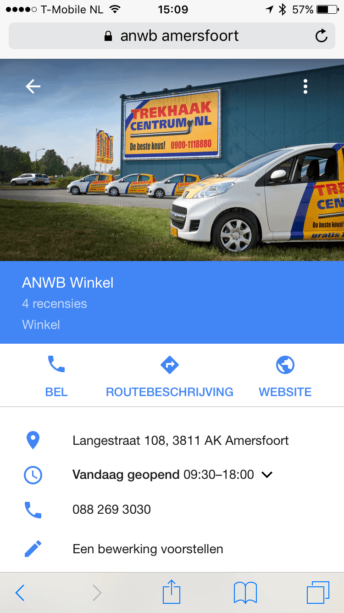

> **Historisch archief.** Deze aflevering verscheen op 10-12-2015 als onderdeel van ReputatieCoaching (2012–2016). De oorspronkelijke tekst is hieronder historisch bewaard. Diensten, contactgegevens, links, tools en adviezen kunnen inmiddels verouderd zijn.

**Transcriptiestatus:** Oorspronkelijke shownotes. Vanaf aflevering 153 werd de podcast niet meer volledig uitgeschreven.

\*\*[*Historische afbeelding niet beschikbaar: ReputatieCoaching Podcast*](https://web.archive.org/web/*/https://www.reputatiecoaching.nl/wp-content/uploads/2012/12/Reputatie-Coaching-Podcast-logo-200x200.jpg)WordPress 4.4 is uitgekomen. Ik vertel jou zo wat er nieuw aan is… Dan heb ik een verhaal over photo hijacking en ik vertel je kort over de presentatie die ik bij een opdrachtgever heb gegeven ten behoeve van een (lokale) SEO audit.\*\*

**Wist je dat klikken op je lokale vermelding helpt om hogerop te komen in de lokale resultaten? Nee? Ga vooral luisteren!**

**Daarna vertel ik je over het belang van instellen van afwijkende openingstijden gedurende de feestdagen en hoe je dat moet doen.**

**Op Frankwatching las ik 12 tips om livestreaming met Periscope zakelijk in te zetten. Die heb ik wel nodig, want tijdens de workshop in samenwerking met de Hogeschool Tilburg die morgen op de agenda staat, zal mijn presentatie ook live worden gestreamd…**

**Apple Maps wordt op iOS driemaal vaker gebruikt dan Google Maps. En dan sta jij nog steeds niet op Apple Maps met je bedrijf? Gemiste kans, zou ik zo zeggen!**

**Het laatste onderwerp voor vandaag gaat over de factoren waar ik op let, als ik een bedrijf help om hogerop te komen in de lokale zoekresultaten.**

## WordPress 4.4 is uitgekomen

2 dagen geleden is [WordPress 4.4](https://wordpress.org/news/2015/12/clifford/) uitgekomen. Deze keer heeft het de codenaam “Clifford”, ter nagedachtenis van de jazztrompetist Clifford Brown. Tegelijkertijd is, zoals je eind van elk jaar gewend bent, ook een nieuw theme uitgekomen, als opvolger van “Twenty Fifteen”. Dit theme heeft dan ook de originele naam “Twenty Sixteen”.

De belangrijkste veranderingen in een notedop, zijn:

```
  * **Responsive images** – Je hoeft niets meer te veranderen en niets speciaals te doen in welk theme dan ook: images worden altijd responsive vertoond en schalen dus mee met de grootte van het scherm waarop ze worden bekeken.
  * **Embed Everything** – Je kunt nu vrijwel alles embedden. Je kunt zelfs de ene WordPress post embedden in een andere, door de URL in de editor te plaatsen. Verder ondersteunt WordPress 4.4 ook vijf nieuwe zogenaamde oEmbed providers, te weten: Cloudup, Reddit Comments, ReverbNation, Speaker Deck en VideoPress.
```

Verder is ook de API vernieuwd, dat is de manier waarop andere services tegen of met WordPress kunnen communiceren.

## Photo hijacking bij de ANWB vermeldingen op Google Maps

[](/wp-content/uploads/2015/12/20151208-ANWB-winkel-Amersfoort.png)Laatst was ik bezig wat vermeldingen van ANWB keuringsstations en ANWB winkels op Google Maps te verrijken, toen ik op een aparte vermelding stuitte. En dan was niet zo zeer de vermelding vreemd, maar de foto die erbij stond.

Ik verwachtte bijvoorbeeld een foto van het keuringsstation, of de voorgevel van een ANWB winkel. Maar ik zag tientallen vermeldingen in Google Maps met foto’s van trekhaakcentrum.nl. Allemaal verschillende foto’s van bestickerde auto’s waar die URL op stond, gebouwen waar banners hingen met die URL en dergelijke.

Het was duidelijk dat er iets niet in de haak was, dus belde ik de Internetmarketing afdeling van de ANWB. Daar werd ik één keer doorverbonden en toen had ik iemand die me tenminste begreep… Dat dacht ik…

Volgens mij vertelde ik duidelijk dat tientallen van hun vermeldingen op Google waren voorzien van foto’s, die volgens mij door de ANWB ongewenst waren. Ik gaf als voorbeeld Almere. De beste man aan de telefoon zegde toe het door te geven aan de verantwoordelijke. En zowaar, een paar uur later was de foto van locatie Almere verdwenen…

Maar nu, een paar dagen later zie je dat de overige locaties nog steeds niet zijn aangepast, zoals bijvoorbeeld: Ridderkerk, Dordrecht, Waalwijk, Helmond en Breda. Beetje slordig van de ANWB.

Ik heb dit fenomeen photo hijacking genoemd: het kapen van online real estate bij anderen door hun foto’s weg te drukken door je eigen foto’s bij de bedrijfsvermelding te uploaden.

## Klikken op je lokale vermelding voor hogere ranking

Het gerucht ging al lange tijd: het blijkt dat je veranderingen in de ranking van je bedrijfsvermelding in de lokale resultaten kunt beïnvloeden door op je vermelding te klikken en door anderen erop te laten klikken.

Maar Google heeft dit recent ook zelf vermeld op haar site. Zo stond er eerst de tekst te lezen:

Toen dit openbaar werd, heeft ze het er ook snel weer vanaf gehaald. In de podcast vertel ik je wat er nu staat.

## Afwijkende openingstijden gedurende de feestdagen

[*Historische afbeelding niet beschikbaar: Zet je bedrijf op de mobiele kaarten!*](https://web.archive.org/web/*/https://www.reputatiecoaching.nl/wp-content/uploads/2012/11/lokale-SEO-kaart-met-pin.jpg)Sinterklaas is alweer terug naar Spanje, maar er staan nog de nodige feestdagen voor de deur. We hebben Kerstavond, 1e Kerstdag, 2e Kerstdag, Oudejaarsdag en Nieuwjaarsdag. Dat zijn allemaal dagen dat veel bedrijven afwijkende openingstijden hebben en sommige bedrijven hebben ook vóór die tijd bijvoorbeeld een aantal extra avonden koopavond.

Natuurlijk moet je die tijden communiceren. Ze op een etalageruit plakken, zoals men vroeger deed, is niet echt handig meer. Veel mensen gaan niet doelloos door een winkelstraat lopen om vervolgens in elke etalage te kijken wanneer die bepaalde winkel wel of niet open is.

Je actuele openingstijden op je website plaatsen is al een stuk beter, want vrijwel elke zoektocht naar een lokaal bedrijf begint online.

Daar kleeft echter een groot probleem aan: veel mensen klikken niet per se door naar de website van een winkel. Mensen typen de bedrijfsnaam in, in Google, en kijken dan wat ze zien in het overzicht van de lokale resultaten.

Als er geen openingstijden staan bij jouw vermelding, maar wel bij een concurrent, dan is de kans groot dat die persoon naar je concurrent gaat. Of wat nog erger is, is dat als je bij een winkel komt, waarvan je op Internet had gelezen dat die open zou moeten zijn, maar bij aankomst blijkt dat dus niet het geval te zijn. Dat is een erg negatieve klantervaring.

Daarom moet je dus niet alleen de openingstijden van je bedrijf op je site actueel houden, maar nog belangrijker is het dus om dat bij Google te doen.

In de podcast vertel ik je hoe je afwijkende openingstijden kunt instellen voor je Google Mijn Bedrijf vermelding.

## 12 tips om livestreaming zakelijk in te zetten

Maaike Gulden publiceerde op Frankwatching [12 tips om livestreaming zakelijk in te zetten](https://www.frankwatching.com/archive/2015/11/25/periscope-12-tips-om-livestream-zakelijk-in-te-zetten/), speciaal toegespitst op Periscope. Je weet dat ik morgen de workshop geef in samenwerking met de studenten van de Hogeschool Tilburg, in Utrecht. Ik wil de presentatie die ik daar geef, eigenlijk ook streamen via Persicope. Dus ik kan ook even mijn voordeel doen met de tips:

```
  1. Goede voorbereiding
  2. Hergebruik de content
  3. Ga interactie aan
  4. Wees authentiek
  5. Deel waardevolle content
  6. Promoot je uitzending vooraf
  7. Gebruik een pakkende titel
  8. Beperk de chat niet
  9. Deel op Twitter
  10. Zet de locatie aan
  11. Meteen actie
  12. Promoot de herhaling
```

Ik zal mijn best doen ze morgen op te volgen!

## Lokale SEO audit: waar kijk ik zoal naar?

[*Historische afbeelding niet beschikbaar: Zet je bedrijf op de kaart van TomTom*](https://web.archive.org/web/*/https://www.reputatiecoaching.nl/wp-content/uploads/2013/01/local-seo-phone-pin.png)Recent heb ik een bedrijf geholpen met het verbeteren van de ranking in de lokale resultaten. De korte versie is dat het bedrijf meer dan één bedrijfsvermelding in Google had, die inconsistente gegevens naar Google communiceerden als gevolg van een paar verhuizingen in het verleden. Die foute vermeldingen hebben we verwijderd. Volgens mij heb ik ze allemaal kunnen opsporen.

Het is nog iets te vroeg om nu te zeggen of dat het euvel was, maar ik heb verder niets kunnen vinden.

Heb jij issues met je ranking in de lokale zoekresultaten? Wil je weten, waar ik zoal naar kijk, als ik er voor een opdrachtgever in duik? In de podcast ga ik in op de diverse factoren die ik in ogenschouw neem…

Links naar content elders op Internet die in deze podcast aan bod komt:

```
  * [ReputatieCoaching Podcast in iTunes](https://web.archive.org/web/*/https://www.reputatiecoaching.nl/itunes)
  * [ReputatieCoaching Podcast op Stitcher](https://web.archive.org/web/*/https://www.reputatiecoaching.nl/stitcher)
  * [ReputatieCoaching Podcast op TuneIn Radio](http://tunein.com/radio/ReputatieCoaching-Podcast-p655084/)
  * [ReputatieCoaching Podcast RSS-feed](https://feeds.reputatiecoaching.nl/ReputatieCoachingPodcast)
  * [WordPress 4.4](https://wordpress.org/news/2015/12/clifford/)
  * "[Periscope: 12 tips om livestream zakelijk in te zetten](https://www.frankwatching.com/archive/2015/11/25/periscope-12-tips-om-livestream-zakelijk-in-te-zetten/)" (Frankwatching, 25 november 2015)
```
