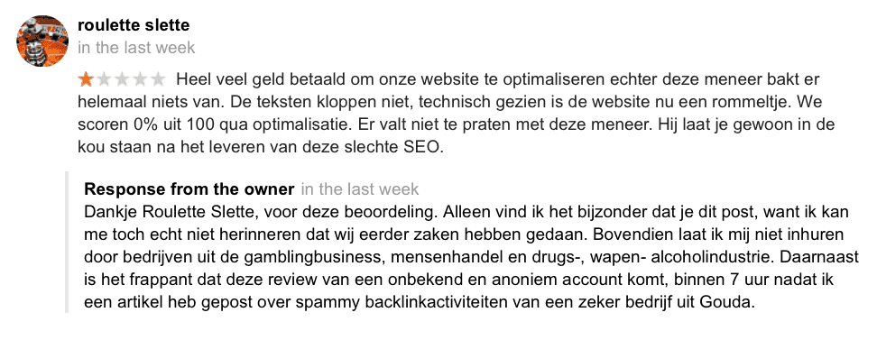
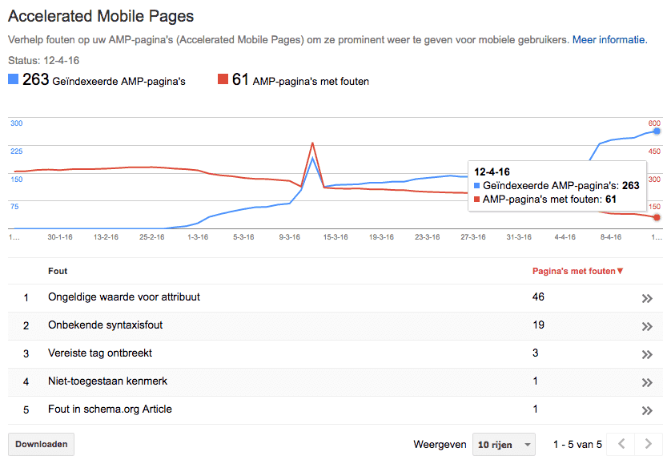
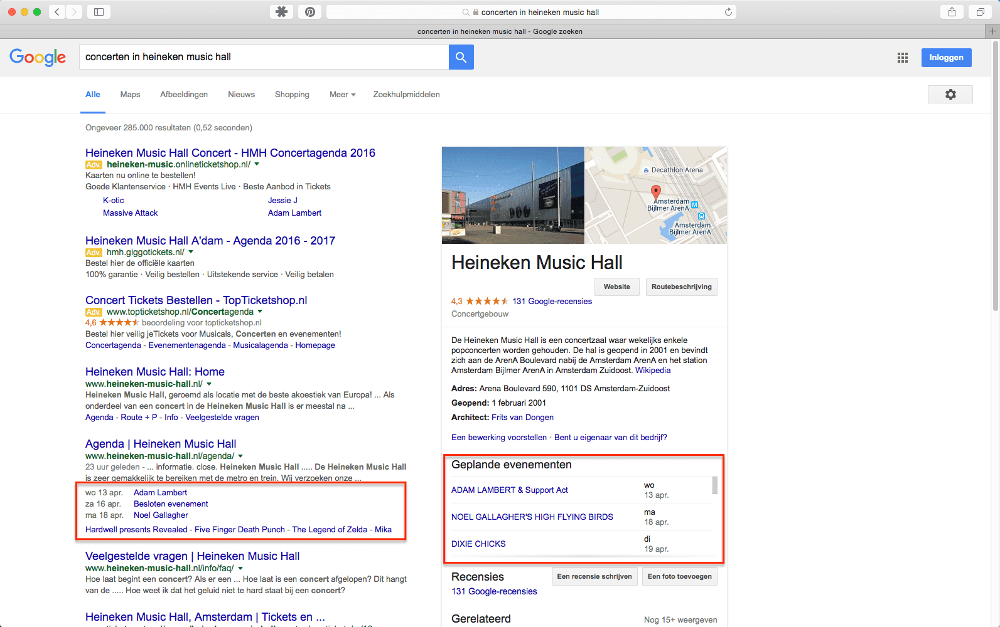
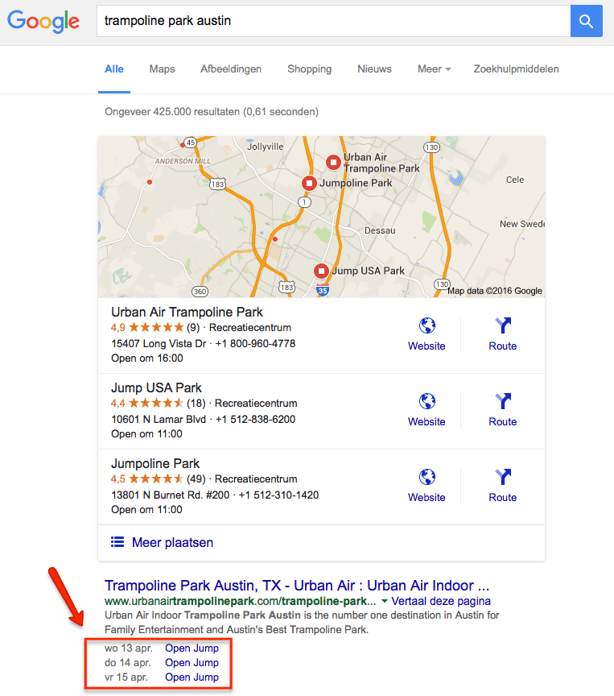
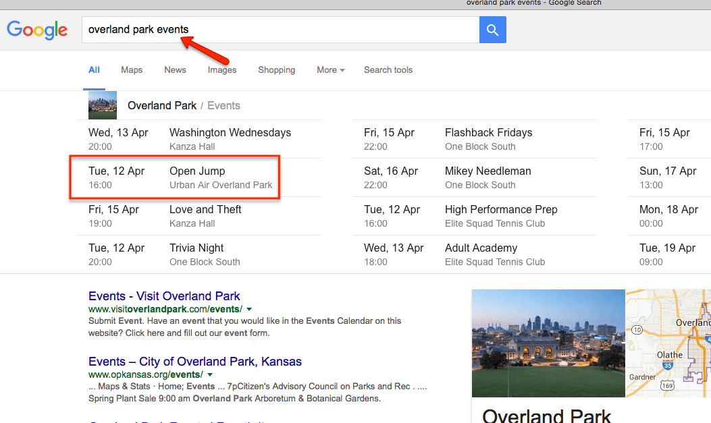
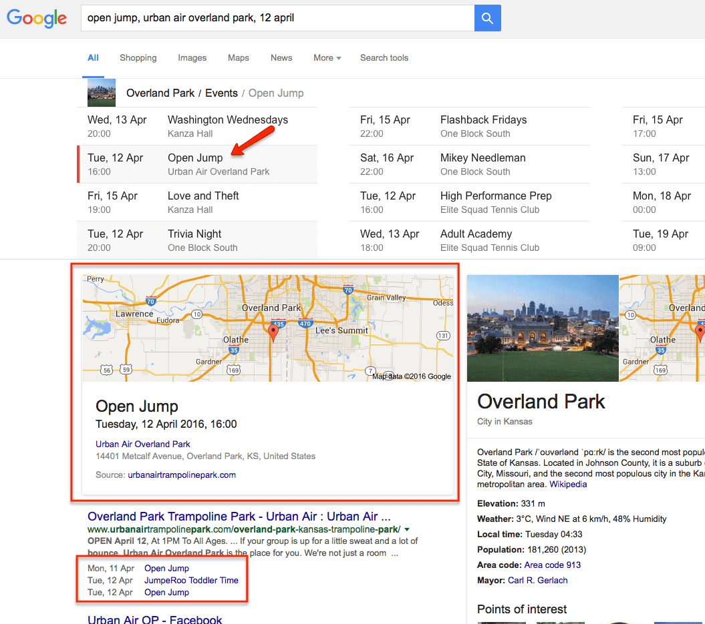

> **Historisch archief.** Deze aflevering verscheen op 14-04-2016 als onderdeel van ReputatieCoaching (2012–2016). De oorspronkelijke tekst is hieronder historisch bewaard. Diensten, contactgegevens, links, tools en adviezen kunnen inmiddels verouderd zijn.



**Transcriptiestatus:** Oorspronkelijke shownotes. Vanaf aflevering 153 werd de podcast niet meer volledig uitgeschreven.

\*\*[*Historische afbeelding niet beschikbaar: ReputatieCoaching Podcast*](https://web.archive.org/web/20160422081458/http://www.reputatiecoaching.nl/wp-content/uploads/2012/12/Reputatie-Coaching-Podcast-logo-200x200.jpg)Het is alweer een tijdje geleden dat ik de laatste podcast heb uitgebracht. Dus mocht je je afvragen of je iets hebt gemist in de tussentijd, dan betreft het in elk geval geen content van mij. Ik had namelijk een erg drukke tijd, waarin veel werk verzet moest worden. Helaas moesten mijn publiekelijke online activiteiten voor ReputatieCoaching daarvoor wijken.\*\*

Maar goed, ik ben dus weer terug en hoe! Ik heb de pauze van twee maanden ook gebruikt om na te denken over hoe ik nu verder ga met ReputatieCoaching. Let wel: ik zeg “hoe” en niet “of”. Daarover vertel ik je zometeen meer…

De onderwerpen voor vandaag zijn… Als eerste nog een toevoeging op mijn blogpost van afgelopen dinsdag over het bedrijf uit Gouda dat zelfs in deze tijd nog probeert geautomatiseerd backlinks te creëren in reacties op blogposts… Dan wil ik je bijpraten over hoe het gaat met de AMP-pagina’s op mijn website.

Verder heeft Google Mijn Bedrijf de richtlijnen veranderd. Je kunt ze allemaal nalezen op de pagina’s waarvan ik links heb opgenomen in de show notes, maar ik licht er twee uit: de eerste wijziging gaat over de naamgeving van het bedrijf en de tweede wijziging heeft betrekking op afbeeldingen die je gebruikt voor je vermelding op Google Mijn Bedrijf.

Sinds ongeveer een week geleden heb je geen Google+ account meer nodig, om een review te kunnen posten. Dat is goed nieuws, dus daarover zo ook meer.

En ik sluit de podcast van vandaag af met mijn bevindingen voor een opdrachtgever in Texas, voor wie ik een leuke en bruikbare feature heb ingebouwd op zijn website, namelijk het vertonen van evenementen in de zoekresultaten op basis van een Google Calendar.

## I AM BACK

Eerder deze week heb ik het ook al gepost: [ik ben terug](https://web.archive.org/web/20160419201348/http://www.reputatiecoaching.nl/im-back/)! Ik heb even een drukke tijd achter de rug, zowel in mijn werk voor [Whitespark](http://www.whitespark.ca), als met een verbouwing van onze garage, waar we een trainingsruimte van hebben gemaakt. Niet dat ik aan gewichten ga sjorren, maar een trainingsruimte om mensen te trainen.

25 mei a.s. heb ik de eerste training: dat is een training Reputatiemanagement voor zorgverleners / medische professionals, dus bijvoorbeeld tandartsen, fysiotherapeuten en dergelijke.

Ben je benieuwd hoe de trainingsruimte eruit ziet? Nou, ik heb het gemakkelijk gemaakt voor je, want ik heb niet slechts een paar “platte” foto’s gemaakt, maar een heuse bedrijfspanorama. Als je virtueel door de trainingsruimte wilt lopen, surf je naar www.reputatiecoaching.nl/binnenkijken. Deze link vind je ook in de show notes op [www.reputatiecoaching.nl/164](https://web.archive.org/web/20160419201336/http://www.reputatiecoaching.nl/164/).

En in de show notes heb ik ook de virtuele tour opgenomen, zodat je feitelijk niet eens naar de “binnenkijken”-link die ik je zojuist gaf, te gaan:

## Spammy backlinks het verhaal gaat verder

Begin dit jaar ontving ik al een paar keer een berichtje van een bepaald bedrijf of ik vrienden wilde worden en me ergens inschrijven en dergelijke. Nu zag ik laatst een overduidelijk geautomatiseerd geposte reactie van datzelfde bedrijf verschijnen op een blogpost hier op ReputatieCoaching.

Je hebt het artikel wellicht gelezen over dat [SEO-bedrijf uit Gouda](https://web.archive.org/web/20160419201348/http://www.reputatiecoaching.nl/seo-snel-gouda-backlinks-spam/), dat mij uit “wraak” voor mijn 1-ster recensie, meteen ook eentje op de Google Mijn Bedrijf-pagina voor ReputatieCoaching plaatste. Ook ontving ik een mailtje, waarin hij dreigde naar Kassa te gaan om daar iets te posten en dergelijke.

[](/wp-content/uploads/2016/04/20160412-troll-review-seo-snel.png)Inmiddels staat de review er ruim een dag op en is mijn gemiddelde score gezakt van 5.0 naar 4.6. Maar ik vind het wel grappig, temeer daar ik nu eens in de praktijk kon laten zien hoe je moet omgaan met een zogenaamde trol, die een 1-ster review post. En dat ik geen 5.0 als reviewscore heb boeit me dus niet echt. De mensen die de overige reviews lezen en de content op mijn site lezen en de podcast beluisteren weten wel beter en doorzien een dergelijke actie meteen.

Ironisch genoeg zet de bedrijfseigenaar van het SEO-bedrijf uit Gouda zich zo wel erg in de kijker, door binnen 7 uur nadat ik het review gewoon onder mijn eigen naam had gepost, een review te posten onder het pseudoniem “Roulette Slette”.

## Voortgang AMP

Lange tijd terug, heel lang geleden, heb ik je verteld dat ik al bezig was met het AMP-compliant maken van de ReputatieCoaching website. Inmiddels is de AMP-plugin een aantal keren geüpdatet en nu gaat het echt de goede kant op.

In de show notes heb ik een screenshot opgenomen van de “Accelerated Mobile Pages” in Google Search Console. Daarin kun je zien dat inmiddels 263 pagina’s succesvol als Accelerated Mobile Page zijn geïndexeerd, en 61 nog niet. Maar ik verwacht dat dat nu snel nog verder verbetert:

[](/wp-content/uploads/2016/04/20160413-amp-statistics.png)Ook al ga ik op mijn mobiele telefoon testen op [g.co/ampdemo](http://g.co/ampdemo), dan kom ik nog niet vanaf daar op de AMP-versie van bijvoorbeeld de blogberichten. Maar goed, dat duurt waarschijnlijk nog even. Ik ben ik elk geval hoopvol gestemd, dat Google nu lekker alle pagina’s voor AMP aan het indexeren is.

Tot zover de update over AMP.

## Nieuwe richtlijnen Google Mijn Bedrijf

De richtlijnen op Google Mijn Bedrijf zijn aangepast. In de podcast vertel ik je over twee belangrijke wijzigingen:

```
  * Bepalingen ten aanzien van de [naam van een bedrijf die je voor je GMB vermelding gebruikt](https://web.archive.org/web/20151024023121/https://support.google.com/business/answer/3038177?hl=nl)
  * Foto’s die je gebruikt op je Google Mijn Bedrijf pagina
```

Luister ook naar de podcast voor meer informatie hierover.

## Geen Google+ account meer nodig voor reviews

Voorheen moest je per se een Google+ account hebben om reviews te posten bij een Google Mijn Bedrijf vermelding. Maar sinds een paar weken hoeft dat niet meer. Dan kun je ook met een standaard Google account inloggen. En waarom dat een grote verbetering is, leg ik je uit in de podcast.

## Google Calendar evenementen in de zoekresultaten

Organiseer jij evenementen? Sta jij met je bedrijf jaarlijks op verschillende evenementen, zoals beurzen, feesten en dergelijke? Of geef je dikwijls trainingen of presentaties in den lande? Of organiseer je regelmatig of geregeld webinars die je extra aandacht wilt geven in de zoekresultaten?

Dan heb ik iets, waarmee je extra kunt opvallen in die zoekresultaten. Namelijk met het vertonen van die evenementen. Hieronder zie je een voorbeeld van de evenementen in de Heineken Music Hall, zoals die in de zoekresultaten worden vertoond:

[](/wp-content/uploads/2016/04/20160413-heineken-music-hall.png)

Daarvoor zijn bijvoorbeeld voor WordPress allerhande lastige en soms ook kostbare plugins voor verkrijgbaar.

Een klant van Whitespark uit Canada, waarvoor ik diverse projecten doe, heeft dagelijks evenementen in zijn verschillende [trampolineparken in Texas](http://www.urbanairtrampolinepark.com). Hij gebruikte ook zo’n commerciële plugin die het kort gezegd niet goed deed. Dus ben ik voor hem iets gaan programmeren:



Kort gezegd heeft hij nu voor elke locatie een specifieke Google Calendar, waarin hij en zijn staf de evenementen kunnen opnemen. Deze verschijnen dan automatisch binnen zo’n 5 tot 10 minuten op de site. Dat is leuk:

[](/wp-content/uploads/2016/04/201604120-overland-park-events-compressor.png)

Maar wat nog mooier is, is dat ze vanaf het moment dat ze op de site staan, ook op een speciale manier worden aangeboden aan Google, om ervoor te zorgen dat ze in de zoekresultaten worden vertoond.

[](/wp-content/uploads/2016/04/201604120-overland-park-events-2.png)

Hierboven heb ik een paar screenshots opgenomen, van:

```
  1. De simpele vermelding onder het zoekresultaat van de locatiepagina op de site (zelfde als bij de Heineken Music Hall)
  2. De vermelding in de lokale evenementen in een stad, als je op "stadnaam events" zoekt
  3. Wat je te zien krijgt als je op zo’n evenement klikt
```

Als je die afbeeldingen bekijkt, zie je meteen dat er voor jou wellicht ook mogelijkheden liggen!

### Voordelen

```
  * Meer screen real estate in de zoekresultaten
  * Valt extra op, dus krijg je meer kliks
  * Meer kliks betekent meer verkeer en dus meer kans om je omzet te vergroten
  * Werkt niet alleen in WordPress, maar ook in Drupal, Joomla of welk ander PHP-gebaseerd CMS dan ook!
  * Last but not least: GRATIS!
```

En stel je nu eens voor dat het zo simpel kan zijn als eenmalig een kalender aanmaken in Google Calendar, nog wat dingetjes regelen, zo’n drie regels code in je website opnemen, waarna je vervolgens alle technische dingen kunt vergeten. Want vanaf dat moment manage jij namelijk de evenementen die in de zoekresultaten worden vertoond, simpel in je Google Calendar, die je ook nog eens vanaf elk apparaat kunt benaderen.

Wil jij dat ook? Houd dan het weblog van Whitespark in de gaten, want daar komt later deze week het artikel met de volledige instructie hoe je dit zelf kunt realiseren. En zodra het artikel online staat, zal ik het natuurlijk hier ook vermelden met een link naar het artikel. Je kunt de site van Whitespark overigens vinden op [www.whitespark.ca](http://www.whitespark.ca).

## Kijk hier ook eens

Links naar content elders op Internet die in deze podcast aan bod komt:

```
  * ReputatieCoaching Podcast in iTunes
  * ReputatieCoaching Podcast op Stitcher
  * [ReputatieCoaching Podcast op TuneIn Radio](http://tunein.com/radio/ReputatieCoaching-Podcast-p655084/)
  * [ReputatieCoaching Podcast RSS-feed](https://web.archive.org/web/20160408145916/http://feeds.reputatiecoaching.nl/ReputatieCoachingPodcast)
  * [Richtlijnen voor de representatie van uw bedrijf op Google](https://web.archive.org/web/20151024023121/https://support.google.com/business/answer/3038177?hl=nl) (Google Support)
  * [Lokale bedrijfsfoto's toevoegen](https://web.archive.org/web/20190818151219/https://support.google.com/business/answer/6103862?hl=nl&ref_topic=6130059) (Google Support)
  * [Fotorichtlijnen voor bulklocaties](https://web.archive.org/web/20240718121919/https://support.google.com/business/answer/6031953) (Google Support)
  * Binnenkijken in de trainingsruimte van de ReputatieCoach (Google Streetview)
```
