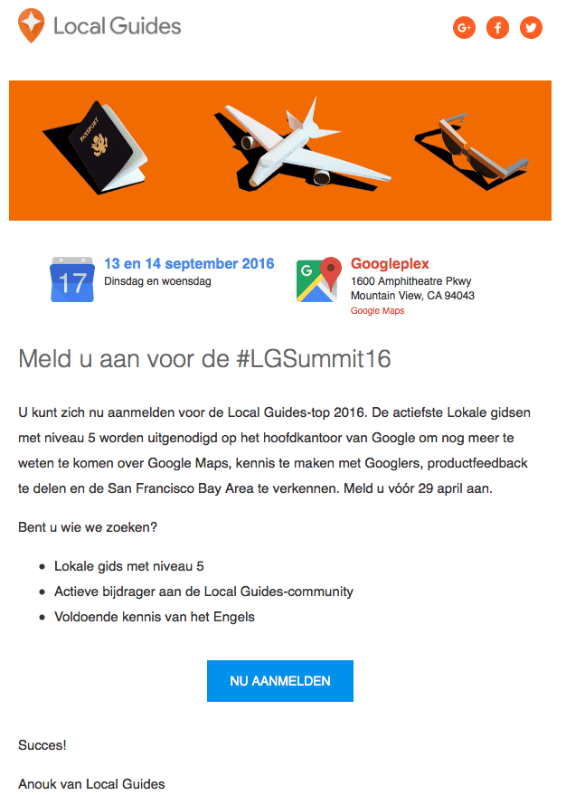
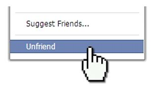
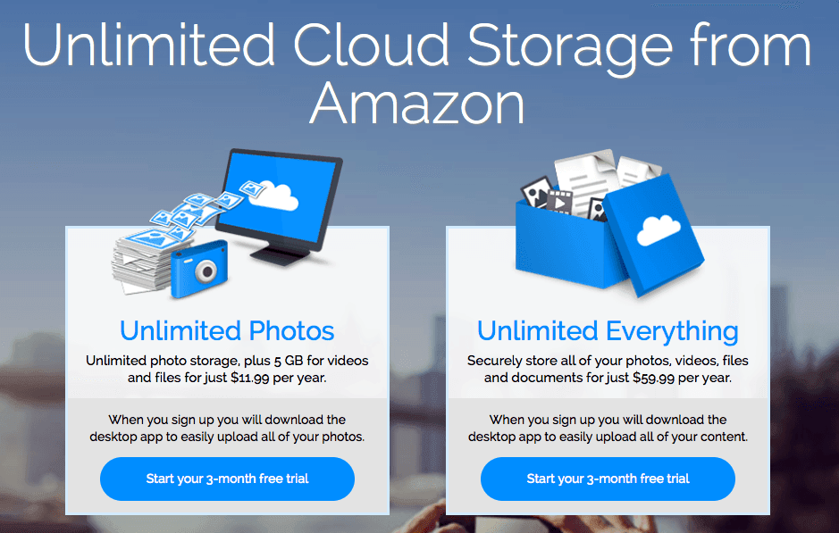
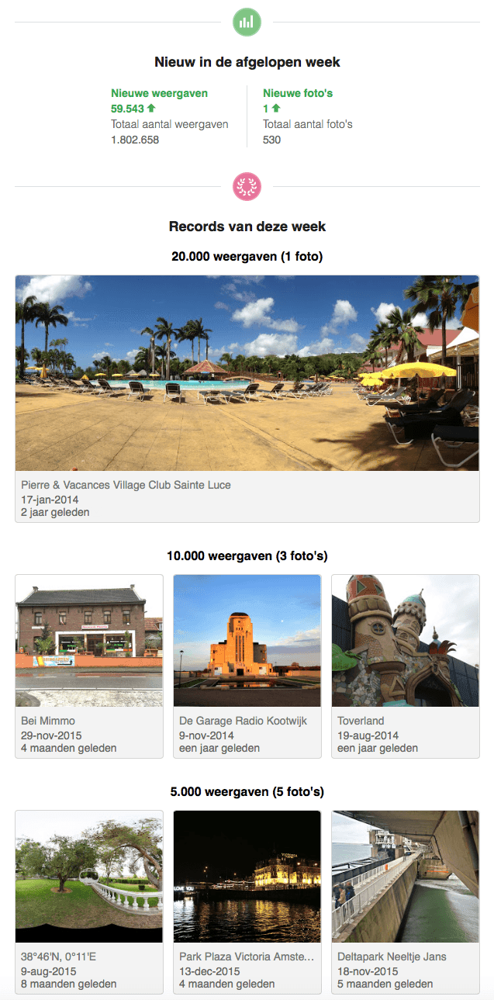
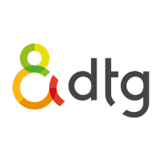
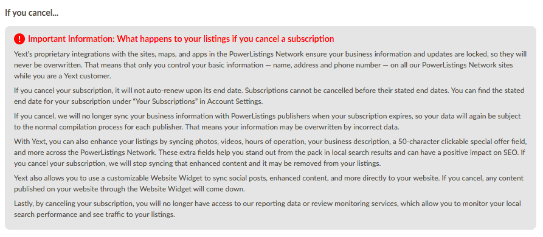

> **Historisch archief.** Deze aflevering verscheen op 23-04-2016 als onderdeel van ReputatieCoaching (2012–2016). De oorspronkelijke tekst is hieronder historisch bewaard. Diensten, contactgegevens, links, tools en adviezen kunnen inmiddels verouderd zijn.

**Transcriptiestatus:** Oorspronkelijke shownotes. Vanaf aflevering 153 werd de podcast niet meer volledig uitgeschreven.

\*\*[*Historische afbeelding niet beschikbaar: ReputatieCoaching Podcast*](https://web.archive.org/web/*/https://www.reputatiecoaching.nl/wp-content/uploads/2012/12/Reputatie-Coaching-Podcast-logo-200x200.jpg)Eerder deze week was de site van mijn broer gehackt en was hij 924 blogposts kwijt. Dat was wel even schrikken! Ik vertel je zijn relaas. Laatst ontving ik de uitnodiging om mij aan te melden voor de Local Guides Summit in San Francisco in september dit jaar.\*\*

**Jalwa was jarenlang gratis, maar wordt nu opeens commercieel. Eergisteren kreeg ik voor ’t eerst een mailtje met wat statistieken over mijn foto’s op Google Maps. Daar stond ik behoorlijk van te kijken!**

**Ontvrienden? Ontvriend jij vaak mensen? Suzanne, m’n vrouw is onlangs ontvriend en was daar behoorlijk ontstemd over.**

**Ik heb deze week weer eens een tip van de week voor je. Daarin vertel ik je hoe je voor US$60 per jaar onbeperkte online opslag kunt krijgen.**

**Het laatste topic voor vandaag gaat over DTG. DTG (dat staat voor “De TelefoonGids”) probeert aan de weg te timmeren met hun dienst “NetwerkProfiel”. Dat is een service waarin ze citations consistent maken en houden. Ik vertel je waarom je daar vooral NIET gebruik van moet maken!**

## Site gehackt!

De site van mijn broer was afgelopen week gehackt. Alle 924 blogberichten waren overschreven met een one-liner met een link die naar een Russische site verwees. Dankzij de service van Antagonist is alles uiteindelijk goedgekomen! Ik beveel Antagonist werkelijk bij iedereen aan, die een website of een aantal websites bij een betrouwbare partij wil onderbrengen.

Het is niet voor niets, dat Antagonist een 9,6 scoort uit 3.099 recensies! En nee, ik word niet betaald voor deze promotie! ;-)

[](https://www.antagonist.nl)

## #LGSummit16

In september organiseert Google in San Francisco de eerste Summit voor Lokale Gidsen. Daarvoor worden alleen actieve gidsen van niveau 5 uitgenodigd. Google betaalt dan alles, zowel de reis als het verblijf. Ik ga me aanmelden!

[](https://web.archive.org/web/*/https://www.reputatiecoaching.nl/wp-content/uploads/2016/04/20160423-LGSummit16.png)

## Jalwa is niet meer gratis

*Historische afbeelding niet beschikbaar: Yalwa: meld je bedrijf aan*
Jalwa was jarenlang gratis, maar gaat nu geld vragen voor een standaard registratie. Dat is een model dat niet veel meer wordt gebruikt op directory sites, want meestal zie je dat een basisprofiel (lees: citation) gratis is en dat je moet gaan betalen voor meer diensten.

Ja, je zult nu moeten kiezen of een citation op Yalwa je die EUR 4,95 of EUR 1,95 per maand waard is. Ik denk het van niet en vertel je in de podcast waarom.

## Ontvrienden

Sommige mensen vinden het vervelend om ontvriend te worden. Maar is het zo erg? Wat is tegenwoordig dan nog een “vriendschap” online waard. Volgens mij moet je er niet te zwaar aan tillen, want voor mijn gevoel wordt het begrip “vriend” langzamerhand behoorlijk uitgehold.



## Amazon Cloud Drive

Omdat ik een Google Lokale Gids niveau 5 ben, heb ik al een Google Drive van 1 TB gratis. Daarop sla ik eigenlijk alle data op, die ik onderhanden heb, of waar ik te allen tijde bij wil kunnen. Een eigenschap van Google Drive is namelijk dat het standaard synchroniseert met alle apparaten waarop je het programma installeert. Zo heb je, net als met Dropbox, overal je bestanden meteen beschikbaar.

Maar mijn laptop heeft een SSD van 256 GB en die loopt al snel vol, als ik alle data van Google Drive synchroniseer. Gelukkig kun je op Google Drive instellen dat je bepaalde folders niet op het gegeven apparaat wilt hebben. Zo kun je toch een soort van backup hebben, een langetermijn archief waar je niet altijd meteen bij hoeft te kunnen.



Maar Google Drive voldoet niet als online backup-mechanisme voor bijvoorbeeld al mijn foto’s, video’s muziek en dergelijke. Daarvoor had ik nog nooit een goede service gevonden.

Een paar maanden geleden had ik al een account genomen op Amazon Cloud Drive Unlimited, maar had het meteen aan de kant geschoven, omdat ik niet tevreden was over de gebruikersinterface.

Daar is nu verandering in gekomen en ik ben nu de nodige TB’s aan het overfluiten naar Amazon. Wat mij heeft bewogen om Amazon Cloud Drive als online backup te gaan gebruiken, vertel ik je in de podcast.

## Statistieken van foto’s op Google Maps

Als Google Lokale Gids upload ik dikwijls foto’s van bedrijven naar Google Maps. De ene keer is het de voorgevel, de andere keer een product en weer een andere keer bijvoorbeeld het terras aan het zwembad. De kans is groot dat die foto’s worden vertoond als mensen op Google bij een bepaald bedrijf gaan kijken, ongeacht via welk Google zoekproduct dan ook (Maps, Google+, Search etc.).

En Google zou Google niet zijn, als ze eens iets NIET zouden meten. Zo wordt het aantal vertoningen van de foto’s natuurlijk ook gemeten. Laatst kreeg ik een mailtje van Google, waarin Google mij meedeelde dat al mijn foto’s gezamenlijk inmiddels wereldwijd al meer dan 1,8 miljoen keer zijn weergegeven!

Wow! Dat vond ik wel cool! En weet je welke foto afgelopen week het meest is weergegeven? Eentje die ik in 2014 heb gemaakt van het terras aan het zwembad van ons hotel op Martinique. Die foto is in één week ook maar liefst meer dan 59.000 keer vertoond. Bekijk hieronder maar eens welke foto’s populair zijn:



## Vermijd Netwerkprofiel van DTG (De TelefoonGids)!


Je weet dat ik altijd ondernemers en bedrijven adviseer hun citations consistent te maken en te houden. Dat is niet altijd even gemakkelijk en erg tijdrovend. DTG (De TelefoonGids) heeft sinds enige tijd hiervoor een nieuwe dienst: [Netwerkprofiel](https://www.dtg.nl/producten/bedrijfsprofielservices/netwerkprofiel.aspx). Het bedrijf is hiervoor een samenwerking aangegaan met het Amerikaanse [Yext](http://www.yext.com).

Op zich werkt het goed, zolang je maar de maandelijkse EUR 37,50 blijft betalen. Dat tikt wel aan! Want als je ervoor gaat zitten heb je zelf in een paar avonden je meeste citations heus wel op orde, zeker als je alle instructievideo’s die ik hiervoor heb gemaakt, volgt.

Maar als je stop met het gebruik van Yext, dan ben je in de aap gelogeerd. Yext schrijft hier het volgende over:

[](https://web.archive.org/web/*/https://www.reputatiecoaching.nl/wp-content/uploads/2016/04/20160423-yext-cancel.png)Dit lijkt niet zo bijzonder… Maar zoals je weet werk ik voor Whitespark en wij hebben recentelijk nog onderzoek gedaan naar het effect, wat er gebeurt als een klant stopt met het gebruiken van Yext. Nou… dan verdwijnen sommige netwerkprofielen en de profielen die ooit aangepast waren door Yext, worden allemaal weer teruggezet naar de originele instellingen, waardoor je dus geen blijvende waarde eraan hebt.

Bovendien is een eigenschap van Yext die wij vaak zien, dat er dikwijls duplicaatvermeldingen worden aangemaakt. En dat is al iets wat je helemaal niet wilt!

Al met al volgens mij voldoende redenen om [Netwerkprofiel van DTG](https://www.dtg.nl/producten/bedrijfsprofielservices/netwerkprofiel.aspx) te mijden!

## Kijk ook eens op…

Links naar onderwerpen die in deze podcast aan bod komen:

```
  * 
  * [ReputatieCoaching Podcast in iTunes](https://itunes.apple.com/nl/podcast/reputatiecoaching-podcast/id584370482?l=en&mt=2)
  * [ReputatieCoaching Podcast op Stitcher](http://www.stitcher.com/podcast/reputatie-coaching-podcast/reputatiecoaching)
  * [ReputatieCoaching Podcast op TuneIn Radio](http://tunein.com/radio/ReputatieCoaching-Podcast-p655084/)
  * [ReputatieCoaching Podcast RSS-feed](https://web.archive.org/web/*/https://www.reputatiecoaching.nl/ReputatieCoachingPodcast)
  * [Antagonist](https://www.antagonist.nl)
  * [Google Lokale Gidsen programma](https://www.google.com/intl/nl/local/guides/)
  * [Yalwa](http://www.yalwa.nl)
  * [Amazon Cloud Drive](https://www.amazon.com/clouddrive/home)
  * [Expandrive](http://www.expandrive.com)
  * [DTG Netwerkprofiel](https://www.dtg.nl/producten/bedrijfsprofielservices/netwerkprofiel.aspx)
  * [Yext](http://www.yext.com)
```
