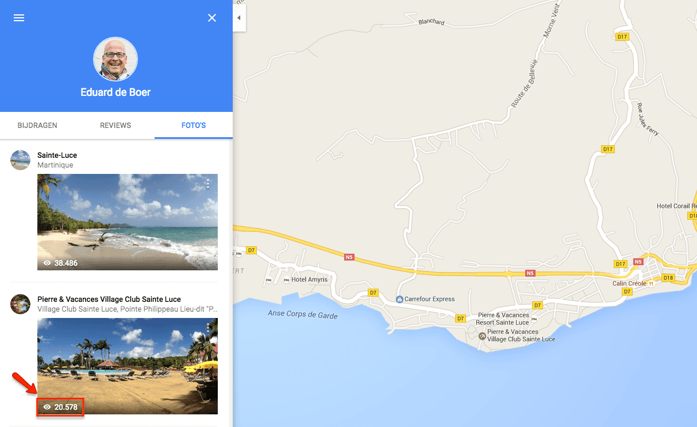
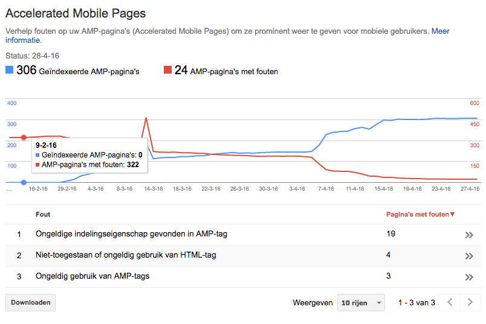
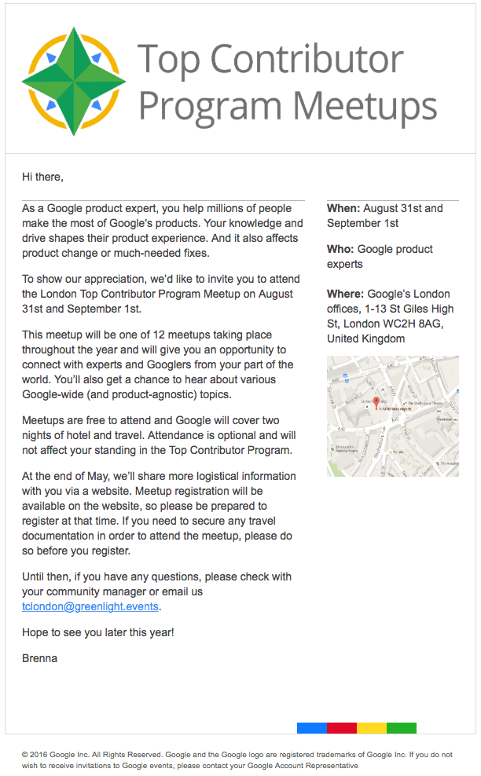

> **Historisch archief.** Deze aflevering verscheen op 28-04-2016 als onderdeel van ReputatieCoaching (2012–2016). De oorspronkelijke tekst is hieronder historisch bewaard. Diensten, contactgegevens, links, tools en adviezen kunnen inmiddels verouderd zijn.



**Transcriptiestatus:** Oorspronkelijke shownotes. Vanaf aflevering 153 werd de podcast niet meer volledig uitgeschreven.

\*\*[*Historische afbeelding niet beschikbaar: ReputatieCoaching Podcast*](https://www.reputatiecoaching.nl/wp-content/uploads/2012/12/Reputatie-Coaching-Podcast-logo-200x200.jpg)Vorige week heb ik een foutje gemaakt in het bericht over de foto’s die ik heb gepost op Google Maps en dan met name ten aanzien van de statistieken. Dat zet ik vandaag eerst recht. Verder een kleine update over mijn gebruik van Amazon Cloud Drive.\*\*

**Eerder deze week ontving ik een leuke mail van Google, die mij erg aangenaam veraste! Over Google gesproken: ik heb me vandaag ook aangemeld voor de Local Guides Summit 2016 in San Francisco.**

**Verder las ik een leuk artikel over hoe Amerikanen inmiddels artsen selecteren op basis van reviews.**

**En ja, het is zover: ik ga concrete diensten aanbieden!**

**Ik sluit de podcast van vandaag af met de analyse van de website van een cateringbedrijf in Apeldoorn en ik vertel je, waar ik zoal naar heb gekeken.**

## Correctie t.a.v. Google Foto’s statistieken

OK, ik was iets te enthousiast met de statistieken die ik vorige week meldde met betrekking tot het aantal weergaven van foto’s op Google Maps. In de podcast vertel ik je wat mijn fout was. Wel heb ik afgelopen week er weer zo’n 100.000 weergaven bij, want ik zit nu op de 1,9 miljoen weergaven van de foto’s:

[](/wp-content/uploads/2016/04/20160428-google-maps-fotos-update-1.png)

## Update AMP

2 wkn geleden waren 263 pagina’s geïndexeerd en 61 nog niet. Nu, 2 weken later zijn 306 pagina’s geïndexeerd en heb ik nog maar 24 pagina’s met fouten. Het lijkt erop alsof de AMP-plugin steeds beter wordt, want de afgelopen tijd heb ik geen aanpassingen gedaan aan de content en is het aantal pagina’s met fouten telkens gedaald, nadat ik de AMP-plugin bijwerkte naar de nieuwste versie:

[](/wp-content/uploads/2016/04/20160428-google-amp-stats.png)

## Update Amazon Cloud Drive

Inmiddels zit ik bijna op de 1TB op Amazon Cloud Drive, maar ik heb besloten het programma Expandrive toch nog maar even niet te kopen.

## Uitnodiging Google Top Contributor Meet-up London

Eerder deze week aangenaam verrast door een mailtje dat ik ontving. Dit keer niet van een luisteraar, maar van Google:

[](/wp-content/uploads/2016/04/20160428-tc-invite.png)

In de podcast vertel ik er meer over deze uitnodiging voor deelname aan de [Google Top Contributor](https://topcontributor.withgoogle.com) Meetup in London…

## Aangemeld voor #LGSummit16

Morgen sluit de mogelijkheid om je aan te melden voor de Local Guides Summit 2016 in San Francisco. Naast dat ik een flink aantal vragen moest beantwoorden, moest ik ook een video maken waarin ik mezelf voorstelde en vertelde, waarom ik graag naar San Francisco wilde komen.

Ik had voor mezelf even snel een paar punten op een Post-IT papiertje geschreven en die op de monitor geplakt, waarna ik de video heb ingesproken. Google had me ervan verzekerd dat ze niet keken naar de professionaliteit van de video, maar dat ze je motivatie wilden zien en horen. Daarom heb ik de video ook niet bijzonder verfraaid. Dit is de video geworden:

## Diagnose: je medische praktijk heeft reviews nodig!

Ik las een leuk artikel op een Amerikaanse site met een titel van soortgelijke strekking. In de podcast vertel ik je de highlights van het onderzoek dat is uitgevoerd in de VS onder mensen die een arts zoeken. De resultaten zullen je waarschijnlijk verrassen, zeker als je hoort hoeveel mensen hun keuze voor een medicus baseren op reviews!

## Mijn dienstverlening krijgt vorm!

Een tijdje geleden heb ik het aangekondigd: ik ga concrete diensten leveren. In de podcast vertel ik kort over de volgende diensten:

```
  * Eenmalig consult
  * ReputatieScan
  * 1:1 Coaching
  * In-company training
```

## Analyse van de website van een cateringbedrijf

Voor een cateringbedrijf uit Apeldoorn heb ik een korte analyse uitgevoerd van hun website.  Voor deze beperkte quickscan heb ik gekeken naar:

```
  1. **Performance webserver & website** – Google adviseert een maximale performance, omdat dit de zogenaamde “customer experience” (klantervaring) verhoogt. Een snelle site “voelt goed” en voorkomt dat mensen als gevolg van onnodig wachten, wegklikken naar de site van de concurrent.
  2. **Presentie op Google Search / Google Maps** – Het "product" / de dienstverlening richt zich voornamelijk op de regio Apeldoorn en omstreken. Over het algemeen zal iemand uit Apeldoorn (of net daarbuiten) bijvoorbeeld eerder een cateringbedrijf uit de directe omgeving zoeken, dan bijvoorbeeld uit Groningen. Daarom is het essentieel dat het bedrijf lokaal goed en correct vindbaar en zichtbaar is.
  3. **Vermelding op Apple Maps** – Het aantal mensen dat een iPhone / iPad bezit is significant. Daarom is een vermelding op Apple Kaarten ook noodzakelijk.
  4. **Opzet website (technisch)** – Voornamelijk wat Google wel ziet, maar de gebruikers meestal niet zien.
  5. **Content** – De hoeveelheid en kwaliteit van de content is een belangrijke factor om te ranken in de zoekresultaten. Hoe meer relevante, educatieve, informatieve en unieke content, des te groter de kans om hoger te scoren.
  6. **Reputatie (reviews)** – ... vanzelfsprekend!
```

Wil je mijn bevindingen, tips en aanbevelingen horen, luister dan naar de podcast…

Eén aspect wil ik hier met je delen, dat is het feit dat de homepage maar liefst 2,4 MB was. Binnen 5 minuten had ik dat teruggebracht naar 1,6MB. Hoe? Enkel door de [bestandsgrootte van een vijftal foto’s op de homepage te verkleinen](https://www.reputatiecoaching.nl/bestandsgrootte-foto-verkleinen-op-mac-pc-en-linux-met-compressor-io-instructievideo/) met behulp van [compressor.io](https://compressor.io):

## Kijk ook eens op…

Links naar onderwerpen die in deze podcast aan bod komen:

```
  * [ReputatieCoaching Podcast in iTunes](https://itunes.apple.com/nl/podcast/reputatiecoaching-podcast/id584370482?l=en&mt=2)
  * [ReputatieCoaching Podcast op Stitcher](http://www.stitcher.com/podcast/reputatie-coaching-podcast/reputatiecoaching)
  * [ReputatieCoaching Podcast op TuneIn Radio](http://tunein.com/radio/ReputatieCoaching-Podcast-p655084/)
  * [ReputatieCoaching Podcast RSS-feed](https://feeds.reputatiecoaching.nl/ReputatieCoachingPodcast)
  * [Google Lokale Gidsen programma](https://www.google.com/intl/nl/local/guides/)
  * [Google Top Contributor programma](https://topcontributor.withgoogle.com)
  * [Amazon Cloud Drive](https://www.amazon.com/clouddrive/home)
  * "[The Diagnosis Is In: Your Medical Practice Needs Reviews](http://www.searchinfluence.com/2016/04/the-diagnosis-is-in-your-medical-practice-needs-reviews/)" (Search Influence, 256 april 2016)
```
