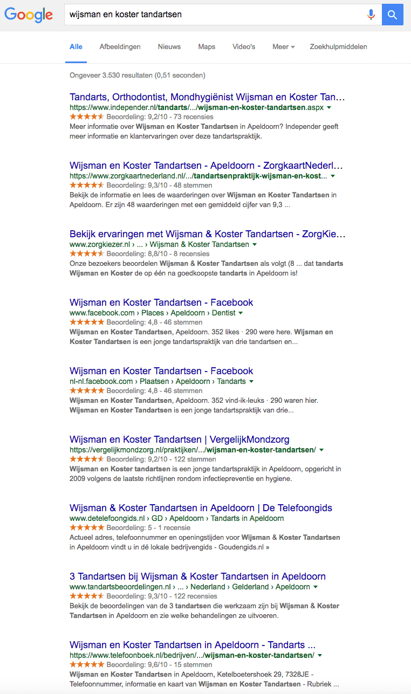

> **Historisch archief.** Deze aflevering verscheen op 5-05-2016 als onderdeel van ReputatieCoaching (2012–2016). De oorspronkelijke tekst is hieronder historisch bewaard. Diensten, contactgegevens, links, tools en adviezen kunnen inmiddels verouderd zijn.



**Transcriptiestatus:** Oorspronkelijke shownotes. Vanaf aflevering 153 werd de podcast niet meer volledig uitgeschreven.

***Historische afbeelding niet beschikbaar: ReputatieCoaching Podcast*
Het is vandaag Hemelvaartsdag 2016 en ook nog eens Bevrijdingsdag. Heb jij nog bijzondere plannen? Ben je vandaag gaan dauwtrappen, of heb je je vanochtend vroeg nog eens een keertje omgedraaid, omdat je toch vrij was?**

**Ik heb vandaag in elk geval weer een aantal onderwerpen voor je geselecteerd, die ik graag met je wil delen. Zo begin ik met twee tips van de week. Waarom twee? Euh, nou ja, 1 vond ik te weinig en 3 wat teveel… Is dat een goed antwoord?**

**Gelijk een mooie binnenkomer: een artikel van mij heeft de Moz Top–10 gehaald! Als tweede onderwerp: ik heb een artikel gepubliceerd over het creëren van reviewsterren in de zoekresultaten, waar ook jij je voordeel mee kunt doen!**

**Het zal ook niet waar zijn: maar liefst vier topics over Google. Als eerste is sinds een paar dagen een beta van de Mobile Friendly Testing Tool online. Verder verwijdert Google de richt snippets bij pagina’s met prijzen van vliegtickets. Het derde Google topic gaat over Indoor Maps en de Olympische Spelen in Rio en het laatste Google topic gaat over de aangepaste richtlijnen voor de vermeldingen van lokale bedrijven.**

**Dan heb ik nog een nieuwtje over het gebruik van AdBlockers en ik sluit de podcast af met de vraag: “Waarom moet je niet alleen op bekende sites reviews verzamelen?”.**

## Tips van van de week: Heb je aan de gewijzigde openingstijden voor vandaag gedacht?

Halloooo!!! Ik verwacht dat vandaag zo’n 90% van alle bedrijven gesloten was. Had jij je openingstijden aangepast op Google Mijn Bedrijf? Ik durf al helemaal niet te vragen of je ze ook op andere sites had vermeld, laat staan op je eigen site…

## Tip van de week: Schrijf je niet uit van spam e-mails!

Een luisteraar van de podcast was druk bezig met zich uit te schrijven van allerhande onduidelijke spam e-mails. Ik leg uit, waarom je dat beter niet kunt doen.

## Artikel over evenementen in de zoekresultaten is in de Moz Top 10 beland!

18 april heb ik op het blog van Whitespark een artikel gepubliceerd waarin ik uitleg hoe je [evenementen uit een Google Calendar in de zoekresultaten vermeld kunt krijgen](http://www.whitespark.ca/blog/post/82-how-to-get-google-calendar-events-in-the-search-results). Dit artikel is verkozen tot één van de artikelen in de Moz Top-10!

[*Historische afbeelding niet beschikbaar: Hoe krijg je de evenementen van een Google Calendar in de zoekresultaten?*](http://www.whitespark.ca/blog/post/82-how-to-get-google-calendar-events-in-the-search-results)

## Artikel gepubliceerd over reviewsterren creëren in de zoekresultaten

Een ander artikel dat ik eerder deze week op het blog van Whitespark heb gepubliceerd, is getiteld: “[How to Use Aggregate Review Schema to Get Stars in the Search Results for Local Businesses](http://www.whitespark.ca/blog/post/83-how-to-use-aggregate-review-schema-to-get-stars-in-the-serps)":

[*Historische afbeelding niet beschikbaar: Reviewsterren in de zoekresultaten*](https://www.reputatiecoaching.nl/wp-content/uploads/2016/05/20160429-invisalign-yonkers.png)

## Google verwijdert rich snippets bij pagina’s met vliegtickets

Ik vertel je waarom Google de rich snippets voor prijzen van vliegtickets van websites niet meer vertoont.

## Google Indoor Maps gereed voor Olympische Spelen in Rio

Google heeft een sterke marketingstunt uitgehaald door alle indoor locaties voor de Olympische Spelen Rio dit zomer, letterlijk op de kaart (Google Maps) te zetten.

## Google Mijn Bedrijf vermeldingen optimaliseren

Google beschrijft op haar support site in grote lijnen hoe de ranking van lokale vermeldingen vandaag de dag werkt. Daarbij valt één ding echt op: het belang van reviews!

## Gebruik Adblockers daalt

Het aantal mensen dat sites ook whitelist neemt toe. Mensen beginnen adblockers te begrijpen. Ik vertel je wat statistieken in de podcast.

## Waarom je niet alleen op bekende sites reviews moet verzamelen

Door niet alleen op bekende sites reviews te verzamelen, krijg je nog meer social proof bij een zogenaamde “branded search”, een zoekopdracht op de naam van een bedrijf, (bijvoorbeeld [Wijsman en Koster Tandartsen](http://www.wktandartsen.nl)):

[](/wp-content/uploads/2016/05/20160504-reviewsites-wk-tandarsen.png)

## Kijk ook eens op…

Links naar onderwerpen die in deze podcast aan bod komen:

```
  * [ReputatieCoaching Podcast in iTunes](https://itunes.apple.com/nl/podcast/reputatiecoaching-podcast/id584370482?l=en&mt=2)
  * [ReputatieCoaching Podcast op Stitcher](http://www.stitcher.com/podcast/reputatie-coaching-podcast/reputatiecoaching)
  * [ReputatieCoaching Podcast op TuneIn Radio](http://tunein.com/radio/ReputatieCoaching-Podcast-p655084/)
  * [ReputatieCoaching Podcast RSS-feed](https://feeds.reputatiecoaching.nl/ReputatieCoachingPodcast)
  * "[How to get Google Calendar events in the search results](http://www.whitespark.ca/blog/post/82-how-to-get-google-calendar-events-in-the-search-results)" (Whitespark blog, 18 april 2016)
  * "[How to Use Aggregate Review Schema to Get Stars in the Search Results for Local Businesses](http://www.whitespark.ca/blog/post/83-how-to-use-aggregate-review-schema-to-get-stars-in-the-serps)" (Whitespark blog, 2 mei 2016)
  * "[Get around Rio with indoor maps of 2016 Olympic venues](https://maps.googleblog.com/2016/05/get-around-rio-with-indoor-maps-of-2016.html)" (Google Maps blog, 3 mei 2016)
  * "[Why Send Good Customers to Crappy Review Sites?](http://www.localvisibilitysystem.com/2016/05/03/why-send-good-customers-to-crappy-review-sites/)" (LocalVisibilitySystem, 3 mei 2016)
```
